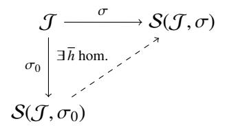
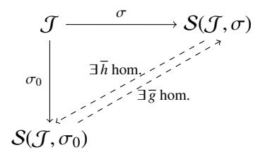

# Technische Universitat¨ Munchen ¨ Ludwig-Maximilians-Universitat¨ Munchen ¨

# On the structure of positive maps

A thesis completed for the degree of Master of Science in the Elite-Master's program TMP by

# Martin Idel

from Krefeld

September 30, 2013

Supervisor: Prof. Dr. Michael M. Wolf

Date of Defence: October 15, 2013 First Reviewer: Prof. Dr. Michael M. Wolf Second Reviewer: Prof. Dr. Michael Keyl Hiermit erklare ich, dass ich die vorliegende Masterarbeit selbst ¨ andig angefertigt habe und nur ¨ die angegebenen Quellen verwendet habe.

Garching, den 09.10.2013

#### **Abstract**

This thesis discusses two unrelated questions concerning positive linear maps between matrix algebras. Positive maps are found in quantum information and provide the tool to determine whether a state is seperable or not. In the first part of the thesis, we derive sufficient conditions for a normal form for certain classes of positive maps and provide hints as to what could be necessary and sufficient conditions. The second and main part of the thesis is then concerned with fixed points of (unital or trace-preserving) positive maps, thereby generalizing known results for the fixed point spaces of trace-preserving completely positive maps, which form the basic concept in quantum information theory (also called *quantum channels*). We first review basic facts and prove that the fixed point spaces of unital positive maps are Jordan algebras, before we provide a detailed study of Jordan subalgebras in finite dimensions (based on and extending the study by Jacobson and Jacobson) and construct projections onto Jordan algebras (largely based on a series of papers by Størmer and extending and simplifying them to finite dimensions), which gives us a classification of the fixed points of trace-preserving positive maps, as well as certain results concerning their *peripheral spectrum*.

# **Acknowledgements**

I thank my advisor Prof. Wolf for giving me the opportunity to do my Master's thesis in his group despite my (prior to starting the thesis) complete ignorance of his main areas of research and I thank him for providing me with a topic.

I am very much indebted to Alexander Muller-Hermes for many discussions. He helped me to ¨ find literature on the topic and proofread most of my work. In addition, he helped me find some shortcuts at certain proofs (especially for the chapter on representation theory, where he made me aware of the fact I proved some things twice) and was very supportive and confident that I would get some nice results even when I wasn't.

Moreover, I am grateful to my friend Andres Goens-Jokisch, who helped me figure out some ´ details in the proof of lemma [3.22.](#page-51-0)

Another constant support came from my friend Javier Cuesta, who shared an office with me for most of my thesis, and whom I would like to thank for many discussions, the proofreading of lemma [3.27](#page-58-0) some night in August, when I couldn't see my mistakes anymore and countless discussions. I also have to thank him for being one of the people to get me interested in quantum information in the first place.

I owe special thanks to Robert Idel and Tobias Ried for reading parts of the first draft and commenting on mistakes and the writing.

Likewise, I would like to thank Sefano Duca, Emmanuel Klinger and Patrik Omland for listening to my moaning, especially about the proof of [4.5](#page-69-0) (which they tried to help me with).

Last but not least, I would like to thank family and other friends for their support during the past year.

# **Contents**

|    | Introduction                                                                                                  | 1           |  |  |  |  |
|----|---------------------------------------------------------------------------------------------------------------|-------------|--|--|--|--|
| 1. | A Normal Form for Positive Maps 1.1. Classical results 1.2. Linear maps between matrix spaces  | 3 3 4 |  |  |  |  |
| 2. | Fixed Point Spaces of positive, unital maps                                                                   | 11          |  |  |  |  |
|    | 2.1. Basic notions of Jordan algebras                                                                   | 14          |  |  |  |  |
|    | 2.2. Fixed point spaces of positive maps                                                                | 18          |  |  |  |  |
| 3. | Representation theory of Jordan algebras                                                                      | 23          |  |  |  |  |
|    | 3.1. Associative specializations and embeddings of formally real algebras                                  | 26          |  |  |  |  |
|    | 3.2. Reduction of the representation theory to universal algebras                                          | 29          |  |  |  |  |
|    | 3.3. Universal embeddings of finite dimensional Jordan algebras                                         | 33          |  |  |  |  |
|    | 3.4. Representations of the different types of Jordan algebras                                          | 45          |  |  |  |  |
| 4. | Positive Projections onto fixed-point algebras                                                                | 55          |  |  |  |  |
|    | 4.1. Existence and uniqueness of projections onto Jordan algebras                                          | 57          |  |  |  |  |
|    | 4.2. Projections onto direct sums with multiplicity                                                     | 58          |  |  |  |  |
|    | 4.3. Projections onto spin factors                                                                      | 62          |  |  |  |  |
|    | 4.4. Construction of positive projections onto spin factors                                             | 70          |  |  |  |  |
|    | 4.5. Projections onto reversible Jordan algebras                                                           | 80          |  |  |  |  |
|    | 4.6. Construction of positive projections onto reversible Jordan algebras                               | 88          |  |  |  |  |
| 5. | Characterizations of positive projections onto fixed point algebras                                           | 94          |  |  |  |  |
|    | 5.1. Decomposability of unital projections onto Jordan algebras                                            | 95          |  |  |  |  |
|    | 5.2. Properties of indecomposable projections onto spin factors                                         | 97          |  |  |  |  |
| 6. | Fixed point spaces of positive, trace-preserving maps and the peripheral spec                                 |             |  |  |  |  |
|    | trum                                                                                                          | 100         |  |  |  |  |
|    | 6.1. Fixed point spaces of positive, trace-preserving maps                                              | 100         |  |  |  |  |
|    | 6.2. The peripheral spectrum of positive, trace-preserving maps                                         | 103         |  |  |  |  |
|    | Conclusion                                                                                                    | 110         |  |  |  |  |

|    | Martin Idel                                                     | Contents |
|----|-----------------------------------------------------------------|----------|
|    | Bibliography                                                    | 112      |
| A. | Appendix                                                        | 115      |
|    | A.1. Spectral and Minimal Projections in Jordan Algebras  | 115      |
|    | A.2. Omitted proofs from chapter 1                        | 121      |

## Introduction

The goal of this thesis is a better understanding of the structure of positive maps, which play a role in quantum information. The title of this thesis "On the structure of positive maps" is extremely broad, which is due to the fact that it covers two very different topics, which are only connected by the fact that both of them concern positive maps.

The first topic, which could be seen as the "Theoretikum", is treated in chapter 1 and generalizes a normal form for matrices (stated in [31]) to positive maps. Normal forms are interesting mathematical objects, because they give an insight to the structure of the objects considered and may help proving other results. However, we will not consider any applications here.

The rest of the thesis is then concerned with the structure of fixed point spaces of positive maps and the projections onto fixed point spaces. The problem is well studied for completely positive maps (see e.g. [40]) and recently, there has also been some work from a different angle in [29]. Since this thesis is completed in the study program "Theoretical and Mathematical Physics", although it is mostly purely mathematical, we will review some physical motivations to study this problem.

In principle, quantum mechanics could be seen as the study of completely positive maps, since the time evolution of the Schrödinger equation results in such maps and physical reasoning on general maps leads to the notion of completely positive maps (see [26], chapter 8). Also, the study of completely positive maps is much simpler than the study of positive maps, which is why much more literature is devoted to the subject. However, one of the most prominent tasks in the early development of quantum information theory in the 1990s was to decide whether a given state is separable or not (in the sense that its density matrix, which is a positive semidefinite matrix  $\rho \in \mathcal{B}(\mathcal{H}) \otimes \mathcal{B}(\mathcal{H}')$  for some Hilbert spaces  $\mathcal{H}, \mathcal{H}'$ , can be written as a sum of tensor products). In [14] it was proven that for every nonseparable state, there is a so-called "entanglement witness", which is a positive matrix  $W \in \mathcal{B}(\mathcal{H}) \otimes \mathcal{B}(\mathcal{H}')$ , such that  $\operatorname{tr}(\rho W) < 0$ . This W then corresponds to a positive, but not completely positive map. This resulted in a renewed interest in positive maps with the goal to find structure theorems for the set of positive maps, in order to compute for a given state, whether it is separable or not. One positive but not completely positive map is the transposition, which gives rise to the Peres criterion (also called PPT-criterion, [27]), which is easy to compute. It was also shown by the Horodeckis in [14] that every witness resulting from decomposable maps (i.e. maps that are a sum of completely positive and completely copositive maps) is not stronger than the Peres criterion. In consequence, there was an increased interest in finding and classifying indecomposable maps. However, the program of complete classification has come to an end, since Gurwitz showed in [9] that the decision problem is supposedly intractable (in the sense that it is NP-hard, which is believed to mean that a it cannot be computed Martin Idel Contents

efficiently on a computer). This means, assuming that the class NP is really intractable that a structure theorem for positive maps that gives an efficient way to prove separability is impossible. Since then, the interest in positive maps, at least from the physics community, seems to have declined somewhat, although many open problems remain.

While for completely positive maps, it turns out that the fixed point space is roughly a C\*-algebra (at least in finite dimensions) and fixed point projections are therefore given by projections onto C\*-algebras, this is no longer true for arbitrary positive maps. It turns out that the algebraic notion needed here is a so-called Jordan algebra.

The main part of the thesis does not assume any prior knowledge on Jordan algebras, while it does assume some prior knowledge of C\*-algebras. With this background, the theory is developed and almost all of the proofs needed are given along the way, with the exception of one technical proposition on Jordan algebras (proposition [2.12\)](#page-25-0), lemma [2.6](#page-22-0) for the peripheral spectrum, which has a technical proof using approximations to diophantine equations, which we do not want to recite here, and some main structure theorems for Jordan algebras (theorem [2.13\)](#page-25-1) and associative algebras (Artin-Wedderburn theorem [3.23,](#page-55-0) and Skolem-Noether theorem [3.15\)](#page-42-1), which have very long, but well-known proofs. Other than this, sources for the proofs and propositions are given and the proofs are included here. Parts of chapter [4](#page-64-0) need a lot of knowledge about projections in Jordan algebras. Since this knowledge is not central for the rest of the thesis, we have included it in a different section in appendix [A.](#page-124-0)

The structure of the main part is as follows: After reviewing a lot of basic material on fixed points, Jordan algebras and positive maps in chapter [2,](#page-20-0) we classify all Jordan algebras that are subalgebras of complex matrices in chapter [3,](#page-32-0) while constructing and characterizing all projections onto these Jordan algebras in chapters [4](#page-64-0) and [5.](#page-103-0) Finally, this gives us a tool to further elaborate on fixed point spaces of positive maps. In order to better guide the reader, from chapter [3](#page-32-0) onwards, we have assembled the main results of the chapter in the beginning and outlined the ideas of their proofs.

# **1. A Normal Form for Positive Maps**

The idea of this part of the thesis is to generalize a normal form for certain classes of nonnegative matrices to positive maps on matrices. The resulting normal form (see theorem [1.15\)](#page-16-0) is known for completely positive maps ([\[40\]](#page-123-0)) and we will generalize this to some extent, yet necessary and sufficient conditions are only conjectured. Some proofs are omitted, because they are deemed easy or known, but for the reader's convenience, we have gathered most of them in appendix [A.2.](#page-130-0)

### **1.1. Classical results**

Let us first introduce some notation to state the classical result we wish to generalize:

Definition 1.1. A positive semidefinite matrix *A* ∈ M*d* (*d* × *d* complex matrices) is called *fully indecomposable*, if there do not exist permutation matrices *P*, *Q* and square matrices *A*1, *A*2 without zero-rows or columns, such that

$$QAP = \begin{pmatrix} A_1 & 0 \\ B & A_2 \end{pmatrix}$$

Basically this implies that we have an invariant subspace for the matrix after independent permutation of rows and columns. This is a stronger notion than the notion of *irreducibility* of a matrix, where *P* = *Q*.

With this definition, we state the result, which was in a less general form first introduced in [\[31\]](#page-122-0), while we use the result with necessary and sufficient conditions similar to [\[4\]](#page-121-2):

Theorem 1.2. *For a nonnegative matrix A* : R *n* → R *n there exist diagonal matrices D*1, *D*2 *such that D*1*AD*2 *is doubly stochastic i*ff *there exist permutation matrices P and Q such that PAQ is a direct sum of fully indecomposable matrices.*

There have been several proofs of this fact in the literature with different methods. We will generalize certain ideas of the proof of [\[4\]](#page-121-2), which builds on material from [\[23\]](#page-122-4). Other proofs are given in [\[20\]](#page-122-5), [\[21\]](#page-122-6) and [\[32\]](#page-123-1).

However, since we cannot yet give a full generalization with necessary and sufficient conditions, we will collect the different equivalent versions of this theorem given in the literature:

Proposition 1.3. *In the setting of theorem [1.2,](#page-12-2) we have the following equivalence:*

• *A is fully indecomposable*

- *[\[32\]](#page-123-1): A has total support, i.e. every positive element lies on a positive diagonal, where a diagonal is given by a permutation* σ *and the list of elements* {*A*1σ(1), . . . *Ad*σ(*d*)}*. The diagonal is positive, if all entries are positive.*
- *[\[20\]](#page-122-5): A has a doubly stochastic pattern, i.e. there exists a doubly stochastic matrix B such that B has nonzero entries exactly where A has nonzero entries.*
- *[\[4\]](#page-121-2): A is irreducible with positive main diagonal.*

The proofs of equivalence of a cited notion to the first statement can be found in the cited papers.

### **1.2. Linear maps between matrix spaces**

Definition 1.4. Fix the following notation:

- M*d d* 2 -dimensional complex square matrices
- C *d* cone of *d* 2 -dim. positive definite matrices
- C*d* cone of *d* 2 -dim. positive semidefinite matrices

The last definition is related to the fact that the semidefinite matrices are the closure of the positive definite matrices. We write *A* ≥ 0 for *A* ∈ C*d* .

First recall the basic definition of positive and doubly stochastic maps:

Definition 1.5. A linear map E : M*d* → M*d* is called *positive*, if for all *A* ≥ 0, *A* ∈ M*d* we have E(*A*) ≥ 0.

A positive linear map E as above is called *doubly stochastic*, if E(1) ∝ 1 and E ∗ (1) ∝ 1 , where E ∗ denotes the adjoint with respect to the usual inner product defined through the matrix trace.

Then we define *strictly kernel-reducing* maps:

Definition 1.6. Let E : M*d* → M*d* be a positive, linear map. Then E is called *strictly kernelreducing* if for all singular *A* ≥ 0, dim ker E(*A*) < dim ker *A*.

In addition, we define *fully indecomposable maps*. In analogy to the classical definition, we say:

Definition 1.7. A positive map is called *fully indecomposable* if

$$\mathcal{E}(P\mathcal{M}_d P) \subset Q\mathcal{M}_d Q$$

for *Q* and *P* projections with the same dimension implies that *P*, *Q* ∈ {0, 1}.

We remark that when *P* = *Q*, this is exactly the notion of irreducibility of matrices as defined in [\[40\]](#page-123-0) (chapter 6). For the reader's convenience, we recall this definition and some basic facts, which we do not prove here:

**Proposition 1.8** ([40], theorem 6.2). For a positive, linear map  $T: \mathcal{M}_d \to \mathcal{M}_d$  the following properties are equivalent:

- *T is irreducible, i.e. if*  $P \in \mathcal{M}_d$  *is a Hermitian projector such that*  $T(P\mathcal{M}_dP) \subset P\mathcal{M}_dP$  *then*  $P \in \{0, 1\}$
- For every nonzero  $A \ge 0$  we have  $(id + T)^{d-1}(A) > 0$ .
- For every nonzero  $A \ge 0$  and every strictly positive  $t \in \mathbb{R}$  we have  $\exp(tT)(A) > 0$

We also recall a version of Brouwer's fixed point theorem, which will be used later:

**Proposition 1.9** (Brouwer's fixed point theorem). Every continuous map  $T: C \to C$ , where C is a convex, compact space, has a fixed point, i.e. a point  $x \in C$  such that T(x) = x.

In order to obtain a normal form in the above spirit, we generalize the *Menon-Operator* introduced in [23] to positive maps:

**Definition 1.10.** Let  $\mathcal{E}: \mathcal{M}_d \to \mathcal{M}_d$  be a positive map, such that  $\mathcal{E}, \mathcal{E}^*: \mathcal{C}^d \to \mathcal{C}^d$ . Let  $\mathcal{D}: \mathcal{C}^d \to \mathcal{C}^d$  denote matrix inversion, then we define the following operator:

$$G: C^{d} \to C^{d}$$

$$G(\cdot) := \frac{\mathcal{D} \circ \mathcal{E}^{*} \circ \mathcal{D} \circ \mathcal{E}(\cdot)}{\operatorname{tr}(\mathcal{D} \circ \mathcal{E}^{*} \circ \mathcal{D} \circ \mathcal{E}(\cdot))}$$

This operator is well-defined and sends positive definite matrices of trace one onto itself.

First we remark that the conditions  $\mathcal{E}, \mathcal{E}^* : C^d \to C^d$  are necessary for a generalized normal form to exist:

**Proposition 1.11.** Let  $\mathcal{E}: \mathcal{M}_d \to \mathcal{M}_d$  be a positive linear map. The following statements are equivalent:

- (1)  $\mathcal{E}(1) > 0$
- (2)  $\mathcal{E}: \mathbb{C}^d \to \mathbb{C}^d$  (equivalence to the first item stated without proof in [1]).
- (3) for X, Y > 0,  $Y\mathcal{E}(X(\cdot)X^{\dagger})Y^{\dagger} : C^d \to C^d$ .
- (4)  $\mathcal{E}^*(X) \neq 0$  for all  $X \geq 0$

*Proof.* See proposition A.13.

**Lemma 1.12.** There exist invertible  $X, Y \in \mathcal{M}_d$  such that  $Y^{-1}\mathcal{E}(X(\cdot)X^{\dagger})Y^{-\dagger}$  is a doubly stochastic map iff  $\mathcal{G}$  has a fixed point (eigenvalue) in the set of positive definite trace one matrices. Furthermore, X, Y can be chosen such that X, Y > 0.

*Proof.* The last proposition 1.11 confirms in particular that  $\mathcal{E}, \mathcal{E}^* : C^d \to C^d$  are necessary conditions for such a normal form to exist. Hence, we restrict to maps, where  $\mathcal{E}, \mathcal{E}^* : C^d \to C^d$ , whence the Menon operator is well-defined.

Let  $\rho > 0$  be the fixed point of  $\mathcal{G}$ . Then define  $0 < \sigma := \mathcal{E}(\rho)$ . Since  $\rho$  is a fixed point, one immediately sees that  $\mathcal{E}^*(\sigma^{-1}) = \rho^{-1}$ . Now define  $X := \sqrt{\rho}$  and  $Y := \sqrt{\sigma}$  (i.e.  $XX^{\dagger} = \rho$  and  $YY^{\dagger} = \sigma$ ), then X, Y are positive definite and if we define the map:

$$\mathcal{E}': \mathcal{M}_d \to \mathcal{M}_d$$

$$\mathcal{E}'(\cdot) := Y^{-1} \mathcal{E}(X(\cdot) X^{\dagger}) Y^{-\dagger}$$

then a quick calculation shows  $\mathcal{E}'(1) = 1$  and  $\mathcal{E}'^*(1) = 1$ :

$$\mathcal{E}'(\mathbb{1}) = Y^{-1}\mathcal{E}(X(\cdot)X^{\dagger})Y^{-\dagger} = Y^{-1}\mathcal{E}(\rho)Y^{-\dagger}$$
$$= Y^{-1}\sigma Y^{-\dagger} = Y^{-1}YY^{\dagger}Y^{-\dagger} = \mathbb{1}$$

(likewise for  $\mathcal{E}'^*(1)$ ).

Conversely, given X, Y as in the lemma,  $XX^{\dagger}$  would be a fixed point of the Menon-operator.  $\Box$ 

We observe:

**Lemma 1.13.** The Menon-Operator defined above is a continuous, homogeneous positive map

*Proof.* Obviously, via the linearity of  $\mathcal{E}$  and  $\mathcal{E}^*$  and since any scalar multiple is inverted by matrix inversion, the Menon-Operator is homogeneous, since we have two matrix inversions. It is also order-preserving (i.e. positive), since matrix inversion is order reversing and  $\mathcal{E}$  and its adjoint are order preserving. The map is continuous, since matrix inversion is continuous and linear maps on finite dimensional spaces are also continuous.

Now we can give sufficient conditions for the existence of such a normal form:

**Lemma 1.14.** Let  $\mathcal{E}: \mathcal{M}_d \to \mathcal{M}_d$  be a positive map such that  $\mathcal{E}: \overline{C^d} \to C^d$  and  $\mathcal{E}^*(\mathbb{1}) > 0$ , then there exist maps X, Y > 0 such that  $Y^{-1}\mathcal{E}(X(\cdot)X^{\dagger})Y^{-\dagger}$  is a doubly stochastic map.

*Proof.* The condition that  $\mathcal{E}: \overline{C^d} \to C^d$  makes  $\mathcal{G}$  a well defined map on  $\overline{C^d} \to \overline{C^d}$ , which sends the set of semidefinite unit trace matrices into itself. Since this is a compact set, by Brouwer's fixed point theorem, the map  $\mathcal{G}$  has a fixed point having necessarily full rank as  $\mathcal{G}$  maps to full-rank matrices.

For the classical case, one idea (c.f. [4]) is to extend the map  $\mathcal{G}$  to  $\overline{C^d}$  for all cases, however, this is not as easy in our case, since  $C^d$  is not a polyhedral cone (see e.g. [19], for polyhedral cones, a continuous extension to the closure always exist, however this is not the case for other cones). Hence the ideas of [4], leading to sufficient and necessary conditions of the classical case cannot be used here.

We can also give a stronger set of sufficient conditions:

**Theorem 1.15.** Given a positive trace-preserving map  $\mathcal{E}$  such that there exists an  $\varepsilon > 0$  such that for all matrices  $\rho \geq \varepsilon \mathbb{1}$  with unit trace it holds that  $\mathcal{E}(\rho) \geq \frac{\varepsilon}{1+(d-1)\varepsilon} \mathbb{1}$ , then we can find X, Y > 0 such that  $Y^{-1}\mathcal{E}(X(\cdot)X^{\dagger})Y^{-\dagger}$  is a doubly stochastic map. Furthermore, this result comprises the last lemma

*Proof.* First observe that for trace-preserving  $\mathcal{E}$ , the adjoint map is unital. Now assume  $\mathcal{E}(\rho) \geq \delta \mathbb{1}$ , then:

$$\begin{split} \rho \geq \varepsilon \mathbb{1} & \Rightarrow & \mathcal{E}(\rho) \geq \delta \mathbb{1} & \Rightarrow & \mathcal{D}(\mathcal{E}(\rho)) \leq \frac{1}{\delta} \mathbb{1} \\ & \Rightarrow & \mathcal{E}^*(\mathcal{D}(\mathcal{E}(\rho))) \leq \frac{1}{\delta} \mathbb{1} & \Rightarrow & \mathcal{D}(\mathcal{E}^*(\mathcal{D}(\mathcal{E}(\rho)))) \geq \delta \mathbb{1} \end{split}$$

where we used the unitality of  $\mathcal{E}^*$  in the third step. Since we assumed  $\operatorname{tr}(\rho) = 1$ , we have that the maximal eigenvalue  $\lambda_{max}$  of  $\mathcal{E}(\rho)$  fulfills  $\lambda_{max} \leq 1 - (d-1)\delta$ . Hence we have  $\delta \mathbb{1}/d \leq \rho \leq (1 - (d-1)\delta)\mathbb{1}/d$  and we obtain via the same reasoning:

$$\operatorname{tr}(\mathcal{D}(\mathcal{E}^*(\mathcal{D}(\mathcal{E}(\rho))))) \le (1 - (d-1)\delta)\operatorname{tr}(\mathbb{1})$$

This implies

$$G(\rho) \ge \frac{\delta}{1 - (d-1)\delta} \mathbb{1}/d$$

Now we want  $\frac{\delta}{1-(d-1)\delta} \ge \varepsilon d$ , in which case the compact set of matrices  $\{\rho > 0 | \operatorname{tr}(\rho) = 1, \rho \ge \varepsilon \mathbb{1}/d\}$  is mapped into itself, hence by Brower's fixed point theorem, we obtain a positive definite fixed point of G. Therefore:

$$\frac{\delta}{1 - (d - 1)\delta} \ge \varepsilon d$$

$$\Leftrightarrow \frac{d\varepsilon}{1 + (d - 1)\varepsilon d} \le \delta$$

Finally, we need to see that this is indeed an extension of the above result. To this end let  $\mathcal{E}: \overline{C}^d \to C^d$ , then for all density matrices  $\rho \geq 0$  there exists a  $\delta_\rho$  such that  $\mathcal{E}(\rho) \geq \delta_\rho \mathbb{1}$ . But the set of density matrices is compact, hence the minimum  $\delta := \min_{\operatorname{tr}(\rho)=1} \delta_\rho$  is attained and therefore  $\delta > 0$ , thus for all  $\rho \geq 0$ ,  $\operatorname{tr}(\rho) = 1$  we have  $\mathcal{E}(\rho) \geq \delta \mathbb{1}$ . In consequence for  $\varepsilon$  small enough, such that  $\delta \geq \frac{\varepsilon d}{1+(d-1)\varepsilon d}$ , the implication of our theorem holds.

We would now like to find necessary conditions. This has proven unsuccessful so far, but we can provide a number of maybe useful observations:

**Lemma 1.16** (noted without proof in [40]). Given  $A \ge 0$  such that  $supp(\mathcal{E}(A)) \subset supp(A)$ , then  $\mathcal{E}(P\mathcal{M}_d P) \subset P\mathcal{M}_d P$ , where P is the orthogonal projector onto the support of A.

Proof. See lemma A.14

**Lemma 1.17** (noted without proof in [40]).  $\mathcal{E}$  is irreducible iff there does not exist a nontrivial orthogonal projection P such that  $\operatorname{tr}(\mathcal{E}(P)(\mathbb{1}-P))=0$ .

*Proof.* See lemma A.15

**Lemma 1.18.** For a doubly stochastic map  $\mathcal{T}$ , we have that  $\mathcal{T}$  is a sum of irreducible maps.

*Proof.* Let *P* be a nontrivial Hermitian projector reducing  $\mathcal{T}$  (if no such projector exists, we are finished). Then, by the above lemma,  $\operatorname{tr}(\mathcal{T}(P)(\mathbb{1}-P))=0$ . But:

$$0 = \operatorname{tr}(\mathcal{T}(P)(\mathbb{1} - P)) = \operatorname{tr}(P\mathcal{T}^*(\mathbb{1} - P))$$
$$= \operatorname{tr}(P) - \operatorname{tr}(P\mathcal{T}^*(P)) = \operatorname{tr}(P) - \operatorname{tr}(P\mathcal{T}(P))$$
$$= \operatorname{tr}(P\mathcal{T}(\mathbb{1} - P))$$

where we used that  $\mathcal{T}$  is doubly-stochastic in the second and last equality and in between we only used the cyclicity and linearity of the trace. This means that if P reduces  $\mathcal{T}$ , then also  $\mathbb{1} - P$  reduces  $\mathcal{T}$ , i.e.

$$\mathcal{T}(P\mathcal{M}_d P) \subset P\mathcal{M}_d P$$
 
$$\mathcal{T}(P^{\perp}\mathcal{M}_d P^{\perp}) \subset P^{\perp}\mathcal{M}_d P^{\perp}$$

which implies that  $\mathcal{T}$  is a direct sum of maps defined on  $P\mathcal{M}_dP$  and  $P^{\perp}\mathcal{M}_dP^{\perp}$ .

We obtain these maps by  $\mathcal{T}_1 := \mathcal{T}(P.P)|_{P\mathcal{M}_dP}$  and  $\mathcal{T}_2 := \mathcal{T}(P^{\perp}.P^{\perp})_{P^{\perp}\mathcal{M}_dP^{\perp}}$ . Obviously,  $P, P^{\perp}$  are the identities on the respective subspaces and the maps are therefore doubly stochastic, i.e.  $\mathcal{T}_1(\mathbb{1}_{P\mathcal{M}_dP}) = \mathcal{T}(P) = P = \mathbb{1}_{P\mathcal{M}_dP}$  (and for  $\mathcal{T}_2$  equivalently).

We can iterate the procedure, which will obviously terminate after finitely many steps, thus giving a reduction to a direct sum of doubly-stochastic irreducible maps.

This condition will not turn out to be necessary, although we have the following result:

**Lemma 1.19** ([40]). Irreducibility is invariant under similarity transformations, i.e. for C > 0  $\mathcal{E}$  is irreducible iff  $C\mathcal{E}(C^{-1}(\cdot)C^{-\dagger})C^{\dagger}$  is irreducible.

Proof. See lemma A.16 □

However, a map of the form  $Y\mathcal{E}(\cdot)Y^{\dagger}$  is not necessarily irreducible if  $\mathcal{E}$  is irreducible, which implies that irreducibility is not necessarily preserved under the equivalence relation we are considering. A stronger (and invariant) notion would be the one of being strictly kernel-reducing, which will play a role later on:

**Lemma 1.20.** Let  $\mathcal{E}$  be a positive, linear map, then it is a strictly kernel-reducing map iff for an arbitrary invertible Y also  $Y\mathcal{E}(\cdot)Y^{\dagger}$  is a kernel-reducing map.

*Proof.* Since Y is invertible, it does not change the dimension of the kernel.

**Proposition 1.21.** Strictly kernel-reducing positive linear maps are always irreducible. Hence, if  $\mathcal{E}$  is a positive, linear map, then it is irreducible and kernel-reducing iff for any Y > 0 the map  $Y\mathcal{E}(\cdot)Y^{\dagger}$  is irreducible and kernel-reducing.

*Proof.* Let  $\mathcal{E}$  be irreducible and strictly kernel-reducing, then  $Y\mathcal{E}(\cdot)Y^{\dagger}$  is still strictly kernel-reducing by the above lemma and obviously  $\ker(\operatorname{Id} + Y\mathcal{E}(\cdot)Y^{\dagger})(A) \subset \ker A$  for every  $A \geq 0$  where the inclusion is strict if A has not full rank. This implies that  $(\operatorname{Id} + Y\mathcal{E}(\cdot)Y^{\dagger})^{d-1}(A) > 0$ , which is equivalent to irreducibility.

In the following observation, we clarify why irreducibility is not invariant under our equivalence relation:

**Lemma 1.22.** If  $\mathcal{E}$  in the above setting is not strictly kernel-reducing, then there exists an invertible Y such that  $Y\mathcal{E}(\cdot)Y^{\dagger}$  is reducible, hence irreducibility is no invariant of this kind of operation.

*Proof.* Let  $\mathcal{E}$  be irreducible. Now suppose  $\mathcal{E}$  is not strictly kernel-reducing. This means there exists  $A \geq 0$  singular matrix such that dim ker  $\mathcal{E}(A) \geq \dim \ker A$ . Since the kernels are vector spaces, this implies we can find a unitary matrix U transforming the basis such that  $\ker(\mathcal{E}(A)) \supset U \cdot \ker A$ . This implies:

$$\ker(\mathcal{E}(A)) \supset U \cdot \ker A$$

$$\Leftrightarrow \ker(\mathcal{E}(A)) \supset \ker UAU^{\dagger}$$

$$\Leftrightarrow \ker(U^{\dagger}\mathcal{E}(A)U) \supset \ker A$$

The latter implies  $\operatorname{supp}(U^{\dagger}\mathcal{E}(A)U) \subset \operatorname{supp} A$ , which means that the map  $\mathcal{E}'(\cdot) := U^{\dagger}\mathcal{E}(\cdot)U$  is reducible by the projection P onto the support of A. This is a contradiction.

This can be used to obtain the following corollaries:

**Corollary 1.23.** If  $\mathcal{T}$  is a doubly-stochastic irreducible positive linear map, then there exists a unitary matrix U such that  $U\mathcal{T}(\cdot)U^{\dagger}$  is a direct sum of strictly kernel-reducing or one-dimensional maps.

*Proof.* Note that for an arbitrary unitary U>0 the maps  $\mathcal{T}(U(\cdot)U^{\dagger})$  and  $U\mathcal{T}(\cdot)U^{\dagger}$  are still doubly-stochastic. Now suppose we can find U such that  $U\mathcal{T}(\cdot)U^{\dagger}$  is reducible. Since  $U\mathcal{T}(\cdot)U^{\dagger}$  is still doubly stochastic as U is unitary, by Lemma 1.18,  $U\mathcal{T}(\cdot)U^{\dagger}$  is a direct sum of (possibly kernel non-reducing) doubly stochastic maps. We can now iterate the procedure, obtaining  $U_1 \oplus U_2$  with unitary  $U_{1,2}$  such that  $(U_1 \oplus U_2)U\mathcal{T}(\cdot)U^{\dagger}(U_1 \oplus U_2)^{\dagger}$  is a direct sum of (possibly kernel non-reducing) doubly stochastic maps. Also,  $(U_1 \oplus U_2)U$  is unitary. Since we are in finite dimensions, this procedure terminates and we obtain a unitary U such that  $U\mathcal{T}(\cdot)U^{\dagger}$  is a direct sum of irreducible and strictly kernel-reducing (or one-dimensional) maps.

**Corollary 1.24.** A positive map  $\mathcal{E}$  is kernel-reducing iff  $Y^{-1}\mathcal{E}(X(\cdot)X^{\dagger})Y^{-\dagger}$  is kernel-reducing for every invertible, Hermitian X, Y.

*Proof.* Lemma 1.19 together with the fact that being strictly kernel-reducing is an invariant of similarity transformations, which can easily be obtained from lemma 1.20, implies that  $\mathcal{E}$  is strictly kernel-reducing iff  $C^{-1}\mathcal{E}(C(\cdot)C^{\dagger})C^{-\dagger}$  is (where C is Hermitian, invertible), which, via proposition 1.21 and again lemma 1.20, holds iff for an arbitrary invertible Hermitian Z  $Z^{-1}C^{-1}\mathcal{E}(C(\cdot)C^{\dagger})C^{-\dagger}Z^{-\dagger}$ .

Choosing C := X and  $Z := C^{-1}Y$ , we obtain that  $\mathcal{E}$  is strictly kernel-reducing iff  $Y^{-1}\mathcal{E}(X(\cdot)X^{\dagger})Y^{-\dagger}$  is strictly kernel-reducing.

Along the way, we have also proven the following observation connecting our two definitions of kernel-reducing and fully indecomposable maps:

**Proposition 1.25.** A positive map  $\mathcal{E}$  is strictly kernel-reducing if and only if it is fully indecomposable.

This leads us to the following conjecture, partial results of which have been proven above:

**Conjecture 1.26.** Consider a positive linear map  $\mathcal{E}: \mathcal{M}_d \to \mathcal{M}_d$ . Then there exist positive definite matrices  $X, Y \in C^d$ , such that  $\mathcal{E}' := Y^{-\dagger}\mathcal{E}(X(\cdot)X^{\dagger})Y^{-1}$  is a doubly stochastic map iff  $\mathcal{E}(\mathbb{1}) > 0$ ,  $\mathcal{E}^*(\mathbb{1}) > 0$  and  $U\mathcal{E}(\cdot)U^{\dagger}$  is a direct sum of fully indecomposable maps for some unitary U.

# Fixed Point Spaces of positive, unital maps

This chapter sets the stage for the main objective of the rest of the thesis: to obtain a characterization of the fixed points of certain classes of positive maps. Let us first fix some notation and then introduce the main objects of interest, in particular the set of fixed points of an arbitrary positive map and its peripheral spectrum.

#### **Notation:**

Throughout this thesis,  $\mathcal{M}_{d,d'} = \mathcal{M}_{d,d'}(\mathbb{C})$  shall be the set of  $d \times d'$  matrices with complex entries, where  $d, d' \in \mathbb{N}$ . For shorter notation, we will also introduce the notation  $\mathcal{M}_d := \mathcal{M}_{d,d}$  for square matrices (our main interest). Matrices over other (skew-)fields will always be written with their field, e.g.  $\mathcal{M}_d(\mathbb{R})$  and  $\mathcal{M}_d(\mathbb{H})$ . The set  $(\mathcal{M}_d)_h$  will then denote the Hermitian matrices of  $\mathcal{M}_d$  and in general, the subscript  $_h$  will indicate that we take the self-adjoint elements of the respective set (in which sense the matrices are self-adjoint will be clear from the context).

A map  $T: \mathcal{M}_d \to \mathcal{M}_{d'}$  is called *linear*, if  $T(\lambda A + B) = \lambda T(A) + T(B) \ \forall A, B \in \mathcal{M}_d, \lambda \in \mathbb{C}$ . Apart from the following paragraph with elementary definitions, every map, unless otherwise specified, will considered to be linear.

For  $A \in \mathcal{M}_d$  we say  $A \ge 0$ , if A is self-adjoint and all eigenvalues are nonnegative. We write A > 0 if all eigenvalues are positive. This induces a partial order on the self-adjoint matrices:  $A \ge B$  on A,  $B \in \mathcal{M}_d$  if A, B self-adjoint and  $A - B \ge 0$ . In addition, a matrix  $A \ge 0$  is called a *state* or a *density matrix*, if tr(A) = 1, where tr denotes the usual matrix trace. States, although matrices, will usually be denoted by Greek letters.

In this thesis, an algebra is not necessarily associative or unital. Given a tensor product  $\mathcal{A} \otimes \mathcal{B}$  of two algebras, we denote the partial trace over one of the factors by a subscript, i.e.  $tr_1$  denotes the partial trace over  $\mathcal{A}$  and  $tr_2$  the partial trace over  $\mathcal{B}$ .

Given a linear map  $T: \mathcal{M}_d \to \mathcal{M}_{d'}$ , denote by  $T^*$  the *adjoint* of the map, defined via  $\langle A, T(B) \rangle = \langle T^*(A), B \rangle$  ( $A \in \mathcal{M}_{d'}, B \in \mathcal{M}_d$ ), where  $\langle ., . \rangle = \operatorname{tr}(.^{\dagger}.)$  defines the usual Hilbert-Schmidt inner product on  $\mathcal{M}_{d'}$  ( $\mathcal{M}_d$  respectively).

Finally, to shorten notation, we sometimes write block-diagonal matrices as diag(A, B, ...), where A, B, ... correspond to the different blocks.

#### Elementary definitions and lemmata:

First we recall the basic definitions of positive maps:

**Definition 2.1.** Let  $T: \mathcal{M}_d \to \mathcal{M}_{d'}$  be a linear map Then

- *T* is called *positive*, if for all  $A \ge 0$ ,  $T(A) \ge 0$ . In particular, a positive map is *Hermitian*, i.e.  $T(A)^{\dagger} = T(A^{\dagger})$  for all  $A \in \mathcal{M}_d$
- *T* is called *unital*, if T(1) = 1
- *T* is called *trace-preserving*, if for all  $A \in \mathcal{M}_d$ , tr(T(A)) = tr(A).

In chapter 5 we will prove some basic structure theorems for the projections onto fixed point spaces, involving the notion of *decomposable maps*. Let us review the definitions here:

**Definition 2.2.** Let  $T: \mathcal{M}_d \to \mathcal{M}_{d'}$  be a linear map, then T is called k-positive for  $k \in \mathbb{N}$ , if  $T \otimes \mathbb{I}_k$  is a positive map. It is called *completely positive*, if it is d-positive (in fact, one defines T to be completely positive as being n-positive for all n, but this is equivalent to the definition here, see e.g. [40]).

T is called k-copositive, if  $T = \theta \otimes P$ , where P is a k-positive map and  $\theta$  is the transposition map. Likewise, T is called completely copositive, if T is d-copositive.

The transposition map in a given basis  $|e_i\rangle \in \mathcal{M}_d$  is given by  $\theta(|e_i\rangle\langle e_j|) = |e_j\rangle\langle e_i|$ . From henceforth, we will always consider the transposition  $\theta$  to be taken in the standard (computational) basis.

This lets us define decomposable maps:

**Definition 2.3.** A positive linear map  $T: \mathcal{M}_d \to \mathcal{M}_{d'}$  is called *decomposable*, if it can be written in the form

$$T := T_1 + \theta \circ T_2 \tag{2.1}$$

where  $T_1$  and  $T_2$  are completely positive maps and  $\theta$  is the transposition map. If T is not decomposable, then it is *indecomposable*. If  $T_1$  and  $T_2$  are only k-positive and k-copositive respectively (for some k < d), then we call the map k-decomposable.

**Definition 2.4.** A positive linear map  $T: \mathcal{M}_d \to \mathcal{M}_{d'}$  is called *atomic*, if it is not 2-decomposable.

Now we introduce the main objects of interest:

**Definition 2.5.** Let  $T: \mathcal{M}_d \to \mathcal{M}_d$  be a positive, linear map. Its set of fixed points  $\mathcal{F}_T$  is given by:

$$\mathcal{F}_T := \{ X \in \mathcal{M}_d | T(X) = X \} \tag{2.2}$$

Furthermore we define the projector onto the fixed point space via [40]:

$$T_{\infty} := \sum_{\lambda=1} P_{\lambda} = \lim_{N \to \infty} \frac{1}{N} \sum_{n=1}^{N} T^{n}$$

$$(2.3)$$

where  $\lambda$  are eigenvalues of T and  $P_{\lambda}$  is the spectral projection corresponding to  $\lambda$  and the second equality holds for trace-preserving maps.

In addition, we define the peripheral spectrum of *T*:

$$X_T := \{ X \in \mathcal{M}_d | T(X) = e^{i\theta} X, \theta \in \mathbb{R} \}$$
 (2.4)

Again, via [40] we obtain the projection onto the peripheral spectrum:

$$T_{\phi} := \sum_{|\lambda|=1} P_{\lambda} \tag{2.5}$$

*Proof.* In principle we have to show that equation (2.3) holds. This is easily done by noting that since T is trace-preserving, every eigenvalue must lie on the complex unit disc, since  $T^*(X) \le ||X||_{\infty} T^*(\mathbb{1}) = ||X||_{\infty}$  by unitality, hence the spectral radius of both T and  $T^*$  is  $\varrho = 1$ . Considering the linear representation  $\hat{T}$  of T, its Jordan decomposition reads

$$\hat{T} = \sum_{k=1}^{K} (\lambda_k P_k + N_k)$$
  $N_k^{d_k} = 0, \ N_k P_k = P_k N_k = N_k$ 

and the  $P_k$  are mutually orthogonal, i.e.  $P_k P_l = \delta_{kl} P_k$ . Since  $N_k^{d_k} = 0$  for some  $d_k \in \mathbb{N}$ ,

$$\lim_{n \to \infty} \frac{1}{n} \sum_{i=1}^{n} \hat{T}^{i} = \lim_{n \to \infty} \frac{1}{n} \sum_{i=1}^{i} \left( \sum_{k=1}^{K} \lambda_{k} P_{k} \right)^{i}$$

In addition, for  $\lambda_k \neq 1$ ,  $\sum_{i=1}^n \lambda_k^i = \frac{\lambda - \lambda^{n+1}}{1 - \lambda} \to 0$  for  $n \to \infty$ . This gives the quoted equivalence.  $\Box$  We also cite the following lemma:

**Lemma 2.6** ([40]). Given T trace-preserving, positive and linear, then there exists a subsequence of numbers  $\{n_i\}_i \subset \mathcal{N}$  s.th.

$$T_{\phi} = \lim_{i \to \infty} T^{n_i} \tag{2.6}$$

For convenience, we collect a number of simple facts about fixed points of positive maps:

**Lemma 2.7** ([40]). For a linear, positive map  $T: \mathcal{M}_d(\mathbb{C}) \to \mathcal{M}_d(\mathbb{C})$  we obtain:

- The fixed point space is a †-closed, complex vector space (and hence spanned by its self-adjoint elements)
- If T is trace-preserving, the fixed point space is spanned by positive elements.
- If T is trace-preserving, then every fixed point has support and range within the support space of the fixed point  $T_{\infty}(1)$ .

*Proof.* We follow the proofs in [40]:

Clearly, the fixed point space is a complex vector space for every linear map. Also, if T is positive, T is in particular Hermitian preserving, i.e.  $T(X)^{\dagger} = T(X^{\dagger})$ , hence the fixed point space is  $\dagger$ -closed. Therefore, it is also spanned by Hermitian elements since if X is a fixed point, then  $X + X^{\dagger}$  and  $i(X - X^{\dagger})$  are fixed points. Now decompose  $X = X^{\dagger}$  into positive and negative part, i.e.  $X = P_+ - P_-$  and  $\operatorname{tr}(P_+P_-) = 0$ . In order to show the second part of the lemma, we need to see that  $T(P_\pm) = P_\pm$ . For this, taking Q to be the projection onto the support of  $P_+$ , we obtain:

$$tr(P_+) = tr(Q(P_+ - P_-)) = tr(Q(T(P_+ - P_-))) \le tr(T(P_+)) = tr(P_+)$$

where we used the orthogonality of  $P_{\pm}$  in the second step, the fact that X is a fixed point of T in the third and the trace-preserving property of T in the last equation. To see that the inequality holds, we note that positive elements are mapped to positive elements and  $\operatorname{tr}(QT(P_+)) \leq \operatorname{tr}(T(P_+))$ . Since we need to have equality obviously, we need  $\operatorname{tr}(QT(P_+)) = \operatorname{tr}(T(P_+))$  and  $\operatorname{tr}(QT(P_-)) = 0$ , i.e.  $T(P_+)$  is supported on Q and  $\operatorname{tr}(QT(P_-)) = 0$ , hence  $T(P_-)$  is supported orthogonal to Q. But then, T preserves the orthogonality of  $P_{\pm}$  and hence  $T(P_{\pm}) = P_{\pm}$ .

For the third part of the lemma, note that for any positive  $X \in \mathcal{M}_d$ , we have that  $X \leq ||X||_{\infty} \mathbb{1}$ . Then the positivity of  $T_{\infty}$  implies:

$$T_{\infty}(X) \leq T_{\infty}(||X||_{\infty}\mathbb{1}) = ||X||_{\infty}T_{\infty}(\mathbb{1})$$

hence the support of X has to be contained in the support of  $T_{\infty}(\mathbb{1})$ . This follows from Douglas' lemma, which is a standard result in linear algebra and will not be proven here, since the assertion here is a bit technical but easy to prove (for a proof and statement of the full lemma, see [7]). For an arbitrary  $X \in \mathcal{M}_d$ , we can write it as a linear combination of positive elements  $P_j$  via the second part. Then using that  $\sup(X) \subset \sup(T_{\infty}(\mathbb{1}))$ , we obtain the same assertion immediately. Note that by using that X is a fixed point iff  $X^{\dagger}$  is a fixed point and that the range of X equals the support of  $X^{\dagger}$ , we obtain also that the range of  $T_{\infty}(X)$  lies within the range of  $T_{\infty}(\mathbb{1})$ .

## 2.1. Basic notions of Jordan algebras

Let us now recall some basic definitions about Jordan algebras. For a general survey on Jordan algebras and Jordan operator algebras, see, e.g. [12], [16] or [22].

**Definition 2.8.** A *Jordan algebra* is an algebra  $\mathcal{A}$  over a field  $\mathbb{F}$ , which contains a multiplicative inverse of 1 + 1 (in our case we will always work over  $\mathbb{C}$  or  $\mathbb{R}$ ), whose product \* is commutative but not necessarily associative and fulfills the *Jordan identity* 

$$(x * y) * (x * x) = x * (y * (x * x))$$
  $\forall x, y \in \mathcal{A}$  (2.7)

A *Jordan operator algebra* is a Jordan algebra over the real or complex numbers, which is also a Banach algebra.

Since we will mostly be concerned with finite dimensional matrix algebras, all Jordan algebras are immediately Jordan operator algebras. However, we want to point out the slight difference, which becomes important in infinite dimensions, where there exists a whole zoo of different Jordan operator algebras corresponding to different topologies (see e.g. [12]).

**Definition 2.9.** We define the symmetrized matrix product

$$A * B := \frac{1}{2}(AB + BA) \qquad \forall A, B \in \mathbb{C}^{d \times d}$$

which makes the set of matrices  $\mathcal{M}_d$  a (complex) Jordan algebra, denoted by  $(\mathcal{M}_d, *)$ . However, we frequently drop the product in the notation, if it is clear from the context. Moreover, we note that the set of self-adjoint elements  $((\mathcal{M}_d)_h, *)$  is a Jordan algebra in its own right, when considered as a real vector space, since  $(A * B)^{\dagger} = A^{\dagger} * B^*$ .

**Definition 2.10.** Let  $\mathcal{A}$  be an algebra (either an associative algebra or a Jordan algebra). Then we define its *centre* C to be the set of all elements that are associative and commute with all other elements of the algebra. More precisely:

$$C := \{ A \in \mathcal{A} | A \circ B = B \circ A, A \circ (B \circ C) = (A \circ B) \circ C, \forall B, C \in \mathcal{A} \}$$

where o is the product of the algebra (either the Jordan product, or the associative product).

The following elements of the structure theory of Jordan algebras will be helpful to us:

**Definition 2.11.** • A Jordan algebra  $\mathcal{J}$  over the reals is called *formally real* if for arbitrary  $n \in \mathbb{N}$ 

$$\sum_{i=1}^{n} X_i^2 \neq 0 \quad \forall X_i \in \mathcal{J}, \ X_i \neq 0, \ i = 1, \dots n$$
 (2.8)

• A Jordan algebra  $\mathcal{J}$  is called *nondegenerate*, if it has no *absolute zero divisor* except  $0 \in \mathcal{J}$  in the sense that for  $a \in \mathcal{J}$ ,

$$U_A: \mathcal{A} \to \mathcal{J}; X \mapsto \{AXA\} := A * X * A + X * A^2 - A^2 * X$$

it holds that  $U_A = 0 \implies A = 0$ .

- An *ideal* of a Jordan algebra  $\mathcal{J}$  is a subspace  $I \subset \mathcal{J}$  s.th.  $\mathcal{J} * I = I = I * \mathcal{J}$ . A Jordan algebra is called *simple*, if the only ideals in  $\mathcal{J}$  are  $\{0\}$  and  $\mathcal{J}$ , which are trivially ideals.
- A Jordan algebra  $\mathcal{J}$  is called semi-simple, if it is the direct sum of simple algebras.
- A Jordan algebra *J* is called *special*, if it can be embedded into an associative algebra *A*, i.e. there is an injective map σ: *J* → *A* such that

$$(A * B)^{\sigma} = \frac{1}{2} (A^{\sigma} B^{\sigma} + B^{\sigma} A^{\sigma}) \qquad \forall A, B \in \mathcal{J}$$
 (2.9)

A Jordan algebra that is not special is called exceptional.

The last definition is in fact a representation of a Jordan algebra. We will consider representations again in chapter 3. Here, we first give an overview of Jordan algebras and state (without proof) a very useful result from general Jordan theory:

**Proposition 2.12** ([16]). A special Jordan algebra is semi-simple if it is nondegenerate. In particular, it is semi-simple, if it has a unit.

We do not give a proof of this proposition here, because it is very technical and requires a lot more definitions and lemmata (e.g. the knowledge of Jacobson-radicals).

Since we will only consider Jordan algebras, which are subalgebras of matrix algebras, from now on every Jordan algebra will be assumed to be special. In this case, we have two products to deal with, the symmetrized Jordan product, which will always be denoted by \* and the usual associative matrix product, which will be denoted by · or omitted for readability.

It might be interesting to note that this restriction is not very profound, since when working over fields with characteristic zero there is only one exceptional Jordan algebra, the so-called *Albert algebra* (see e.g. [22]). This is essentially the reason why the original program for the definition of Jordan algebras by Jordan (see [17]), was abandoned. Jordan (et al.) hoped to thereby create algebras of purely self-adjoint elements that could serve as operator algebras for quantum mechanics without having to refer to some bigger, associative algebra, which seemed futile, once it was realized that there were essentially no exceptional Jordan algebras.

As a further recollection of classical results about Jordan algebras, we obtain (the proofs of these facts can be found in [16] or [15], the classification theorem for formally real Jordan algebras was first derived in the founding paper [17]):

**Theorem 2.13** (Classification of formally real (special) Jordan algebras). Every formally real Jordan algebra is unital, nondegenerate and semi-simple. Furthermore, the simple formally real Jordan algebras in finite dimensions can be classified:

- $(\mathcal{M}_d(\mathbb{R}))_h$  the self-adjoint  $d \times d$ -matrices over the reals.
- $(\mathcal{M}_d(\mathbb{C}))_h$  the self-adjoint  $d \times d$ -matrices over the complex field.
- $(\mathcal{M}_d(\mathbb{H}))_h$  the self-adjoint  $d \times d$ -matrices over the quaternions.
- The spin factors or Jordan algebras of Clifford type, given by  $\mathbb{R}\mathbb{1} + \mathbb{R}^n$ , where the Jordan product is defined via:  $\forall (\alpha\mathbb{1} + v), (\beta\mathbb{1} + w) \in \mathbb{R}\mathbb{1} + \mathbb{R}^n$

$$(\alpha \mathbb{1} + v) * (\beta \mathbb{1} + w) = (\alpha \beta + \langle v, w \rangle) \mathbb{1} + \beta w + \alpha v$$

where  $\langle .,. \rangle$  denotes the inner product on  $\mathbb{R}^n$ . We will denote a spin factor of dimension k+1 by  $\mathcal{V}_k$ 

This implies that a formally real Jordan algebra is either a spin factor or an algebra of Hermitian elements of a matrix algebra over some finite-dimensional associative division algebra (by Frobenius theorem, the associative division algebras are exactly  $\mathbb{R}$ ,  $\mathbb{C}$  or  $\mathbb{H}$ ).

Let us furthermore define a spin system:

**Definition 2.14.** A *spin-system* is a set of n elements  $\{e_i\} \in \mathbb{R}^n$  such that  $e_i * e_j = \delta_{ij} \mathbb{1}$ . A spin-system with n elements together with the identity will be denoted by  $V_n$  to allude to the fact that it generates a spin factor  $V_n$ .

Before continuing, we will give another characterization of spin factors:

**Lemma 2.15** ([12], 6.1.5.). Every spin factor is isomorphic to a spin factor generated by the identity and a spin-system. Furthermore, any spin-system of smaller size can be extended to a generating spin-system.

*Proof.* Given our definition of a spin factor, any orthonormal basis of  $\mathbb{R}^n$  is a spin-system and can be extended to a basis by the basis-extension theorem.

A notion that will turn out to be essential for us and which is tightly linked to spin factors (as the lemma below shows) is *reversibilty* of Jordan algebras:

**Definition 2.16.** A Jordan algebra  $\mathcal{J} \subset \mathcal{M}_d$  for some  $d \in \mathbb{N}$  is called *reversible*, if for every  $n \in \mathbb{N}$  we have:

$$a_1 \dots a_n + a_n \dots a_1 \in \mathcal{J} \qquad \forall a_i \in \mathcal{J}, \ i = 1, \dots n$$
 (2.10)

Otherwise, it is called *irreversible*.

We collect the following easy observations:

**Lemma 2.17.** For any Jordan algebra  $\mathcal{J}$ , we have

$$\frac{1}{2}(abc+cba) = (a*b)*c+(b*c)*a-(a*c)*b \quad \forall a,b,c \in \mathcal{J}$$

In fact, one can show that a Jordan algebra is irreversible, iff the definition for reversibility fails for n = 4, but since we are not going to use this fact, we will not give it as a lemma.

**Corollary 2.18.** The Jordan algebra of self-adjoint operators  $(\mathcal{M}_d)_h \subset \mathcal{M}_d$  (or any real subalgebra thereof) is a formally real Jordan algebra, which is in particular nondegenerate.

*Proof.* Consider the case  $(\mathcal{M}_d)_h$ . This is a real algebra, which is closed under the Jordan product, hence it is a real Jordan algebra. We need to see that it is also formally real, i.e. we for any set of nonzero  $A_i \in (\mathcal{M}_d)_h$ ,  $i = 1, \dots n$   $(n \in \mathbb{N} \text{ arbitrary})$   $\sum_{i=1}^n A_i^2 \neq 0$ . But this is true, since in particular  $A_i^2 > 0$  if  $A_i \neq 0$ . Furthermore, for  $0 \neq A \in (\mathcal{M}_d)_h$  consider  $U_A(B) = A * B * A + B * A^2 - A^2 * B = ABA$ , then ABA = 0 for all  $B \in \mathcal{M}_d$  if and only if A = 0, because choosing B = A, we obtain  $U_A(A) = A^3 \neq 0$  if  $A \neq 0$ , hence  $(\mathcal{M}_d)_h$  is nondegenerate. If we consider subalgebras of the self-adjoint matrices, the properties are obtained via the same proof.

Furthermore, let us introduce the concept of an enveloping algebra:

**Definition 2.19** ([16]). Given a finite dimensional Jordan algebra  $\mathcal{J}$  its enveloping algebra  $\mathcal{S}(\mathcal{J})$  is the associative algebra generated by the elements of  $\mathcal{J}$ .

If  $\mathcal{J}$  is a Jordan-subalgebra of  $(\mathcal{M}_d, *)$ , then  $\mathcal{S}(\mathcal{J})$  is the smallest associative subalgebra of  $\mathcal{M}_d$  that contains  $\mathcal{J}$ . If in addition,  $\mathcal{J}$  is a  $\dagger$ -closed algebra,  $\mathcal{S}(\mathcal{J})$  is the smallest C\*-subalgebra of  $\mathcal{M}_d$  that contains  $\mathcal{J}$ .

As a last important concept, we will introduce the free-algebras and prove their universal properties:

**Definition 2.20** ([16, 12]). The *free associative algebra*  $FA(a_1, ..., a_n)$  is the associative algebra given by all the complex linear combinations of words over  $\{a_1, ..., a_n\}$  (the operation is just concatenation of letters), where the empty word is denoted by 1 and is a unity of the algebra. The *free reversible Jordan algebra*  $FS(a_1, ..., a_n)$  is the subalgebra of  $FA(a_1, ..., a_n)$  consisting of all the words of the form  $a_{i_1} ... a_{i_m} + a_{i_m} ... a_{i_1}$  with  $i_j \in \{1, ..., n\}$  for all j = 1, ..., m and their linear combinations. Again, the empty word is denoted by 1.

**Proposition 2.21.** We have the following universal properties:

- [18] (as free module): Given a unital, associative algebra  $\mathcal{A}$  with elements  $x_1, \ldots, x_n \in \mathcal{A}$  for some  $n \in \mathbb{N}$ , there exists a unique homomorphism  $h : \operatorname{FA}(a_1, \ldots, a_n) \to \mathcal{A}$  with  $1 \mapsto 1$  and  $a_i \mapsto x_i$  for all  $i \in \{1, \ldots, n\}$ .
- [16],[12]: Given a unital Jordan algebra  $\mathcal{J}$  with elements  $x_1, \ldots, x_n \in \mathcal{A}$  for some  $n \in \mathbb{N}$ , there exists a unique Jordan-homomorphism  $h : FS(a_1, \ldots, a_n) \to \mathcal{J}$  with  $1 \mapsto 1$  and  $a_i \mapsto x_i$  for all  $i \in \{1, \ldots, n\}$ .

*Proof.* The first part is clear, since we can define h via  $h(a_i) = x_i$  for all  $i \in \{1, ..., n\}$  and extend by linearity and homomorphism. Since the extension is unique, h is unique. The second part follows from restricting h defined in the first part, since the homomorphism h restricts to a Jordan-homomorphism on FS.

### 2.2. Fixed point spaces of positive maps

The goal of this section is to analyze the structure of fixed points of positive, linear maps. For convenience, let us review the Schwarz-inequalities:

**Definition 2.22.** A positive map  $T: \mathcal{M}_d \to \mathcal{M}_d$  is a *Schwarz-map* if it satisfies the Schwarz-inequality:

$$T(A^{\dagger}A) \ge T(A)^{\dagger}T(A) \tag{2.11}$$

and it is an anti-Schwarz-map, if it satisfies the anti-Schwarz-inequality:

$$T(A^{\dagger}A) \ge T(A)T(A)^{\dagger} \tag{2.12}$$

From e.g. [40] it is well-known that any 2-positive map is a Schwarz-map and that not every positive map is a Schwarz-map. Since we will need the fact that 2-positive maps are Schwarz-maps and 2-copositive maps are anti-Schwarz-maps, we will prove it here:

**Lemma 2.23** ([40]). Let  $T: \mathcal{M}_d \to \mathcal{M}_d$  be a 2-positive map. Then it satisfies the Schwarz-inequality. Likewise, if T is 2-copositive, then it satisfies the anti-Schwarz-inequality.

*Proof.* It satisfies to prove the first assumption, since the second assumption follows by using that  $\theta \circ T$  is 2-positive and using that  $\theta$  is an anti-automorphism.

To prove the first assumption, we follow the proof in [40]. Let  $A \in \mathcal{M}_d$ . Then consider C := (A, 1), then  $C^{\dagger}C$  is a positive semidefinite matrix. In particular:

$$C^{\dagger}C = \begin{pmatrix} A^{\dagger}A & A^{\dagger} \\ A & \mathbb{1} \end{pmatrix}$$

Since T is 2-positive, we obtain  $C^{\dagger}C \ge 0 \implies (id_2 \otimes T_2)(C^{\dagger}C) \ge 0$ . But using [1], theorem 1.3.3., this implies  $T(A^{\dagger})T(A) \ge T(A^{\dagger}A)$ .

However, every positive, unital map satisfies a similar inequality for the Jordan product:

**Lemma 2.24** (Jordan-Schwarz-inequality). 1 Let  $T: \mathcal{M}_d \to \mathcal{M}_d$  be a unital positive map. Then for all  $A \in \mathcal{M}_d$ :

$$T(A^{\dagger} * A) \ge T(A^{\dagger}) * T(A)$$

*Proof.* For Hermitian matrices  $X \in (\mathcal{M}_d)_h$  Kadison's inequality reads:

$$T(X^2) > T(X)^2$$

Now for arbitrary  $A \in \mathcal{M}_d$ ,  $X_1 = A + A^{\dagger}$  and  $X_2 = i(A - A^{\dagger})$  are Hermitian and we obtain:

$$T(A^{2} + A^{\dagger 2}) + 2 \cdot T(A^{\dagger} * A) \ge (T(A) + T(A^{\dagger}))^{2}$$
$$-T(A^{2} + A^{\dagger 2}) + 2 \cdot T(A^{\dagger} * A) \ge -(T(A) - T(A^{\dagger}))^{2}$$

Adding the two inequalities and dividing by four gives the inequality.

**Lemma 2.25.** Given  $X \in \mathcal{M}_d$ , s.th. for a positive map it holds

$$T(X^{\dagger} * X) = T(X^{\dagger}) * T(X)$$

then

$$T(B^{\dagger} * X) = T(B^{\dagger}) * T(X) \quad \forall B \in \mathcal{M}_d$$

&lt;sup>1The proofs of this and the following lemmas are probably well-known, they also appear in [8] and are supposedly known from Boise. This version was given by M.M. Wolf through private communication

*Proof.* Let *X* ∈ M*d* fulfill equality in the Jordan-Schwarz-inequality. We apply the first lemma to *A* := *tX* + *B* with *t* ∈ R. We calculate:

$$T(A^{\dagger} * A) \geq T(A^{\dagger}) * T(A)$$

$$\Leftrightarrow t^{2}T(X^{\dagger} * X) + \frac{1}{2}tT(X^{\dagger}B + B^{\dagger}X + XB^{\dagger} + BX^{\dagger}) + T(B^{\dagger} * B) - T(B^{\dagger}) * T(B)$$

$$\geq t^{2}T(X^{\dagger}) * T(X) + \frac{1}{2}t(T(X^{\dagger})T(B) + T(B^{\dagger})T(X)$$

$$+ T(X)T(B^{\dagger}) + T(B)T(X^{\dagger}))$$

$$\Leftrightarrow \frac{1}{2}tT(X^{\dagger}B + B^{\dagger}X + XB^{\dagger} + BX^{\dagger}) + T(B^{\dagger} * B) - T(B^{\dagger}) * T(B)$$

$$\geq \frac{1}{2}t(T(X^{\dagger})T(B) + T(B^{\dagger})T(X) + T(X)T(B^{\dagger}) + T(B)T(X^{\dagger}))$$

We repeat the same calculations for *A* = *itX* + *B* and obtain:

$$\begin{split} \frac{1}{2}itT(-X^{\dagger}B+B^{\dagger}X+XB^{\dagger}-BX^{\dagger})+T(B^{\dagger}*B)-T(B^{\dagger})*T(B) \\ &\geq +\frac{1}{2}it(T(-X^{\dagger})T(B)+T(B^{\dagger})T(X)+T(X)T(B^{\dagger})+T(B)T(-X^{\dagger})) \end{split}$$

Now the above equation holds for all *t* ∈ R. Hence the linear terms must vanish, since:

$$\frac{1}{2}tT(X^{\dagger}B + B^{\dagger}X + XB^{\dagger} + BX^{\dagger}) + T(B^{\dagger} * B)$$
 (2.13)

$$\geq \frac{1}{2}t(T(X^{\dagger})T(B) + T(B^{\dagger})T(X) + T(X)T(B^{\dagger}) + T(B)T(X^{\dagger})) + T(B^{\dagger}) * T(B)$$
 (2.14)

$$\Leftrightarrow T(B^{\dagger} * B) - T(B^{\dagger}) * T(B) + \frac{1}{2}t[T(X^{\dagger}B + B^{\dagger}X + XB^{\dagger} + BX^{\dagger})$$
 (2.15)

$$-(T(X^{\dagger})T(B) + T(B^{\dagger})T(X) + T(X)T(B^{\dagger}) + T(B)T(X^{\dagger}))] \ge 0$$
(2.16)

Now if the linear term in [\(2.16\)](#page-29-0) does not vanish, we can always find some *t* ∈ R which violates the above equation thus showing that the linear term has to vanish. But then, we have

$$T(X^{\dagger}B + B^{\dagger}X + XB^{\dagger} + BX^{\dagger})$$

$$- T(X^{\dagger})T(B) + T(B^{\dagger})T(X) + T(X)T(B^{\dagger}) + T(B)T(X^{\dagger}) = 0$$

$$T(-X^{\dagger}B + B^{\dagger}X + XB^{\dagger} - BX^{\dagger})$$

$$- T(-X^{\dagger})T(B) + T(B^{\dagger})T(X) + T(X)T(B^{\dagger}) + T(B)T(-X^{\dagger}) = 0$$

Adding both equations and dividing by four, we obtain the desired result:

$$\frac{1}{2}(T(B^{\dagger}X+XB^{\dagger}))=\frac{1}{2}(T(B^{\dagger})T(X)+T(X)T(B^{\dagger}))$$

With our knowledge of Jordan algebras, we obtain the following theorem, which extends a theorem in [40] (chapter 6, theorem 12) for Schwarz-maps and which appears also in [8] (cor. 1.6, apparently pointed out by Alain Connes), albeit in a more general form and proved differently:

**Theorem 2.26.** Let  $T^*: \mathcal{M}_d \to \mathcal{M}_d$  be a unital, positive map such that T has a full-rank fixed point (i.e. T is similar to a unital map). Then  $\mathcal{F}_{T^*}$  is a semi-simple, unital Jordan algebra, whose self-adjoint part is a formally real, semi-simple Jordan algebra. Furthermore, if T satisfies the Schwarz-inequality, the Jordan algebra is in fact a  $C^*$ -algebra.

*Proof.* The proof basically follows the proof of the C\*-case presented in [40], replacing the Schwarz-inequality by the Jordan-Schwarz-inequality:

Let  $\rho \in \mathcal{M}_d(\mathbb{C})$  be a full-rank positive fixed point of T. Now consider a fixed point  $A \in \mathcal{F}_{T^*}$ , i.e.  $T^*(A) = A$ . By lemma 2.24, it follows  $T^*(A^{\dagger} * A) \ge T^*(A)^{\dagger} * T^*(A) = A^{\dagger} * A$ . We also get:

$$\operatorname{tr}(T^*(A^\dagger*A)^\dagger\rho) = \operatorname{tr}((A^\dagger*A)^\dagger T(\rho)) = \operatorname{tr}((A^\dagger*A)^\dagger\rho) = \operatorname{tr}((T^*(A)^\dagger*T^*(A))^\dagger\rho)$$

This implies:

$$tr((T^*(A^{\dagger} * A) - T^*(A)^{\dagger} * T^*(A))^{\dagger} \rho) = 0$$

Now by the Jordan-Schwarz-inequality,  $T^*(A^{\dagger}*A) - T^*(A)^{\dagger}*T(A) - T(A)^{\dagger}*T(A) \geq 0$ , hence equality must hold in the Jordan-Schwarz-inequality for all  $A \in \mathcal{F}_{T^*}$ , since  $\rho$  is positive definite. Using lemma 2.25, we obtain that  $T^*(A*B) = T^*(A)*T^*(B) = A*B$  for all  $A, B \in \mathcal{F}_{T^*}$ , hence the fixed point space must be a complex Jordan algebra, as we already know it to be a complex vector space from lemma 2.7. Since the Jordan product of two self-adjoint matrices is still self-adjoint and the self-adjoint part of the fixed point algebra is naturally a real vector space, we obtain that it is also a Jordan algebra, which is formally real (and unital) by construction. Consequently, by corollary 2.18, the Jordan algebra is semi-simple, thus also the complex Jordan algebra generated by its self-adjoint part, which corresponds to the fixed point space. If the Schwarz-inequality holds instead of the Jordan-Schwarz-inequality, the proof holds also with instead of the \*-product, hence we obtain a \*-algebra.

We can also drop the condition that T has a full rank fixed point:

**Corollary 2.27.** Let  $T: \mathcal{M}_d \to \mathcal{M}_d$  be a trace-preserving, positive map, where Q is the projection onto the support of the maximum rank fixed point of T (see lemma 2.7). Then the following set is a Jordan algebra:

$$\{Y \in \mathcal{OM}_d(\mathbb{C}) \mid \mathcal{O}T^*(Y)\mathcal{O} = Y\} \tag{2.17}$$

Again, if T fulfills the Schwarz-inequality, this set is a \*-algebra and not only a Jordan algebra.

*Proof.* Again, we follow the proof in [40]:

Note that for T a trace-preserving, positive map, in lemma 2.7 we have stated that every fixed

point has support in  $\operatorname{supp}(T_{\infty}(\mathbb{1}))$ . The idea of the proof will be to construct a map  $\tilde{T}$  acting only on  $\operatorname{supp}(T_{\infty}(\mathbb{1}))$ , such that T and  $\tilde{T}$  act in the same way on fixed points. Then  $\tilde{T}$  has a full-rank fixed point. We then have to connect the fixed point space of  $T^*$  with the fixed point space of  $\tilde{T}^*$  and if  $\tilde{T}$  is also positive and trace-preserving, then we can use the theorem for  $\tilde{T}$ , inferring  $\mathcal{F}_{T^*}$  from  $\mathcal{F}_{\tilde{T}^*}$ .

To this end, let  $V: \mathcal{H} \to \mathbb{C}^d$  be an isometry which embeds  $\mathcal{H}$  into  $\mathbb{C}$  such that  $Q:=VV^{\dagger}$  is the projection onto  $\operatorname{supp}(T_{\infty})$ , then  $\tilde{T}: \mathcal{B}(\mathcal{H}) \to \mathcal{B}(\mathcal{H})$  with  $\tilde{T}(X) = V^{\dagger}T(VXV^{\dagger})V$  is a positive map, since  $\tilde{T}$  is a composition of positive and completely positive maps and thus positive. We need to show that the map is trace-preserving. To this end, decompose  $VXV^{\dagger} = X \oplus 0$  with support and range within the range of Q (0 acts on the orthogonal complement of  $\mathcal{H}$ , or put differently, write  $V: |\psi\rangle \mapsto |\psi\rangle \oplus 0$ ). We want to show that then  $T(X \oplus 0) = \tilde{T}(X) \oplus 0$ . Then also the set of fixed points of T equals the set of fixed points of T.

First consider positive  $X \oplus 0$  and observe that  $X \oplus 0 \le cT_{\infty}(\mathbb{1})$  for some constant c > 0, since  $X \oplus 0$  has support and range inside the support and range of  $T_{\infty}(\mathbb{1})$ . Also, by definition of the projection,  $T_{\infty}(\mathbb{1}) \le c'Q$  for some constant c' > 0 and since  $T_{\infty}(\mathbb{1})$  is a fixed point of T, we obtain that  $T(X \oplus 0) \le c'cQ$ , i.e. especially  $T(X \oplus 0)$  has range and support in  $\mathcal{H}$ , i.e.  $T(X \oplus 0) = \tilde{T}(X) \oplus 0$ . Therefore,  $\tilde{T}$  is trace-preserving, since T is trace-preserving.

Since all fixed points have support (and range) in  $\mathcal{H}$  (again, via lemma 2.7), hence are of the form  $X \oplus 0$ , which implies  $\mathcal{F}_T = \mathcal{F}_{\tilde{T}} \oplus 0$  and  $\tilde{T}$  has a full-rank fixed point.

Now suppose we knew that if  $A \in \mathcal{F}_{T^*}$ , then  $V^{\dagger}AV \in \mathcal{F}_{\tilde{T}^*}$  and  $X \in \mathcal{F}_{\tilde{T}^*}$  iff  $V^{\dagger}T^*(VXV^*)V = X$ . But then, the set given in the corollary is exactly  $\mathcal{F}_{\tilde{T}^*}$ , which is a Jordan algebra by the theorem (or a \*-algebra if T fulfills the Schwarz inequality).

It remains to prove that (1) if  $A \in \mathcal{F}_{T^*}$ , then  $V^{\dagger}AV \in \mathcal{F}_{\tilde{T}^*}$  and (2)  $X \in \mathcal{F}_{\tilde{T}^*}$  iff  $V^{\dagger}T^*(VXV^{\dagger})V = X$ . To this end, note that  $\tilde{T}^*(V^{\dagger}AV) = V^{\dagger}T^*(QAQ)V$  (this gives (2) once we know (1)). Let  $C \in \mathcal{B}(\mathcal{H})$  be arbitrary, note that  $\operatorname{tr}(T(VCV^{\dagger})QAQ) = \operatorname{tr}(T(VCV^{\dagger})A)$ , since  $VCV^{\dagger} \leq \operatorname{const} Q$  for some constant by definition of V and  $\operatorname{tr}((\mathbb{1}-Q)T(Q)) = 0$ . Then we obtain for arbitrary C:

$$\operatorname{tr}(C^{\dagger}\tilde{T}^{*}(V^{\dagger}AV)) = \operatorname{tr}(T(VC^{\dagger}V^{\dagger})QAQ) = \operatorname{tr}(T(VC^{\dagger}V^{\dagger})A) = \operatorname{tr}(C^{\dagger}V^{\dagger}AV)$$

But then 
$$V^{\dagger}AV \in \mathcal{F}_{\tilde{T}^*}$$
.

One of the most important observations in this section is the fact that the fixed point space  $\mathcal{F}_{T^*}$  of a positive, trace-preserving map T is a semi-simple Jordan algebra. In order to get deeper insights, we now study positive projections onto Jordan algebras.

# **3. Representation theory of Jordan algebras**

In this chapter, we want to study finite dimensional representations (i.e. Jordan homomorphisms of abstractly defined Jordan algebras into complex matrices) of Jordan algebras. Since in principle, any Jordan subalgebra of the complex matrices M*d* could occur as a fixed point space of some positive map, we need to consider all possible Jordan subalgebras. In consequence, it will be helpful to get to know more about their structure. The representation theory of Jordan algebras will be the fundamental ingredient to constructing projections onto Jordan algebras, which will be done in chapter [4.](#page-64-0)

The problem of considering all Jordan algebras J that are subalgebras of M*d* is equivalent to the problem of classifying faithful (i.e. injective) representations of Jordan algebras. It is crucial to note that when considering representations into the set of complex matrices, we actually have to deal with the complex Jordan algebras and not the formally real Jordan algebras, since these are the actual fixed-point algebras (e.g. we have to deal with the set of symmetric elements rather than only the set of real symmetric matrices). However, there is a simple connection, which will be exploited in order to still use our classification in theorem [2.13.](#page-25-1)

Let us first give a general overview of the main result of this chapter and outline the thoughts leading to this result. To this end, we give the basic definition of a representation:

Definition 3.1. A *representation* of a finite dimensional Jordan algebra J (with Jordan product ·) into a finite dimensional associative algebra A M*d* (with symmetric product ∗) is a linear map σ : J → A such that

$$(A \cdot B)^{\sigma} = A^{\sigma} * B^{\sigma} \quad \forall A, B \in \mathcal{J}$$
(3.1)

Such maps are also called *associative specializations*, alluding to the fact that such a Jordan algebra is by definition a special Jordan algebra.

In addition, we call a representation *faithful* (or an *embedding*), if it is injective and we introduce the notation Jσ to denote the represented subalgebra (i.e. the image of the representation), if it is necessary to distinguish between the abstract algebra and a specially chosen representation.

Likewise, considering the envelope S(J) of a representation of a Jordan algebra J, we specify the representation σ via S(J, σ) if necessary.

Note that there are also different representations, called *multiplicative representations*, see [\[16\]](#page-122-8).

Definition 3.2. Let I, J be two Jordan algebras (with Jordan product ∗), then a map *T* : I → J is a *Jordan homomorphism*, if it is linear and respects the Jordan structure, i.e.

$$T(A*B) = T(A)*T(B)$$

With this definition in mind, we state the main result, the proof of which will be obtained in section 3.4

**Theorem 3.3** (Classification of complex Jordan algebras). Given a unital Jordan subalgebra  $\mathcal{J}$  of  $\mathcal{M}_d$ , it is (up to isomorphism) of the following form:

$$\mathcal{J} = \left(\bigoplus_{i=1}^{K_{1}} \mathcal{M}_{d_{i}} \otimes \mathbb{1}_{m_{i}}\right) \oplus \left(\bigoplus_{i=1}^{K_{2}} \mathcal{J}_{\bar{d}_{i}}^{C}\right) \oplus \left(\bigoplus_{i=1}^{K_{3}} \mathcal{J}_{d_{i}'}^{T} \otimes \mathbb{1}_{m_{i}'}\right) \\
\oplus \left(\bigoplus_{i=1}^{K_{4}} \mathcal{J}_{d_{i}''}^{H} \otimes \mathbb{1}_{m_{i}''}\right) \oplus \left(\bigoplus_{i=1}^{K_{5}} \mathcal{J} \operatorname{spin}_{k_{i}}^{\operatorname{full}} \otimes \mathbb{1}_{m_{i}''}\right) \oplus \left(\bigoplus_{i=1}^{K_{6}} \mathcal{J} \operatorname{spin}_{k_{i}}^{\operatorname{sum}}\right)$$
(3.2)

where  $m_i, m_i', m_i'', m_i''' \in \mathbb{N}$  and the unknown factors are given by

- 1.  $d'_i \in \mathbb{N}$ ,  $\mathcal{J}^T_{d'_i} = S(\mathcal{M}_{d'_i}(\mathbb{R}) + i\mathcal{M}_{d'_i}(\mathbb{R}))S^{\dagger}$  for some unitary S.
- 2.  $d_i'' \in 2\mathbb{N}, d_i'' \geq 6$ , and set  $d_i'' = 2k_i$ , then  $\mathcal{J}_{d_i''}^H \subset \mathcal{M}_{d_i''}$  and  $\mathcal{J}_{d_i''}^H = S(\mathcal{M}_{k_i}(\mathbb{H})^{\sigma} + i\mathcal{M}_{k_i}(\mathbb{H})^{\sigma})S^{\dagger}$  for some unitary  $S \in \mathcal{M}_{d_i''}$ . Here,  $(\mathcal{M}_{k_i}(\mathbb{H})^{\sigma} + i\mathcal{M}_{k_i}(\mathbb{H})^{\sigma})$  is the complex extension of the embedding  $\sigma$  of the Jordan algebra of Hermitian quaternions in proposition 3.6 such that its enveloping algebra is  $\mathcal{M}_{d_i''}$ .
- 3.  $\tilde{d}_i \in \mathbb{N}$ ,  $\tilde{d}_i \geq 3$ ,  $\mathcal{J}_{\tilde{d}_i}^C = U \operatorname{diag}(\tilde{A}, \hat{A}^T)U^{\dagger}$  with unitary U denote all embeddings of Jordan algebra generated by the complex Hermitian matrices of dimension  $\tilde{d}_i$ , where the envelope is isomorphic to the universal envelope and  $\tilde{A} = A \otimes \mathbb{1}_{\tilde{m}_i} \subset \mathcal{M}_{\tilde{d}_i\tilde{m}_i}$  and  $\hat{A} = A \otimes \mathbb{1}_{\hat{m}_i} \subset \mathcal{M}_{\tilde{d}_i\tilde{m}_i}$  for all  $A \in \mathcal{M}_{d_i}(\mathbb{C})$  and some  $\tilde{m}_i, \hat{m}_i \in \mathbb{N}$ .
- 4.  $\mathcal{J}$ spin $_{k_i}^{\text{full}}$  with  $4 \le k_i = 2n_i$  or  $4 \le k_i = 2n_i + 1$  is a spin factor of dimension  $k_i + 1$  and enveloping algebra  $\mathcal{M}_{2^{n_i}}$  Its embedding is then isomorphic to the universal embedding given in proposition 3.7 for  $k_i = 2n_i$  or isomorphic to the embedding given in proposition 3.8 for  $k_i = 2n_i + 1$ .
- 5.  $\mathcal{J}\text{spin}_{k_i}^{\text{sum}}$  with  $4 \leq k_i = 2n_i 1$  odd is a spin factor of dimension  $k_i + 1$ . Then either  $\mathcal{J}\text{spin}_{k_i}^{\text{sum}} = S(\mathcal{V}_{k_i})^{\sigma_0}S^{\dagger}$ , where  $\sigma_0$  is the universal embedding in proposition 3.7 with envelope  $\mathcal{M}_{2^{n_i-1}} \otimes \mathcal{M}_{\tilde{m}_i} \oplus \mathcal{M}_{2^{n_i-1}} \otimes \mathcal{M}_{\hat{m}_i}$  and  $S \in \mathcal{M}_{2^{n_i-1}\tilde{m}_i+2^{n_i-1}\hat{m}_i}$  a unitary.

The decomposition given here is unique up to isomorphism.

We have here a very explicit form of the possible fixed point spaces. Using this structure, one can give similarly explicit constructions of projections onto the Jordan algebras, which can then be characterized by inspection. In addition, it will be very important to talk about the reversibility of the given representation. Reversibility is a feature of the representation, since it requires a surrounding associative algebra for its definition (see definition 2.16). We get the following proposition, which slightly extends a result in [12] (Theorem 6.2.6):

Proposition 3.4 ([\[12\]](#page-121-5)). *Every embedding of a Jordan algebra that is not a spin factor is reversible. In addition, spin factors of dimension n* = 3, 4 *are reversible, while every spin factor of dimension n* ≥ 7 *and n* = 5 *is irreversible. The case n* = 6 *is special. Here, every embedding, which is \*-isomorphic to the universal embedding is irreversible, while every embedding with a simple envelope is reversible.*

*Spin factors of dimension n* = 6 *also correspond to embeddings of* M2(H) *and there is exactly one irreversible embedding of this spin factor.*

The proposition tells us that basically, all embeddings of Hermitian matrices are reversible with exactly one exception (a curious embedding of M2(H)), while spin factors are in general not reversible, unless the dimension is too small.

Now let us turn to an outline of the strategy for proving the classification theorem. The main idea of the proof is to split the question into two different problems: the representation theory of C\*-algebras (which is given by the Artin-Wedderburn theorem, see theorem [3.23\)](#page-55-0) and so-called *universal embeddings*, which are (intuitively) faithful representations of a given Jordan algebra J ⊂ M*d* such that its enveloping algebra S(J) has maximal dimension.

Step 1: We first construct embeddings for every type of formally real Jordan algebra in section [3.1.](#page-35-0) These embeddings will later turn out to be universal or the universal embedding can easily be constructed from these embeddings.

Step 2: In section [3.2](#page-38-0) we will introduce universal embeddings, prove their existence and clarify, why, given the representation theory of C\*-algebras, it suffices to consider these representations. The main point is that any (special) Jordan algebra has an enveloping C\*-algebra, hence we need to consider the possible embeddings of enveloping algebras (i.e. C\*-algebras) into M*d* and the embedding of Jordan algebras into their envelopes. The universality of the universal envelope will ensure that we find all possible envelopes. For reference, we refer to e.g. [\[15\]](#page-122-11) and [\[16\]](#page-122-8)

Step 3: Having this in mind, in section [3.3](#page-42-0) we present the calculations of [\[15\]](#page-122-11), where the universal enveloping algebras and the universal embeddings of all complex Jordan algebras are computed, after having seen that there is a one-to-one correspondence between formally real Jordan algebras and the self-adjoint part of complex Jordan algebras. We will see that the universal envelopes are always either simple associative or a sum of two simple associative algebras.

Step 4: Finally, we can put things together in section [3.4.](#page-54-0) We know all possible envelopes and all possible embeddings of envelopes. Furthermore, we know that there are automorphisms between all possible universal embeddings and we can extend this result to other embeddings. Hence it remains to find embeddings for each case and to consider the automorphisms between them. With the help of the Skolem-Noether theorem [3.15,](#page-42-1) we can prove that the automorphisms are mostly inner automorphisms (hence automorphisms of M*d*), which gives us the structure as in our characterization theorem with all different isomorphic embeddings.

This last section and hence the explicit description of finite dimensional Jordan algebras of the main theorem seem to be well-known, as they follow rather straight-forwardly from the calculation of the universal algebras, but (to our knowledge) have never been written down in explicit form.

# 3.1. Associative specializations and embeddings of formally real algebras

We now construct embeddings of all formally real algebras. Our later discussion will crucially rely on these faithful representations. Embeddings of the self-adjoint, formally real Jordan algebras  $\mathcal{J}_h$  into  $\mathcal{M}_d(\mathbb{C})$  for  $\mathcal{J}_h = (\mathcal{M}_d(\mathbb{R}))_h$  and  $\mathcal{J}_h = (\mathcal{M}_d(\mathbb{C}))_h$  are obvious (inclusion induced). The two non-trivial cases are the quaternionic Hermitian matrices and the spin factors. Let us start with the quaternionic Hermitian matrices.

Recall that quaternion numbers are given as  $a \in \mathbb{H}$ , then a = w + ix + jy + kz where  $i^2 = j^2 = k^2 = ijk = -1$ . Hence we can also write a = (w + ix) + (y + iz)j as a sum of two complex matrices. The idea is to find an embedding of j, just as one can embed the complex numbers into the reals. To this end, consider first the standard embedding of  $\mathbb{H}$  into  $\mathcal{M}_2(\mathbb{C})$  via:

$$w + ix + jy + kz \mapsto \begin{pmatrix} w + ix & y + iz \\ -y + iz & w - ix \end{pmatrix}$$

Complex conjugation for quaternions is then just given by complex conjugation of the corresponding matrix, or else by  $\overline{w+ix+jy+kz}=w-ix-jy-kz$ . This gives us a hint how to define an embedding of quaternion Hermitian matrices, where a quaternion matrix  $A \in \mathcal{M}_d(\mathbb{H})$  is called *Hermitian*, if  $A^{\dagger} = A$ , where  $^{\dagger}$  denotes transposition and quaternionic complex conjugation:

**Lemma 3.5.** Let  $A \in \mathcal{M}_d(\mathbb{H})$  be Hermitian, then we can write

$$A = W + iX + iY + kZ$$

where W is real symmetric and X, Y, Z are real and skew-symmetric.

Then define:

**Proposition 3.6.** Given the decomposition above, for every  $d \in \mathbb{N}$ , we have an embedding of the quaternionic Hermitian matrices via:

$$\sigma : (\mathcal{M}_d(\mathbb{H}))_h \to (\mathcal{M}_{2d}(\mathbb{C}))_h$$

$$A = W + iX + jY + kZ \mapsto \begin{pmatrix} W + iX & Y + iZ \\ -Y + iZ & W - iX \end{pmatrix}$$
(3.3)

The corresponding complex Jordan algebra  $\mathcal{J} = (\mathcal{M}_d(\mathbb{H}))_h^{\sigma} + i(\mathcal{M}_d(\mathbb{H}))_h^{\sigma}$  can equally be characterized as the set of matrices  $A \in \mathcal{M}_{2d}(\mathbb{C})$  such that either

$$A \in \mathcal{J} \implies A = \begin{pmatrix} A_{11} & A_{12} \\ A_{21} & A_{22} \end{pmatrix}$$

where we have the following conditions:

$$A_{11} = A_{22}^T, \quad A_{12}^T = -A_{12}, \quad A_{21}^T = -A_{21}$$
 (3.4)

*or A*0 = *A, where*

$$': \mathcal{M}_{2d} \to \mathcal{M}_{2d}$$

$$A \mapsto Q^{-1}A^{T}Q$$

$$(3.5)$$

with 
$$Q := \begin{pmatrix} 0 & \mathbb{1} \\ -\mathbb{1} & 0 \end{pmatrix}$$
.

*Proof.* We first note that we have:

$$\sigma: (\mathcal{M}_d(\mathbb{H}))_h \to (\mathcal{M}_{2d}(\mathbb{C}))_h$$

$$A = W + iX + jY + kZ \mapsto \begin{pmatrix} W + iX & Y + iZ \\ -Y + iZ & W - iX \end{pmatrix}$$

By the symmetry-properties, *W*, *iX*, *iZ* are self-adjoint, while *Y* is skew-Hermitian, hence the embedding is well-defined. A quick calculation shows that it also respects the Jordan product, hence is a representation of the Jordan algebra.

Now consider the complex Jordan algebra J := J*h*+*i*J*h*, where J*h* is the constructed embedding of the quaternionic Hermitian matrices. We immediately have a decomposition as above:

$$A \in \mathcal{J} \ \Rightarrow \ A = \begin{pmatrix} A_{11} & A_{12} \\ A_{21} & A_{22} \end{pmatrix}$$

This induces the following conditions:

$$A_{11} = A_{22}^T (3.6)$$

$$A_{12}^T = -A_{12} (3.7)$$

$$A_{21}^T = -A_{21} (3.8)$$

since in the Hermitian case we have (*W* + *iX*) *T* = *W* − *iX*, as *W* was symmetric and *X* was skew-symmetric (condition [\(3.6\)](#page-36-0)) and since *Y* + *iZ* were skew-symmetric (condition [\(3.7\)](#page-36-1) and [\(3.8\)](#page-36-2)). We claim that these are all the conditions on *Ai j*.

For *A*11 and *A*22 there cannot be any more conditions, since *W*, *X*, *iW*, *iX* span M*d* (as the real symmetric and real and skew-symmetric matrices span all real matrices).

For *A*21 and *A*12 the condition of being skew-symmetric is obviously necessary, but one might not expect that *A*21 and *A*12 are independent. To see this, it suffices to construct all matrices *A* ∈ M*d* such that

$$A = \begin{pmatrix} 0 & A_{12} \\ 0 & 0 \end{pmatrix}$$

(by symmetry, we also get the matrices where only *A*21 is nonzero). Of course, *A*12 needs to be skew-symmetric. This implies:

$$\begin{pmatrix} 0 & A_{12} \\ 0 & 0 \end{pmatrix} = \begin{pmatrix} 0 & R+iI \\ 0 & 0 \end{pmatrix} = \frac{1}{2} \left( \begin{pmatrix} 0 & R+iI \\ -R+iI & 0 \end{pmatrix} + i \begin{pmatrix} 0 & I-iR \\ -I-iR & 0 \end{pmatrix} \right)$$

where R, I are real skew-symmetric matrices. Then the last expression contains a linear combination of matrices in  $\mathcal{J}_h$ . Hence there are no further conditions on  $A_{12}$  ( $A_{21}$ ). This proves the claim that indeed, the conditions in equation (3.4) are complete.

Now consider the involution

$$': \mathcal{M}_{2d} \to \mathcal{M}_{2d}$$

$$A \mapsto Q^{-1}A^TQ$$

We claim that  $\mathcal{J}$  are exactly the matrices  $A \in \mathcal{M}_{2d}$  such that A' = A. In the notation above:

$$A' = Q^{-1}A^{T}Q = \begin{pmatrix} A_{22}^{T} & -A_{12}^{T} \\ -A_{21}^{T} & A_{11}^{T} \end{pmatrix}$$

Comparison gives the conditions as stated in equation (3.4).

Now we construct an embedding of spin factors. It suffices, to construct an embedding of the spin-systems and extend this construction to the linear span. Here, we follow [12]: Let  $\sigma_1, \sigma_2, \sigma_3$  be the familiar Pauli-matrices in the following order:

$$\sigma_1 = \begin{pmatrix} 0 & 1 \\ 1 & 0 \end{pmatrix}, \quad \sigma_2 = \begin{pmatrix} 0 & i \\ -i & 0 \end{pmatrix}, \quad \sigma_3 = \begin{pmatrix} 1 & 0 \\ 0 & -1 \end{pmatrix}$$
 (3.9)

These are self-adjoint and will form the basis of our construction. Furthermore, identify  $\mathcal{M}_n(\mathbb{C}) \otimes \mathcal{M}_m(\mathbb{C}) = \mathcal{M}_{nm}(\mathbb{C}) = \mathcal{M}_m(\mathcal{M}_n(\mathbb{C}))$  via:

$$A \otimes \mathbb{1}_m = \operatorname{diag}(A, \dots, A) \in \mathcal{M}_m(\mathcal{M}_n(\mathbb{C})) \quad A \in \mathcal{M}_m$$
  
$$\mathbb{1}_n \otimes B = (B_{i,i}\mathbb{1}_n) \in \mathcal{M}_m(\mathcal{M}_n(\mathbb{C})) \quad B \in \mathcal{M}_m$$

We apply this construction to  $\mathcal{M}_2$  and obtain a chain  $\mathcal{M}_2 \to \mathcal{M}_{2^2} \to \mathcal{M}_{2^3}$ , etc.

**Proposition 3.7** ([12]). Consider the following representation of a spin-system  $V_k$  into  $\mathcal{M}_{2^{n+1}}$  with k = 2n + 2:

$$S_{1} = \sigma_{3} \otimes \mathbb{1}^{n-1}$$

$$S_{2} = \sigma_{1} \otimes \mathbb{1}^{n-1}$$

$$S_{3} = \sigma_{2} \otimes \sigma_{3} \otimes \mathbb{1}^{n-2}$$

$$S_{4} = \sigma_{2} \otimes \sigma_{1} \otimes \mathbb{1}^{n-2}$$

$$\vdots$$

$$S_{2n+1} = \sigma_{2}^{n} \otimes \sigma_{3}$$

$$S_{2n+2} = \sigma_{2}^{n} \otimes \sigma_{1}$$

where  $\sigma_i^n$  denotes the n-fold tensor product. For k = 2n + 1 or k = 2n + 2, the sets  $\{S_1, \ldots, S_{2n+1}\}$  and  $\{S_1, \ldots, S_{2n+2}\}$  extend to an embedding of the spin factor  $\mathcal{V}_k$  into  $\mathcal{M}_{2^{n+1}}$ .

*Proof.* Taking the embeddings of the tensor products above, we obtain that  $S_k \in \mathcal{M}_{2^n}$  if  $k \le 2n$ . Using  $\{\sigma_i, \sigma_j\} = 2\delta_{ij}\mathbb{1}$  the usual Clifford-algebra, we obtain that  $S_i * S_j = \delta_{ij}\mathbb{1}$ , hence we have a spin-system and by linear extension a spin factor of dimension k + 1. This gives us an embedding of a spin-system of arbitrary finite dimension as claimed. The fact that the enveloping algebras are as stated will be given later on in lemma 3.22.

At this point let us remark that the infinite dimensional case results in the usual CAR algebra, which we do not consider here ([12]).

**Proposition 3.8.** Consider k = 2n - 1, then proposition 3.7 gives an embedding of  $V_k$  into  $M_{2^n}$  with envelope  $S(V_k) = M_{2^{n-1}} \oplus M_{2^{n-1}}$ .

There is also an embedding  $\sigma_1: \mathcal{V}_k \to \mathcal{M}_{2^{n-1}}$  by using an embedding of  $S_1, \ldots, S_{2n}$  into  $\mathcal{M}_{2^{n-1}}$  as a spin factor of type k = 2n and add  $S_{2n+1} := \frac{\varepsilon}{2}(S_1 \ldots S_{2n} + S_{2n} \ldots S_1)$ , where  $\varepsilon = \{1, i\}$  such that  $S_{2n+1}$  is self adjoint.

*Proof.* We just need to prove that the given map is an embedding of a spin-system. To this end, note that  $S_i * S_j = 0$  for  $i \neq j$  and  $S_i^2 = 1$  for  $i, j \in \{1, ..., 2n\}$  since we have an embedding of the spin system  $V_{2n}$  Via the anticommutation relations of the  $S_n$ , since  $S_{2n+1}$  is an even linear combination of  $S_i$ ,  $S_{2n+1} * S_i = 0$  for all  $i \in \{1, ..., 2n\}$ . Furthermore,  $S_{2n+1}^2 = 1$ , hence we have an embedded spin system, which extends to an embedding of the spin factor  $V_k$  as claimed.  $\Box$ 

# 3.2. Reduction of the representation theory to universal algebras

**Definition 3.9** ([15]). A representation  $A \mapsto A^{\sigma_0}$  of a Jordan algebra  $\mathcal{J}$  is called a *universal embedding* and its enveloping algebra  $\mathcal{U} := \mathcal{S}(\mathcal{J})$  is called a *universal enveloping algebra* for  $\mathcal{J}$ , if the correspondence  $A^{\sigma_0} \mapsto A^{\sigma}$  determined by an arbitrary representation  $\sigma$  can be extended to a (algebra)-homomorphism of the enveloping algebra  $\mathcal{U}$  onto the enveloping algebra  $\mathcal{S}(\mathcal{J}, \sigma)$ .

We can visualize this definition in a commutative diagram, which makes it easier to remember:

From now on, every homomorphism and isomorphism that is not called a Jordan homomorphism (isomorphism) is an algebra homomorphism of the associative algebras. We are interested in algebra-homomorphisms, because, since any Jordan algebra is in particular a linear subspace, linear homomorphisms and their extensions on the level of vector spaces are pretty much meaningless.

First of all, we need the following abstract existence theorem for universal algebras:

**Proposition 3.10** ([15, 16]). Given a finite-dimensional, special Jordan algebra  $\mathcal{J}$ , it has a universal embedding.

*Proof.* We follow here [12] (they only consider the real case; the general case is the same, a different source is [16]). Consider the special Jordan algebra  $\mathcal{J}$  and define:

$$\mathcal{T}(\mathcal{J}) := \bigoplus_{i=1}^{\infty} \bigotimes_{n} \mathcal{J}$$

Then  $\mathcal{T}(\mathcal{J})$  is an associative algebra with  $\otimes$  as multiplication (associative, since the tensor product is associative). Now let I be the ideal generated by  $A \otimes B + B \otimes A - 2A * B$  for  $A, B \in \mathcal{J}$  and define  $\mathcal{U} := \mathcal{T}(\mathcal{J})/I$  and claim that it is a universal envelope.

Consider an embedding  $\sigma$  of  $\mathcal{J}$  into an associative algebra  $\mathcal{A}$ , i.e. a linear map

$$\sigma: \mathcal{J} \to \mathcal{A}$$

$$A \mapsto A^{\sigma}$$

Then, via the universal property of the tensor product (see e.g. [18]), this extends to a homomorphism

$$h: \mathcal{T}(\mathcal{J}) \to \mathcal{A}$$
  
$$h(A_1 \otimes \dots \otimes A_n) = A_1^{\sigma} \dots A_n^{\sigma}$$

Now since

$$h(A \otimes B + B \otimes A - 2A * B) = A^{\sigma}B^{\sigma} + B^{\sigma}A^{\sigma} - 2(A * B)^{\sigma} = 0$$

the homomorphism descends to a homomorphism  $\bar{h}: \mathcal{U} \to \mathcal{A}$ . Since the embedding was arbitrary,  $\mathcal{U}$  fulfills the universal property.

Furthermore, we will need the (intuitive) theorem about direct sums of algebras, which lets us focus only on the simple algebras:

**Proposition 3.11** ([15]). Given a unital Jordan algebra  $\mathcal{J}$  such that  $\mathcal{J} = \mathcal{J}_1 \oplus \mathcal{J}_2$ , then its universal algebra  $\mathcal{U}$  also decomposes as  $\mathcal{U} = \mathcal{U}_1 \oplus \mathcal{U}_2$  such that  $\mathcal{U}_i$  are generated by the respective  $\mathcal{J}_i$ .

*Proof.* The proof follows along [15] (theorem 2.1 and 2.2). Let  $\mathcal{J} = \mathcal{J}_1 \oplus \mathcal{J}_2$  be a unital subalgebra of some associative algebra  $\mathcal{A}$ . Then, by unitality, we have  $E_1 \in \mathcal{J}_1$  which is an idempotent acting as an identity for  $\mathcal{J}_1$  (with respect to the Jordan product), i.e.  $E_1*A = A*E_1 = A$  for all  $A \in \mathcal{J}_1$ . Likewise, we have and identity  $E_2 \in \mathcal{J}_2$ . Now  $E_1E_2 = E_2E_1 = 0$  via the direct sum structure. Furthermore, for all  $A \in \mathcal{J}$ :

$$A = E_1 * (E_1 * A) = E_1 * (E_1 A + A E_1)/2 = (E_1 A + A E_1)/4 + E_1 A E_1/2$$

and since  $E_1 * A = A$ ,  $(E_1A + AE_1)/2 = E_1AE_1(=A)$  hence  $E_1A = AE_1$ . Then,  $E_1$  is an identity also for  $S(\mathcal{J}_1)$ . Likewise,  $E_2$  is an identity for  $S(\mathcal{J}_2)$  as an associative algebra.

On the other hand, for  $A \in \mathcal{J}_2$ ,  $E_1 * A = 0$ ,  $\Rightarrow E_1^2 A = -E_1 A E_1 = A E_1^2$ , hence  $E_1 A = A E_1 = 0$ . This means that  $E_1$  and  $E_2$  are orthogonal identities for  $\mathcal{S}(\mathcal{J}_1)$  and  $\mathcal{S}(\mathcal{J}_2)$ , hence the two algebras are a direct sum, i.e.  $\mathcal{S}(\mathcal{J}_1 \oplus \mathcal{J}_2) = \mathcal{S}(\mathcal{J}_1) \oplus \mathcal{S}(\mathcal{J}_2)$ . In particular, this implies that the enveloping algebra of a direct sum is a direct sum and we only need to see that the  $\mathcal{U}_i$  are universal for  $\mathcal{J}_i$ . To this end, consider an embedding  $\sigma$  into an associative algebra with envelope  $\mathcal{A}$ , such that  $A_1 + A_2 \mapsto A_1^{\sigma} + A_2$  (for all  $A_{1,2} \in \mathcal{J}_{1,2}$ ). Then the enveloping algebra of this representation is  $\mathcal{A} \oplus \mathcal{U}_2$  and by the universal property, the embedding extends to a homomorphism  $h: \mathcal{U}_1 \oplus \mathcal{U}_2 \to \mathcal{A} \oplus \mathcal{U}_2$  of the associative algebras. The restriction to the first summand  $\mathcal{A}$  is an extension of the representation  $\sigma$  to a homomorphism  $h|_{\mathcal{U}_1}: \mathcal{U}_1 \to \mathcal{A}$ . Since  $\sigma$  is arbitrary,  $\mathcal{U}_1$  fulfills the universal property for  $\mathcal{J}_1$ , hence is universal. An analogous argument gives that  $\mathcal{U}_2$  is universal.

We derive a few consequences, which illuminate the way to a characterization of representations of Jordan algebras:

**Lemma 3.12.** Given a Jordan algebra  $\mathcal{J}$  with its universal embedding  $_0^{\sigma}$  and universal enveloping algebra  $\mathcal{U}$ , any correspondence  $\pi: \mathcal{J}^{\sigma_0} \to \mathcal{J}^{\sigma}, A^{\sigma_0} \to A^{\sigma}$  between the universal embedding and another representation  $_0^{\sigma}$  extends to a surjective \*-homomorphism between the enveloping algebras  $\overline{\pi}: \mathcal{U} \to \mathcal{S}(\mathcal{J}, \sigma)$ , which is an isomorphism if the enveloping algebras are simple.

*Proof.* We have  $\pi: \mathcal{J}^{\sigma_0} \to \mathcal{J}^{\sigma}$  is a Jordan-\*-isomorphism. By the universal property of  $\pi$ , the map extends to a map  $\overline{\pi}$  between the envelopes, which is a \*-homomorphism. Furthermore, the enveloping algebras are necessarily \*-algebras.

In the general case, since we already have a (\*)-homomorphism, we only need to show surjectivity of  $\overline{\pi}$ , but this follows from the fact that  $\pi$  is onto, since, given a generating system  $\{A_1, \ldots, A_m\} \subset \mathcal{J}$ , such that  $(A_{i_1}^{\sigma_0}) \ldots (A_{i_n}^{\sigma_0})$  with  $i_1, \ldots, i_n \in \{1, \ldots, m\}$  generate the enveloping algebra, we obtain:

$$\overline{\pi}\left(A_{i_1}^{\sigma_0}\dots A_{i_n}^{\sigma_0}\right) = \overline{\pi}(A_{i_1}^{\sigma_0})\dots \overline{\pi}(A_{i_n}^{\sigma_0})$$

and since  $\pi$  is bijective, the  $\{A_i^{\sigma}\}_i$  generate  $\mathcal{J}^{\sigma}$  and hence their products generate the enveloping algebra, which implies that  $\overline{\pi}$  is surjective.

Note that  $\overline{\pi}$  cannot be trivial, hence if the universal enveloping algebra is simple,  $\overline{\pi}$  must be injective, as it is a representation of a simple associative algebra, which must necessarily be irreducible. In particular, the enveloping algebra of any embedding of a Jordan algebra with simple universal envelope must be simple.

Note that in passing, this result also proves the intuition that the universal embedding has the highest dimensional envelope for an embedding, since otherwise the extension from the universal embedding to the envelopes cannot be surjective.

**Corollary 3.13.** In the setting of lemma 3.12, we have in particular: Given two unital Jordan algebras  $\mathcal{J}_i$ ,  $i = \{1, 2\}$  of self-adjoint matrices such that the universal algebra is simple,  $\pi$  extends to a \*-isomorphism of the corresponding enveloping algebras.

*Proof.* Given two unital Jordan algebras of self-adjoint matrices, the enveloping algebras are isomorphic by a \*-isomorphism, which extends the Jordan-\*-isomorphism between the two Jordan algebras. To see this, call the two Jordan algebras  $\mathcal{J}_1$  and  $\mathcal{J}_2$ . Note that since the Jordan algebras are isomorphic, they necessarily have the same universal algebra  $\mathcal{U}$  and universal embeddings  $\mathcal{J}^{\sigma_1}$  and  $\mathcal{J}^{\sigma_2}$ . Then, concatenating the two isomorphisms from the universal envelope gives the required result. For clarity, look at the following diagram:

Here, the  $\bar{h}$  is an extension of h via the universal property of  $\mathcal{S}(\mathcal{J}_1, \sigma_1)$  and  $\tilde{H}$  is an extension of h via the universal property of  $\mathcal{S}(\mathcal{J}_2, \sigma_2)$ . Since both are homomorphisms, they must be inverses of each other, thus proving the claim.

The fact that a representation of the Jordan algebra extends to a representation of the universal envelope taken together with the fact that representations of simple algebras are always irreducible, we obtain the following corollary, which will be very important in the last section of this chapter:

**Corollary 3.14.** Given an embedded Jordan algebra  $\mathcal{J} \subset \mathcal{M}_d$ , such that  $\mathcal{M}_d$  is the universal envelope and given another representation of  $\mathcal{J}$  into  $\mathcal{M}_{d'}$  such that  $\mathcal{S}(\mathcal{J}) = \mathcal{M}_{d'}$ , then d = d'. In particular, the two enveloping algebras are isomorphic as  $C^*$ -algebras.

*Proof.* Denote the universal representation by  ${}^{\sigma_0}$  and the second representation by  ${}^{\sigma}$ . By the lemma, the Jordan-\*-isomorphism  $h: \mathcal{J}^{\sigma_0} \to \mathcal{J}^{\sigma}$  extends to a surjective representation of the enveloping algebras  $\overline{h}: \mathcal{M}_d \to \mathcal{M}_{d'}$ . Now via surjectivity,  $d' \leq d$ . Suppose d' < d, then  $\overline{h}$  cannot be injective, hence is either trivial, which is impossible, since it extends h, which is an isomorphism, or has a nontrivial kernel, which is not  $\mathcal{M}_d$ . But this is impossible since  $\mathcal{M}_d$  has no nontrivial ideals and the kernel of an algebra homomorphism is an ideal. Hence d = d'.

This corollary is crucial, because we can now combine it with the well-known Skolem-Noether theorem to classify certain classes of Jordan-representations. Let us recall that a complex associative algebra is called *central-simple*, if it is simple and its centre (i.e. its set of commuting elements) is  $\mathbb{C}1$ . We only state a weaker version adapted to our needs for reference (this version can be easily adapted from the version and proof in [30]):

**Theorem 3.15** (Skolem-Noether theorem, [18]). Let  $\mathcal{A}$  be a finite dimensional central-simple associative algebra over  $\mathbb{C}$ . Every automorphism of  $\mathcal{A}$  is inner, i.e. every automorphism is of the form  $\mathcal{A} \ni A \mapsto SAS^{-1}$  where  $S \in \mathcal{A}$  is an invertible element.

**Corollary 3.16.** Given the setting of the Skolem-Noether theorem, if the automorphism in question is a \*-automorphism, then S must necessarily be unitary.

*Proof.* If the automorphism is a \*-automorphism, we have for every self-adjoint  $A \in \mathcal{A}$ ,  $(SAS^{-1})^{\dagger} = S^{-\dagger}AS^{\dagger} = SAS^{-1}$ , hence  $S^{\dagger} = S^{-1}$ .

Using this together with corollary 3.14 implies:

**Corollary 3.17.** Given a Jordan algebra  $\mathcal{J}^{\sigma_0} \subset \mathcal{M}_d$  such that its enveloping algebra is  $\mathcal{M}_d$ . Then every other faithful representation of  $\mathcal{J}^{\sigma}$  has either an enveloping algebra that is not contained in  $\mathcal{M}_d$  or is equivalent to this representation in the sense that the correspondence is given by  $\mathcal{J}^{\sigma} \mapsto S \mathcal{J}^{\sigma_0} S^{\dagger}$  with  $S \in \mathcal{M}_d$  a unitary matrix.

*Proof.* According to corollary 3.14, either we have a faithful representation with a bigger enveloping algebra or else the enveloping algebras are isomorphic, where the isomorphism is given as an extension of the corresponding Jordan-isomorphism  $a^{\sigma_0} \mapsto a^{\sigma}$ . But  $\mathcal{M}_d$  is a central-simple associative algebra (since the only matrices that commute with all matrices are multiples of the identity, cf. Schur's lemma), hence the Skolem-Noether theorem implies the existence of S.  $\square$ 

# 3.3. Universal embeddings of finite dimensional Jordan algebras

We now need to study the universal enveloping algebras of simple Jordan algebras. However, we have not yet given a classification of simple Jordan algebras, only of their self-adjoint parts (the formally real algebras in theorem 2.13). But this turns out sufficient:

**Lemma 3.18.** Given a finite-dimensional, simple Jordan algebra  $\mathcal{J}$  and denote its self-adjoint elements by  $\mathcal{J}_h$ , then  $\mathcal{J} = \mathcal{J}_h + i\mathcal{J}_h$ , i.e. every element  $A \in \mathcal{J}$  has a unique decomposition into a self-adjoint part and a skew-Hermitian part within the Jordan algebra.

*Proof.* We will show (see corollary (4.3) for the crucial uniqueness part) that for every Jordan algebra  $\mathcal{J}$ , there exists a unique trace-preserving, linear, positive projection T such that  $\mathcal{T}(\mathcal{J}) = \mathcal{J}$ . Since  $\mathcal{M}_d$  is spanned by its self-adjoint elements, via linearity,  $T|_{(\mathcal{M}_d)_h}$  uniquely defines T. Any self-adjoint part of a finite-dimensional simple Jordan algebra  $\mathcal{J}$  now defines a Jordan algebra  $\mathcal{J}'$  via  $\mathcal{J}' := \mathcal{J}_h + i\mathcal{J}_h$ . This is obviously a complex linear space and it is also a Jordan algebra since:

$$(A + iB) * (C + iD) = A * C - B * D + i(B * C + A * D) \in \mathcal{T}' \quad \forall (A + iB), (C + iD) \in \mathcal{T}'$$

But then,  $\mathcal{J}' = \mathcal{J}$ , since there is only one trace-preserving, linear, positive projection T such that  $T((\mathcal{M}_d)_h) = \mathcal{J}_h$ .

We have just seen that the finite-dimensional simple Jordan algebras are characterized by their self-adjoint part, for which we have a structure theorem. Finally, we discuss the enveloping algebras of these simple algebras (this part is a reproduction of [15] with adapted notation and some small extensions. We include it here for completeness):

We will make extensive use of the multiplication table of matrix units. Recall the standard basis for complex matrices  $\{E_{ij}\}_{i,j=1,\dots,d}$ , where  $E_{ij}$  is a matrix with a 1 at the (i,j)-th entry and zeros everywhere else. Then the following relations characterize these matrix units (for all  $i, j, k, l = 1, \dots d$  if not otherwise specified):

$$E_{ii}^{2} = E_{ii}, \quad E_{ii}E_{jj} = 0 \quad \forall i \neq j, \quad E_{ii}E_{jk} = \delta_{ij}E_{ik}$$
  
 $E_{ik}E_{ii} = \delta_{ki}E_{ii}, \quad E_{ij}E_{kl} = 0 \quad \text{for } i, j, k, l \text{ distinct}$  (3.10)

We will need these relations quite often:

**Lemma 3.19** ([15], Case A). Let  $\mathcal{J}_h = (\mathcal{M}_d)_h$  for  $d \geq 3$ , then  $\mathcal{J} = \mathcal{M}_d$  and the universal embedding is given as  $A \mapsto \operatorname{diag}(A, A^T)$  with the universal enveloping algebra  $\operatorname{diag}(A, B)$  with  $A, B \in \mathcal{M}_d$ , i.e.  $\mathcal{U}(\mathcal{M}_d) = \mathcal{M}_d \oplus \mathcal{M}_d$ .

*Proof.* We follow the proof from [15]:

The basic idea is the following: Knowing that a universal embedding exists (proposition 3.10) and knowing that it is the biggest possible envelope (remark after lemma 3.12), we will construct minimal conditions for the envelope of a Jordan algebra and then give an embedding such that the envelope has these conditions.

To this end, consider the usual orthonormal basis of  $\mathcal{M}_d(\mathbb{C})$ ,  $\{E_{ij}\}_{i,j=1,\dots,d}$ , where only the (i,j)-th entry is nonzero and hence 1. Then we have:

$$2E_{ij} * E_{kl} = \delta_{ik}E_{il} + \delta_{il}E_{kj} \tag{3.11}$$

Now we consider a representation of the  $E_{ij}$  into  $\mathcal{M}_{d'}$  for some  $d' \in \mathbb{N}$ , i.e. we consider  $E_{ij}^{\sigma}$ , where the  $E_{ij}^{\sigma}$  fulfill relation (3.11) instead of the usual matrix relations in an associative algebra. In particular, the  $E_{ii}^{\sigma}$  are orthogonal idempotent elements in the algebra, meaning  $E_{ii}^{\sigma} * E_{jj}^{\sigma} = 0$  for  $i \neq j$  and  $(E_{ii}^{\sigma})^2 = E_{ii}^{\sigma}$ . Now we consider the universal enveloping algebra. Here, the  $E_{ii}^{\sigma}$  remain idempotents and since  $E_{ii}^{\sigma} E_{jj}^{\sigma} = (E_{ii}^{\sigma})^2 E_{jj}^{\sigma} = -E_{ii}^{\sigma} E_{jj}^{\sigma} E_{ii}^{\sigma} = E_{jj}^{\sigma} (E_{ii}^{\sigma})^2 = E_{jj}^{\sigma} E_{ii}^{\sigma}$ , the  $E_{ii}^{\sigma}$  are also orthogonal in the associative algebra. Now define for  $i \neq j$ 

$$G_{ij} := E_{ii}^{\sigma} E_{ij}^{\sigma} E_{jj}^{\sigma} \tag{3.12}$$

Then we obtain using (3.11):

$$G_{ij} = E_{ii}^{\sigma} E_{ij}^{\sigma} E_{jj}^{\sigma} = (E_{ij}^{\sigma} - E_{ij}^{\sigma} E_{ii}^{\sigma}) E_{jj}^{\sigma} = E_{ij}^{\sigma} E_{jj}^{\sigma}$$
(3.13)

$$G_{ij} = \dots = E_{ii}^{\sigma} E_{ij}^{\sigma} \tag{3.14}$$

Using  $E_{jj}^{\sigma}E_{kk}^{\sigma}=E_{jj}^{\sigma}*E_{kk}^{\sigma}=0$  for  $j\neq k$ , we furthermore obtain  $G_{ij}G_{kl}=0$  and if i,j,k are not equal, then

$$G_{ij}G_{jk} = E_{ii}^{\sigma}E_{ik}^{\sigma}E_{ik}^{\sigma}E_{kk}^{\sigma} = E_{ii}^{\sigma}(E_{ik}^{\sigma} - E_{ik}^{\sigma}E_{ij}^{\sigma})E_{kk}^{\sigma} = G_{ik}$$
(3.15)

using that the  $E_{ii}$  is an idempotent and  $E_{ii} * E_{jk} = 0$ . Now define:

$$G_{ii} := G_{ii}G_{ii}$$

where we first have to prove that this is well defined, in the sense that this is independent of j. This is done by using eqn. (3.15) in a mere shifting of the argument  $(i \neq j \neq k)$ :

$$G_{ij}G_{ji} = G_{ij}(G_{jk}G_{ki}) = (G_{ij}G_{jk})G_{ki} = G_{ik}G_{ki}$$

Since  $E_{ii}^{\sigma}G_{ij} = G_{ij} = G_{ij}E_{jj}^{\sigma}$ , using  $E_{ii}^{\sigma}E_{jj}^{\sigma} = E_{ii}^{\sigma}*E_{jj}^{\sigma} = 0$  we obtain:

$$G_{ii}G_{jk} = 0 = G_{kj}G_{ii} (3.16)$$

if only  $i \neq j$ . Also, let  $i \neq j$  and choose  $k \neq i$ , j, then:

$$G_{ii}G_{ij} = (G_{ik}G_{ki})G_{ij} = G_{ik}G_{kj} = G_{ij}$$

Also, for i, j, k distinct, we obtain:

$$G_{ii}^2 = G_{ij}G_{ji}G_{ik}G_{ki} = G_{ij}G_{jk}G_{ki} = G_{ii}$$
$$G_{jk}G_{ii} = \delta_{ki}G_{ji}$$

by making extensive use of eqn. (3.15). These relations form a complete set of matrix units (see equations (3.10)) of the form like  $E_{ij}$  (not the representations  $E_{ij}^{\sigma}$ , which we know nothing about), i.e. the  $G_{ij}$  form the basis of a matrix algebra  $\mathcal{M}_d$ .

Now we consider a second set of matrix units:

$$G_{d+i,d+j} = E_{ii}E_{ji}E_{jj}$$

$$G_{d+i,d+i} = G_{d+i,d+j}G_{d+i,d+i}$$
(3.17)

The crucial observation is now that eqn. (3.11) does not change by just changing the order of two subscripts, hence we can do exactly the same calculations as above to obtain that the set in eqn. (3.17) is also a set of matrix units.

We will now prove that  $G_{ij}G_{d+k,d+l} = G_{d+k,d+l}G_{ij} = 0$  for all i, j, k, l = 1, ..., d, hence the two complete sets of matrix units form a direct sum of two full matrix algebras. To see this, note that for i, j, k distinct  $E_{ij}^{\sigma}E_{kk}^{\sigma} = 0 = E_{kk}^{\sigma}E_{ij}^{\sigma}$  in the same way as we have proven that the orthogonal idempotents  $E_{jj}$  are also orthogonal in the associative envelope. But then, using eqn. (3.14):

$$G_{ij}G_{d+j,d+k} = E_{ij}^{\sigma}E_{jj}^{\sigma}E_{kj}^{\sigma}E_{kk}^{\sigma} = E_{ij}^{\sigma}E_{kj}^{\sigma}E_{kk}^{\sigma} = -E_{kj}^{\sigma}E_{ij}^{\sigma}E_{kk}^{\sigma} = 0$$

where in the second to last step we used (3.11). This implies also (i, j, k distinct)

$$G_{ij}G_{d+j,d+i} = G_{ij}G_{d+j,d+k}G_{d+k,d+i} = 0$$
  
 $G_{ij}G_{d+i,d+j} = G_{ij}G_{d+i,d+j}G_{d+i,d+j} = 0$ 

Furthermore, since  $G_{ii}E_{ii}^{\sigma} = G_{ii}$  and  $E_{jj}^{\sigma}G_{d+j,d+j} = G_{d+j,d+j}$  again via eqn. (3.14) and the analogue for the second set of matrix units, we have  $G_{ii}G_{d+j,d+j} = 0$  for  $i \neq j$  (the argument is the same as for equation (3.16)).

Putting everything together, using  $G_{ii}G_{i+d,i+d} = G_{ij}(G_{ji}G_{d+i,d+k})G_{d+k,d+i} = 0$ , we have the required  $G_{ij}G_{d+k,d+l}$  for all i, j, k, l. Since the arguments are the same for  $G_{d+k,d+l}G_{ij}$ , we have two orthogonal sets of matrix units.

We can now define  $G := \sum_i G_{ii}$  and  $G' := \sum_i G_{d+i,d+i}$ , which are identities for  $G_{ij}$  and  $G_{d+i,d+j}$  respectively and we have just seen that it holds:

$$GG' = \sum_{ij} G_{ii} G_{d+j,d+j} = 0 (3.18)$$

Now we denote by  $\tilde{\mathcal{A}}_{(i)}$  the subspace of the envelope  $\mathcal{U}$  of the Jordan algebra, generated by the  $G_{ij}$  for i=1 and the  $G_{d+i,d+j}$  for i=2. Then the  $\tilde{\mathcal{A}}_{(i)}$  are full orthogonal matrix subalgebras, since:

$$\tilde{\mathcal{A}}_{(1)}\tilde{\mathcal{A}}_{(2)} = 0 = \tilde{\mathcal{A}}_{(2)}\tilde{\mathcal{A}}_{(1)}$$
 (3.19)

via GG' = G'G = 0, hence  $\tilde{\mathcal{A}}_{(1)} \oplus \tilde{\mathcal{A}}_{(2)} \subset \mathcal{U}$ . Now

$$E_{ij}^{\sigma} = E_{ii}^{\sigma} E_{ij}^{\sigma} + E_{ij}^{\sigma} E_{ii}^{\sigma} = G_{ij} + G_{d+j,d+i}$$
(3.20)

$$E_{ii}^{\sigma} = \dots = G_{ii} + G_{d+i,d+i} \tag{3.21}$$

hence the  $E_{ij}$  that span  $\mathcal{J}$  are elements of  $\tilde{\mathcal{A}}_{(1)} \oplus \tilde{\mathcal{A}}_{(2)}$  or in other words,  $\mathcal{J} \subset \mathcal{U} \subset \tilde{\mathcal{A}}_{(1)} \oplus \tilde{\mathcal{A}}_{(2)}$ , since  $\mathcal{U}$  is the smallest associative algebra containing  $\mathcal{J}$ . This implies  $\mathcal{U} = \tilde{\mathcal{A}}_{(1)} \oplus \tilde{\mathcal{A}}_{(2)}$ . Hence the universal envelope is a direct sum of two algebras, each of which is either 0 or isomorphic to  $\mathcal{M}_d$ , since it is a simple matrix algebra.

We now need to construct the universal embedding. If we find an embedding, such that the envelope is  $\mathcal{M}_d \oplus \mathcal{M}_d$ , we are finished with the proof, since the universal envelope has maximal dimension. To this end consider:

$$E_{ij}^{\sigma} := \begin{pmatrix} S_{ij} & 0 \\ 0 & S_{ji} \end{pmatrix}$$

where the  $S_{ij}$  are the canonical  $d \times d$ -basis of  $\mathcal{M}_d(\mathbb{C})$  (above we called this basis of canonical matrix units  $E_{ij}$ , however here this symbol has already been used). With this choice, since  $S_{ij}S_{kl} = \delta_{ik}S_{il}$ , we can see that:

$$G_{ij} = \begin{pmatrix} S_{ij} & 0 \\ 0 & 0 \end{pmatrix}$$

$$G_{d+i,d+j} = \begin{pmatrix} 0 & 0 \\ 0 & S_{ji} \end{pmatrix}$$

Furthermore, the Jordan algebra is given by the elements  $diag(A, A^T)$ , where  $A \in \mathcal{M}_d(\mathbb{C})$ . Hence we have a universal embedding.

The case d=1 is the same as the the case d=1 for symmetric matrices, since the self-adjoint complex numbers are the real numbers and the case d=2 corresponds, as we have already seen, to a spin factor. We had to exclude it here, since at one point we needed i, j, k all distinct, which is impossible for d=2. We will cover this case together with the spin factors, but it seems also possible to just give a similar but shorter proof for the special case of d=2 dimensions.

**Lemma 3.20** ([15], Case B). Let  $d \in \mathbb{N}$ ,  $\mathcal{J}_h = (\mathcal{M}_d(\mathbb{R}))_h + i(\mathcal{M}_d(\mathbb{R}))_h$  (i.e. the symmetric matrices), then the universal embedding is the canonical inclusion and the universal enveloping algebra is  $\mathcal{M}_d$ .

*Proof.* We follow the proof from [15]:

The basic idea is again: Knowing that a universal embedding exists and knowing that it is the biggest possible envelope, we will construct minimal conditions for the envelope of a Jordan algebra and then give an embedding such that the envelope has these conditions.

Denote by  $\{E_{jk}\}_{j,k=1,\dots,d}$  the usual orthonormal basis of  $\mathcal{M}_d(\mathbb{C})$ . Then defining

$$F_{jk} := \frac{1}{2}(E_{jk} + E_{kj})$$
  $j, k = 1, ..., d$ 

we obtain a basis  $\{F_{jk}\}_{j,k}$  of  $\mathcal{J}$ . Then by using  $E_{ij}E_{kl}=E_{il}\delta_{jk}$ , we obtain:

$$F_{ii}^{2} = F_{ii} 4F_{ij}^{2} = F_{ii} + F_{jj} i \neq j$$

$$2F_{ii} * F_{ij} = F_{ij} i \neq j 4F_{ij} * F_{ik} = F_{jk} i, j, k distinct$$

$$F_{ii} * F_{jj} = F_{ii} * F_{jk} = F_{ij} * F_{kl} = 0 i, j, k, l distinct$$

These relations are the defining relations for the basis of  $\mathcal{J}$ .

We organize them in the equation:

$$4F_{ij} * F_{kl} = \delta_{jk}F_{il} + \delta_{jl}F_{ik} + \delta_{ik}F_{jl} + \delta_{il}F_{jk}$$
(3.22)

In particular, the first relation shows that  $F_{ii}$  are idempotents that are orthogonal by the last relation

Now we consider an arbitrary embedding  $F^{\sigma}_{ij}$  and want to construct the enveloping algebra  $\mathcal{U}$ . Again, the  $F^{\sigma}_{ii}$  must be idempotents of  $\mathcal{U}$ , since they are idempotents of the Jordan algebra. Furthermore,  $F^{\sigma}_{ii}F^{\sigma}_{jj} = -F^{\sigma}_{jj}F^{\sigma}_{ii}$ . Also,  $F^{\sigma}_{ii}F^{\sigma}_{jj} = (F^{\sigma}_{ii})^2F^{\sigma}_{jj} = -F^{\sigma}_{ii}F^{\sigma}_{jj}F^{\sigma}_{ii} = F^{\sigma}_{jj}(F^{\sigma}_{ii})^2 = F^{\sigma}_{jj}F^{\sigma}_{ii}$ , hence  $F^{\sigma}_{ii}F^{\sigma}_{jj} = 0$  and the idempotents must also be orthogonal in the associative algebra. Now define:

$$G_{ii} := F_{ii}^{\sigma}; \quad G_{ij} := 2F_{ii}^{\sigma}F_{ij}^{\sigma}F_{jj}^{\sigma}; \quad \forall i, j = 1, \dots d$$
 (3.23)

Then  $G_{ii}^2 = G_{ii}$ ,  $G_{ii}G_{jj} = 0$  since we have orthogonal idempotents. Furthermore (for all i, j, k), making use of (3.22):

$$G_{ii}G_{jk} = 2F_{ii}^{\sigma}F_{jk}^{\sigma}F_{jk}^{\sigma}F_{kk}^{\sigma} = \delta_{ij}G_{jk}$$
$$G_{ik}G_{ii} = \delta_{ik}G_{ii}$$

where we use that the  $F_{ii}$  are orthogonal idempotents. Putting the two equations together, we obtain also  $G_{ij}G_{kl} = 0$  if  $j \neq k$ . If  $i \neq j$ , we have:

$$G_{ij} = 2F_{ii}^{\sigma}F_{ij}^{\sigma}F_{ij}^{\sigma} = 2(F_{ij}^{\sigma} - F_{ij}^{\sigma}F_{ii}^{\sigma})F_{ij}^{\sigma} = 2F_{ij}^{\sigma}F_{ij}^{\sigma}$$

as well as  $G_{ij} = 2F_{ii}^{\sigma}F_{ij}^{\sigma}$ . Then, making use of (3.22)

$$G_{ij}G_{ji} = 4F_{ii}^{\sigma}(F_{ij}^{\sigma})^{2}F_{ii}^{\sigma} = F_{ii}^{\sigma}(F_{ii}^{\sigma} + F_{ij}^{\sigma})F_{ii}^{\sigma} = F_{ii}^{\sigma} = G_{ii}$$

and for i, j, k distinct, we have

$$G_{ij}G_{jk} = 4F_{ii}^{\sigma}F_{ij}^{\sigma}F_{ik}^{\sigma}F_{kk}^{\sigma} = 2F_{ii}^{\sigma}(F_{ik}^{\sigma} - F_{ik}^{\sigma}F_{ij}^{\sigma})F_{kk}^{\sigma} = 2F_{ii}^{\sigma}F_{ik}^{\sigma}F_{kk}^{\sigma} = G_{ik}$$

But then the  $G_{ij}$ , for i, j = 1, ..., d form a set of matrix units (see equations (3.10)). Denote by  $\mathcal{A}$  the algebra defined by the  $G_{ij}$ . Then, naturally,  $\mathcal{A} \subset \mathcal{U}$  by construction. On the other hand, we have

$$F_{ij}^{\sigma} = 2(F_{ii}^{\sigma} * F_{ij}^{\sigma}) = F_{ii}^{\sigma} F_{ij}^{\sigma} + F_{ij}^{\sigma} F_{ii}^{\sigma} = \frac{1}{2} (G_{ij} + G_{ji})$$

which implies  $\mathcal{U} \subset \mathcal{A}$  and in consequence  $\mathcal{U} = \mathcal{A}$ . In particular, the envelope is either  $\{0\}$  or  $\mathcal{M}_d$  since  $\mathcal{A}$  is a simple algebra. Since it cannot be trivial, the universal embedding must have envelope  $\mathcal{M}_d$ .

To give another argument, if we take the extension to a complex Jordan embedding of the natural embedding of the symmetric matrices  $(\mathcal{M}_d(\mathbb{R}))_h \to (\mathcal{M}_d(\mathbb{C}))_h$ , then the envelope is  $\mathcal{M}_d$  since the real symmetric matrices generate  $\mathcal{M}_d(\mathbb{R})$ , hence the complex Jordan algebra generates  $\mathcal{M}_d(\mathbb{C})$ .

**Lemma 3.21** ([15], Case C). Let  $d \ge 3$  and  $\mathcal{J}_h = \mathcal{M}_d(\mathbb{H})$  and consider its embeddings, then the universal algebra of  $\mathcal{J}$  is  $\mathcal{M}_{2d}$  and the universal embedding is given in proposition 3.6.

*Proof.* We follow again [15].

The strategy is again the same as in the two previous proofs. We know that a universal embedding exists and it is the embedding with the envelope of highest dimension, so we take an arbitrary embedding and search for constraints on the envelope such that in the end we have a set of possible envelopes. Then, we only need to find an embedding for the biggest envelope.

We have already constructed an embedding of quaternion Hermitian matrices in proposition 3.6.

There, we have also seen a characterization of the complex Jordan algebra generated by this embedding in eqn. (3.5) or eqn. (3.4). We recall that we have for an  $A \in \mathcal{M}_{2d}$  such that  $A \in \mathcal{J}$ :

$$A = \begin{pmatrix} A_{11} & A_{12} \\ A_{21} & A_{22} \end{pmatrix}$$

and the conditions:

$$A_{11} = A_{22}^T$$
,  $A_{12}^T = -A_{12}$ ,  $A_{21}^T = -A_{21}$ 

Hence, if the  $E_{ij}$  are the usual matrix units, we can span  $\mathcal{J}$  by the following basis:

$$H_{ij} := E_{ij} + E_{d+j,d+i}$$
 
$$F_{ij} = -F_{ji} := E_{i,d+j} + E_{j,d+i}$$
 
$$D_{ij} = -D_{ji} := E_{d+i,j} - E_{d+j,i} \qquad i, j = 1, \dots, d$$

The first observation is that the  $H_{ij}$  generate a subalgebra of  $\mathcal{J}$  that is isomorphic to  $\mathcal{M}_d$  (which is clear since they were constructed from the embedding in proposition 3.6). Also, we easily derive the following multiplication table:

$$2H_{ij} * H_{kl} = \delta jkH_{il} + \delta ilH_{jk}$$

$$2H_{ij} * F_{kl} = \delta_{jk}F_{il} + \delta_{jl}F_{ki}$$

$$2H_{ij} * D_{kl} = \delta_{il}D_{kj} + \delta_{ik}D_{jl}$$

$$2F_{ij} * D_{kl} = \delta_{jk}H_{il} + \delta_{il}H_{jk} - \delta_{ik}H_{jl} - \delta_{jl}H_{ik}$$

$$2F_{ij} * F_{kl} = 2D_{ij} * D_{kl} = 0$$
(3.24)

Now we consider the  $H_{ij}$ ,  $F_{ij}$ ,  $D_{ij}$  as defining relations for  $\mathcal{J}$  and we want to study an arbitrary representation  $\sigma$ , i.e. we study  $H_{ij}^{\sigma}$ ,  $F_{ij}^{\sigma}$ ,  $D_{ij}^{\sigma}$ .

Let us define, similarly to the cases above and choosing  $i \neq j$  whenever they appear together:

$$\begin{split} G_{ij} &:= H_{ii}^{\sigma} H_{ij}^{\sigma} H_{jj}^{\sigma} & G_{ii} := G_{ij} G_{ji} \\ G_{d+i,d+j} &:= H_{ii}^{\sigma} H_{ji}^{\sigma} H_{jj}^{\sigma} & G_{d+i,d+i} := G_{d+i,d+j} G_{d+j,d+i} \\ G_{i,d+j} &:= H_{ii}^{\sigma} F_{ij}^{\sigma} H_{jj}^{\sigma} & G_{i,d+i} := G_{ii} G_{j,d+i} \\ G_{d+i,j} &:= H_{ii}^{\sigma} D_{ij}^{\sigma} H_{jj}^{\sigma} & G_{d+i,i} := G_{d+i,j} G_{ji} \end{split}$$

and for all i, j = 1, ...d. The idea is that the  $H_{ij}^{\sigma}$  form an embedding of  $\mathcal{M}_d(\mathbb{C})$  (if we look at proposition 3.6 the blocks on the diagonal form a universal embedding of  $\mathcal{M}_d(\mathbb{C})$ ), hence the first two lines mimic the construction in the proof of lemma 3.19, while the last two lines provide the off-diagonal elements, thus obtaining a full matrix algebra.

To complete the proof, we now need to see that (denoting by  $\mathcal{A}$  the associative algebra spanned by the G)

- (a) these form a set of matrix units of  $\mathcal{M}_{2d}$  ( $\mathcal{A} \subset \mathcal{U}$ )
- (b) the elements  $H^{\sigma}$ ,  $F^{\sigma}$ ,  $D^{\sigma}$  that span  $\mathcal{J}$  lie inside the space spanned by the  $G(\mathcal{U} \subset \mathcal{A})$

Part (a) is already established for  $G_{ij}$  and  $G_{d+i,d+j}$  in the proof of Case A. This means we have for all i, j, k, l:

$$G_{ij}G_{kl} = \delta jkG_{il}$$

$$G_{d+i,d+j}G_{d+k,d+l} = \delta jkG_{d+i,d+l}$$

$$G_{ij}G_{d+k,d+l} = G_{d+i,d+j}G_{kl} = 0$$

$$(3.25)$$

We also recall  $G_{ij} = H_{ii}^{\sigma}H_{ij}^{\sigma} = H_{ij}^{\sigma}H_{jj}^{\sigma}$  and the same for  $G_{i+d,j+d}$ . For  $i \neq j$ , we have (using equations (3.24)):

$$G_{i,d+j} = H_{ii}^{\sigma} F_{ij}^{\sigma} H_{jj}^{\sigma} = (F_{ij}^{\sigma} - F_{ij}^{\sigma} H_{ii}^{\sigma}) H_{jj}^{\sigma} = F_{ij}^{\sigma} H_{jj}^{\sigma}$$

since the  $H_{ii}^{\sigma}H_{jj}^{\sigma}=0$  for  $i\neq j$  as the  $H_{ii}^{\sigma}$  are orthogonal idempotent elements. Similarly  $G_{i,d+j}=H_{ii}^{\sigma}F_{ij}^{\sigma}$  and  $G_{d+i,j}=D_{ij}^{\sigma}H_{jj}^{\sigma}$ . For i,j,k distinct (recall  $d\geq 3$ ), we have:

$$G_{kj}G_{j,d+i} = H_{kk}^{\sigma}H_{kj}^{\sigma}F_{ii}^{\sigma}H_{ii}^{\sigma} = H_{kk}^{\sigma}(F_{ki}^{\sigma} - F_{ii}^{\sigma}H_{kj}^{\sigma})H_{ii}^{\sigma} = H_{kk}^{\sigma}F_{ki}^{\sigma}H_{ii}^{\sigma} = G_{k,d+i}$$

i.e.  $G_{ij}G_{j,m+i} = G_{ij}G_{j,k}G_{k,d+i} = G_{ik}G_{k,d+i}$  for all j Likewise  $G_{jj}G_{j,d+i} = G_{j,d+i}$  since

$$G_{jj}G_{j,d+i} = G_{jk}G_{kj}G_{j,d+i} = G_{jk}G_{k,d+i} = G_{j,d+i}$$

and these relations imply (using equation (3.25)) for all h, k, i, j provided that  $i \neq j$ :

$$G_{hk}G_{j,d+i} = G_{hk}G_{jj}G_{j,m+i} = \delta_{jk}G_{hj}G_{j,d+i} = \delta_{jk}G_{h,d+i}$$

$$\Rightarrow G_{hk}G_{i,d+i} = \delta_{ik}G_{h,d+i}$$

In total, we have for all i, j, k, l:

$$G_{ij}G_{k,d+l} = \delta_{jk}G_{i,d+l} \tag{3.26}$$

Furthermore, for  $i \neq j$ , using equation (3.24):

$$\begin{split} G_{i,d+j}G_{d+j,d+i} &= H_{ii}^{\sigma}F_{ij}^{\sigma}H_{ij}^{\sigma}H_{ii}^{\sigma} \\ &= -H_{ii}^{\sigma}H_{ij}^{\sigma}F_{ij}^{\sigma}H_{ii}^{\sigma} \\ &= H_{ii}^{\sigma}H_{ij}^{\sigma}F_{ji}^{\sigma}H_{ii}^{\sigma} \\ &= G_{ij}G_{j,d+i} \\ &= G_{i,d+i} \end{split}$$

and similarly as above (same calculations), we establish for all i, j, k, l:

$$G_{j,d+i}G_{d+h,d+k} = \delta_{ik}G_{j,d+k} \tag{3.27}$$

Similar calculations lead to:

$$G_{d+i,j}G_{hk} = \delta_{jh}G_{d+i,k}$$

$$G_{d+h,d+k}G_{d+i,j} = \delta_{ik}G_{d+h,j}$$
(3.28)

Also, using the orthogonality of  $G_{ij}$  and  $G_{d+i,d+j}$  in equation (3.25), we obtain:

$$G_{i,d+i}G_{hk} = (G_{i,d+l}G_{d+l,d+i})G_{hk} = G_{i,d+l}(G_{d+l,d+i}G_{hk}) = 0$$

for all h, i, j, k. Similarly, we obtain:

$$G_{j+d+i}G_{hk} = G_{d+j,i}G_{d+h,d+k} = G_{j,i}G_{d+h,k} = G_{d+j,d+i}G_{h,d+k} = 0$$
(3.29)

Furthermore, if  $i \neq k$  (again using the orthogonality relations):

$$G_{h,d+k}G_{d+i,j} = G_{h,d+k}G_{d+k,d+k}G_{d+i,d+j}G_{d+i,j} = 0$$

Then, for h, i, j distinct, we have (using (3.24)):

$$\begin{split} G_{h,d+i}G_{d+i,j} &= H_{hh}^{\sigma}F_{hi}^{\sigma}D_{ij}^{\sigma}H_{jj}^{\sigma} \\ &= H_{hh}^{\sigma}(H_{hj}^{\sigma} - D_{ij}^{\sigma}F_{hi}^{\sigma})H_{jj}^{\sigma} \\ &= H_{hh}^{\sigma}H_{hj}^{\sigma}H_{jj}^{\sigma} + H_{hh}^{\sigma}D_{ij}^{\sigma}H_{jj}^{\sigma}F_{hi}^{\sigma} \\ &= H_{hh}^{\sigma}H_{hj}^{\sigma}H_{jj}^{\sigma} - D_{ij}^{\sigma}H_{hh}^{\sigma}H_{jj}^{\sigma}F_{hi}^{\sigma} \\ &= G_{hj} \end{split}$$

and

$$G_{h,d+i}G_{d+i,h} = G_{h,d+i}G_{d+i,j}G_{jh} = G_{hh}$$

and so on as above to obtain for all i, j, k, l:

$$G_{i,d+j}G_{d+k,l} = \delta_{jk}G_{il}$$

$$G_{d+i,j}G_{k,d+l} = \delta_{ik}G_{d+i,d+l}$$
(3.30)

Now we put equations (3.26)-(3.30) together:

$$G_{ij}G_{kl} = \delta_{jk}G_{il}$$

$$G_{ij}G_{k,d+l} = G_{i,d+j}G_{d+k,d+l} = \delta_{jk}G_{d+l}$$

$$G_{ij}G_{d+k,d+l} = G_{d+k,d+l}G_{ij} = 0$$

$$\begin{split} G_{ij}G_{d+k,l} &= G_{d+i,d+j}G_{l,d+k} = G_{i,d+j}G_{k,l} = G_{d+i,j}G_{d+k,d+l} = 0 \\ G_{d+i,d+j}G_{d+k,d+l} &= \delta jkG_{d+i,d+l} \\ G_{d+i,d+j}G_{d+k,l} &= G_{d+i,j}G_{k,l} = \delta jkG_{d+i,l} \\ G_{d+i,j}G_{k,d+l} &= \delta jkG_{d+i,d+l} \\ G_{i,d+j}G_{d+j,l} &= \delta jkG_{il} \end{split}$$

and we see that the  $G_{ij}$ ,  $G_{d+i,d+j}$  form a complete set of  $2d \times 2d$ -matrix units. In particular, the associative algebra  $\mathcal{A}$  spanned by  $G_{ij}$ ,  $G_{i,d+j}$ ,  $G_{d+i,j}$ ,  $G_{d+i,d+j}$  is simple is a simple C\*-algebra of dimension  $(2d)^2$  and fulfills  $\mathcal{A} \subset \mathcal{U}$  for any envelope  $\mathcal{U}$ .

For part (b) ( $\mathcal{U} \subset \mathcal{A}$ ), we just rewrite the definitions:

$$\begin{split} G_{ij} + G_{j+d,i+d} &= H_{ii}^{\sigma} H_{ij}^{\sigma} + H_{ij}^{\sigma} H_{ii}^{\sigma} = H_{ij}^{\sigma} \quad i \neq j \\ G_{ii} + G_{d+i,d+i} &= G_{ij} G_{ji} + G_{d+i,d+j} G_{d+j,d+i} = H_{ii}^{\sigma} H_{ij}^{\sigma} H_{ji}^{\sigma} + H_{ii}^{\sigma} H_{ji}^{\sigma} H_{ij}^{\sigma} H_{ii}^{\sigma} \\ &= H_{ii}^{\sigma} (H_{ij}^{\sigma} H_{ji}^{\sigma} + H_{ji}^{\sigma} H_{ij}^{\sigma}) H_{ii}^{\sigma} = H_{ii}^{\sigma} \\ G_{i,d+j} - G_{j,d+i} &= H_{ii}^{\sigma} F_{ij}^{\sigma} - F_{ji}^{\sigma} H_{ii}^{\sigma} = H_{ii}^{\sigma} F_{ij}^{\sigma} + F_{ij}^{\sigma} H_{ii}^{\sigma} = F_{ij}^{\sigma} \\ G_{i+d,j} - G_{j+d,i} &= H_{ii}^{\sigma} D_{ij}^{\sigma} - D_{ii}^{\sigma} H_{ii}^{\sigma} = H_{ii}^{\sigma} D_{ij}^{\sigma} + D_{ij}^{\sigma} H_{ii}^{\sigma} = D_{ii}^{\sigma} \end{split}$$

hence  $\mathcal{U} = \mathcal{A}$ .

This proves that the universal envelope is either  $\{0\}$ , which is impossible, or  $\mathcal{M}_{2d}$ , since it is a simple algebra with  $(2d)^2$  generators. This implies that the universal algebra is  $\mathcal{M}_{2d}$  and the embedding given in prop. 3.6 is universal and generates  $\mathcal{M}_{2d}$  as the envelope.

We note that the case d = 1 corresponds again to the symmetric elements, since the self-adjoint quaternions are the real numbers.

The case d = 2 will turn out slightly different from the other cases, its universal embedding is different, as we shall see from studying spin factors. The proof does not work here, because we used the proof of Case A here, to obtain that the  $G_{ij}$  and  $G_{d+i,d+j}$  form two sets of matrix units.

**Lemma 3.22** ([15], Case D). Let  $\mathcal{J}$  be a spin factor of dimension d+1. Then we have two cases: Either k=2n is even, then  $\mathcal{U}=\mathcal{M}_{2^n}$ , or k=2n+1 is odd, then  $\mathcal{U}=\mathcal{M}_{2^n}\oplus\mathcal{M}_{2^n}$ . Also, for k=2, this is Case A for d=3 and for k=5 this is Case C for d=2 that we have not yet covered. The universal embedding is always given by proposition 3.7.

*Proof.* The strategy is again the same as in the two previous proofs. We know that a universal embedding exists and that it is the embedding with the envelope of highest dimension, so we take an arbitrary embedding and search for constraints on the envelope such that in the end we have a set of possible envelopes. Then, we only need to find an embedding for the biggest envelope. We have already established a representation of spin factors in the first section of this chapter. Taking the basis of the spin-system to be  $S_1, \ldots, S_k$  and denoting  $S_0 := 1$  as before, we have the

multiplication table:

$$S_0 * S_i = S_i,$$
  
 $S_i^2 = S_0, i = 1, ..., k$   
 $S_i * S_j = 0, i, j = 1, ..., k; i \neq j$ 

$$(3.31)$$

We first consider the case k = 2n even.

The universal algebra  $\mathcal{U}$  is the algebra of Clifford numbers, where we claim that the basis is given by

$$S_1^{\varepsilon_1} \dots S_d^{\varepsilon_d}$$

where  $\varepsilon_j \in \{0, 1\}$  for all j. The relations in equation (3.31) let us reorder any product of  $S_i$  into products of the form  $S_1^{\varepsilon_1} \dots S_d^{\varepsilon_d}$ , hence these must span the algebra. Now suppose the products were not linearly independent. Then we have:

$$S_1^{\varepsilon_1} \dots S_d^{\varepsilon_d} = \sum_{(\varepsilon_i, \dots, \varepsilon_{i,d})} c_{\varepsilon_{i_1}, \dots, \varepsilon_{i_d}} S_1^{\varepsilon_{i_1}} \dots S_d^{\varepsilon_{i_d}}$$

with complex numbers  $c_{\varepsilon_{i_1},\dots,\varepsilon_{i_d}}$  and some set of  $\varepsilon_{i_j}$ . Without loss of generality, we assume that the terms on the right hand side are all linearly independent and that the number of nonzero  $\varepsilon_i$  is even. Now every  $S_i$  anticommutes with  $S_j$  for  $i \neq j$ . This means that every  $S_i$  such that  $\varepsilon_i = 0$  commutes with  $S_1^{\varepsilon_1} \dots S_d^{\varepsilon_d}$  and every  $S_i$  such that  $\varepsilon_i = 1$  anticommutes with  $S_1^{\varepsilon_1} \dots S_d^{\varepsilon_d}$ , hence the same must hold on the right hand side. In particular, it must hold for every summand individually. Pick one summand  $S_1^{\varepsilon_{i_1}} \dots S_d^{\varepsilon_{i_d}}$ , then a quick calculation shows that  $S_1^{\varepsilon_{i_1}} \dots S_d^{\varepsilon_{i_d}} = S_1^{\varepsilon_1} \dots S_d^{\varepsilon_n}$  necessarily. Hence the products above form a basis and the Clifford algebra has dimension  $2^{2m}$  by construction.

Now introduce the following objects:

$$U_m := S_1 S_2 \dots S_{2m-1}, \quad V_m := S_{2m-1} S_{2m}$$

The basis relations eqn. (3.31) implie:

$$U_m^2 = (-1)^{m-1}, \quad V_m^2 = -1, \quad U_m V_m = -V_m U_m$$

Call  $Q_m$  the algebra generated by  $(S_0, U_m, V_m, U_m V_m)$ . It is easy to see that  $Q_m$  is isomorphic to  $\mathcal{M}_2$ . The elements  $S_1, S_2, \ldots, S_{2m-2}$  commute with  $U_m$  and  $V_m$  and generate a Clifford algebra of dimension  $2^{2(m-1)}$ , which we want to call  $\mathcal{W}$ . Furthermore, every basis element  $A = S_1^{\varepsilon_1} \ldots S_d^{\varepsilon_d}$  fulfills:  $A \in Q_m$ ,  $A \in \mathcal{W}$  or  $A = Q\mathcal{W}$  where  $Q \in Q_m$  and  $W \in \mathcal{W}$ . Hence we have a tensor product structure  $\mathcal{U} = Q_m \otimes \mathcal{W}$ . Introducing again:

$$U_k := S_1, \dots U_{2k-1}, \quad V_k := S_{2k-1} S_{2k}$$
  

$$\Rightarrow \quad U_k^2 = (-1)^k, \quad V_k^2 = -1$$

$$Q_k := (S_0, U_k, V_k, U_k V_k)$$

an induction argument gives  $\mathcal{U} = Q_1 \otimes Q_2 \otimes \ldots \otimes Q_m$ .

Observe that in  $Q_k$ , the only elements commuting with all other elements are multiples of the identity, hence also for  $\mathcal{U}$ , the centre must be trivial. In particular,  $\mathcal{U}$  is a central C\*-algebra of dimension  $2^{2m}$ , which by the Artin-Wedderburn structure theorem means that  $\mathcal{U} \cong \mathcal{M}_{2^m}$  (assuming  $\mathcal{U} \neq \{0\}$ , which is clear). In particular  $\mathcal{U}$  is simple.

Now let d be odd, i.e. d = 2m + 1.

Defining  $C := S_1 \dots S_{2m+1}$ , we obtain that C commutes with every  $S_i$ , hence C is in the centre of  $\mathcal{U}$ . We have  $C^2 = (-1)^m$  and by regarding iC for odd m instead of C, we can therefore assume  $C^2 = 1$ .

The elements  $S_1, \dots S_{2m}$  generate a Clifford algebra W which is central simple of dimensionality  $2^{2m}$  using the case d even. Since  $CS_1 \dots S_{2m} \propto S_{2m+1}$ , we have

$$\mathcal{W}\mathbb{C}(C)=\mathbb{C}(C)\mathcal{W}=\mathcal{U}$$

(The inclusion  $\supset$  is given by the observation  $CS_1 \dots S_{2m} \propto S_{2m+1}$  and the inclusion  $\subset$  is given by construction). Since  $\mathcal{W}$  has trivial centre, this immediately implies that the centre of  $\mathcal{U}$  is  $C = \operatorname{span}(S_0, C)$ . But then  $\mathcal{U}$  is a direct sum of two simple algebras isomorphic to  $\mathcal{W}$ , again using the Artin-Wedderburn structure theorem 3.23.

It could in principle be that any embedding has only a simple envelope, as *C* could be the identity. However, we will show that the embedding given in proposition 3.7 has an envelope that is a direct sum of two full algebras. To see this, we follow [12] (paragraph 6.2.2):

Note that the C\*-algebra generated by  $\sigma_3$  and  $\mathbb{1}$  is just the diagonal matrices. If we add  $\sigma_1$ , we span  $\mathcal{M}_2$  since:

$$\sigma_2 \cdot \frac{1}{2} (\mathbb{1} + \sigma_3) = \begin{pmatrix} 0 & 0 \\ 1 & 0 \end{pmatrix}$$

$$\frac{1}{2} (\mathbb{1} + \sigma_3) \cdot \sigma_2 = \begin{pmatrix} 0 & 1 \\ 0 & 0 \end{pmatrix}$$
(3.32)

hence the self-adjoint part of the spin factor spans the real part of  $\mathcal{M}_2$ , i.e.  $\{1, \sigma_3, \sigma_2\}$  spans  $\mathcal{M}_2$  as complex algebra.

This provides the start for an induction: If we know that for some positive integer m,  $\{S_1, \ldots, S_{2m}\}$  embedded via

$$S_1 := \sigma_3 \otimes \mathbb{1}^{m-1}$$

$$S_2 := \sigma_1 \otimes \mathbb{1}^{m-1}$$

$$\vdots$$

$$S_{2m-1} := \sigma_2^{m-1} \otimes \sigma_3$$

$$S_{2m} := \sigma_2^{m-1} \otimes \sigma_1$$

span  $\mathcal{M}_{2^m}$ , then considering the natural embedding  $\sigma: \mathcal{M}_{2^m} \to \mathcal{M}_{2^{m+1}}$  as for proposition 3.7, namely:

$$S_1^{\sigma} := S_1 \otimes \mathbb{1} \quad \dots \quad S_{2m}^{\sigma} := S_{2m}^{\sigma} \otimes \mathbb{1}$$

by definition of  $S_{2m+1}$ ,  $\mathbb{1}$  and  $S_{2m+1}$  span the diagonal  $2 \times 2$  matrices with entries in  $\mathcal{M}_{2^m}$ . But then, the embedding  $\sigma$  of the spin factor spans  $\mathcal{M}_{2^m} \oplus \mathcal{M}_{2^m}$ , which is what we claimed.

If we then add  $S_{2m+2}$ , we again span  $\mathcal{M}_{2^{m+1}}$  completely, since  $\mathbb{1}$ ,  $S_{2m+1}$ ,  $S_{2m+2}$  span the  $2 \times 2$  matrices with entries in  $\mathcal{M}_{2^m}$  by using (3.32).

Hence by induction, for every k = 2n + 1, we can see that the envelope of the given embedding is  $\mathcal{M}_{2^n} \oplus \mathcal{M}_{2^n}$ , which implies that this must be the universal envelope as claimed.

Now we want to have a look at the cases we left out for the Hermitian matrices.

First we have a look at k = 3. Then we can choose the basis:

$$S_0 = 1$$
,  $S_1 = \sigma_3$ ,  $S_2 = \sigma_1$ ,  $S_3 = \sigma_2$ 

and the universal algebra is a direct sum of two algebras, each of which is isomorphic to the Clifford algebra determined by  $S_1, S_2$ . But as observed in equation (3.32), this algebra is a full  $2 \times 2$ -matrix algebra, hence  $\mathcal{V}_3 = \mathbb{M}_2(\mathbb{C})$ . The universal algebra and embedding of  $\mathcal{M}_2$  are therefore given by the universal algebra and embedding of  $\mathcal{V}_3$ , but this is the same result as for  $\mathcal{M}_d(\mathbb{C})$  and  $d \neq 2$ .

Now consider an embedding of the case k = 5 via:

$$\begin{split} S_0 &:= \mathbb{I}, \quad S_1 := \operatorname{diag}(\sigma_3, \sigma_3) \\ S_2 &:= \operatorname{diag}(\sigma_2, \sigma_2^T), \quad S_3 := \operatorname{diag}(\sigma_1, \sigma_1) \\ S_4 &:= \begin{pmatrix} 0 & \sigma_2 \\ \sigma_2 & 0 \end{pmatrix}, \quad S_5 := i \begin{pmatrix} 0 & \sigma_2 \\ -\sigma_2 & 0 \end{pmatrix} \end{split}$$

Then a quick calculation shows that this is a complex extension of an embedding of  $(\mathcal{M}_2(\mathbb{H}))_h$ , hence the missing case in Case C. Since the  $S_i$  fulfill the Clifford algebra (as another quick calculation shows), the universal algebra of  $(\mathcal{M}_2(\mathbb{H}))_h$  is a direct sum of two  $4 \times 4$  algebras. This is different from the universal embeddings of  $(\mathcal{M}_d(\mathbb{H}))_h$  for  $d \neq 2$ .

## 3.4. Representations of the different types of Jordan algebras

Having computed the universal envelopes for Jordan algebras, we now proceed to looking at the embeddings of Jordan algebras inside their universal envelope. In order to get a complete classification of Jordan algebras, we need all possible embeddings. We already know how the universal embeddings look like and that all universal embeddings are isomorphic by algebra automorphism of the enveloping algebra. The universal envelopes are now embedded as  $C^*$ -algebras into some  $\mathcal{M}_d$ . We will not develop the theory of embeddings of  $C^*$ -algebras here, since

this lies outside the scope of this thesis; we only recall the usual Artin-Wedderburn structure theorem:

**Theorem 3.23** (Artin-Wedderburn structure theorem; [40] with proof in [39]). *Given a unital*  $C^*$ -subalgebra  $\mathcal{A}$  of  $\mathcal{M}_d(\mathbb{C})$ , then this algebra has the form:

$$\mathcal{A} = \bigoplus_{i=1}^{K} \mathcal{M}_{d_i} \otimes \mathbb{1}_{m_i} \tag{3.33}$$

where the  $m_i$  are called the multiplicities and the  $d_i$  are the dimension of the full matrixsubalgebras of  $\mathcal{A}$ . In particular, any nontrivial, unital representation of a simple \*-algebra  $\tilde{\mathcal{A}}$  is isomorphic to

$$\tilde{\mathcal{A}} = \mathcal{M}_{d'} \otimes \mathbb{1}_m \tag{3.34}$$

with d'm = d.

This theorem tells us that equation (3.2) of our basic structure theorem 3.3 holds, without specification of the terms  $\mathcal{J}$ . This will then be done in section 3.4, where we will need the Artin-Wedderburn theorem, again.

The usual form of the Artin-Wedderburn theorem (c.f. [39]) is a little bit stronger in the sense that it asserts that all embeddings of a C\*-algebra are automorphic, however we do not care about general algebra automorphisms, but only those that extend to an automorphism of the underlying  $\mathcal{M}_d$ . More precisely:

**Definition 3.24.** We call two embeddings  $\sigma_0, \sigma_1 : \mathcal{J} \to \mathcal{M}_d$  of a Jordan algebra  $\mathcal{J}$  *equivalent*, if there is an algebra automorphism  $S : \mathcal{M}_d \to \mathcal{M}_d$  that restricts to a Jordan isomorphism on  $\mathcal{J}^{\sigma_0}$ .

The discussion will be dominated by the Skolem-Noether theorem and we have to consider all possible embeddings of Jordan algebras.

**Lemma 3.25.** Consider the universal embedding for the Jordan algebras  $\mathcal{J}$  with  $\mathcal{J}_h = (\mathcal{M}_d(\mathbb{R}))_h$  (given in lemma 3.20),  $\mathcal{J}_h = (\mathcal{M}_d(\mathbb{H}))_h$  (given in lemma 3.21) and spin factors  $\mathcal{J}_h = (\mathcal{V}_k)_h$  with k = 2n (given in lemma 3.22). Then any embedding is universal and all universal embeddings are isomorphic up to isomorphism of the embedding of the envelope, i.e.:

Given  ${}^{\sigma}\mathcal{J} \to \mathcal{M}_d$  such that  $\mathcal{S}(\mathcal{J}, \sigma) = \mathcal{M}_d$ , then for any other embedding  ${}^{\sigma_1}$  of the same type, we have  $A^{\sigma_1} = UA^{\sigma}U^{\dagger}$  for some  $U \in \mathcal{M}_d$  unitary.

*Proof.* The existence and form of the universal embedding follows from the cited lemmata. Since all embeddings must have either trivial envelope, which is impossible for an injective embedding, or the envelope of the universal embedding, since this is a simple matrix algebra, the lemma follows directly from corollary 3.17.

With a bit more effort, we can classify the embeddings of complex Hermitian matrices. At first sight this is quite surprising that this part is harder, since the embedding of  $\mathcal{M}_d(\mathbb{C})$  as a Jordan algebra seems to be obvious, but the universal algebra turned out to be more complicated in lemma 3.19:

**Lemma 3.26.** Let  $\mathcal{J} = \mathcal{M}_d(\mathbb{C})$  and consider embeddings  $\sigma : \mathcal{J} \to \mathcal{M}_{d'}$  with  $d' \in \mathbb{N}$ . There are two types of possible embeddings:

- d' = dk for some positive integer k and  $\sigma$  is inclusion induced  $\sigma : (\mathcal{M}_d)_h \to (\mathcal{M}_d)_h \otimes \mathbb{1}_k$ .
- d' = dk + dl with  $k, l \in \mathbb{N}$  and the embedding is given by  $\sigma : (\mathcal{M}_d)_h \to (\mathcal{M}_{d'})_h$ , where the embedding is given by

$${}^{\sigma}: (\mathcal{M}_d)_h \to \mathcal{M}_d \otimes \mathcal{M}_k \oplus \mathcal{M}_d \otimes \mathcal{M}_l A \mapsto A \otimes \mathbb{1}_k \oplus A^T \otimes \mathbb{1}_l$$
 (3.35)

The first case comprises all possible embeddings where the envelope is a full associative algebras, while the second case comprises all universal embeddings of the Jordan algebra. Given another embedding  $\tilde{\sigma}: (\mathcal{M}_d(\mathbb{C}))_h \to (\mathcal{M}_{d'})_h$ , we can find a unitary  $U \in \mathcal{M}_{d'}$  such that  $U\mathcal{M}_d(\mathbb{C})^{\tilde{\sigma}}U^{\dagger} = \mathcal{M}_d(\mathbb{C})^{\sigma}$  for one of the embeddings  $\sigma$  above.

*Proof.* We know that every faithful representation extends to a surjective homomorphism of the universal enveloping algebra to the enveloping algebra of the embedding. Via 3.19, this envelope is a direct sum of two simple algebras. The kernel of the homomorphism must be a subalgebra, i.e. either {0}, one of the two summands or the whole algebra. Since the representation is faithful, the last case is excluded.

Consider first a nonuniversal embedding  $^{\sigma}$ , i.e. the kernel of the homomorphism of the universal enveloping algebra to the enveloping algebra of the embedding  $^{\sigma}$  is nontrivial. Then, since the universal envelope is a direct sum of two simple algebras, the envelope  $\mathcal{S}(\mathcal{M}_d(\mathbb{C}), \sigma)$  must be  $\mathcal{M}_d$  via corollary 3.14. But then  $\mathcal{M}_d(\mathbb{C})^{\sigma} = \mathcal{M}_d$ , i.e. the Jordan algebra is a C\*-algebra and all embeddings are given by the Artin-Wedderburn theorem. Via lemma 3.17, we have that these are all the possible representations up to isomorphism of the enveloping C\*-algebra.

In the case where the kernel of the homomorphism is trivial, the correspondence  $a^{\sigma_0} \mapsto a^{\sigma}$  for all  $a \in \mathcal{J}$  with the universal embedding  $\sigma_0$  and some other embedding  $\sigma$  extends to an isomorphism on the level of enveloping algebras.

Now we consider the embedding given by

$${}^{\sigma_0}: (\mathcal{M}_d)_h \to \mathcal{M}_d \otimes \mathcal{M}_k \oplus \mathcal{M}_d \otimes \mathcal{M}_l$$
$$A \mapsto A \otimes \mathbb{1}_t \oplus A^T \otimes \mathbb{1}_l$$

This embedding is universal by lemma 3.19. A universal embedding into  $\mathcal{M}_{d'}$  now consists of a concatenation of an embedding into its envelope (call it  $\sigma_1 : (\mathcal{M}_d(\mathbb{C}))_h \to \mathcal{S}((\mathcal{M}_d(\mathbb{C}))_h, \sigma_1)$ ) and

an embedding of the envelope into  $\mathcal{M}_{d'}$  (call it  $\sigma_2 : \mathcal{S}((\mathcal{M}_d(\mathbb{C}))_h, \sigma_1) \to \mathcal{M}_{d'}(\mathbb{C})$ ), i.e. any other embedding  $\sigma$  is of the form  $\sigma = \sigma_2 \circ \sigma_1$ .

First, we know that  $\sigma_1$  is a universal embedding and any two universal embeddings are automorphic. Furthermore, the envelope is a C\*-algebra, hence its embeddings are given by the Artin-Wedderburn theorem 3.23. In principle, two C\*-algebras of the same dimension are automorphic, which proves that any two universal embeddings of Jordan algebras are isomorphic, however the automorphism need not extend to an automorphism of  $\mathcal{M}_{d'}$  (hence an inner-automorphism by Skolem-Noether theorem 3.15), i.e. the embeddings need not be equivalent. However, we want to classify equivalent embeddings.

Let d' = dk + dl as in the lemma, then the Artin-Wedderburn theorem 3.23 tells us all embeddings  $\sigma_2$  of the universal envelope. These are given by:

$$\sigma_2: \mathcal{M}_d \oplus \mathcal{M}_d \to \mathcal{M}_{d'}$$
$$A \oplus B \mapsto U \operatorname{diag}(A \otimes \mathbb{1}_k, B \otimes \mathbb{1}_l)U^{\dagger}$$

with  $U \in \mathcal{M}_{d'}$  and embeddings of different  $\{k, l\}$  are inequivalent.

Now consider the embeddings  $\sigma_1$  into the universal envelope. By definition, the correspondence  $A \oplus A^T \mapsto A^{\sigma_1}$  for all  $A \in \mathcal{J}$  extends to an automorphism  $\overline{h}$  of  $\mathcal{M}_d \oplus \mathcal{M}_d \to \mathcal{M}_d \oplus \mathcal{M}_d$ . Since the automorphism must send simple summands to simple summands and automorphisms of simple summands are inner by the Skolem-Noether theorem 3.15, we obtain:

$$\overline{h}: \mathcal{M}_d \oplus \mathcal{M}_d \to \mathcal{M}_d \oplus \mathcal{M}_d$$

$$(A_1 \oplus A_2) \mapsto \bigoplus_{i=1}^2 U_i A_{\pi(i)} U_i^{\dagger}$$

where  $\pi$  is a permutation of  $\{1,2\}$  and  $U_i \in \mathcal{M}_d$  is a unitary for  $i \in \{1,2\}$ . These are all possible embeddings of  $\mathcal{J}$  into  $\mathcal{S}(\mathcal{J})$ .

First, if we consider embeddings  $\sigma_1$  with  $\pi = 1$ , then  $\overline{h}$  extends to an automorphism of  $\mathcal{M}_{d'}$ , if we concatenate the embedding  $\sigma_1$  with an embedding  $\sigma_2$  of the envelope into  $\mathcal{M}_{d'}$ . In particular, there exist  $U \in \mathcal{M}_{d'}$ ,  $U_1, U_2 \in \mathcal{M}_{d}$  unitaries such that

$$\sigma_{2} \circ \sigma_{1} : \mathcal{J} \to \mathcal{M}_{d'}$$

$$A \mapsto U \operatorname{diag}(U_{1}AU_{1}^{\dagger} \otimes \mathbb{1}_{k}, (U_{2}AU_{2}^{\dagger})^{T} \otimes \mathbb{1}_{l})U^{\dagger}$$

$$= U \operatorname{diag}((U_{1} \otimes \mathbb{1}_{k})(A \otimes \mathbb{1}_{k})(U_{1} \otimes \mathbb{1}_{k})^{\dagger}, (U_{2}^{T} \otimes \mathbb{1}_{l})(A^{T} \otimes \mathbb{1}_{l})(U_{2}^{T} \otimes \mathbb{1}_{l})^{\dagger})U^{\dagger}$$

$$= U(U_{1} \otimes \mathbb{1}_{k} \oplus U_{2}^{T} \otimes \mathbb{1}_{l}) \operatorname{diag}(A \otimes \mathbb{1}_{k}, A^{T} \otimes \mathbb{1}_{l})(U_{1} \otimes \mathbb{1}_{k} \oplus U_{2}^{T} \otimes \mathbb{1}_{l})^{\dagger}U^{\dagger}$$

$$=: \tilde{U} \operatorname{diag}(A \otimes \mathbb{1}_{k}, A^{T} \otimes \mathbb{1}_{l})\tilde{U}^{\dagger}$$

and  $\tilde{U}$  is also a unitary.

Consider now the embeddings  $\sigma_1$  with  $\pi = (1, 2)$ , then via a similar calculation, all embeddings are given by

$$\sigma_2 \circ \sigma_1 : \mathcal{J} \to \mathcal{M}_{d'}$$

$$A \mapsto \tilde{U} \operatorname{diag}(A^T \otimes \mathbb{1}_k, A \otimes \mathbb{1}_l) \tilde{U}^{\dagger}$$

for some unitary  $\tilde{U} \in \mathcal{M}_{d'}$ . But if we define  $U := \begin{pmatrix} 0 & \mathbb{1}_{dk} \\ \mathbb{1}_{dl} & 0 \end{pmatrix}$ , then we obtain

$$U \operatorname{diag}(A \otimes \mathbb{1}_k, A^T \otimes \mathbb{1}_l) U^{\dagger} = \operatorname{diag}(A^T \otimes \mathbb{1}_l, A \otimes \mathbb{1}_k)$$

hence the embeddings were already covered by the case  $\pi = 1$ . But this proves that all possible embeddings with an envelope that is a sum of two simple envelopes are given by equation (3.35).

Again, the case d = 1 is covered by the corresponding symmetric case.

The last case to consider are the spin factors with k = 2n + 1. This is similarly difficult as the complex matrices, since the envelope is not simple. This implies that there will be inequivalent representations, as in the case of complex matrices. We need this case to cover the case of d = 2 quaternionic Hermitian matrices as well.

Recall the universal embedding given in proposition 3.7. We will also give another embedding, which is just the universal embedding concatenated with an embedding of the envelope. Let k, l be positive integers, let k = 2m + 1 for some  $m \in \mathbb{N}$  and define the spin-system  $\{\tilde{S}_1, \ldots, \tilde{S}_{2m+1}\}$ :

$$\begin{split} \tilde{S}_1 &:= \sigma_3 \otimes \mathbb{1}^{(m-1)} \otimes \operatorname{diag}(\mathbb{1}_k, \mathbb{1}_l) \\ \tilde{S}_2 &:= \sigma_1 \otimes \mathbb{1}^{(m-1)} \otimes \operatorname{diag}(\mathbb{1}_k, \mathbb{1}_l) \\ &\vdots \\ \tilde{S}_{2m} &:= \sigma_2^{(m-1)} \otimes \sigma_1 \otimes \operatorname{diag}(\mathbb{1}_k, \mathbb{1}_l) \\ \tilde{S}_{2m+1} &:= \sigma_2^{(m)} \otimes \operatorname{diag}(\mathbb{1}_k, -\mathbb{1}_l) \end{split}$$

Then we have the following lemma:

**Lemma 3.27.** For  $\mathcal{V}_k$  a spin factor of dimension k+1 where k=2m+1 and the spin factor is defined by a spin-system  $\{S_1,\ldots,S_k\}$ . Given an embedding  $\sigma:\mathcal{V}_k\to\mathcal{M}_d$  for some  $d\in\mathbb{N}$ , then we have two cases:

•  $d = 2^m k + 2^m l$  with positive integers k, l as above.

$$\sigma: \mathcal{V}_k \to \mathcal{M}_d$$

$$S_i \mapsto U\tilde{S}_i U^{\dagger}$$
(3.36)

for some unitary  $U \in \mathcal{M}_d$ .

•  $d = 2^m k$ ,  $\{S_1, \dots, S_{k-1}\}$  form an embedding of  $\mathcal{V}_{k-1}$  into  $\mathcal{M}_d$  and

$$S_{sn+1} = \varepsilon S_1 \dots S_{2m} \tag{3.37}$$

where  $\varepsilon = \{1, i\}$  such that  $S_{2n+1}$  is self-adjoint.

In particular, this covers also the case of  $2 \times 2$  Hermitian matrices (which corresponds to the spin factor  $\mathcal{V}_3$ ) and the case of the  $2 \times 2$  quaternionic matrices (which corresponds to the spin factor  $V_5$ ).

*Proof.* The fact that the universal algebra is as stated is Case D of the previous section (lemma 3.22).

Now proceed as for the case of  $\mathcal{M}_d(\mathbb{C})$ . Consider an arbitrary faithful representation  $\sigma$  of  $\mathcal{V}_k$ . As we know that the Jordan isomorphism between the universal embedding  $\sigma_0$  and the embedding  $\sigma$ extends to a homomorphism between the envelopes, the envelope of  $\mathcal{V}^{\sigma}_{k}$  can be either  $\{0\}$ , which is impossible, since the representation is faithful,  $\mathcal{M}_{2^m} \oplus \mathcal{M}_{2^m}$ , or  $\mathcal{S}(\mathcal{V}_{k}^{\sigma}) = \mathcal{M}_{2^m}$ .

Consider first the case where the embedding is universal. Then we obtain equation (3.36) in exactly the same way as we obtained (3.35), the proof covers both cases.

Finally, consider the case where the embedding has a simple envelope. The embedding is now fully determined by the embedding of  $S_i^{\sigma}$  for  $i = 1, \dots 2m + 1$ . Clearly,  $\{S_1, \dots, S_{2m}\}$  forms an embedding of the spin factor  $\mathcal{V}_{k-1}$ . Since we know that there is only one possible embedding of this type, it must be a universal embedding with simple envelope  $\mathcal{M}_{2^m}$ . Now consider

$$C := S_1 S_2 \dots S_{2m+1}$$

Then, as in the proof of the universal envelope, C commutes with all  $S_i$  for i = 1, ..., 2n + 1, since C is a product of an odd number of  $S_i$ . Hence C commutes with every element in the envelope of  $V_k^{\sigma}$ ,  $\mathcal{M}_{2^{m-1}}$  and  $C \in C(\mathcal{S}(V_k), \sigma)$ , but since this is a simple algebra,  $C = \lambda \mathbb{1}$  with  $\lambda \in \mathbb{C}$ . Furthermore, using the anticommutation relations, we obtain:

$$C^{2} = (S_{1} \dots S_{2m+1})^{2} = (-1)^{2m} S_{2} \dots S_{2m+1} S_{2} \dots S_{2m+1}$$
$$= (-1)^{\sum_{i=1}^{2m} i} \mathbb{1} = (-1)^{m(2m+1)} \mathbb{1}$$

Hence we have two cases (via  $S_i^2 = 1$  for all i, we know that the  $S_i$  are invertible):

$$C^{2} = \begin{cases} 1, & m = 2n \\ -1, & m = 2n + 1 \end{cases}$$
 (3.38)

$$C^{2} = \begin{cases} 1, & m = 2n \\ -1, & m = 2n + 1 \end{cases}$$

$$\Rightarrow S_{2m+1} = \begin{cases} \pm S_{1} \dots S_{2m}, & m = 2n \\ \pm iS_{1} \dots S_{2m}, & m = 2n + 1 \end{cases}$$
(3.38)

Hence we have constructed two embeddings (depending on the choice of sign for  $S_{2m+1}$ ) for each even-dimensional spin factor. We need to see that these embeddings are isomorphic and that all other embeddings are also isomorphic to this embedding.

Consider first two representations  $\sigma_1$  and  $\sigma_2$  such that  $S_{2m+1}$  has the positive sign equation (3.39). Since  $\{S_1^{\sigma_1}, \dots S_{2m}^{\sigma_1}\}$  as well as  $\{S_1^{\sigma_2}, \dots S_{2m}^{\sigma_2}\}$  generate a spin factor  $V_{k-1}$ , we know that there is a unitary  $U \in \mathcal{M}_{2^m}$  such that  $US_i^{\sigma_1}U^{\dagger} = S_j^{\sigma_2}$  for all  $i = 1, \dots, 2m$  and some j. But then also  $US_{2m+1}U^{\dagger} = \pm S_{2m+1}$  after reordering. Thus, every two representations are isomorphic. In particular, renumbering the different  $S_i$  gives an isomorphism of the representation with a positive sign and a negative sign. 

**Example:** To give a better intuition about what happens, we will give two embeddings as in proposition 3.8 with different sign in equation (3.39) and give their isomorphism:

$$\begin{split} & {}^{\sigma_1}: S_1^{\sigma_1} = \sigma_3 \otimes \mathbb{1}^{m-1} & {}^{\sigma_2}: S_1^{\sigma_2} = S_1^{\sigma_1} \\ & S_2^{\sigma_1} = \sigma_1 \otimes \mathbb{1}^{m-1} & S_2^{\sigma_2} = S_2^{\sigma_1} \\ & \vdots & \vdots & \vdots \\ & S_{2m-2}^{\sigma_1} = \sigma_2^{m-2} \otimes \sigma_1 \otimes \mathbb{1} & S_{2m-2}^{\sigma_2} = S_{2m-2}^{\sigma_1} \\ & S_{2m-1}^{\sigma_1} = \sigma_2^{m-1} \otimes \sigma_3 & S_{2m-1}^{\sigma_2} = S_{2m}^{\sigma_1} \\ & S_{2m}^{\sigma_1} = \sigma_2^{m-1} \otimes \sigma_1 & S_{2m}^{\sigma_2} = S_{2m-1}^{\sigma_1} \\ & S_{2m+1}^{\sigma_1} = \varepsilon S_1^{\sigma_1} \dots S_{2m}^{\sigma_1} & S_{2m+1}^{\sigma_2} = -\varepsilon S_1^{\sigma_2} \dots S_{2m}^{\sigma_2} \end{split}$$

where  $\varepsilon = 1$  for m even and  $\varepsilon = i$  for m odd.

Now consider  $U = \frac{1}{\sqrt{2}} \mathbb{1}^{(m-1)} \otimes \begin{pmatrix} 1 & 1 \\ 1 & -1 \end{pmatrix}$ . We observe:

$$\frac{1}{2} \begin{pmatrix} 1 & 1 \\ 1 & -1 \end{pmatrix} \sigma_3 \begin{pmatrix} 1 & 1 \\ 1 & -1 \end{pmatrix} = \sigma_1$$

$$\frac{1}{2} \begin{pmatrix} 1 & 1 \\ 1 & -1 \end{pmatrix} \sigma_1 \begin{pmatrix} 1 & 1 \\ 1 & -1 \end{pmatrix} = \sigma_3$$

$$\frac{1}{2} \begin{pmatrix} 1 & 1 \\ 1 & -1 \end{pmatrix} \sigma_2 \begin{pmatrix} 1 & 1 \\ 1 & -1 \end{pmatrix} = -\sigma_2$$

which implies:

$$\begin{split} US_i^{\sigma_1}U^\dagger &= S_i^{\sigma_2} \quad \forall i=1,\dots 2m \\ US_{2m+1}^{\sigma_1}U^\dagger &= \varepsilon US_1^{\sigma_1}\dots S_{2m}^{\sigma_1}U^\dagger \\ &= \varepsilon S_{1}^{\sigma_2}\dots S_{2m}^{\sigma_2}S_{2m-1}^{\sigma_2} = -\varepsilon S_{1}^{\sigma_1}\dots S_{2m}^{\sigma_2} \\ &= S_{2m+1}^{\sigma_2} \end{split}$$

which means that the two embeddings are isomorphic.

This finishes the proof of the characterization of Jordan algebras as stated in theorem 3.3. Let us note the following corollary:

**Corollary 3.28.** Consider every embedding of  $V_k$  with odd k with a simple envelope (which we have just characterized and which are given by proposition 3.8). Then for  $k \le 5$ , the embeddings are reversible.

*Proof.* Denote the embedding by  $^{\sigma}$ . Given the spin-system  $\{S_1, \ldots, S_k\}$  defining the spin factor (we drop the  $^{\sigma}$  for readability), we need to see that

$$S_{i_1} \dots S_{i_n} + S_{i_n} \dots S_{i_1} \in V_k^{\sigma} \quad \forall i_1, \dots, i_n \in \{1, \dots, k\}$$

Using the anticommutation relations, this amounts to showing that

$$S_1^{\varepsilon_1} \dots S_k^{\varepsilon_k} + S_k^{\varepsilon_k} \dots S_1^{\varepsilon_1} \in V_k^{\sigma} \quad \forall \varepsilon_1, \dots, \varepsilon_k \in \{0, 1\}$$

For  $k \le 3$ , these are just products of three generators, hence this follows immediately. For  $k \le 5$ , using that  $S_5 = \pm S_1 \dots S_4$ , we can express  $S_k$  in terms of the other  $S_i$ , hence we need to see that

$$S_1^{\varepsilon_1} \dots S_4^{\varepsilon_4} + S_4^{\varepsilon_4} \dots S_1^{\varepsilon_1} \in V_5^{\sigma} \quad \forall \varepsilon_1, \dots, \varepsilon_4 \in \{0, 1\}$$

But then every product except  $S_1S_2S_3S_4 + S_4S_3S_2S_1$  consists only of three or less generators, which implies that it lies in  $V_k^{\sigma}$ . Moreover  $S_1S_2S_3S_4 + S_4S_3S_2S_1 = \pm 2S_5 \in V_5$  since  $S_5$  is self-adjoint. But then,  $V_5^{\sigma}$  is reversible.

Finally, we need a proof of proposition 3.4:

*Proof.* First note that two equivalent embeddings are either both reversible or both irreversible. This means we only have to consider the different equivalence classes of embeddings for a given type of Jordan algebra.

Let  $\mathcal{J} = \mathcal{M}_d(\mathbb{R})$  for  $d \in \mathbb{N}$ . Then the universal embedding is inclusion induced and since elements of the form  $A_1 \dots A_n + A_n \dots A_1$  for  $A_1, \dots A_n \in \mathcal{J}$  are obviously symmetric,  $\mathcal{J}$  is reversible.

The same argumentation holds for  $\mathcal{J} = \mathcal{M}_d(\mathbb{C})$  for  $d \geq 3$  (the case of d = 2 being simultaneously a spin factor, hence it will be done later on) and  $\mathcal{J} = \mathcal{M}_d(\mathbb{H})$  for  $d \geq 3$  (again, the case d = 3 will be done later on).

For the spin factors, we basically follow the proof presented in [12]. A different proof can also be found in [10].

From the Jordan product in spin factors, we can see that given the self-adjoint part of a spin factor  $(\mathcal{V}_{n-1})_h$  and a basis  $\{S_i\} \subset \mathbb{R}^{n-1}$ , we have  $S_i * S_j = \delta_{ij}$ , meaning that the basis fulfills the Clifford algebra relation. By multilinearity, (ir)reversibility can be seen by considering just a basis of the spin factor.

Now consider first the case n=3,4, i.e. the spin factor is generated by  $\{1,S_1,S_2\}$  and  $\{1,S_1,S_2,S_3\}$ . By the Clifford relations, any multiplication of some of these elements can be brought to the form  $S_1^{\varepsilon_1}S_2^{\varepsilon_2}$  for n=3 and  $S_1^{\varepsilon_1}S_2^{\varepsilon_2}S_3^{\varepsilon}$  for n=4, where  $\varepsilon_i \in \{0,1\}$  for all  $i=\{1,2,3\}$  for dimension n=3,4. In particular, for n=3,4, given

$$B_1 \dots B_m + B_m \dots B_1 \in (\mathcal{V}_{n-1})_h$$

we can choose  $B_i = E_j$  for some  $j \in \{1, 2, 3\}$  and all  $i \in \{1, ..., m\}$  and we can then bring this into the form  $E_1 \cdot E_2 \cdot E_3 + E_3 \cdot E_2 \cdot E_1$  (for n = 4, for n = 3 the expression does not contain  $E_3$ ). But  $E_1 \cdot E_2 \cdot E_3 + E_3 \cdot E_2 \cdot E_1 \in (\mathcal{V}_{n-1})_h$  always, hence the two spin factors must be reversible. Now consider and embedding of  $(\mathcal{V}_4)_h$  and assume that it was reversible. Consider again a basis  $\{1, S_1, S_2, S_3, S_4\}$  and define  $S_5 = S_1 S_2 S_3 S_4$ . By the Clifford relations, we obtain  $S_5 = \frac{1}{2}(S_1 S_2 S_3 S_4 + S_4 S_3 S_2 S_1)$ . However, we also obtain  $S_5^2 = 1$  and  $S_5 * S_i = 0$  always, hence

 $\{1, S_1, \dots, S_5\}$  is a linear independent set in  $(\mathcal{V}_4)_h$  which is obviously impossible.

Consider finally  $n \ge 7$ . We assume again reversibility of the Jordan factor. As we have seen in the case n = 5, given  $\{1, S_1, S_2, S_3, S_4\}$ , assuming reversibility of the Jordan factor,  $S_5 := S_1 S_2 S_3 S_4$  must be contained in the algebra and fulfills the Clifford relations, i.e. can be taken as a basis vector. Now we add a sixth  $S_6$  such that the Clifford relations are fulfilled, e.g.  $S_6 * S_i = 0$  for all  $i \in \{1, ... 5\}$ . In particular:

$$S_5S_6 = -S_6S_5 = -S_6(S_1S_2S_3S_4) = -(S_1S_2S_3S_4)S_6 = -S_5S_6$$

but then already  $S_5S_6 = 0$  which is impossible, since both  $S_5$ ,  $S_6$  are invertible elements. Hence any spin factor must be irreversible.

As a last case, consider the case  $(V_5)_h$ . The universal embedding has been given in proposition 3.7 and we have seen during the proof of theorem 3.3 that all embeddings with universal envelope are isomorphic. Hence, any embedding with envelope that consists of a direct sum of two simple algebras is isomorphic to the universal embedding.

We consider first the embedding  $\sigma: \mathcal{V}_5 \to \mathcal{M}_4$  via:

$$\begin{split} S_0^{\sigma} &:= \mathbb{1}, & S_1^{\sigma} &:= \operatorname{diag}(\sigma_3, \sigma_3) \\ S_2^{\sigma} &:= \operatorname{diag}(\sigma_2, \sigma_2^T), & S_3^{\sigma} &:= \operatorname{diag}(\sigma_1, \sigma_1) \\ S_4^{\sigma} &:= \begin{pmatrix} 0 & \sigma_2 \\ \sigma_2 & 0 \end{pmatrix}, & S_5^{\sigma} &:= i \begin{pmatrix} 0 & \sigma_2 \\ -\sigma_2 & 0 \end{pmatrix} \end{split}$$

which we have already encountered in chapter 3. Since the enveloping algebra must be isomorphic to either  $\mathcal{M}_4$  or  $\mathcal{M}_4 \oplus \mathcal{M}_4$ , in this case, it must be  $\mathcal{M}_4$ . Moreover, we have seen in the proof of lemma 3.22 that this is an embedding of  $\mathcal{M}_2(\mathbb{H})$  as in 3.6, which is reversible by a simple calculation. Hence,  $\sigma$  must be reversible. We note that in particular  $S_5^{\sigma} := \frac{1}{2}(S_1S_2S_3S_4 + S_4S_3S_2S_1)^{\sigma}$  since:

$$\begin{pmatrix} \sigma_3 & 0 \\ 0 & \sigma_3 \end{pmatrix} \cdot \begin{pmatrix} \sigma_2 & 0 \\ 0 & \sigma_2^T \end{pmatrix} \cdot \begin{pmatrix} \sigma_1 & 0 \\ 0 & \sigma_1 \end{pmatrix} \cdot \begin{pmatrix} 0 & \sigma_2 \\ \sigma_2 & 0 \end{pmatrix} = \begin{pmatrix} 0 & i\sigma_2 \\ -i\sigma_2 & 0 \end{pmatrix}$$

and the same for the other combination, hence the stated result. Now, consider another embedding  $\tilde{\sigma}$  with  $S_i^{\tilde{\sigma}} = S_i^{\tilde{\sigma}}$  for all  $i = 0, \dots, 4$  and

$$S_5^{\tilde{\sigma}} := i \begin{pmatrix} 0 & -\sigma_2 \\ \sigma_2 & 0 \end{pmatrix}$$

which is another embedding of  $V_5$ , which is, by itself, also reversible and isomorphic to  $\tilde{\sigma}$ , since all embeddings with the same envelope are isomorphic. However, now consider the representation

$$A \mapsto \begin{pmatrix} A^{\sigma} & 0 \\ 0 & A^{\tilde{\sigma}} \end{pmatrix}$$

$$(3.40)$$

then this embedding satisfies (using *S* 2 5 = 1 and *S* σ˜ 5 = −*S* σ 5 ):

$$\frac{1}{2}(S_2S_2S_3S_4S_5 + S_5S_4S_3S_2S_1)^{\sigma_0} = \begin{pmatrix} \mathbb{1} & 0 \\ 0 & -\mathbb{1} \end{pmatrix} \notin \mathcal{V}_5^{\sigma_0}$$

hence this embedding is not reversible. Since its envelope is isomorphic to the universal envelope, this must the the universal embedding, which concludes the proof.

#### **Final remarks**

We have seen that every finite dimensional Jordan-\*-algebra with an identity is a direct sum of of Jordan algebras of six different types. Three of them result from a well-known embedding of Hermitian matrices over an associative division ring into the complex matrices, one of another embedding of Hermitian matrices over C into M*d*(C) and these embeddings are reversible and unique. In addition, we have embeddings of spin factors, where we have one embedding for odd dimensional spin factors and two embeddings for even dimensional ones. In higher dimension (≥ 7), these are always irreversible, while in lower dimensions, they cannot be. In fact, all reversible embeddings correspond to embeddings of Hermitian matrices, i.e. in order to obtain uniqueness of the decomposition, we had to exclude certain dimensions of Hermitian matrices (1 × 1 complex and quaternionic Hermitian and 2 × 2-complex and quaternionic Hermitian and spin factors of dimension ≤ 2), where an embedding can be seen as both, an embedding of a spin factor or of some different types of Hermitian matrices. However, this is only a phenomenon in lower dimensions, where there is not enough space to accommodate all different types of Jordan algebras.

# 4. Positive Projections onto fixed-point algebras

In this chapter, we want to analyze positive projections  $T_{\infty}^*$  onto unital Jordan algebras (from now on, we will silently assume all Jordan algebras to be unital). These projections arise for example from linear, positive and trace-preserving maps T with a full-rank fixed point. Let us first state the result of this section and give an outline of the proof, which will cover the rest of the chapter. The reversible part of this theorem was basically proven in [8, 36], while parts of the irreversible part are proven in [10]. However, using theorem 3.3, we are able to give all possible projections, thereby including original results especially on spin factors.

**Theorem 4.1.** Let  $\mathcal{J} = \bigoplus_{i=1}^K \mathcal{J}_i \subset \mathcal{M}_d$  be a Jordan algebra with  $\mathcal{J}_i \subset \mathcal{M}_{d_i}$  for i = 1, ..., K and  $\sum_{i=1}^K d_i = d$ .

- 1. There exists a unique trace-preserving projection onto  $\mathcal{J}$ .
- 2. Consider a positive projection onto a Jordan algebra  $\mathcal{J}$ . Then every projection  $T: \mathcal{M}_d \to \mathcal{M}_d$  onto  $\mathcal{J}$  is a sum of projections  $T_i: \mathcal{M}_{d_i} \to \mathcal{M}_{d_i}$  onto  $\mathcal{J}_i$  and we have two cases:
  - Let  $\mathcal{J}_i$  be simple with simple envelope  $\mathcal{S}(\mathcal{J}_i)$ , then we have

$$\mathcal{M}_{d_i} \xrightarrow{T_i^{(1)}} \mathcal{S}(\mathcal{J}_i) \xrightarrow{T_i^{(2)}} \mathcal{J}_i$$

and  $T_i = T_i^{(2)} \circ T_i^{(1)}$ , where  $T_i^{(1)}$  is a projection onto the envelope of  $\mathcal{J}_i$  and  $T_i^{(2)}$  is the unique projection from the envelope to the embedded Jordan subalgebra.

• Let  $\mathcal{J}_i$  be simple with envelope a direct sum of two simple algebras  $\mathcal{S}(\mathcal{J}_i) = \mathcal{A}_1 \oplus \mathcal{A}_2$ , then we have

$$\mathcal{M}_{d_i} \stackrel{T_i^{(1)}}{\longrightarrow} \mathcal{S}(\mathcal{J}_i) \stackrel{T_i^{(2),\lambda}}{\longrightarrow} \mathcal{J}_i$$

and  $T_i = T_i^{(2),\lambda} \circ T_i^{(1)}$ , where  $T_i^{(1)}$  is a projection onto the envelope of  $\mathcal{J}_i$  and  $T_i^{(2),\lambda}$  is a convex combination (parameter  $\lambda \in [0,1]$ ) of projections  $T_{\mathcal{A}_1}: \mathcal{A}_1 \oplus 0 \to \mathcal{J}_i$  ( $T_{\mathcal{A}_2}: 0 \oplus \mathcal{A}_2 \to \mathcal{J}_i$ ) such that the restriction to the algebra  $\mathcal{A}_1 \oplus 0$  ( $0 \oplus \mathcal{A}_2$ ) is the unique projection onto the Jordan algebra with simple envelope and  $T_{\mathcal{A}_i}$  is the unique extension of this projection.

3. Since the enveloping algebras are  $C^*$ -algebras, projections onto the envelopes are well-known. In particular, if  $\mathcal{J}_i = \mathcal{M}_{d_i} \otimes \mathbb{1}_{m_i}$ , then  $T: \mathcal{M}_{d_i m_i} \to \mathcal{M}_{d_i m_i}$  a positive, unital projection onto  $\mathcal{J}$  is given by:

$$T(A \otimes B) = A \otimes \operatorname{tr}(\rho B) \mathbb{1} \qquad \forall A \in \mathcal{M}_{d_{i}}, B \in \mathcal{M}_{m_{i}}$$

$$\tag{4.1}$$

Together with the direct sum structure of the map, this completely describes projections onto envelopes.

- 4. If  $\mathcal{J}_i$  is reversible, then  $T_i^{(2)} = \frac{\mathrm{id} + \alpha}{2}$ , where  $\alpha$  is a positive antiautomorphism such that  $\mathcal{J}_i$  is the set of fixed-points of  $\alpha$ . In particular, such an  $\alpha$  always exists for any simple, reversible embedding algebra with a simple envelope and  $T_i^{(2)}$  is always self-adjoint as a positive map.
- 5. If  $\mathcal{J}_i$  is irreversible, then  $T_i^{(2)}$  is a projection onto a spin factor.

Let us now outline the strategy of proof: The basic existence and uniqueness results for trace-preserving projections onto Jordan algebras are established in section 4.1 and rely on the Riesz representation theorem. In section 4.2, we cover the case of projections onto the envelope. Here, we first observe that any projection onto a direct sum is a sum of projections of the different summands, hence we can restrict to simple factors. Moreover, this restriction is still unique. In addition, here we will see that every projection onto a simple Jordan algebra is a concatenation of a projection onto its envelope and further projections and we observe that the projection onto the envelope is not necessarily unique, if we have multiplicities.

First, we treat the irreversible spin factors (recall that every irreversible representation is also a representation of a spin factor) in sections 4.3. Here, we have to distinguish between simple and nonsimple envelopes. The methods for proving uniqueness of the projection onto spin factors with simple (and non-simple) envelope are very elementary, using only the underlying spin-system to obtain the results. Similarly, we can construct them with elementary tools in section 4.4.

In section 4.5, we treat the different reversible summands that arise in our decomposition. We first consider the case of simple envelopes, where we prove that there are projections that are a sum of the identity and an antiautomorphism. To this end, we will consider the real algebra  $\mathcal{R}(\mathcal{J}_h)$  generated by the self-adjoint elements of the Jordan algebra and show how the antiautomorphism arises from the decomposition of the complex envelope into  $\mathcal{R}(\mathcal{J}_h) + i\mathcal{R}(\mathcal{J}_h)$ . Then we show that the projections are unique by using appendix A.1 to reduce the case to the case of spin factors. Likewise, we reduce the case of Jordan algebras with non-simple envelope to the case of spin factors (at least partially).

Especially the results on projections onto embeddings of spin factors  $\mathcal{V}_{2k+1}$  seem to be unknown in the literature (except for the case  $\mathcal{V}_3$ , which is done in [36] to prove the results stated on reversible algebras). In addition, we give explicit calculations for all projections and also calculate their adjoints, which correspond to the fixed point projections of a positive, trace-preserving map with a full-rank fixed point. This will later enable us to construct all possible fixed point spaces.

# 4.1. Existence and uniqueness of projections onto Jordan algebras

Before delving into this topic, we begin with an abstract existence theorem:

**Proposition 4.2.** Given a Jordan algebra of self-adjoint elements  $\mathcal{J}_h \subset \mathcal{M}_d(\mathbb{C})_h$ , there exists a positive, linear, unital projection T such that  $T(\mathcal{M}_d(\mathbb{C})) = \mathcal{J}$ . Hence T is a positive, linear map with  $T_\infty = T$ .

*Proof.* We follow the finite dimensional case in [8], where this theorem is stated as lemma 2.3. for spin factors. The idea of the proof is to use the underlying vector space structure together with the Riesz representation theorem to obtain a projection:

First note that tr defines the usual inner product on  $\mathcal{M}_d$  via tr :  $\mathcal{M}_d \times \mathcal{M}_d \to \mathbb{C}$ ,  $(A, B) \mapsto \operatorname{tr}(A^{\dagger}B) =: \langle A, B \rangle$ . Since  $\mathcal{J}_h$  is a real vector space, the restriction of this scalar product to  $\mathcal{J}_h$  defines an inner product on  $\mathcal{J}_h$ . Now for every  $X \in (\mathcal{M}_d)_h$ ,  $\langle X, \cdot \rangle$  defines a linear functional on  $\mathcal{J}_h$ , hence by Riesz representation theorem, we obtain:

$$\langle X, A \rangle = (T(X), A) \quad \forall A \in \mathcal{J}$$

where  $(\cdot, \cdot)$  is the restriction of  $\langle \cdot, \cdot \rangle$  to  $\mathcal{J}$ . This implies that T is well defined on  $(\mathcal{M}_d)_h$  and by sesquilinearity of the Riesz-map also well defined on  $\mathcal{M}_d$ . By construction,  $T((\mathcal{M}_d)_h) = \mathcal{J}$  (since every finite-dimensional normed space is reflexive) and  $T^2 = T$  as well as T is unital, since  $\mathcal{J}$  is unital. It remains to be shown that T is a positive map. To this end, assume that T was not positive. Consider  $\mathcal{M}_d \ni X \ge 0$  s.th.  $T(X) \not\ge 0$ . Then, since T is Hermitian preserving (as by construction, it maps self-adjoint elements to self-adjoint elements), by the spectral theorem  $T(X) = \alpha P_1 - \beta P_2$  for some  $\alpha, \beta \in \mathbb{R}^+, \beta \ne 0$  and  $P_1, P_2 \in \mathcal{J}$  s.th.  $P_1 + P_2 = \mathbb{1}$  and  $(P_1, P_2) = 0$ . But then:

$$0 \le \operatorname{tr}(X^{\dagger} P_2) = (T(X), P_2) = -\beta(P_2, P_2) < 0$$

which is a contradiction. Hence T must be positive.

We obtain the following important corollary, using the fact that the Riesz representation theorem guarantees uniqueness of the projection constructed in this way:

**Corollary 4.3.** For every Jordan algebra  $\mathcal{J} \subset M_d$ , there exists a unique linear, positive, unital and trace-preserving projection T onto  $\mathcal{J}$ .

*Proof.* Let T be a linear, positive, unital and trace-preserving projection onto  $\mathcal{J}$ . Given  $a \in \mathcal{J}$  and  $x \in \mathcal{M}_d$  arbitrary, we obtain (since for a, we have equality in the Jordan-Schwarz-inequality):

$$\operatorname{tr}(T(x)^{\dagger}a) = \operatorname{tr}(T(x)^{\dagger}*a) = \operatorname{tr}(T(x^{\dagger})*T(a)) = \operatorname{tr}(T(x^{\dagger}*a)) = \operatorname{tr}(x^{\dagger}*a) = \operatorname{tr}(x^{\dagger}a)$$

where we used the trace-preserving property in the last equality. But then, T must be a projection of the type constructed in the last proposition. The construction there is unique, since the Riesz-representation theorem states that the element T(x) is unique, hence T is unique.

### 4.2. Projections onto direct sums with multiplicity

In order to give a characterization of projections onto Jordan algebras, we need to break down the problem to projections onto the envelopes of simple factors, where the necessary ingredients will be provided by the next lemmata, which tell us how projections onto envelopes look like:

**Lemma 4.4.** Given a unital Jordan algebra  $\mathcal{J} := \bigoplus_{i=1}^K \mathcal{J}_i \subset \mathcal{M}_d(\mathbb{C})$  that is a direct sum of simple algebras  $\mathcal{J}_i \subset \mathcal{M}_{d_i}$  and given a unital, positive, linear projection  $T : \mathcal{M}_d \to \mathcal{M}_d$  s.th.  $T(\mathcal{M}_d) = \mathcal{J}$  and  $T(\mathcal{J}) = \mathcal{J}$ , we can find isometries  $V_i : \mathbb{C}_{d_i} \to \mathbb{C}_d$  and unital, positive, linear projections  $T_i : \mathcal{M}_{d_i} \to \mathcal{M}_{d_i}$  s.th.

$$T(A) = \sum_{k=1}^{K} V_k T_k (V_k^{\dagger} A V_k) V_k^{\dagger}$$

$$\tag{4.2}$$

*Proof.* The first two steps essentially follow the proof of the known result for conditional expectations in [40] (prop. 1.5). To begin with, consider the enveloping algebras  $S(\mathcal{J}_i)$  of  $\mathcal{J}_i$  for  $i \in \{1, ..., K\}$ , i.e. the associative algebras generated by the  $\mathcal{J}_i$ . These algebras are necessarily \*-subalgebras of  $\mathcal{M}_d$ .

We notice that the direct sum  $\bigoplus_{i=1}^K \mathcal{J}_i \subset \mathcal{M}_d(\mathbb{C})$  implies in particular

$$\bigoplus_{i=1}^K \mathcal{J}_i \subset \bigoplus_{i=1}^K \mathcal{M}_{d_i} \quad \mathcal{J}_i \subset \mathcal{M}_{d_i}$$

for some  $d_i \in \mathbb{N}$ . Since the generators of  $\mathcal{J}_i$  lie in  $\mathcal{M}_{d_i}$ , in particular  $\mathcal{S}(\mathcal{J}_i) \subset \mathcal{M}_{d_i}$ . This means that  $\mathcal{S}(\mathcal{J}) = \bigoplus_{i=1}^K \mathcal{S}(\mathcal{J}_i)$ .

Now  $S(\mathcal{J}_i) \subset \mathcal{M}_{d_i}$  and we have also a decomposition of the Hilbert space  $\mathbb{C}^d = \bigoplus_{i=1}^K \mathcal{H}_i$  (where  $\dim(\mathcal{H}_i) = d_i$ ), hence we can find isometries  $V_i : \mathcal{H}_i \to \mathbb{C}^d$  s.th.  $V_i^{\dagger} V_i = \mathbbm{1}_{d_i}$ . Furthermore, recall that  $\mathbbm{1} \in \mathcal{J}$ , hence it is also in  $S(\mathcal{J})$ , which implies that  $\sum_{i=1}^K d_i = d$ . With this in mind, define  $P_i = V_i V_i^{\dagger}$ , which is a projection onto  $\mathcal{H}_i$ , hence  $P_k \in S(\mathcal{J})$  and in particular, it acts as identity on  $\mathcal{H}_i$  and as zero operator on  $\mathcal{H}_j$  for  $j \neq i$ . This implies  $\sum_{i=1}^K V_i V_i^{\dagger} = \sum_{i=1}^K P_i = \mathbbm{1}$  We define the pinching map  $T_0(A) := \sum_{i=1}^K P_i A P_i$ . The basic idea of the proof is now to show

We define the pinching map  $T_0(A) := \sum_{i=1}^K P_i A P_i$ . The basic idea of the proof is now to show that this map leaves any positive projection onto a Jordan algebra invariant if we apply it before applying T or vice-versa. To this end, consider  $A \in \mathcal{S}(\mathcal{J})$ , hence  $A = \bigoplus_{i=1}^K A_i$  with  $A_i \in \mathcal{M}_{d_i}$ . Then:

$$T_0(A) = T_0(A_1 \oplus A_2 \oplus \ldots \oplus A_K) = \sum_i P_i(A_1 \oplus \ldots \oplus A_K) P_i$$
$$= \sum_i 0 \oplus \ldots \oplus A_i \oplus \ldots \oplus 0 = A$$

hence  $T_0$  keeps  $\mathcal{S}(\mathcal{J})$  and therefore  $\mathcal{J}$  invariant and we have  $T_0T=T$ . Moreover, consider  $A_{\pm}:=\lambda P_k+\lambda^{-1}P_l\pm(Q+Q^{\dagger})$  for  $\lambda>0$  and  $k\neq l$ , where  $\|Q\|_{\infty}\leq 1$  and  $P_lQP_k = Q$ . Recall that  $P_l\mathcal{M}_dP_k \cong \mathcal{M}_{d_l,d_k}$ , i.e. all possible Q have nonzero entries only in the  $d_l \times d_k$  block that sends vectors from  $\mathcal{H}_k$  to  $\mathcal{H}_l$  (and the transpose of this block), in particular, such Q exist. We want to see that Q = 0 necessarily, which would imply that the non-diagonal blocks always vanish, or equivalently, that  $TT_0 = T$ .

To this end we have  $A_{\pm} \geq 0$ , by using that

$$\begin{pmatrix} \lambda \mathbb{1} & Q \\ Q^{\dagger} & \lambda^{-1} \mathbb{1} \end{pmatrix} \ge 0 \quad \Leftrightarrow \quad ||Q||_{\infty} \le 1$$

(see [1], theorem 1.3.3 or [40], chapter 5). Hence,  $T(A_{\pm}) \geq 0$  by the positivity of T. Now  $T(A_{\pm}) = \lambda P_k + \lambda^{-1} P_l \pm T(Q + Q^*)$ . Now  $T(Q + Q^*) = P - N$  with  $P, N \geq 0$  the positive and negative part. Consider first the case  $A_+$  then N = 0, since if  $N \neq 0$ , then  $T(Q + Q^*)$  possesses a negative eigenvalue  $-\xi < 0$  and as  $P_k N P_k + P_l N P_l = N$  (here we use the direct sum structure:  $T(Q + Q^{\dagger}) \in \mathcal{J}$  since T is a projection onto  $\mathcal{J}$ , hence N, P must be invariant under the pinching map). Therefore, the corresponding eigenvector  $\psi \in \mathcal{H}_k \oplus \mathcal{H}_l$  lies either in  $\mathcal{H}_k$  or in  $\mathcal{H}_l$ . Suppose without loss of generality that  $\psi = \tilde{\psi} \oplus 0$ . By choosing  $0 < \lambda < \xi/\langle \psi | P_k | \psi \rangle$ , we can obtain

$$\langle \psi | T(A_+) | \psi \rangle = \lambda \langle \psi | P_k | \psi \rangle + \lambda^{-1} \langle \psi | P_l | \psi \rangle - \xi = \lambda \langle \psi | P_k | \psi \rangle - \xi < 0$$

which contradicts the positivity of T. Hence N = 0. Likewise, considering  $A_-$ , we obtain P = 0, implying  $T(Q + Q^*) = 0$  for all Q s.th.  $P_lQP_k = Q$  (since we can always normalize Q to fulfill  $\|Q\|_{\infty} \le 1$ ). Hence,  $TT_0 = T$ .

Above, we have shown  $T_0TT_0=T$ , which means we can write  $T(A)=\sum_{k,l=1}^K P_lT(P_kAP_k)P_l$ . The last step consists in showing that the terms  $k\neq l$  have to vanish. To this end, consider  $A\in\mathcal{M}_{d_k}$  (the k-th direct summand) arbitrary. By abuse of notation, we will also write A for the respective element in  $\mathcal{M}_d$ . Without loss of generality, by linearity of the map, it suffices to consider positive elements A (since any element can be decomposed into a sum of four positive elements). Therefore, we only have to show that  $P_lT(A)P_l=0$  for all  $l\neq k$ . To this end, consider  $\tilde{A}_\pm=P_k\pm A/\|A\|_\infty$  then  $\tilde{A}_\pm\geq0$  as above (note that  $P_k$  is the identity on  $\mathcal{M}_{d_k}$ ) and  $T(\tilde{A}_\pm)\geq0$ . We can then decompose T(B) into positive and negative part as above and show that since  $T(P_k)=P_k$  as  $P_k\in\mathcal{J}_k$ , the projection to  $P_l$  of the positive and negative part of T(B) must vanish.

Now define  $T_k: \mathcal{M}_{d_k} \to \mathcal{M}_{d_k}$  via  $T_k(.) := V_k^{\dagger} T(V_k.V_k^{\dagger}) V_k$ . Then we have the decomposition

$$T(A) = \sum_{k=1}^{K} P_k T(P_k A P_k) P_k = \sum_{k=1}^{K} V_k T_k (V_k^{\dagger} A V_k) V_k^{\dagger}$$

Since T is a unital, positive projection, this implies by a straightforward calculation that also the  $T_k$  must be unital, positive projections:

For positivity, note that for all  $A_k \in \mathcal{M}_{d_k}$  with  $A_k \ge 0$ ,  $A = 0 \oplus \ldots \oplus 0 \oplus A_k \oplus 0 \oplus \ldots \oplus 0 \ge 0$  and we have

$$0 \le T(A) = \sum_{k=1}^{K} V_k T_k (V_k^{\dagger} A V_k) V_k^{\dagger} = V_k T_k (A_k) V_k^{\dagger}$$

hence  $T_k$  is positive. Decomposing  $\mathbb{I}$  into the projections  $P_k$  shows that  $T_k$  must be unital.

Now we wish to treat multiplicities. During the proof, we will need the fact that projections onto a Jordan algebra with a simple envelope are unique, a result which will only be proven later on in lemma 4.23 for the reversible case and 4.8 for the irreversible case (the proofs there do not need the following lemma, since the next section is independent of the results of this section).

**Lemma 4.5.** Let  $\mathcal{J} \subset \mathcal{M}_d$  be a unital, irreducible representation of a simple Jordan factor. Denote by  $\mathcal{S}(\mathcal{J})$  its enveloping algebra and assume  $\mathcal{S}(\mathcal{J})$  is simple. Then  $\mathcal{S}(\mathcal{J}) \otimes \mathcal{N}$ , where  $\mathcal{N} := \mathcal{S}(\mathcal{J})'$  the (relative) commutant of  $\mathcal{S}(\mathcal{J})$ . In particular, any projection from  $\mathcal{M}_d$  onto  $\mathcal{J} = \tilde{\mathcal{J}} \otimes \mathbb{I}$  is of the form  $T(A) = \tilde{T}(\operatorname{tr}_2(A(\mathbb{I} \otimes \rho))) \otimes \mathbb{I}$  with  $\rho \in \mathcal{N}$  a state and  $\tilde{T}$  a positive, unital projection of  $\mathcal{S}(\mathcal{J})$  to  $\mathcal{J}$ .

*Proof.* The proof is clustered from [36]. However, we will need a lot of technical results that we summarized in A.1 and which are not present in the reference, since they are supposedly common knowledge in the field.

By linearity of T, it suffices to prove  $T(X \otimes Y) = \operatorname{tr}(Y\rho)\tilde{T}(X) \otimes \mathbb{1}$  where  $X \in \mathcal{S}(\mathcal{J}), Y \in \mathcal{N}$   $\tilde{T}: \mathcal{S}(\mathcal{J}) \to \tilde{\mathcal{J}}$  a positive, unital projection and  $\rho \geq 0$ . The proof now proceeds as follows: We consider  $A \otimes \mathbb{1}$  for  $A \in \mathcal{S}(\mathcal{J})$  in step 1 and  $\mathbb{1} \otimes B$  for  $B \in \mathcal{N}$  in step 2, before we put everything together in step 3.

**Step 1**: First note that  $T(A \otimes \mathbb{1}) = A \otimes \mathbb{1}$  for all  $A \in \tilde{\mathcal{J}}$ . Also, by linearity, unitality and positivity of T, we can define a linear, unital and positive map  $\tilde{T} : \mathcal{S} \to \tilde{\mathcal{J}}$  such that  $T(X \otimes Y) = \tilde{T}(X) \otimes \mathbb{1}$  for all  $X \in \mathcal{S}$ . In particular, since T is a projection,  $\tilde{T}$  is a projection.

**Step 2**: In this step, we will make use of the concepts introduced in appendix A.1. Now we consider the case  $T(\mathbb{1} \otimes Y)$  for  $Y \in \mathcal{N}$ . We want to show that  $T(\mathbb{1} \otimes Y) = \operatorname{tr}(\rho Y)\mathbb{1} \otimes \mathbb{1}$  for some  $\rho \geq 0$ . Consider first  $Y \geq 0$ , then  $T(\mathbb{1} \otimes Y) \geq 0$  via positivity. Also,

$$T(A \otimes Y) = T((A \otimes \mathbb{1}) * (\mathbb{1} \otimes Y)) = (A \otimes \mathbb{1}) * T(\mathbb{1} \otimes Y) \ge 0$$

for all  $0 \le A \in \mathcal{J}$  by lemma 2.25. Now we suppose

$$T(\mathbb{1} \otimes Y) = \sum_{i=1}^{n} \lambda_i P_i$$

where  $\lambda_i \in \mathbb{R}^+$  are the eigenvalues of  $T(\mathbb{1} \otimes Y)$  and  $P_i$  their eigenprojections. In particular,  $\sum_{i=1}^n P_i = \mathbb{1}$ . If  $Y \neq 0$ , then at least one eigenvalue is nonzero and assuming  $\lambda_1 \neq 0$  is the biggest eigenvalue, we can normalize the expression to  $\lambda_1 = 1$ . We now wish to show that then all the other eigenvalues must necessarily be 1 also, which would imply that  $T(\mathbb{1} \otimes Y) \propto \mathbb{1} \otimes \mathbb{1}$ .

Using lemma A.3 that tells us that all spectral projections of an element lie in the Jordan algebra, we can now say that  $P_i \in \mathcal{J}$ , since  $T(\mathbb{1} \otimes Y) \in \mathcal{J}$ . Also, using section A.1, we can assume that the  $P_i$  are minimal. Let j = 2, ..., n. Denote  $P_{(1j)} := P_1 + P_j$ . Then

$$(A \otimes \mathbb{1}) * T(\mathbb{1} \otimes Y) \ge 0 \quad \Rightarrow \quad (P_{(1j)}(A \otimes \mathbb{1})P_{(1j)}) * (P_{(1j)}T(\mathbb{1} \otimes Y)P_{(1j)}) \ge 0$$

In particular, using proposition A.9, we can choose  $A \otimes \mathbb{I}$  to be a minimal projection  $A \otimes \mathbb{I} \leq P_1 + P_j$  different from  $P_1$  and  $P_j$ . Then, using lemma A.7, we know that this projection has the form

$$A \otimes \mathbb{1} = P_{(1j)}(A \otimes \mathbb{1})P_{(1j)} = \begin{pmatrix} \alpha \mathbb{1} & \beta B \\ \overline{\beta}B^{\dagger} & \gamma \mathbb{1} \end{pmatrix}$$

with  $\alpha, \gamma \ge 0$ ,  $\alpha + \gamma = 1$ ,  $B^{\dagger}B = BB^{\dagger} = 1$  and  $|\beta|^2 = \alpha \gamma$ . But then  $P_{(1j)}(A \otimes 1)P_{(1j)} = A \otimes 1 \ge 0$  by construction and we have:

$$\begin{split} P_{(1j)}(A\otimes\mathbb{1})P_{(1j)}*P_{(1j)}T(\mathbb{1}\otimes Y)P_{(1j)} &= \begin{pmatrix} \alpha\mathbb{1} & \beta B \\ \overline{\beta}B^{\dagger} & \gamma\mathbb{1} \end{pmatrix}*\begin{pmatrix} \mathbb{1} & 0 \\ 0 & \lambda\mathbb{1} \end{pmatrix} \\ &= \begin{pmatrix} \alpha\mathbb{1} & \frac{\beta(1+\lambda)}{2}B \\ \overline{\frac{\beta}{2}(1+\lambda)}B^{\dagger} & \gamma\lambda\mathbb{1} \end{pmatrix} \geq 0 \end{split}$$

Using [1], theorem 1.3.3., which states that

$$\begin{pmatrix} A & B \\ B^* & C \end{pmatrix} \ge 0 \quad \Leftrightarrow \quad B^*C^{-1}B \le A$$

hence we obtain:

$$\lambda \alpha \gamma \ge \left| \frac{1}{2} \beta (1 + \lambda) \right|^2 = \frac{1}{4} \alpha \gamma (1 + \lambda)^2$$

$$\Leftrightarrow \quad \lambda \ge \frac{1}{4} (1 + \lambda)^2$$

But the last equation is only fulfilled if  $\lambda = 1$ . Since j was arbitrary, every eigenvalue must be 1 and hence  $T(\mathbb{1} \otimes Y) \propto \mathbb{1} \otimes \mathbb{1}$ . By linearity and positivity, the proportionality factor must be a positive, linear functional on  $\mathcal{M}_d$ , hence by Riesz representation theorem,

$$T(1 \otimes Y) = \operatorname{tr}(\rho Y) 1 \otimes 1$$

for all positive  $Y \in N$ . For arbitrary Y, decompose Y into a linear combination of four positive operators and use linearity to obtain the same result.

**Step 3**: Note that for  $A \in \mathcal{J}$ , we have  $T(A \otimes Y) = T(A \otimes \mathbb{1} * \mathbb{1} \otimes Y) = T(A \otimes \mathbb{1}) * T(\mathbb{1} \otimes Y) = A \otimes \mathbb{1} \operatorname{tr}(\rho Y)$ , using the equality condition in the Jordan Schwarz inequality. This implies that for fixed  $Y, T_Y : \mathcal{S}(\mathcal{J}) \to \mathcal{J}$  defined via  $T_Y(X) \otimes \mathbb{1} = T(X \otimes Y)$  for all  $X \in \mathcal{S}(\mathcal{J})$  must be a positive projection onto a Jordan algebra with full envelope. Since  $T(\mathbb{1} \otimes Y) = \operatorname{tr}(\rho Y)\mathbb{1} \otimes \mathbb{1}$ , we have that  $T_Y(\mathbb{1}) = \operatorname{tr}(\rho Y)\mathbb{1}$ , hence for Y normalized with respect to  $\operatorname{tr}(\rho)$ , we have  $T_Y$  is a positive unital projection. In lemma 4.23 (for the reversible case) and lemma 4.8 (for the irreversible case), we will see that such projections are unique, hence  $T_Y = T_{\mathbb{1}} = \tilde{T}$ , or in other words,  $T(X \otimes Y) = \operatorname{tr}(\rho Y)\tilde{T}(X) \otimes \mathbb{1}$  for all  $X \in \mathcal{S}(\mathcal{J})$  and for all  $Y \geq 0$ . Using the decomposition of arbitrary  $Y \in \mathcal{N}$  into four positive operators, the proof is finished.

In passing, we have proven the following

**Corollary 4.6** ([36], Lemma 3.1). Let  $\mathcal{J}$  be a simple Jordan algebra. Let  $Z \in \mathcal{J}$ ,  $Z \ge 0$ . If

$$Z * A \ge 0 \quad \forall A \in \mathcal{J} \tag{4.3}$$

then  $Z \propto 1$ .

### 4.3. Projections onto spin factors

This section is a partial recollection of the results presented in [10]. The results of this paper apply to the universal embedding of spin factors and contain an error concerning the universal embeddings of even-dimensional spin factors. We will extend the results to cover all embeddings (which means we have to incorporate the embeddings given in proposition 3.8 and fix the error in the paper). This requires some technicalities.

Throughout this section, we always consider the universal embedding of the spin factors from proposition 3.7 as well as the nonuniversal embeddings in 3.8, which via theorem 3.3 give all equivalence classes of embeddings of spin factors. In particular, given  $n \in \mathbb{N}$ , we will consider the embedding of a spin factor  $\mathcal{V}_k$  into  $\mathcal{M}_{2^n}$  for k=2n-1, k=2n and k=2n+1, where the first embedding has an envelope that is a direct sum of two simple factors and the second and third embedding have full envelopes. This covers all different cases (up to isomorphy of the envelopes). First define the following elements:

$$X_1 := \begin{pmatrix} 0 & 1 \\ 1 & 0 \end{pmatrix}, \quad X_2 := \begin{pmatrix} 0 & i \\ -i & 0 \end{pmatrix}, \quad X_3 := \begin{pmatrix} 1 & 0 \\ 0 & 0 \end{pmatrix}, \quad X_4 := \begin{pmatrix} 0 & 0 \\ 0 & 1 \end{pmatrix},$$

then the  $X_i$  span  $(\mathcal{M}_2(\mathbb{C}))_h$  as a real vector space, hence they span  $\mathbb{M}_2$  as a complex vector space. This also implies that

$$X := X_{i_1} \otimes \ldots \otimes X_{i_k} \quad i_1, \ldots i_k \in \{1, \ldots, 4\}$$
 (4.4)

span the space  $\mathcal{M}_{2^k}$ , hence we need only consider these elements. Before giving the projections, we will need a preparatory lemma:

**Lemma 4.7** ([10]). Let  $V_k$  be a spin factor with k = 2n or k = 2n + 1. Then for m = 0, 1, ..., n - 1, let  $X := \mathbb{1}_m \otimes X_{i_{m+1}} \otimes ... \otimes X_{i_n}$  and T a positive, unital projection onto  $\mathcal{V}_k$ , we have:

$$S_{2m+2} * (S_{2m+2} * P(X)) = \frac{1}{2} P(\mathbb{1}_2^{m+1} \otimes X_{i_{m+2}} \otimes \dots \otimes X_{i_k}) \qquad i_{m+1} = 3, 4$$
 (4.5)

$$S_{2m+1} * P(x) = 0$$
  $i_{m+1} = 1, 2$  (4.6)

*Proof.* We follow the proof in [10]. First note that

$$X_3 * \sigma_1 = \frac{1}{2} \begin{pmatrix} 1 & 0 \\ 0 & 0 \end{pmatrix} \begin{pmatrix} 0 & 1 \\ 1 & 0 \end{pmatrix} + \begin{pmatrix} 0 & 1 \\ 1 & 0 \end{pmatrix} \begin{pmatrix} 1 & 0 \\ 0 & 0 \end{pmatrix} = \frac{1}{2} \sigma_1$$

and likewise for  $X_4$ . Then, using the Jordan Schwarz equality in lemma 2.25 for fixed points twice, we have for  $X_{m+1} = X_3$  or  $X_{m+1} = X_4$ :

$$\begin{split} S_{2m+2} * (S_{2m+2} * T(X)) &= S_{2m+2} * T(S_{2m+2} * X) = T(S_{2m+2} * (S_{2m+2} * X)) \\ &= T(S_{2m+2} * (\sigma_2^{(m)} \otimes \sigma_1 * \mathbbm{1}_2^m \otimes X_{i_{m+1}} \otimes \ldots \otimes X_{i_n})) \\ &= T(S_{2m+2} * (\sigma_2^{(m)} \otimes (\sigma_1 * X_{i_{m+1}}) \otimes X_{i_{m+2}} \otimes \ldots \otimes X_{i_n})) \\ &= \frac{1}{2} T(S_{2m+2} * (\sigma_2^{(m)} \otimes \sigma_1 \otimes X_{i_{m+2}} \otimes \ldots \otimes X_{i_n})) \\ &= \frac{1}{2} T(\mathbbm{1}_2^{m+1} \otimes X_{i_{m+2}} \otimes \ldots \otimes X_{i_n}) \end{split}$$

which proves equation (4.5). For equation (4.6) first note that  $X_1 * \sigma_3 = X_2 * \sigma_3 = 0$  since  $X_1 = \sigma_1$  and  $X_2 = \sigma_2$ . With this in mind, we have:

$$S_{2m+1} * T(X) = T(S_{2m+1} * X)$$

$$= T(\sigma_2^{(m)} \otimes (\sigma_3 * X_{i_{m+1}}) \otimes X_{i_{m+2}} \otimes \dots \otimes X_{i_k})$$

$$= 0 \qquad i_{m+1} = \{1, 2\}$$

This is equation (4.6). Note that we do not have this equation for  $S_{2k+1}$ , only for all  $S_m$  with m odd and  $m \le 2k-1$ . The reason is that if we consider arbitrary embeddings,  $S_{2k+1}$  has not the form exploited in the lemma, namely  $S_{2k+1} \ne \sigma_2^{(k)} \otimes \sigma_3$  in every embedding. This is different from the proof of the lemma in [10].

With this lemma, we can state the uniqueness result. In contrary to the claims in [10] we only get uniqueness for embeddings with simple envelope, similar to what we will obtain for the reversible case:

**Lemma 4.8.** Let T be a positive, unital projection onto an embedding of the spin factor  $V_k$  such that the envelope of the embedding  $S(V_k)$  is simple, then T is unique.

*Proof.* Following the proof in [10], we will prove that T is trace-preserving, hence T is unique by corollary 4.3.

Consider an arbitrary positive, unital projection  $T: \mathcal{M}_{2^n} \to \mathcal{V}_k$  for k = 2n - 1, k = 2n or k = 2n + 1 depending on the embedding of  $\mathcal{V}_k$ . Consider X of the form above, then X is self-adjoint and we can write:

$$T(X) =: a_0 \mathbb{1}_2^n + \sum_{i=1}^k a_i S_i$$
 (4.7)

with real numbers  $a_i$ . Since the embeddings of  $S_i$  are trace-less (and must be traceless in every embedding, since the trace is unitarily invariant), it suffices to show that  $a_0 = \operatorname{tr}(X)$  with X of the form in equation (4.4) for T to be trace-preserving.

To this end, consider first  $i_1 = 1, 2$  in X and note that  $S_1 * T(X) = a_0 S_1 + a_1 \mathbb{I}_2^n$  via the Clifford relations. But by equation (4.6),  $S_1 * T(X) = 0$  hence  $a_0 = a_1 = 0$  in this case. Let  $i_3 = 1, 4$ . Then, using  $S_1 = \sigma_3 \otimes \mathbb{I}^{(n-1)}$ , we have via  $S_1 * X_3 = X_3$  and  $S_1 * X_4 = -X_4$ :

$$a_0 S_1 + a_1 \mathbb{1}_2^n = S_1 * P(X)$$

$$= T(S_1 * X)$$

$$= \begin{cases} T(X) & \text{if } X_{i_1} = X_3 \\ T(-X) & \text{if } X_{i_1} = X_4 \end{cases}$$

Comparing coefficients with equation (4.7), we obtain:

$$T(X) = \begin{cases} a_0 \mathbb{1}_2^n + a_0 S_1 & \text{if } X = X_3 \otimes X_{i_2} \otimes \dots \otimes X_{i_n} \\ a_0 \mathbb{1}_2^n - a_0 S_1 & \text{if } X = X_4 \otimes X_{i_2} \otimes \dots \otimes X_{i_n} \end{cases}$$

Using  $S_2 * S_1 = 0$ , we calculate:

$$a_0 \mathbb{1}_2^n = S_2 * (S_2 * T(X))$$
  
=  $T(S_2 * (S_2 * X))$   
=  $\frac{1}{2} T(\mathbb{1}_2 \otimes X_{i_2} \otimes \dots \otimes X_{i_n})$ 

where we used equation (4.5) in the last step. Now we have the same situation as in the preparatory lemma. We now iterate:

•  $X_{i_2} = X_3$  or  $X_{i_2} = X_4$ , then

$$a_0 \mathbb{1}_2^n = \frac{1}{2} T(\mathbb{1}_2 \otimes X_{i_2} \otimes \dots \otimes X_{i_n})$$

$$= S_4 * (S_4 * \frac{1}{2} T(\mathbb{1}_2 \otimes X_{i_2} \otimes \dots \otimes X_{i_n}))$$

$$= \frac{1}{2^2} T(\mathbb{1}_2^2 \otimes X_{i_3} \otimes \dots \otimes X_{i_n})$$

as above using equation (4.5),

•  $X_{i_2} = X_1$  or  $X_{i_4} = X_2$ , then

$$a_0 S_3 = S_3 * \frac{1}{2} T(\mathbb{1}_2 \otimes X_{i_2} \otimes \ldots \otimes X_{i_n}) = 0$$

using equation (4.6)

Hence we have either  $a_0 = 0$  if  $X_{i_2} = X_1$  or  $X_{i_2} = X_2$  or else, we have again a structure of X as in lemma 4.7. Let us write down the final iteration for m = n - 1:

•  $X_{i_n} = X_3$  or  $X_{i_n} = X_4$ , then

$$a_0 \mathbb{1}_2^n = \frac{1}{2^{n-1}} T(\mathbb{1}_2^{n-1} \otimes X_{i_n})$$

$$= S_{2n} * (S_{2n} * \frac{1}{2} T(\mathbb{1}_2^{n-1} \otimes X_{i_n}))$$

$$= \frac{1}{2^n} T(\mathbb{1}_2^n)$$

as above using equation (4.5),

•  $X_{i_2} = X_1$  or  $X_{i_4} = X_2$ , then

$$a_0 S_{2n-1} = S_{2n-1} * \frac{1}{2^{n-1}} T(\mathbb{1}_2^{n-1} \otimes X_{i_n}) = 0$$

using equation (4.6)

The original paper [10] makes a mistake in this step, claiming that this iteration is true for both k = 2n and k = 2n - 1, however it does not hold for k = 2n - 1, since  $S_{2n}$  is missing, hence not necessarily

$$a_0 \mathbb{1}_2^n = \frac{1}{2^n} T(\mathbb{1}_2^n)$$

which is needed to have a trace-preserving projection. However, this step is valid for the embedding of the case k = 2n + 1 with simple envelope, since we only need  $S_{2m}$  and  $S_{2m-1}$  for all  $m \in \{1, ..., k\}$ . Then we obtain:

$$a_0 \mathbb{1}_2^n = \begin{cases} \frac{1}{2^n} T(\mathbb{1}_2^n) & \text{if } X_{i_l} = X_3 \text{ or } X_{i_l} = X_4, \ \forall l \in \{1, \dots, n\} \\ 0 & \text{if } X_{i_l} = X_1 \text{ or } X_{i_l} = X_2, \text{ for some } l \in \{1, \dots, n\} \end{cases}$$

Since  $T(\mathbb{1}_2^n) = \mathbb{1}_2^n$  by unitality of T this implies  $a_0 = 0$  if  $X_{i_l} = X_1$  or  $X_{i_l} = X_2$  for some l and else  $a_0 = \frac{1}{2^n}$ . But then we have:

$$\operatorname{tr}(T(X)) = \begin{cases} 1 & \text{if } X_{i_l} = X_3 \text{ or } X_{i_l} = X_4, \ \forall l \in \{1, \dots, n\} \\ 0 & \text{if } X_{i_l} = X_1 \text{ or } X_{i_l} = X_2, \text{ for some } i_l \in \{1, \dots, n\} j \end{cases}$$

On the other hand, we obtain:

$$tr(X) = tr(X_{i_1} \otimes X_{i_2} \otimes \ldots \otimes X_{i_n})$$
  
= 
$$tr(X_{i_1}) tr(X_{i_2}) \ldots tr(X_{i_n})$$
  
= 
$$tr(T(X))$$

using that  $X_1$  and  $X_2$  are traceless and  $X_3$  and  $X_4$  have unit trace. But then, T must be trace-preserving by linearity. Hence corollary 4.3 implies uniqueness of the representation.

We already know how the unique projection can be constructed, using Riesz representation theorem, i.e. we have:

**Corollary 4.9.** Let  $T: \mathcal{M}_{2^n} \to \mathcal{M}_d$  be a positive projection onto an embedding of the spin factor  $\mathcal{V}_k$  with k = 2n or k = 2n + 1. Denote the spin-system underlying the spin factor by  $\{S_1, \ldots, S_k\}$  then T is given by:

$$T(A) = \frac{\text{tr}(A)}{2^n} \mathbb{1} + \sum_{i=1}^k \frac{\text{tr}(S_i^{\dagger} A)}{2^n} S_i$$

*Proof.* This follows from proposition 4.2 together with corollary 4.3 (the factor  $\frac{1}{2^n}$  is the normalization of the trace).

It would be nice to have a more specific characterization of this positive projection similar to the reversible case, but this turns out to be rather difficult. However, we will give some other characterizations in section 4.4.

We have just seen that we have unique projections onto spin factors for simple algebras. We have also already seen where exactly we have the difference between spin factors with simple envelope or with envelope that is a direct sum of two envelopes. In this case, there seems to be a choice in  $T(\mathbb{1}^{n-1} \otimes X_3)$ .

The case of representations of spin factors with simple envelopes covers the embedding of  $W_k$  into  $\mathcal{M}_{2^n}$  for k=2n and k=2n+1, but not the universal embedding for k=2n-1. Now let us study the projections onto representations of spin factors with an envelope that is a direct sum of two simple algebras, i.e. the (universal) representation for k=2n-1. This case is similar to the case of nonsimple envelope for reversible algebras, which we will cover later on. This does not come as a very big surprise, since the universal embedding of  $V_3$  is a case of a reversible algebra with nonsimple envelope.

**Lemma 4.10.** Let  $\mathcal{J}$  be the universal embedding  $\sigma_0: \mathcal{V}_{2n+1} \to \mathcal{M}_{2^{n+1}}$  with universal envelope  $\mathcal{M}_{2^n} \oplus \mathcal{M}_{2^n}$ . Let  $T: \mathcal{M}_{2^{n+1}} \to \mathcal{M}_{2^{n+1}}$  be a positive, unital projection onto  $\mathcal{J}$ . Then there are  $\lambda_1, \lambda_2 \in [0, 1]$  with  $\lambda_1 + \lambda_2 = 1$  such that for  $P_1 := \operatorname{diag}(\mathbb{1}_{2^n}, 0)$  and  $P_2 := \operatorname{diag}(0, \mathbb{1}_{2^n})$  we have  $T(P_i) = \lambda_i \mathbb{1}$ . Then

$$T(A) = \lambda_1 T_{P_1}(A) + \lambda_2 T_{P_2}(A) \tag{4.8}$$

where  $T_{P_i}(A) = \sum_{j=0}^{2n+1} \text{tr}(P_i A P_i * P_i S_j P_i) S_j / 2^{n+1}$ .

In other words, the restriction of the embedding of the spin-system  $\{S_j\}_{j=0}^{2n+1}$  to  $P_i\mathcal{M}_{2^{n+1}}P_i$  is an embedding of  $\mathcal{V}_{2n+1}$  into  $\mathcal{M}_{2^n} \oplus 0$  (or  $0 \oplus \mathcal{M}_{2^n}$ ). Then  $T_{P_i|P_i}$  is the unique projection onto this embedding and  $T_{P_i}$  is the natural extension to the embedding into  $\mathcal{M}_{2^{n+1}}$ . Then T is a convex combinations of the unique projections corresponding to the two possible restrictions  $P_1$  and  $P_2$ .

*Proof.* Let us first outline the strategy of proof. In the first step, we will see that the off-diagonal blocks  $P_1 \mathcal{M}_d P_2 + P_2 \mathcal{M}_d P_1$  vanish. Then we prove the claim that  $T(P_i) \propto 1$  in step 2, before

we can finally construct  $T_{P_i}$  in the third step, thereby reducing the problem to the problem of projections onto spin factors with simple envelope that we have already covered.

**Step 1:** Claim:  $T(P_1XP_2 + P_2XP_1) = 0$  for all  $X \in \mathcal{M}_{2^{n+1}}$ .

We use a different terminology of the proof of lemma 4.8, albeit the ideas are similar. Recall that  $\mathbb{1} =: \sigma_0, \sigma_1, \sigma_2, \sigma_3$  span  $(\mathcal{M}_2)_h$ . Then the space  $\{P_1XP_2 + P_2XP_1 \mid X \in \mathcal{M}_{2^{n+1}}\}$  is spanned by

$$X := \sigma_{i_1} \otimes \ldots \otimes \sigma_{i_n} \otimes \sigma_{1/2}$$

hence we need to see that T(X) = 0 for all X of this type.

Let  $T(X) = a_0 \mathbb{1} + \sum_{i=1}^{2n+1} a_i S_i$ , since  $T(X) \in \mathcal{J}$ . Then, since  $S_{2n+1} = \sigma_2^n \otimes \sigma_3$  and  $\sigma_3 * \sigma_{1/2} = 0$ , we observe:

$$S_{2n+1} * T(X) = T(S_{2n+1} * X) = T((\sigma_2 * \sigma_{i_1}) \otimes ... \otimes (\sigma_3 * \sigma_{1/2})) = 0$$

using the equality in the Jordan-Schwarz inequality for  $T_{S_{n+1}} = S_{n+1}$ , lemma 2.25. On the other hand,  $S_{2n+1} * (a_0 \mathbb{1} + \sum_{i=1}^{2n+1} a_i S_i) = a_0 S_{2n+1} + a_{2n+1} \mathbb{1}$ , hence  $a_0 = a_{2n+1} = 0$ . Now consider first  $\sigma_{i_1} = \sigma_1$ . Then

$$S_{2} * (S_{2} * T(X)) = T(S_{2} * (S_{2} * X))$$

$$= T(S_{2} * (\sigma_{1} * \sigma_{1} \otimes \sigma_{i_{2}} \otimes \dots \otimes \sigma_{i_{n}} \otimes \sigma_{1/2}))$$

$$= T(\sigma_{1} \otimes \sigma_{i_{2}} \otimes \dots \otimes \sigma_{1/2})$$

$$= T(X)$$

But also  $S_2 * (S_2 * (a_0 \mathbb{1} + \sum_{i=1}^{2n+1} S_i)) = a_0 \mathbb{1} + a_2 S_2$ . Since we already knew that  $a_0 = 0$ , we have  $T(X) = a_2 S_2$ .

Now  $a_2 \mathbb{1} = S_2 * T(X) = T(S_2 * X) = T(\mathbb{1} \otimes \sigma_{i_2} \otimes \ldots \otimes \sigma_{1/2})$ . But then

$$a_2S_{2n+1} = S_{2n+1} * T(\mathbb{1} \otimes \sigma_{i_2} \otimes \ldots \otimes \sigma_{1/2}) = 0$$

as  $\sigma_3 * \sigma_{1/2} = 0$ , which implies  $a_2 = 0$ , hence T(X) = 0.

Next consider  $\sigma_{i_1} = \sigma_3$ , then, using  $S_1$  instead of  $S_2$  we obtain  $T(X) = a_0 \mathbb{1} + a_1 S_1$ . Furthermore,  $a_0 = 0$  is known and calculating  $0 = S_{2n+1} * (S_1 * T(X)) = a_1 S_{2n+1}$  we obtain  $a_1 = 0$ , hence T(X) = 0.

For  $\sigma_{i_1} = \sigma_0$ , we have already seen that T(X) = 0, since  $a_0 \mathbb{1} + a_2 S_2 = S_2 * (S_2 * T(X)) = T(X)$  and  $a_2 S_{2n+1} = S_{2n+1} * T(X) = 0$ , hence T(X) = 0.

The last case to consider is  $\sigma_{i_1} = \sigma_2$ . In this case, we can iterate. Let  $\sigma_{i_2} = \sigma_1$ , then, using  $S_4 = \sigma_2 \otimes \sigma_1 \otimes \mathbb{1}^{n-1}$ , we have

$$a_0 \mathbb{1} + a_4 S_4 = S_4 * (S_4 * T(X))$$

$$= T(S_4 * ((\sigma_2 * \sigma_2 \otimes \sigma_1 * \sigma_1 \otimes \sigma_{i_3} \otimes \dots \otimes \sigma_{i_n} \otimes \sigma_{1/2})))$$

$$= T(S_4 * (\mathbb{1} \otimes \mathbb{1} \otimes \sigma_{i_3} \otimes \dots \otimes \sigma_{i_n} \otimes \sigma_{1/2}))$$

$$= T(\sigma_2 \otimes \sigma_1 \otimes \sigma_{i_3} \otimes \dots \otimes \sigma_{i_n} \otimes \sigma_{1/2})$$

$$= T(X)$$

Then, as above we know that  $a_0 = 0$  and  $a_4 = 0$  via  $a_4S_{2n+1} = S_{2n+1} * T(X) = 0$ . Similarly, the cases  $\sigma_{i_2} = \sigma_{0/3}$  are handled and for  $\sigma_{i_2} = \sigma_2$ , we can iterate.

The last case, which is not covered by the iteration, is

$$X = \sigma_2^n \otimes \sigma_{1/2}$$

Clearly,  $S_{2n+1} * T(X) = 0$  as above, but in addition, as  $\sigma_2 * \sigma_{1/3} = 0$ , we also have  $S_i * T(X) = 0$  for all i = 1, ..., 2n. Hence T(X) = 0.

In summary, T(X) = 0 for all  $X = \sigma_{i_1} \otimes \dots \sigma_{i_n} \otimes \sigma_{1/2}$ , i.e.  $T(P_1XP_2 + P_2XP_1) = 0$ .

**Step 2:**  $T(P_i) = \lambda_i \mathbb{1}$  for some  $\lambda_i \in [0, 1]$  such that  $\lambda_1 + \lambda_2 = 1$ .

By definition,  $P_1 = \sigma_0^n \otimes \varepsilon_{11}$  and  $P_2 = \sigma_0^n \otimes \varepsilon_{22}$ , where we define

$$\varepsilon_{11} = \begin{pmatrix} 1 & 0 \\ 0 & 0 \end{pmatrix}, \quad \varepsilon_{22} = \begin{pmatrix} 0 & 0 \\ 0 & 1 \end{pmatrix}$$

Then  $T(P_i) = a_0 \mathbb{1} + \sum_{i=1}^{2n+1} a_i S_i$  with real coefficients  $a_i$  as above. For  $j = 1, \dots, 2n$  we obtain:

$$a_0 \mathbb{1} + a_i S_i = S_i * (S_i * T(X)) = T(S_i * (S_i * X)) = T(X)$$

since  $S_j = \sigma_{j_1} \otimes \ldots \otimes \sigma_{j_n} \otimes \mathbb{1}$  for some  $j_1, \ldots, j_n$ . Comparing coefficients then shows that  $T(P_i) = a_0^{(i)} \mathbb{1}$  for i = 1, 2 and some  $a_0^{(i)} \in \mathbb{R}$ . Furthermore, since T is positive,  $a_0 \ge 0$  and since T is unital,  $\mathbb{1} = T(\mathbb{1}) = T(P_1) + T(P_2) = (a_0^{(1)} + a_0^{(2)})\mathbb{1}$ , which proves the claim.

#### Step 3: Decomposition and reduction to the case of a simple envelope:

Using Step 1, we can see that for any  $X \in \mathcal{M}_{2^{n+1}}$  and using  $T(X)P_i = T(X) * P_i$ , since  $P_i$  is in the centre of the envelope of the image of T:

$$T(X) = T((P_1 + P_2)X(P_1 + P_2)) = T(P_1XP_1) + T(P_2XP_2)$$
  
=  $T(P_1XP_1)P_1 + T(P_1XP_1)P_2 + T(P_2XP_2)P_1 + T(P_2XP_2)P_2$ 

Now we want to have a look at  $T(P_iXP_i)P_i$ .

Using  $S_j P_i = P_i S_j$  for all j = 1, ..., 2n + 1, since  $P_i \in C(S(\mathcal{J}))$ ,  $T(S_i) = S_i$  and the lemma about the conditions for equality in the Jordan-Schwarz-inequality (lemma 2.25), we obtain

$$T(P_{i}S_{j}P_{i})P_{i} = T(P_{i} * S_{j})P_{i} = (T(P_{i}) * S_{j})P_{i} = \lambda_{i}S_{j} * P_{i}$$

$$= \lambda_{i}P_{i}S_{j}P_{i}$$
(4.9)

Now define  $\tilde{T}_i: \mathcal{M}_{2^n} \to \mathcal{M}_{2^n}$  via  $T(X) = \lambda_i^{-1} T(X \oplus 0) P_i|_{\mathcal{M}_{2^n}}$  (where we set  $\lambda_i^{-1} = 0$  if  $\lambda_i = 0$ ), where  $X \oplus 0$  is just the decomposition according to the embedding of  $\mathcal{M}_{2^n} \to P_i \mathcal{M}_{2^{n+1}} P_i$  with  $X \mapsto X \oplus 0$ . Then we have  $\tilde{T}_i(\mathbb{1}) = \lambda_i^{-1} T(P_i) P_i|_{\mathcal{M}_{2^n}} = \mathbb{1}$ , hence T is unital. Furthermore, since

 $X \mapsto P_i X P_i$  is a positive map, restrictions are positive and T is positive,  $\tilde{T}$  is also positive. Finally,  $\tilde{T}_i(\tilde{T}_i(X)) = \tilde{T}_i(X)$  for all  $X \in \mathcal{M}_{2^n}$  since by definition,

$$\begin{split} \tilde{T}(X) &= \lambda_i^{-1} T(X \oplus 0) P_i |_{\mathcal{M}_{2^n}} = \lambda_i^{-1} \sum_{j=0}^{2n+1} a_j S_j P_i |_{\mathcal{M}_{2^n}} \\ &= \lambda_i^{-1} \sum_{i=0}^{2n+1} a_j P_i S_j P_i |_{\mathcal{M}_{2^n}} \end{split}$$

Via equation (4.9), if we define  $\tilde{S}_j = P_i S_i P_i|_{\mathcal{M}_{2^n}}$ , we have in particular

$$\tilde{T}(\tilde{S}_i) = \tilde{S}_i$$

hence  $\tilde{T}$  is a projection onto the algebra spanned by  $\{\tilde{S}_j\}_{j=0}^{2n+1}$ . Since by definition  $S_j = \tilde{S}_j \otimes \mathbb{I}$  for  $j = 1, \ldots, 2n$  and  $S_{2n+1} = \tilde{S}_{2n+1} \otimes \sigma_3$ , the algebra spanned by the  $\tilde{S}_j$  is the embedding of the spin factor  $\mathcal{V}_{2n+1}$  into  $\mathcal{M}_{2^n}$  from proposition 3.8. But then,  $\tilde{T}$  is a positive, unital projection onto a spin factor with simple envelope, hence it is unique by lemma 4.8. Consequently

$$\tilde{T}(X) = \sum_{i=0}^{2n+1} \operatorname{tr}(X * \tilde{S}_j) \tilde{S}_j$$

This basically finishes the proof, if we observe with the above calculations that this implies

$$\lambda_i^{-1} T(P_i X P_i) P_i = \sum_{j=0}^{2n+1} \operatorname{tr}(P_i X P_i * P_i S_j P_i) P_i S_i P_i$$

$$\Rightarrow \lambda_i^{-1} T(P_i X P_i) = \sum_{j=0}^{2n+1} \operatorname{tr}(P_i X P_i * P_i S_j P_i) S_i$$

Hence  $T(X) = \sum_{i=1}^{2} \lambda_i (\lambda_i^{-1} T(P_i X P_i)) = \lambda_1 T_{P_1}(X) + \lambda_2 T_{P_2}(X)$  defining  $T_{P_i}$  as in the proposition.

**Corollary 4.11.** Consider the universal embedding  $_0^{\sigma}$  of the spin factor  $V_{2n+1}$  into  $M_{2^{n+1}}$  as in proposition 3.7. Let  $T^*$  be a positive unital projection onto  $V_{2n+1}^{\sigma_0}$  such that T has a full-rank fixed point. Then, given the notation of lemma 4.10

$$T_{\infty}(A) = \sum_{o,p=1}^{2} \sum_{j=0}^{2n+1} \lambda_{o} P_{o} S_{j} P_{o} \operatorname{tr}((P_{p} A P_{p}) * (P_{p} S_{j} P_{p})) / 2^{n+1}$$

where  $\lambda_1 + \lambda_2 = 1$  and  $\lambda_1, \lambda_2 \in (0, 1)$ .

*Proof.* We have to compute T from  $T^*$  given in lemma 4.10. Using cyclicity of the trace and  $P_o^2 = P_o$  we obtain (for  $A, B \in \mathcal{M}_{2^{n+1}}$  arbitrary):

$$\begin{split} & \operatorname{tr} \left\{ A^{\dagger} \sum_{o,p=1}^{2} \sum_{j=0}^{2n+1} \lambda_{p} P_{o} S_{j} P_{o} \operatorname{tr}(P_{p} B P_{p} * P_{p} S_{j} P_{p}) / 2^{n+1} \right\} \\ & = \sum_{o,p=1}^{2} \sum_{j=0}^{2n+1} \lambda_{p} \operatorname{tr} \left\{ P_{o} A^{\dagger} P_{o} P_{o} S_{j} P_{o} \operatorname{tr}(P_{p} B P_{p} S_{j}) / 2^{n+1} \right\} \\ & = \sum_{o,p=1}^{2} \sum_{j=0}^{2n+1} \lambda_{p} \operatorname{tr} \left\{ \operatorname{tr}(P_{o} A^{\dagger} P_{o} P_{o} S_{j} P_{o}) P_{p} B P_{p} S_{j} / 2^{n+1} \right\} \\ & = \sum_{o,p=1}^{2} \sum_{j=0}^{2n+1} \lambda_{p} \operatorname{tr} \left\{ P_{p} S_{j} P_{p} / 2^{n+1} \operatorname{tr}(P_{o} A^{\dagger} P_{o} P_{o} S_{j} P_{o}) B \right\} \\ & = \operatorname{tr} \left\{ \left( \sum_{o,p=1}^{2} \sum_{j=0}^{2n+1} \lambda_{p} P_{p} S_{j} P_{p} / 2^{n+1} \operatorname{tr}(P_{o} A P_{o} P_{o} S_{j} P_{o}) \right)^{\dagger} B \right\} \end{split}$$

using that the  $P_i$  and  $S_j$  are self-adjoint. But then we have the projection as claimed. Now if  $\lambda_1 = 0$ , then  $P_2 T_{\infty}(A) P_2 = 0$  for all A, hence  $T_{\infty}$  cannot have a full-rank fixed point. Therefore,  $\lambda_1 \neq 0$  and likewise,  $\lambda_2 \neq 0$ .

This finishes the preliminary considerations about projections onto irreversible subalgebras. In principle, we have also seen that a projection onto a subalgebra with envelope that is isomorphic to a sum of two simple algebras is given by a concatenation of (a) a projection onto the envelope and (b) a convex combination of the obvious extensions of the projection from one of the summands to the Jordan algebra restricted to that summand. Note however, that we have not fully proven this for all possible embeddings of the envelopes, yet; the last step will be done in the next section.

## 4.4. Construction of positive projections onto spin factors

We can now collect our findings from the previous section and the knowledge of representation theory to give a complete description of projections onto irreversible Jordan algebras. We need these to construct and characterize the fixed point spaces of trace-preserving maps. Using theorem 3.3 and proposition 3.4, we know we only have to cover spin factors with either simple or nonsimple envelope, which gives two cases. In addition, we will give different characterizations of the (unique) projection onto a spin factor with simple envelope.

#### Projections onto representations of spin factors with simple envelope

For  $K \in \mathbb{N}$  consider the Jordan algebra

$$\mathcal{J} := U \left( \bigoplus_{i=1}^{K} \mathcal{J} \operatorname{spin}_{k_i} \otimes \mathbb{1}_{m_i} \right) U^{\dagger} \subset \mathcal{M}_d$$
 (4.10)

where  $U \in \mathcal{M}_d$  a unitary and  $\mathcal{J}\text{spin}_{k_i} \subset \mathcal{M}_{2^{n_i}}$  with  $k_i = 2n_i$  or  $k_i = 2n_i + 1$  and  $\mathcal{J}\text{spin}_{k_i} = S(\mathcal{V}_{k_i}^{\sigma_0})S^*$  with the universal embedding  $\sigma_0$  of the spin factor  $\mathcal{V}_{k_i}$  as in proposition 3.7 for  $k_i = 2n_i$  and in proposition 3.8 for  $k_i = 2n_i + 1$ , and unitary  $S \in \mathcal{M}_{2^{n_i}}$ . We can push the unital S into U to obtain  $\tilde{U}$ :

$$U\left(\bigoplus_{i=1}^{K} S_{i}(\mathcal{M}_{d_{i}}(\mathbb{R})^{\sigma_{0}} + i\mathcal{M}_{d_{i}}(\mathbb{R})^{\sigma_{0}})S_{i}^{\dagger} \otimes \mathbb{1}_{m_{i}}\right)U^{\dagger}$$

$$= U\left(\bigoplus_{i=1}^{K} (S_{i} \otimes \mathbb{1}_{m_{i}})\left[(\mathcal{M}_{d_{i}}(\mathbb{R})^{\sigma_{0}} + i\mathcal{M}_{d_{i}}(\mathbb{R})^{\sigma_{0}}) \otimes \mathbb{1}_{m_{i}}\right](S_{i}^{\dagger} \otimes \mathbb{1}_{m_{i}})\right)U^{\dagger}$$

$$= U((S_{1} \otimes \mathbb{1}_{m_{1}}) \oplus \ldots \oplus (S_{K} \otimes \mathbb{1}_{m_{K}}))$$

$$\left(\bigoplus_{i=1}^{K} (\mathcal{M}_{d_{i}}(\mathbb{R})^{\sigma_{0}} + i\mathcal{M}_{d_{i}}(\mathbb{R})^{\sigma_{0}}) \otimes \mathbb{1}_{m_{i}}\right)$$

$$((S_{1}^{\dagger} \otimes \mathbb{1}_{m_{1}}) \oplus \ldots \oplus (S_{K}^{\dagger} \otimes \mathbb{1}_{m_{K}}))U^{\dagger}$$

$$= \tilde{U}\left(\bigoplus_{i=1}^{K} (\mathcal{M}_{d_{i}}(\mathbb{R})^{\sigma_{0}} + i\mathcal{M}_{d_{i}}(\mathbb{R})^{\sigma_{0}}) \otimes \mathbb{1}_{m_{i}}\right)\tilde{U}^{\dagger}$$

with a different unitary  $\tilde{U}$ .

In addition, the form of  $\mathcal{J}$  leads to a decomposition of the underlying Hilbert space

$$\mathbb{C}^{d} = \bigoplus_{k=1}^{K} \mathcal{H}_{k} = \bigoplus_{k=1}^{K} (\mathcal{H}_{k,1} \otimes \mathcal{H}_{k,2}) \cong \bigoplus_{k=1}^{K} (\mathbb{C}^{d_{k}} \otimes \mathbb{C}^{m_{k}})$$
(4.11)

Denote by  $V_k : \mathcal{H}_k \to \mathbb{C}^d$  the corresponding isometries and by  $\operatorname{tr}_{k,2}$  the partial trace over the Hilbert space with label k, 2 and by  $\operatorname{tr}_k$  the partial trace over the Hilbert space with label k as in the decomposition of equation (4.11). Then define:

$$S_{j}^{k_{i},\sigma_{0}} := S_{j}^{\sigma_{0}} \otimes \mathbb{1}_{m_{i}} \subset \mathcal{J} \operatorname{spin}_{k_{i}} \otimes \mathbb{1}_{m_{i}}, \quad j = 0, \dots, k_{i}$$

the embedding of the spin-system into  $\mathcal{J}$  resulting from the universal embedding in propositions 3.7 and 3.8, where we again let  $S_0^{\sigma_0}$  denote the identity.

**Proposition 4.12.** Let  $\mathcal{J}$  be a Jordan algebra as in equation (4.10) and denote by  $V_k$  the isometries and by  $\operatorname{tr}_i$ ,  $\operatorname{tr}_{i,k}$  the partial traces obtained from equation (4.11). Any unital, positive, linear projection  $T^*$  of  $\mathcal{M}_d$  onto  $\mathcal{J}$  has the form:

$$T^{*}(A) = \sum_{i=1}^{K} \sum_{j=0}^{k_{i}} V_{i} \left( \frac{\operatorname{tr}_{i} \left[ \left( \operatorname{tr}_{i,2} (V_{i}^{\dagger} A V_{i} (\mathbb{1}_{2^{n_{i}}} \otimes \rho_{i})) \otimes \mathbb{1}_{m_{i}} \right) S_{j}^{k_{i}, \sigma_{0}} \right]}{2^{n_{i}} m_{i}} S_{j}^{k_{i}, \sigma_{0}} \right) V_{i}^{\dagger}$$
(4.12)

where  $\rho_i \in \mathcal{M}_{m_i}$  are states.

*Proof.* First note that the enveloping algebra of any summand  $\mathcal{J}\text{spin}_{k_i}$  is isomorphic to a simple matrix algebra. Using section 4.2, we can see that T is a concatenation of projections  $T_k$ :  $\mathcal{S}(\mathcal{J}\text{spin}_{k_i}) \to \mathcal{J}\text{spin}_{k_i}$  and projections onto the envelope. The statement is the concatenation written out and simplified.

Before we calculate the adjoint map, we will prove a well-known technical lemma, which tells us how to compute the adjoint of partial traces:

**Lemma 4.13.** Let  $A, B \in \mathcal{M}_d \otimes \mathcal{M}_{d'}, C \in \mathcal{M}_d$  and  $D, E \in \mathcal{M}_{d'}$ , then

$$tr(A[tr_2(B(C \otimes D)) \otimes E]) = tr([tr_2((C \otimes E)A) \otimes D]B)$$
(4.13)

*Likewise, for A, B, C, D as above and E*  $\in$   $\mathcal{M}_d$ , we have

$$tr(A[E \otimes tr_1(B(C \otimes D))]) = tr([C \otimes tr_1((E \otimes D)A)]B)$$
(4.14)

*Proof.* We write the calculation out, starting with the first equation. To this end, let  $|i_1\rangle$  be a basis of  $\mathcal{M}_d$  and  $|i_2\rangle$  a basis of  $\mathcal{M}_{d'}$ . The trick is to view the traced out system as if we had a bigger system  $\mathcal{M}_d \otimes \mathcal{M}_{d'} \otimes \mathcal{M}_{d'}$ , where the third system is traced out and has the same basis as the second. We denote it by  $|i_3\rangle$ . Furthermore, if  $B = \sum_{ijkl} b_{ijkl} E_{ij} \otimes E'_{kl}$  in the chosen basis with  $b_{ijkl} \in \mathbb{C}$  and matrix units  $E_{ij}$ ,  $E'_{kl}$ . Then define:

$$\tilde{B} = \sum_{ijkl} b_{ijkl} E_{ij} \otimes \mathbb{1}_{d'} \otimes E'_{kl} \in \mathcal{M}_{dd'd^{prime}}$$

Then we have:

$$\begin{aligned} \operatorname{tr}(A[\operatorname{tr}_2(B(C\otimes D))\otimes E]) &= \langle i_1|\langle i_2|A\langle i_3|B(C\otimes D)|i_3\rangle\otimes E|i_1\rangle|i_2\rangle \\ &= \langle i_1|\langle i_2|\langle i_3|(A\otimes \mathbb{1})\tilde{B}(C\otimes E\otimes D)|i_1\rangle|i_2\rangle|i_3\rangle \\ &= \langle i_1|\langle i_2|\langle i_3|[(C\otimes E)A\otimes D]\tilde{B}|i_1\rangle|i_2\rangle|i_3\rangle \\ &= \langle i_1|\langle i_3|[\langle i_2|(C\otimes E)A|i_3\rangle\otimes D]B|i_1\rangle|i_3\rangle \\ &= \operatorname{tr}([\operatorname{tr}_2((C\otimes E)A)\otimes D]B) \end{aligned}$$

using the cyclicity of the trace.

For the second equation, we do a similar computation. To this end we consider the system as

above with a basis  $|i_2\rangle$  of  $\mathcal{M}_d$  and a basis  $|i_3\rangle$  of  $\mathcal{M}_{d'}$  and consider the bigger system, where the first system is traced out and has the same basis as the second. We denote it  $|i_1\rangle$ . Furthermore define  $\tilde{B}$  as before (with  $\mathbb{I}_d$  inserted instead of  $\mathbb{I}_{d'}$ ) and we have:

$$\begin{split} \operatorname{tr}(A[E \otimes \operatorname{tr}_1(B(C \otimes D))]) &= \langle i_2 | \langle i_3 | A[E \otimes \langle i_1 | B(C \otimes D) | i_1 \rangle] | i_2 \rangle | i_3 \rangle \\ &= \langle i_1 | \langle i_2 | \langle i_3 | (\mathbbm{1} \otimes A) \tilde{B}(C \otimes E \otimes D) | i_1 \rangle | i_2 \rangle | i_3 \rangle \\ &= \langle i_1 | \langle i_2 | \langle i_3 | C \otimes [(E \otimes D)A] \tilde{B} | i_1 \rangle | i_2 \rangle | i_3 \rangle \\ &= \langle i_1 | \langle i_3 | [C \otimes \langle i_2 | (E \otimes D)A | i_2 \rangle] B | i_1 \rangle | i_3 \rangle \\ &= \operatorname{tr}([C \otimes \operatorname{tr}_1((E \otimes D)A)] B) \end{split}$$

This will help us in commuting the adjoint map:

**Corollary 4.14.** Let T be a positive, trace-preserving map with a full-rank fixed point such that the fixed point algebra of  $T^*$  is given by  $\mathcal J$  in equation (4.10). Denote by  $V_k$  the isometries and by  $\operatorname{tr}_i$ ,  $\operatorname{tr}_{i,k}$  the partial traces as obtained from equation (4.11). then its fixed point projection  $T_\infty$  has the form:

$$T_{\infty}(A) = \sum_{i=1}^{K} \sum_{j=1}^{k_i} \frac{1}{2^{n_i}} V_i \left( S_j^{\sigma_0} \otimes \rho_i \operatorname{tr}_i (S_j^{k_j, \sigma_0} V_i^{\dagger} A V_i) \right) V_i^{\dagger}$$

where  $\rho_i \in \mathcal{M}_{m_i} > 0$  is a state.

*Proof.* Given the expression for  $T_{\infty}$ , the  $\rho_i$  must necessarily be full-rank, since otherwise the fixed points are not full-rank.

We have to find the adjoint to  $T^*$  given in the proposition. First rewrite: In particular, to give different characterizations of what happens:

$$T^{*}(A) = \sum_{i=1}^{K} \sum_{j=0}^{k_{i}} V_{i} \left( \frac{\operatorname{tr}_{i} \left[ \left( \operatorname{tr}_{i,2} (V_{i}^{\dagger} A V_{i} (\mathbb{1}_{2^{n_{i}}} \otimes \rho_{i})) \otimes \mathbb{1}_{m_{i}} \right) S_{j}^{k_{i},\sigma_{0}} \right]}{2^{n_{i}} m_{i}} S_{j}^{k_{i},\sigma_{0}} \right) V_{i}^{\dagger}$$

$$= \sum_{i=1}^{K} \sum_{j=0}^{k_{i}} V_{i} \left( \frac{\operatorname{tr}_{i} \left[ \operatorname{tr}_{i,2} (V_{i}^{\dagger} A V_{i} (\mathbb{1}_{2^{n_{i}}} \otimes \rho_{i})) S_{j}^{\sigma_{0}} \right]}{2^{n_{i}}} S_{j}^{k_{i},\sigma_{0}} \right) V_{i}^{\dagger}$$

$$= \sum_{i=1}^{K} \sum_{j=0}^{k_{i}} V_{i} \left( S_{j}^{\sigma_{0}} \otimes \frac{\operatorname{tr}_{i,1} \left[ \left( \operatorname{tr}_{i,2} (V_{i}^{\dagger} A V_{i} (\mathbb{1}_{2^{n_{i}}} \otimes \rho_{i})) S_{j}^{\sigma_{0}} \right) \otimes \mathbb{1}_{m_{i}} \right]}{2^{n_{i}}} \right) V_{i}^{\dagger}$$

Now calculate the adjoint:

$$\operatorname{tr}\left\{B^{\dagger}\sum_{i=1}^{K}\sum_{j=0}^{k_{i}}V_{i}\left[S_{j}^{\sigma_{0}}\otimes\frac{\operatorname{tr}_{i,1}\left[\left(\operatorname{tr}_{i,2}(V_{i}^{\dagger}AV_{i}(\mathbb{1}_{2^{n_{i}}}\otimes\rho_{i}))S_{j}^{\sigma_{0}}\right)\otimes\mathbb{1}_{m_{i}}\right]}{2^{n_{i}}}\right]V_{i}^{\dagger}\right\}$$

$$\begin{split} &= \sum_{i=1}^{K} \sum_{j=0}^{k_{i}} \frac{1}{2^{n_{i}}} \operatorname{tr} \left\{ V_{i}^{\dagger} B^{\dagger} V_{i} \left( S_{j}^{\sigma_{0}} \otimes \operatorname{tr}_{i,1} \left[ \left( \operatorname{tr}_{i,2} (V_{i}^{\dagger} A V_{i} (\mathbb{1}_{2^{n_{i}}} \otimes \rho_{i})) S_{j}^{\sigma_{0}} \right) \otimes \mathbb{1}_{m_{i}} \right] \right) \right\} \\ &\stackrel{(*)}{=} \sum_{i=1}^{K} \sum_{j=0}^{k_{i}} \frac{1}{2^{n_{i}}} \operatorname{tr} \left\{ \mathbb{1} \otimes \operatorname{tr}_{i,1} (S_{j}^{k_{i},\sigma_{0}} V_{i}^{\dagger} B^{\dagger} V_{i}) \left( \left( \operatorname{tr}_{i,2} (V_{i}^{\dagger} A V_{i} (\mathbb{1}_{2^{n_{i}}} \otimes \rho_{i})) S_{j}^{\sigma_{0}} \right) \otimes \mathbb{1}_{m_{i}} \right) \right\} \\ &= \sum_{i=1}^{K} \sum_{j=0}^{k_{i}} \frac{1}{2^{n_{i}}} \operatorname{tr} \left\{ \left( S_{j}^{\sigma_{0}} \otimes \operatorname{tr}_{i,1} (S_{j}^{k_{i},\sigma_{0}} V_{i}^{\dagger} B^{\dagger} V_{i}) \right) \left( \operatorname{tr}_{i,2} (V_{i}^{\dagger} A V_{i} (\mathbb{1}_{2^{n_{i}}} \otimes \rho_{i})) \otimes \mathbb{1}_{m_{i}} \right) \right\} \\ &\stackrel{(+)}{=} \sum_{i=1}^{K} \sum_{j=0}^{k_{i}} \frac{1}{2^{n_{i}}} \operatorname{tr} \left\{ \left( \operatorname{tr}_{i_{2}} \left[ S_{j}^{\sigma_{0}} \otimes \operatorname{tr}_{i,1} (S_{j}^{k_{i},\sigma_{0}} V_{i}^{\dagger} B^{\dagger} V_{i}) \right] \otimes \rho_{i} \right) V_{i}^{\dagger} A V_{i} \right\} \\ &= \operatorname{tr} \left\{ \sum_{i=1}^{K} \sum_{j=1}^{k_{i}} \frac{1}{2^{n_{i}}} \operatorname{tr} \left\{ \left( S_{j}^{\sigma_{0}} \otimes \rho_{i} \operatorname{tr} (S_{j}^{k_{i},\sigma_{0}} V_{i}^{\dagger} B V_{i}) \right)^{\dagger} V_{i}^{\dagger} A \right\} \end{aligned}$$

where in (\*) we used equation (4.14) with C = D = 1,  $E = S_j^{\sigma_0}$  and in (+) we used equation (4.13) with C = 1,  $D = \rho_i$ , E = 1.

#### Projections onto representations with nonsimple envelope

For  $K \in \mathbb{N}$  consider the Jordan algebra

$$\mathcal{J} := U \left( \bigoplus_{i=1}^K \mathcal{J} \operatorname{spin}_{k_i} \right) U^{\dagger} \subset \mathcal{M}_d$$

where  $U \in \mathcal{M}_d$  is a unitary and  $\mathcal{J}\operatorname{spin}_{k_i} \subset \mathcal{M}_{2^{n_i}m_i^{(1)}+2^{n_i}m_i^{(2)}}$  with  $k_i = 2n_i + 1$  and  $\mathcal{S}(\mathcal{J}\operatorname{spin}_{k_i}, \sigma_0) = \mathcal{M}_{2^{n_i}} \otimes \mathbb{1}_{m_i^{(1)}} \oplus \mathcal{M}_{2^{n_i}} \otimes \mathbb{1}_{m_i^{(2)}}$  with the universal embedding  $\sigma_0$  of the spin factor  $\mathcal{V}_{k_i}$  as in proposition 3.7. Again, all unitaries are gathered in the unitary U, such that this expression contains all possible embeddings of spin factors.

Recall the embedding of the spin-system into  $\mathcal{M}_{2^{n_i}m_i^{(1)}+2^{n_i}m_i^{(2)}}$  that led to the universal embedding:

$$\begin{split} S_1^{k_i,\sigma_0} &:= \sigma_3 \otimes \mathbb{1}^{(n_i-1)} \otimes \operatorname{diag}(\mathbb{1}_{m_i^{(1)}},\mathbb{1}_{m_i^{(2)}}) \\ S_2^{k_i,\sigma_0} &:= \sigma_1 \otimes \mathbb{1}^{(n_i-1)} \otimes \operatorname{diag}(\mathbb{1}_{m_i^{(1)}},\mathbb{1}_{m_i^{(2)}}) \\ &\vdots \\ S_{2n_i}^{k_i,\sigma_0} &:= \sigma_2^{(n_i-1)} \otimes \sigma_1 \otimes \operatorname{diag}(\mathbb{1}_{m_i^{(1)}},\mathbb{1}_{m_i^{(2)}}) \\ S_{2n_i}^{k_i,\sigma_0} &:= \sigma_2^{(n_i)} \otimes \operatorname{diag}(\mathbb{1}_{m_i^{(1)}},-\mathbb{1}_{m_i^{(2)}}) \end{split}$$

Furthermore, define  $S_i^{k_i,\sigma_0,(j)}$  to be the restriction to  $\mathcal{M}_{2^{n_i}m_i^{(1)}}$  for j=1 and to  $\mathcal{M}_{2^{n_i}m_i^{(2)}}$  for j=2. Then  $S_i^{k_i,\sigma_0} = S_i^{k_i,\sigma_0,(1)} \oplus 0 + 0 \oplus S_i^{k_i,\sigma_0,(2)}$ . Define

$$\begin{split} P_i^{(1)} &:= \mathrm{diag}(\mathbb{1}_{2^{n_i}m_i^{(1)}}, 0) \\ P_i^{(2)} &:= \mathrm{diag}(0, \mathbb{1}_{2^{n_i}m_i^{(2)}}) \\ \Rightarrow & P_i^{(1)} + P_i^{(2)} = \mathbb{1}_{\mathcal{M}_{2^{n_i}m_i^{(1)} + 2^{n_i}m_i^{(2)}}} =: P_i \end{split}$$

(abuse of notation: We restrict to the i-th summand in the direct sum in  $\mathcal{J}$ , in principle, we would have  $P_i = \operatorname{diag}(0, \dots, 0, \mathbb{1}_{M_{\gamma n_i m}(1)_+ \gamma n_i m}(2), 0, \dots, 0))$ .

The decomposition of  $\mathcal{J}$  leads to a decomposition of the underlying Hilbert space similar to equation (4.11).

$$\mathbb{C}^{d} = \bigoplus_{i=1}^{K} \mathcal{H}_{i} = \bigoplus_{i=1}^{K} \left( \mathcal{H}_{i,1}^{(1)} \otimes \mathcal{H}_{i,2}^{(1)} \oplus \mathcal{H}_{i,1}^{(2)} \otimes \mathcal{H}_{i,2}^{(2)} \right)$$

$$\cong \bigoplus_{i=1}^{K} (\mathbb{C}^{n_{i}} \otimes \mathbb{C}^{m_{i}^{(1)}} \oplus \mathbb{C}^{n_{i}} \otimes \mathbb{C}^{m_{i}^{(2)}})$$

$$(4.15)$$

Denote by  $V_i: \mathcal{H}_i \to \mathbb{C}^d$  the corresponding isometries. In particular,  $V_i(V_i)^\dagger = \mathbbm{1}_{\mathcal{M}_{2^n i m_i^{(1)} + 2^n i m_i^{(2)}}} = P_i$ . Then we have isometries  $V_i^{(1)}$  and  $V_i^{(2)}$  for all  $i \in \{1, \dots, K\}$  such that  $(V_i^{(j)})^\dagger V_i^{(j)} = P_i^{(j)}$  and  $V_i^{(1)}(V_{i,1}^{(1)})^\dagger = \mathbbm{1}_{\mathcal{M}_{2^n i} \otimes \mathcal{M}_{m_i^{(1)}}}, V_i^{(2)}(V_i^{(2)})^\dagger = \mathbbm{1}_{\mathcal{M}_{2^n i} \otimes \mathcal{M}_{m_i^{(2)}}}$ . Finally, denote by  $\operatorname{tr}_{i,k}^{(j)}$  the partial trace over the Hilbert space  $\mathcal{H}_{i,k}^{(j)}$  and by  $\operatorname{tr}_i^{(i)}$  the trace over  $\mathcal{H}_{i,1}^{(j)} \otimes \mathcal{H}_{i,2}^{(j)}$  as in the decomposition of equation (4.15).

**Proposition 4.15.** Given the setting described in this paragraph, for every i = 1, ..., K, there are  $\lambda_i^{(1)}, \lambda_i^{(2)} \in [0, 1]$  such that for every positive, unital projection  $T : \mathcal{M}_d \to \mathcal{J}$  we have  $T(P_i^{(1)}) = \lambda_i^{(1)} P_i$  and  $T(P_i^{(2)}) = \lambda_i^{(2)} P_i$  and  $\lambda_i^{(1)} + \lambda_i^{(2)} = 1$ . Then any positive, unital projection  $T^*$  onto  $\mathcal{J}$  is given by:

$$T(A) = \sum_{i=1}^{K} \left\{ \sum_{j=0}^{k_{i}} \lambda_{i}^{(1)} V_{i} \left( \frac{\operatorname{tr}_{i}^{(1)} \left[ \left( \operatorname{tr}_{i,2}^{(1)} \left[ V_{i}^{(1)*} A V_{i}^{(1)} \left( \mathbb{1}_{2^{n_{i}}} \otimes \rho_{i}^{(1)} \right) \right] \otimes \mathbb{1}_{m_{i}^{(1)}} \right) S_{j}^{k_{i},\sigma_{0},(1)} \right] S_{j}^{k_{i},\sigma_{0}} \right\} V_{i}^{\dagger}$$

$$+ \sum_{j=0}^{k_{i}} \lambda_{i}^{(2)} V_{i} \left( \frac{\operatorname{tr}_{i}^{(2)} \left[ \left( \operatorname{tr}_{i,2}^{(2)} \left[ V_{i}^{(2)*} A V_{i}^{(2)} \left( \mathbb{1}_{2^{n_{i}}} \otimes \rho_{i}^{(2)} \right) \right] \otimes \mathbb{1}_{m_{i}^{(2)}} \right) S_{j}^{k_{i},\sigma_{0},(2)} \right] S_{j}^{k_{i},\sigma_{0}} V_{i}^{\dagger}$$

$$(4.16)$$

where the  $\rho_i^{(1)}$ ,  $\rho_i^{(2)}$  are states.

*Proof.* The proof is basically identical to the proof for the simple case lemma 4.10, where we use proposition 4.12 to write out the projection onto the simple factors. Only the first step, where we

need to see that the off-diagonal elements vanish, might be different, since now we have to have a look at

$$X = \sigma_{i_1} \otimes \ldots \otimes \sigma_{i_n} \otimes \begin{pmatrix} 0_{2^{n_i} m_i^{(1)}} & A \\ A^{\dagger} & 0_{2^{n_i} m_i^{(2)}} \end{pmatrix}$$

with A arbitrary. Furthermore, we know

$$S_{2n_{i}+1}^{k_{i},\sigma_{0}} = \sigma_{2}^{n} \otimes \operatorname{diag}(\mathbb{1}_{2^{n_{i}}m_{i}^{(1)}}, -\mathbb{1}_{2^{n_{i}}m_{i}^{(2)}})$$

hence one can easily see  $X * S_{2n_i+1} = 0$  for all X of this form. This is the only difference in the proof.

**Corollary 4.16.** Consider the setting described in this paragraph as for proposition 4.15. Given a positive, trace-preserving map T with a full-rank fixed point such that the fixed point algebra of  $T^*$  is given by  $\mathcal{J}$ , then its fixed point projection  $T_{\infty}$  has the form:

$$T_{\infty}(A) = \sum_{i=1}^{K} \sum_{j=0}^{k_{i}} \sum_{o,p=1}^{2} \left\{ \frac{\lambda_{i}^{(o)}}{2^{n_{i}}} V_{i}^{(o)} \left( S_{j}^{k_{i},\sigma_{0},(o)} \left( \mathbb{1}_{2^{n_{i}}} \otimes \rho_{i}^{(o)} \right) \right) V_{i}^{(o)*} \operatorname{tr}_{i}^{(p)} \left[ V_{i}^{(p)*} A V_{i}^{(p)} S_{j}^{k_{i},\sigma_{0},(p)} \right] \right\}$$

where 
$$\lambda_i^{(1)}, \lambda_i^{(2)} \in (0, 1), \ \lambda_i^{(1)} + \lambda_i^{(2)} = 1 \ and \ \rho_i^{(1)} > 0, \rho_i^{(2)} > 0 \ are \ states.$$

*Proof.* Decomposing  $V_i S_{2n_i+1}^{k_i,\sigma_0} V_i^* = \sum_{o=1}^2 V_i^{(o)} S_{2n_i+1}^{k_i,\sigma_0,(o)} V_i^{(o)*}$ , the corollary follows from calculating T from  $T^*$  in equation (4.16). Comparison with corollary 4.11 gives the result. The fact that  $\rho_i^{(o)}$  are positive definite is necessary for  $T_\infty$  to have a full-rank fixed point, as is the condition  $\lambda_i^{(1)} \in (0,1)$  (see cor. 4.11).

#### Specific construction of the projection

Let us specify this construction first for the universal embeddings. Unfortunately, an explicit construction does not give results as nice as for the reversible embeddings. In fact, closed expressions are very lengthy. We will give two different descriptions of the projection, but we need a preparatory lemma first.

For computational convenience, we will now start counting the matrix entries from 0 instead of 1 until the end of this section.

**Lemma 4.17.** Let  $E_{ij} \in \mathcal{M}_{2^k}$  be a matrix unit, i.e. the (i, j)-th entry is 1 and the all other entries are zero. Denote the matrix units of  $\mathcal{M}_2$  by  $\epsilon_{ij}$ . Then we have:

$$E_{ij} = \epsilon_{i \bmod 2j \bmod 2} \otimes \epsilon_{\left\lfloor \frac{j}{2} \right\rfloor \bmod 2} \otimes \left\lfloor \frac{j}{2} \right\rfloor \bmod 2 \otimes \ldots \otimes \epsilon_{\left\lfloor \frac{j}{2k} \right\rfloor \bmod 2} \otimes \ldots \otimes \left\lfloor \frac{j}{2k} \right\rfloor \bmod 2} \tag{4.17}$$

where |.| means that we round to the lower number.

*Proof.* This follows from the embedding of the matrix algebras into each other as we fixed it in the definition of proposition 3.7.

Note that

$$\epsilon_{00} = \frac{\mathbb{1}_2 + \sigma_3}{2}, \quad \epsilon_{11} = \frac{\mathbb{1}_2 - \sigma_3}{2}$$

$$\epsilon_{01} = \frac{\sigma_1 - i\sigma_2}{2}, \quad \epsilon_{10} = \frac{\sigma_1 + i\sigma_2}{2}$$

Now we define  $\tilde{\oplus}$  to mean bitwise addition, i.e. for  $i, j \in \mathbb{N}_0$  with  $i = \sum_{n=0}^{\infty} i_n 2^n$  and  $j = \sum_{n=0}^{\infty} j_n 2^n$  we have  $i\tilde{\oplus}j = \sum_{n=0}^{\infty} ((a_n + b_n) \mod 2)2^n$ .

In addition, consider the alphabet  $\Sigma = \{0, 1\}$  and words over  $\Sigma$  are just strings of letters, then j is a word over  $\Sigma$  in its binary representation, i.e.  $j_{n-1} \dots j_0$  with  $j_i \in \Sigma$  for all i. Given two words v, w with letters in  $\Sigma$ , then let |v| denote the length of the word, i.e. the number of letters. Then vw is another word with length  $|vw| = |v| \cdot |w|$ .

**Proposition 4.18.** Consider the setting and definitions described in this paragraph. Let  $W_k$  be the universal embedding of the spin factor with k = 2n, k = 2n - 1 or the embedding of k = 2n + 1 into the envelope of k = 2n. For every positive integer i, we consider its binary representation as a word over  $\Sigma$  with length n and letters  $i_j$ ,  $j = 0, \ldots, n - 1$ .

Then  $T: \mathcal{M}_{2^n} \to \mathcal{V}_k$ , the unique positive, unital projection onto the spin factor, is given by

$$T(A) = \sum_{j=0, k=0}^{n-1} \left[ \left( i^{|w_1|-1} (-1)^{\sum_{l=0}^{|w_1|-2} k_l} \right) S_{2|w_1|} / 2^n \right]$$

$$j\tilde{\oplus} k = w_0 w_1, |w_0 w_1| = n$$

$$w_0 = 0...0, w_1 = 1...1$$

$$+ \left( (-1)^{j_{|w_1|}} i^{|w_1|} (-1)^{\sum_{l=0}^{|w_1|-1} k_l} \right) S_{2|w_1|+1} / 2^n + \delta_{|w_1|0} (1+i) S_0 / 2^n A_{jk}$$

$$(4.18)$$

where we set  $j_n = 0$  to have the right prefactor of  $S_{2n+1}$ , we set  $S_{2n+1} := 0$  for k = 2n and likewise  $S_{2n} := 0$  and  $S_{2n+1} := 0$  for k = 2n - 1 such that the above definition is well-defined for all three cases.

The last term in the sum for  $S_0$  stems from the fact that we have the wrong prefactor of  $\mathbb{I}$  otherwise (*i* instead of 0).

*Proof.* For the cases k = 2n and k = 2n - 1, for every l = 1, ..., 2(n - 1) + 2, we need to evaluate  $tr(S_i E_{ik})$ . To this end recall

$$S_{2m+2} = \sigma_2^{(m)} \otimes \sigma_1 \otimes \mathbb{1}^{(n-1-m)}$$
$$S_{2m+1} = \sigma_2^{(m)} \otimes \sigma_3 \otimes \mathbb{1}^{(n-1-m)}$$

for all m = 0, ..., n - 1.

We have the binary representations  $j = j_{n-1} \dots j_0$  and  $k = k_{n-1} \dots k_0$ . Then observe in particular:

$$E_{jk} = \epsilon_{j_0k_0} \otimes \ldots \otimes \epsilon_{j_{n-1}k_{n-1}}$$

and thus:

$$\operatorname{tr}(E_{jk}S_{2m+2/1}) = \operatorname{tr}(\epsilon_{j_0k_0}\sigma_2) \dots \operatorname{tr}(\epsilon_{j_{m-1}k_{m-1}\sigma_2}) \operatorname{tr}(\epsilon_{j_mk_m}\sigma_{1/3}) \operatorname{tr}(\epsilon_{j_{m+1}k_{m+1}}\sigma_0) \dots \operatorname{tr}(\epsilon_{j_{n-1}k_{n-1}}\sigma_0)$$
(4.19)

Now we have to consider the two cases 2m + 2 and 2m + 1 separately.

#### Case 1: Consider 2m + 2:

We can see that the expression in equation (4.19) does not vanish if and only if  $j_l \neq k_l$  for  $l \leq m$  and  $j_l = k_l$  for l > m, since  $\operatorname{tr}(\sigma_0) = 2$  and  $\operatorname{tr}(\sigma_i) = 0$  for i = 1, 2, 3. Recall  $\epsilon_{01} = \frac{1}{2}(\sigma_1 - i\sigma_2)$  and  $\epsilon_{10} = \frac{1}{2}(\sigma_1 + i\sigma_2)$ . This implies that for the first m - 1 factors in equation (4.19), we get a factor of i, i.e.  $i^m$  in total, and for every factor with  $\epsilon_{01}$  we obtain a factor of (-1) (for the other terms we do not get any prefactor), hence we obtain:

$$(4.19) = i^m (-1)^{\# \epsilon_{01}}$$

if it is not zero. Now  $\#\epsilon_{01} = \sum_{l=0}^{m-1} k_l$ , which gives the sum in the exponent in the expression of the projection.

#### Case 2: Consider 2m + 1:

Similarly, we have that (4.19) does not vanish iff  $j_l \neq k_l$  for  $l \leq m-1$  and  $j_l = k_l$  for l > m-1. Likewise, we see that the prefactors from the first m-1 terms in the expression (4.19) is given by

$$(4.19) = i^m (-1)^{\# \epsilon_{01}}$$

while the prefactor for the last n - 1 - m terms is 1 each and

$$\operatorname{tr}(\epsilon_{j_m k_m} \sigma_3) = \begin{cases} 1 & \text{if } j_m = k_m = 0 \\ -1 & \text{if } j_m = k_m = 1 \end{cases}$$

#### **Choice of** *m*:

The prefactors just calculated look similar to the ones in the proposition, however, we still have to see which m do not vanish. To this end, observe that above we always had the conditions  $j_l = k_l$  for  $l \ge p$  and  $j_l \ne k_l$  for l < p for some integer p, otherwise the expression (4.19) must vanish.

This expression translates to  $j\tilde{\oplus}k = \overbrace{0\dots0}^{\infty}\overbrace{1\dots1}^{\infty}$ . In other words,  $j\tilde{\oplus}k$  does not contain the string 10.

Therefore, only terms

$$j \tilde{\oplus} k = w_0 w_1$$
 with  $w_0 = 0 \dots 0 w_1 = 1 \dots 1$ 

give nonzero terms for  $T(E_{jk})$ . Also,  $m = |w_1|$ , hence the prefactors as given in the proposition. Since  $|w_1| \in \{0, ... n\}$  by definition, in order to have a well-defined expression, we need to set  $k_n$  to have a well-defined expression. Also, if  $S_{2n}$  or  $S_{2n+1}$  are not defined, because we look at expressions for k = 2n or k = 2n + 1, we can set them = 0 to still have our well-defined expression.

Now in order to obtain the prefactor of  $S_{2n+1}$  for the nonuniversal embedding, recall that

$$S_{2n+1} = \varepsilon S_1 \dots S_{2n}$$

for  $\varepsilon \in \{\pm 1, \pm i\}$ . A quick calculation shows that  $S_{2n+1} = \sigma_2^{(n)}$ . Thus we have the same situation as in equation (4.19). The prefactor must be as given in the case 2m + 1 for the case  $\epsilon_{00}$ . Hence setting  $k_n = 0$  gives us the correct prefactor.

Finally, we need the prefactor of  $S_0 = 1$  which is just  $\operatorname{tr}(E_{ij})$ . Now evaluating the expression in equation (4.18), we would obtain  $\operatorname{tr}(E_{ij}) = i$  if i = j and 0 else. Obviously, we want  $\operatorname{tr}(E_{ij}) = 1$  if i = j and 0 else. Since  $i \in j = 0$  iff i = j, in this case  $w_1$  is the empty word and  $\delta_{|w_1|0}$  produces the given result. Hence the projection must be as claimed.

The above characterization is explicit and easy to compute in principle. It also shows us several features of the projection as such, namely that it sends matrix units to a sum of two spin symmetries. However, it is not very elegant and its use of bitwise addition might be unsuitable for further study. There is another characterization of the projections onto universal embeddings, which is given in [10]. We cite it here for the reader's convenience:

**Proposition 4.19** ([10], Theorem 2.4 and onwards). For a positive integer k, given the universal embedding of  $V_n$  into  $\mathcal{M}_{2^k(\mathbb{C})}$ , we can define the unique positive projection T onto  $V_n$  recursively: Let  $\varepsilon_{ij}$  be the matrix units in  $\mathcal{M}_2$  as above and define

$$y := \epsilon_{i_1 i_1} \otimes \ldots \otimes \epsilon_{i_k i_k} \in \mathcal{M}_{2^k}$$

Define the nonnegative integer m = m(x) as the cardinal number of the set  $\{(i_l, j_l)|(i_l, j_l) = (0, 1)\}$ . Then for k = 1, 2, ... we obtain the recursive definition:

*(i)* 

$$T_{2k+2}(y \otimes \epsilon_{00}) = \begin{cases} T_{2k}(y) \otimes \frac{1}{2} & \text{if some } \{i_l, j_l\} \neq \{0, 1\} \\ T_{2k}(y) \otimes \frac{1}{2} + \frac{i^k(-1)^m}{2^{k+1}} S_{2k+1} & \text{if all } \{i_l, j_l\} \neq \{0, 1\} \end{cases}$$

(ii)

$$T_{2k+2}(y \otimes \epsilon_{11}) = \begin{cases} T_{2k}(y) \otimes \frac{\mathbb{I}}{2} & \text{if some } \{i_l, j_l\} \neq \{0, 1\} \\ T_{2k}(y) \otimes \frac{\mathbb{I}}{2} + \frac{i^k(-1)^{m+1}}{2^{k+1}} S_{2k+1} & \text{if all } \{i_l, j_l\} \neq \{0, 1\} \end{cases}$$

$$T_{2k+2}(y \otimes \epsilon_{01}) = T_{2k+2}(y \otimes \epsilon_{10}) = \begin{cases} 0 & \text{if some } \{i_l, j_l\} \neq \{0, 1\} \\ \frac{i^k(-1)^m}{2^{k+1}} S_{2k+2} & \text{if all } \{i_l, j_l\} = \{0, 1\} \end{cases}$$

(iv)

$$T_{2k+1}(y \otimes \epsilon_{ij}) = \begin{cases} T_{2k+2}(y \otimes \epsilon_{ij}) & \text{if } i = j \\ 0 & \text{if } i \neq j \end{cases}$$

(v)

$$T_2(\epsilon_{00}) = \epsilon_{00}$$
  $T_2(\epsilon_{01}) = T_2(\epsilon_{10}) = \frac{1}{2}\sigma_1$   $T_2(\epsilon_{11}) = \epsilon_{11}$ 

*Proof.* We need to see that this description is equivalent to the other description, which can be seen by inspection. We will give a sketch of the crucial elements:

First notice that the factors of  $\frac{1}{2^k}$  add up to give  $\frac{1}{2^n}$  if every summand and amount to the normalization of  $S_i$  in equation (4.18). Item (iii) tells us (taken together with the first case of (i) and (ii)) that y must consist only of  $\varepsilon_{01}$  or  $\varepsilon_{10}$ , hence, looking at the binary representation of i and j such that  $E_{ij} = \varepsilon_{i_0 j_0} \otimes \ldots \otimes \varepsilon_{i_{n-1} j_{n-1}}$ , all  $i_l$  must first be different from  $j_l$  and then they must be the same, i.e.  $i \oplus j + 1 = w_0 w_1$  with  $w_0 = 0 \ldots 0$  and  $w_1 = 1 \ldots 1$  as in equation (4.18).

The second cases of (i) and (ii) correspond exactly the case 2m+1, where we obtained an additional sign for  $\epsilon_{11}$  when the trace did not vanish. Furthermore,  $m = \sum_{l=0}^{k} j_l$  by definition of m, hence the prefactors are the same. The first case of (i), (ii), (iii) and (iv) together also show that as long as the last elements in the tensor product  $y \otimes \epsilon_{ij}$  are  $\epsilon_{11}$  or  $\epsilon_{00}$ , the result of  $T_{2k+2}(y \otimes \epsilon_{ij})$  is just  $T_{2k}(y) \otimes 1/2$ , as in equation (4.18). Finally, (v) gives the projection for the two dimensional case, which can easily be seen as equivalent to the case in equation (4.18).

This gives a complete characterization of projections onto representations of irreversible spin factors.

## 4.5. Projections onto reversible Jordan algebras

Let us now consider projections onto simple, reversible Jordan algebras. It turns out that again, we only have to consider two different cases: Either the Jordan algebra has a simple enveloping algebra or an enveloping algebra that is the sum of two simple algebras. This section is in the spirit of [8] (which again is based on [35] and used heavily in [36] among others), i.e. the results are the same, but some of the proofs are different.

To this end, consider a Jordan algebra of self adjoint elements  $\mathcal{J}_h = \operatorname{span}(A_1, \dots, A_n)$ , where the span is meant to be as a real Jordan algebra (real, linear span + all Jordan products of  $A_i$ ), denote by

 $\mathcal{R}$  the real, associative algebra generated by products of the form  $\prod_{i=1}^{m} A_i$  where  $A_i \in \{A_1, \dots, A_n\}$ , i.e. the real algebra generated by the Jordan algebra. Then observe  $\mathcal{R} + i\mathcal{R} = \mathcal{S}(\mathcal{J})$  by the definition of the enveloping algebra.

**Lemma 4.20** ([33]).  $\mathcal{J}$  is reversible if and only if  $\mathcal{J}_h = \mathcal{R}_{h}$ .

*Proof.* To shorten the notation at some places, we write  $\prod_{i=n}^{1} A_i := A_n \dots A_1$ .

Observe that  $\mathcal{R}_h$  is reversible, as the set of self-adjoint matrices of an algebra is always reversible since for  $\left(\prod_{i=1}^n A_{k_i} + \prod_{i=n}^1 A_{k_i}\right)^{\dagger} = \prod_{i=1}^n A_{k_i} + \prod_{i=n}^1 A_{k_i}$  where the  $k_i \in \{1, \dots, n\}$ . Now let  $\mathcal{J}_h$  be reversible, then by definition of  $\mathcal{J}_h$  as real Jordan algebra generated by self-adjoint

elements,  $\mathcal{J}_h \subset \mathcal{R}_h$ .

To see the other inclusion  $\mathcal{R}_h \subset \mathcal{J}$ , we consider the free associative real algebra generated by  $A_1 \dots A_n$ , denoted by  $FA(A_1, \dots, A_n)$ . This algebra possesses a natural involution \* defined via  $(\overline{A}_1 \dots \overline{A}_m)^{\dagger} = \overline{A}_m \dots \overline{A}_1$  and extended by linearity. We call an element  $\overline{A} \in FA$  self-adjoint if  $\overline{A}^{\dagger} = \overline{A}$ . Considering the algebra of self-adjoint elements of FA, we call it FS, the free special Jordan algebra and note that it is generated as a Jordan algebra by  $\{\overline{A}_i\}_i$  and reversible products  $\{\overline{A}_{k_1}...\overline{A}_{k_m}\}:=\prod_{i=1}^n\overline{A}_{k_i}+\prod_{i=n}^1\overline{A}_{k_i}$  with the  $k_i$  as above.

The universal property of free algebras ensures that there exists a unique homomorphism  $\bar{h}$ :  $FA \to \mathcal{R}(\mathcal{J})$  defined via  $\overline{A}_i \mapsto \overline{A}_i$ . This then restricts to a Jordan-homomorphism of  $h: FS \to \mathcal{J}$ . Both maps are, by construction, surjective. Furthermore, if † denotes also the complex conjugation on  $\mathcal{R}(\mathcal{J})$ , then  $\overline{h}(\overline{A}^{\dagger}) = (\overline{h}(\overline{A}))^{\dagger}$  for all products  $\overline{A} := \prod_{i=1}^{m} \overline{A}_{k_i}$  with  $k_i \in \{1, \dots, n\}$  as before, hence  $\overline{h}(\overline{A}^{\dagger}) = (\overline{h}(\overline{A}))^{\dagger}$  for all  $A \in \mathcal{R}$  by linearity ( $\mathcal{R}$  is a real algebra). Hence  $\overline{h}$  is a \*-homomorphism. We want to show that for  $A \in \mathcal{R}_h$  we have  $A \in \mathcal{J}$ . Consider  $A \in \mathcal{R}_h$ . If there exists an  $\tilde{A} \in FS$  s.th.  $h(\tilde{A}) = A$ , we are done. Hence suppose we only have an element  $\tilde{A} \in FA$ , s.th.  $h(\tilde{A}) = h(\tilde{A}^{\dagger})$ , but  $\tilde{A}^{\dagger} \neq \tilde{A}$ . To this end, split  $\tilde{A}$  into one part that is reversible and another part that is not:

$$\widetilde{A} = \sum_{i_1,\dots,i_m} b_{i_1,\dots,i_m} (\overline{A}_{i_1} \dots \overline{A}_{i_m} + \overline{A}_{i_m} \dots \overline{A}_{i_1}) + \sum_{i_1,\dots,i_m} c_{i_1,\dots,i_m} \overline{A}_{i_1} \dots \overline{A}_{i_m}$$

where the coefficients are real. Now building the adjoint, we obtain:

$$\tilde{A}^{\dagger} = \sum_{i_1,\dots,i_m} b_{i_1,\dots,i_m} (\overline{A}_{i_1} \dots \overline{A}_{i_m} + \overline{A}_{i_m} \dots \overline{A}_{i_1}) + \sum_{i_1,\dots,i_m} c_{i_1,\dots,i_m} \overline{A}_{i_m} \dots \overline{A}_{i_1}$$

This implies:

$$\tilde{A} - \tilde{A}^{\dagger} = \sum_{i_1, \dots, i_m} c_{i_1, \dots, i_m} (\overline{A}_{i_1} \dots \overline{A}_{i_m} - \overline{A}_{i_m} \dots \overline{A}_{i_1})$$

Since by definition  $\overline{h}(\tilde{A} - \tilde{A}^{\dagger}) = 0$ , we obtain via the linearity or  $\overline{h}$  that

$$\overline{h}\left(\sum_{i_1,\dots,i_m} c_{i_1,\dots,i_m} \overline{A}_{i_1} \dots \overline{A}_{i_m}\right) = \overline{h}\left(\sum_{i_1,\dots,i_m} c_{i_1,\dots,i_m} \overline{A}_{i_m} \dots \overline{A}_{i_1}\right)$$

hence in particular

$$\overline{h}\left(\sum_{i_1,\dots,i_m} c_{i_1,\dots,i_m} \overline{A}_{i_1} \dots \overline{A}_{i_m}\right) = \overline{h}\left(\frac{1}{2}\left(\sum_{i_1,\dots,i_m} c_{i_1,\dots,i_m} (\overline{A}_{i_m} \dots \overline{A}_{i_1} + \overline{A}_{i_1} \dots \overline{A}_{i_m})\right)\right)$$

which means that we have found an element  $\hat{A} = \sum_{i_1,\dots i_m} (b_{i_1,\dots,i_m} + \frac{1}{2}c_{i_1,\dots,i_m})(\overline{A}_{i_1}\dots\overline{A}_{i_m} + \overline{A}_{i_m}\dots\overline{A}_{i_1})$  s.th.  $\overline{h}(\hat{A}) = A$  and  $\hat{A} \in FS$ , thus  $A \in \mathcal{J}$ , which was to be shown.

**Lemma 4.21** ([8]). *Set*  $\mathcal{M} := \mathcal{R} \cap i\mathcal{R}$ , then  $\mathcal{M}_h$  is a Jordan ideal of  $\mathcal{J}$ .

*Proof.* As intersection of two linear subspaces,  $\mathcal{M}_h \subset J$  is a real linear subspace. In addition,  $\mathcal{J} * \mathcal{R} \subset \mathcal{R}$  by the definition of  $\mathcal{R}$  (and  $\mathcal{J} * \mathcal{R}_h \subset \mathcal{R}_h$ ), i.e.  $\mathcal{M}$  is a Jordan ideal.

**Lemma 4.22.** Let  $\mathcal{J} \subset M_d$  be a simple, unital reversible Jordan algebra such that its enveloping algebra is given by  $\mathcal{M}_d$ . Then consider positive projections  $P: \mathcal{M}_d \to \mathcal{J}$ . There are two cases:

- $\mathcal{M} = \mathcal{J}$  then  $P = \mathbb{1}$  the identity, since the complex Jordan algebra generated by  $\mathcal{J}$  is already  $\mathcal{M}_d$
- $\mathcal{M} = \{0\}$  then there exists an antiautomorphism  $\alpha : \mathcal{M}_d \to \mathcal{M}_d$  s.th.  $P = \frac{\mathrm{id} + \alpha}{2}$

*Proof.* This proof basically follows some arguments presented in [8] and [35].

Since we have just seen that  $\mathcal{M}_h$  is a Jordan ideal of  $\mathcal{J}$ , which is a simple Jordan algebra, we immediately have  $\mathcal{M}_h = \mathcal{J}$  or  $\mathcal{M}_h = \{0\}$ . In the first case, any self-adjoint matrix  $A \in \mathcal{R}$  is also an element of  $i\mathcal{R}$ , hence  $\mathcal{R} = \mathcal{S}(\mathcal{J})$ , which immediately implies that  $\mathcal{M}_h$  is the set of self-adjoint elements of  $\mathcal{M}_d$ . But this algebra, as a real algebra, generates  $\mathcal{M}_d$  as a complex Jordan-algebra, hence  $\mathcal{M}_d$  is fixed and the projection is necessarily the identity.

Let  $\mathcal{M}_h = \{0\}$ , then we can consider the direct sum  $\mathcal{R} + i\mathcal{R}$ . We first note that

$$\mathcal{R} + i\mathcal{R} = \mathcal{M}_d$$

which is true since  $\mathcal{J}$  generates  $\mathcal{M}_d$  by assumption (as a complex algebra) and every element in  $c \in \mathcal{M}_d$  can therefore be written as a sum of products with complex coefficients:

$$c = \sum_{i_1, \dots, i_m} c_{i_1, \dots, i_m} A_{i_1} \dots A_{i_m}$$

$$= \sum_{i_1, \dots, i_m} \text{Re}(c_{i_1, \dots, i_m}) A_{i_1} \dots A_{i_m} + i \sum_{i_1, \dots, i_m} \text{Im}(c_{i_1, \dots, i_m}) A_{i_1} \dots A_{i_m} \in \mathcal{R} + i\mathcal{R}$$

Now consider the map  $\alpha: \mathcal{M}_d \to \mathcal{M}_d$  given by  $X + iY \mapsto X^{\dagger} + iY^{\dagger}$  for  $X, Y \in \mathcal{R}$ . First note that this map is an antiisomorphism:

$$\alpha((X+iY)(W+iZ)) = \alpha(XW - YZ + i(YW + XZ)) = W^{\dagger}X^{\dagger} - Z^{\dagger}Y^{\dagger} + iW^{\dagger}Y^{\dagger} + iZ^{\dagger}X^{\dagger}$$
$$= (W^{\dagger} + iZ^{\dagger})(Y^{\dagger} + iX^{\dagger})$$

for  $X, Y, W, Z \in \mathcal{R}$ , hence  $\alpha$  is an anti-automorphism, since it is obviously bijective and  $\mathbb{R}$ -linear and

$$\alpha(i(X+iY)) = i\alpha(X+iY) \quad \forall X, Y \in \mathcal{R}$$

trivially. In addition,  $\alpha(A^{\dagger}) = \alpha(A)^{\dagger}$ , i.e.  $\alpha$  is a Hermitian map. We also note that the fixed point space of  $\alpha$  is precisely  $\mathcal{R}_h + i\mathcal{R}_h$  (the complex Jordan algebra generated by  $\mathcal{J}_h$ ). Considering  $P := \frac{\mathrm{id} + \alpha}{2}$ , we obtain that  $P^2 = P$  as  $\alpha \circ \alpha = \mathrm{id}$  and hence P is a projection with  $P((\mathcal{M}_d)_h) = \mathcal{J}_h$ , since given  $A \in (\mathcal{M}_d)_h$ , we have  $A = B + iC \in \mathcal{R} + i\mathcal{R}$ . Now  $A^{\dagger} = B^{\dagger} - iC^{\dagger}$ , hence  $B^{\dagger} = B$  and  $C^{\dagger} = -C$  in order for  $A^{\dagger} = A$  to hold, using the fact that the decomposition is a direct sum. But then  $\alpha(A) = B^{\dagger} + iC^{\dagger} = B - iC$  and  $P(A) = B \in \mathcal{J}_h$ . The last point to show is the positivity of P. However, this follows from the fact that  $\alpha$  is positive, since given  $A = B + iC \in \mathcal{M}_d$ ,  $A, C \in \mathcal{R}$  and  $\tilde{A} := B - iC \in \mathcal{M}_d$ , we obtain:

$$\alpha(A^{\dagger}A) = \alpha((B^{\dagger} - iC^{\dagger})(B + iC)) = \alpha(B^{\dagger}B + C^{\dagger}C - iC^{\dagger}B + iB^{\dagger}C)$$
$$= B^{\dagger}B + C^{\dagger}C - iB^{\dagger}C + iC^{\dagger}B = (B^{\dagger} + iC^{\dagger})(B - iC) = \tilde{A}^{\dagger}\tilde{A}$$

Since a sum of positive maps is still positive, the proof is finished.

It is important to note that during the proof we saw a rather explicit construction of the antiautomorphism  $\alpha$  appearing in the lemma. In addition, we noted that the Jordan algebra consists of all the elements that are fixed points of this antiautomorphism. This will be of value, when explicitly constructing the different projections. We also need uniqueness:

**Lemma 4.23.** Given a unital, reversible Jordan algebra  $\mathcal{J} \subset \mathcal{M}_d$  such that  $\mathcal{S}(\mathcal{J}) = \mathcal{M}_d$ , there is a unique positive projection T onto  $\mathcal{J}$ .

*Proof.* We cover the different cases of reversible embeddings with simple envelope separately:

**Case 1:** Let  $\mathcal{J} = \mathcal{M}_d(\mathbb{C})$ , then the projection is the identity and uniqueness is trivial.

Case 2: Let  $\mathcal{J}$  be a reversible spin factor, then uniqueness is covered by lemma 4.8.

For the other cases, we essentially follow the proof in [36], relying heavily on the appendix A.1. Let T be the projection onto  $\mathcal{J}$ . Since T is linear, we can use the Peirce decomposition in equation (A.2). Let  $\mathbb{1} = \sum_{i=1}^{n} P_i$  be a decomposition into mutually orthogonal, minimal projections. Now consider  $P_{(ij)} := P_i + P_j$  for  $i, j \in \{1, ..., n\}$  with  $i \neq j$ . Then for any  $A \in \mathcal{J}$  we have

$$T(P_{(ij)}AP_{(ij)}) = T(2P_{(ij)} * (P_{(ij)} * A) - P_{(ij)}^{2} * A)$$

$$\stackrel{(*)}{=} 2P_{(ij)} * (P_{(ij)} * T(A)) - P^{2} * T(A) = P_{(ij)}T(A)P_{(ij)}$$

$$(4.20)$$

where we used lemma 2.25 in (\*) and the fact that  $P_{(ij)} \in \mathcal{J}$ . Given another positive, unital projection  $\tilde{T}$ , it suffices to show that  $T|_{P_{(ij)}\mathcal{M}_dP_{(ij)}} = \tilde{T}|_{P_{(ij)}\mathcal{M}_dP_{(ij)}}$  for all i, j, since we can decompose any  $A \in \mathcal{M}_d$  into  $A = \sum_{ij} \lambda_{ij} P_{(ij)} \mathcal{M}_d P_{(ij)}$  with some  $\lambda_{ij}$  (the decomposition is not unique, since the  $P_{(ij)}$  are not orthogonal).

П

Now, the Peirce decomposition tells us that  $P_{(ij)}\mathcal{J}P_{(ij)}$  is a Jordan algebra, which means that  $T|_{P_{(ij)}\mathcal{J}P_{(ij)}}$  is a positive, unital projection of  $P_{(ij)}\mathcal{M}_dP_{(ij)}$  onto  $P_{(ij)}\mathcal{J}P_{(ij)}$ . By construction,  $P_{(ij)}\mathcal{J}P_{(ij)}$  is isomorphic to a unital Jordan algebra with a decomposition into two orthogonal, minimal projections:  $\mathbb{1}_{P_{(ij)}\mathcal{J}P_{(ij)}} = P_i + P_j$  (by abuse of notation). Corollary A.11 implies that  $P_{(ij)}\mathcal{J}P_{(ij)}$  is therefore a spin factor. If we can show that  $S(P_{(ij)}\mathcal{J}P_{(ij)}) = P_{(ij)}\mathcal{M}_dP_{(ij)}$ , then we know that  $T|_{P_{(ij)}\mathcal{J}P_{(ij)}} = \tilde{T}|_{P_{(ij)}\mathcal{M}_dP_{(ij)}}$  since projections onto spin factors with simple envelope are unique (via lemma 4.8). To this end, we consider the different cases of reversible embeddings of Jordan algebras with simple envelope that we have not yet covered and it clearly suffices to consider one particular embedding, since all others are equivalent.

Case 3: Let  $\mathcal{J} = \mathcal{M}_d(\mathbb{R})^{\sigma_0}$  where  $\sigma_0$  is the inclusion induced embedding. The minimal projections are rank-one matrix units  $E_{ii}$  for i = 1, ..., d. These are obviously projections and they are in  $\mathcal{J}$ , hence, since they are rank one, they must be minimal. For  $i \neq j$  arbitrary, this means  $(E_{ii} + E_{jj})(\mathcal{M}_d(\mathbb{R}))^{\sigma_0}(E_{ii} + E_{jj}) \cong (\mathcal{M}_2(\mathbb{R}))^{\sigma_0}$ , but  $\mathcal{S}((\mathcal{M}_2(\mathbb{R}))^{\sigma_0}) = \mathcal{M}_2(\mathbb{C})$ , hence the envelope is simple and the projections must be unique.

Case 4: Let d be even and  $\mathcal{J} = \mathcal{M}_{d/2}(\mathbb{H})^{\sigma_0}$  where  $\sigma_0$  is the standard embedding of proposition 3.6. A set of mutually orthogonal projections  $P_i \in \mathcal{J}$  is given by  $P_i := E_{ii} + E_{d+i,d+i}$ . In order to see that these are also minimal projections, note that, using section A.1, we know that any non-minimal projection  $P \in \mathcal{J}$  contains a nonzero projection  $\tilde{P} \leq P$  which is minimal. However,  $P_i$  has rank two, hence any minimal projection  $\tilde{P}_i \leq P_i$  must have rank 1, i.e.  $\tilde{P}_i = E_{ii}$  or  $\tilde{P}_i = E_{d+i,d+i}$ . By the characterization of  $\mathcal{J}$  in proposition 3.6,  $\tilde{P}_i \notin \mathcal{J}$ , hence  $P_i$  was already minimal. Then we see, similarly to case 3,  $P_i(\mathcal{M}_{d/2}(\mathbb{H}))^{\sigma_0}P_i \cong (\mathcal{M}_2(\mathbb{H}))^{\sigma_0}$ , hence as in case 3, we obtain uniqueness, since the envelope is known to be the full matrix algebra.

Let us now turn to the case, where the enveloping algebra of our simple Jordan factor is a direct sum of two simple algebras. Using [8, 34, 35], there is a general construction of such map in [36]. However, we will give simpler arguments along the lines of [36] that are not as general, but tailored to our needs. To avoid the abstract general methods of [36], we use our representation theorem 3.3.

From there we see two cases, where the enveloping algebra is a direct sum of two simple algebras: certain spin factors and universal embeddings of complex matrices.

Since the spin factors were already covered, we only need to consider the case of Hermitian matrices:

**Lemma 4.24.** By theorem 3.3, we know that every embedding  $\mathcal{J}$  of  $\mathcal{M}_d(\mathbb{C})$  is isomorphic to the universal embedding and therefore given by:

$$A \mapsto U \begin{pmatrix} A \otimes \mathbb{1}_{m_1} & 0 \\ 0 & A^T \otimes \mathbb{1}_{m_2} \end{pmatrix} U^{\dagger}$$

for all  $A \in \mathcal{M}_{dm_1+dm_2}$  and  $m_1, m_2 \in \mathbb{N}$  and unitary  $U \in \mathcal{M}_{dm_1+dm_2}$ . Now consider any positive, unital  $T : \mathcal{M}_{dm_1+dm_2} \to \mathcal{M}_{dm_1+dm_2}$  onto the Jordan algebra.

Let  $P_1$  be the projection onto the first direct sum factor (i.e.  $P_1 := \begin{pmatrix} \mathbb{1}_{dm_1} & 0 \\ 0 & 0 \end{pmatrix}$  and  $P_2 = \mathbb{1} - P_1$ ). Then  $T(P_1) = \lambda \mathbb{1}$  with  $\lambda \in [0, 1]$ . Depending on  $\lambda$ , we have three possibilities:

•  $\lambda \in (0,1)$ , then

$$T(x) = (\lambda T_{P_1} + (1 - \lambda)T_{P_2}) \circ Q(X) \quad \forall X \in \mathcal{M}_{dm_1 + dm_2}$$

where  $Q: \mathcal{M}_{dm_1+dm_2} \to \mathcal{M}_{dm_1+dm_2}$  is a projection onto  $\mathcal{S}(\mathcal{J}) = \mathcal{M}_d \otimes \mathbb{1}_{m_1} \oplus \mathcal{M}_d \otimes \mathbb{1}_{m_2}$  and for i = 1, 2

$$T_{P_i}(X): \mathcal{S}(\mathcal{J}) \to \mathcal{J}$$
  
 $X \mapsto \tilde{X}$ 

where  $\tilde{X}$  is defined such that  $\tilde{X}P_i = XP_i$ 

•  $\lambda = 1$ , then

$$T(X) = T_{P_1} \circ Q_{P_1}(X) \quad \forall X \in \mathcal{M}_{dm_1 + dm_2}$$

where  $T_{P_1}$  is defined as above and  $Q_{P_1}$  is a projection onto  $P_1S(\mathcal{J})P_1$ .

•  $\lambda = 0$ , then replace  $T_{P_1}$  by  $T_{P_2}$  and  $Q_{P_1}$  by  $Q_{P_2}$  with the same definitions.

*Proof.* Let us first give an overview over the proof. First, we make a few observations and general definitions about the embedding in step 1. In the second step, we then see that  $T(P_i) \propto \mathbb{I}$  before using the result to show that, if we restrict ourselves to the envelope of  $\mathcal{J}$ , we can write down the projections in step 3. Restricted to the envelope, the projections are a convex combination of projections onto the subalgebras with simple envelope. In the fourth step, we then show that elements in  $P_1\mathcal{M}_dP_2 + P_2\mathcal{M}_dP_1$  vanish. Finally, in the last step, it will be shown that T must indeed be a concatenation of a projection onto the envelope and the restricted projections discovered in the third step. **Step 1:** First, we make a few observations about the Jordan algebra. With the definitions as in the lemma,  $\mathcal{M}_d \otimes \mathbb{I} \oplus 0 = P_1 \mathcal{S}(\mathcal{J})P_1 = P_1 \mathcal{J}P_1$  and likewise for  $P_2$ . In particular, there exists an antiautomorphism:

$$\chi: P_1 \mathcal{J} P_1 \to P_2 \mathcal{J} P_2$$
$$\chi\left(\begin{pmatrix} A & 0 \\ 0 & 0 \end{pmatrix}\right) := \begin{pmatrix} 0 & 0 \\ 0 & A^T \end{pmatrix}$$

This is a very important observation, which we keep in mind for later.

**Step 2:** Calculate  $T(P_1)$ .

Obviously,  $\mathbb{1} = T(\mathbb{1}) = T(P_1) + T(P_2)$ , hence if  $T(P_1) = \lambda \mathbb{1}$ , then  $T(P_2) = (1 - \lambda) \mathbb{1}$ . To this end, let  $0 \le A \in \mathcal{J}$  be arbitrary. Then

$$0 \le T(AP_1) = T(A * P_1) = A * T(P_1)$$

by using that  $P_1$  commutes with the enveloping algebra of  $\mathcal{J}$  and by using the equality condition of the Jordan-Schwarz-inequality (see lemma 2.25). We have already encountered this scenario in corollary 4.6, hence we obtain  $T(P_1) = \lambda \mathbb{1}$  for some  $\lambda \in \mathbb{R}$ . Since  $P_1 \geq 0$  and  $P_2 \geq 0$ , also  $T(P_1) \geq 0$  and  $T(P_2) \geq 0$ , which implies that  $\lambda \in [0, 1]$  and  $T(P_2) = (1 - \lambda)\mathbb{1}$ .

The rest is now similar to the proof in [36] (proposition 6.4, 6.5), which is more general and needs more technical results.

**Step 3:** Let us first see how the projection must look like on the envelope of  $\mathcal{J}$ : To this end, let  $X \in \mathcal{S}(\mathcal{J})$ , then we have, since  $P_i\mathcal{S}(\mathcal{J})P_i = P_i\mathcal{J}P_i$ , that there exists a  $\tilde{X} \in \mathcal{J}$  such that  $\tilde{X}P_1 = XP_1$  and a  $X \in \mathcal{J}$  such that  $X \in \mathcal{J}$  such that  $X \in \mathcal{J}$  such that  $X \in \mathcal{J}$  such that  $X \in \mathcal{J}$  such that  $X \in \mathcal{J}$  such that  $X \in \mathcal{J}$  such that  $X \in \mathcal{J}$  such that  $X \in \mathcal{J}$  such that  $X \in \mathcal{J}$  such that  $X \in \mathcal{J}$  such that  $X \in \mathcal{J}$  such that  $X \in \mathcal{J}$  such that  $X \in \mathcal{J}$  such that  $X \in \mathcal{J}$  such that  $X \in \mathcal{J}$  such that  $X \in \mathcal{J}$  such that  $X \in \mathcal{J}$  such that  $X \in \mathcal{J}$  such that  $X \in \mathcal{J}$  such that  $X \in \mathcal{J}$  such that  $X \in \mathcal{J}$  such that  $X \in \mathcal{J}$  such that  $X \in \mathcal{J}$  such that  $X \in \mathcal{J}$  such that  $X \in \mathcal{J}$  such that  $X \in \mathcal{J}$  such that  $X \in \mathcal{J}$  such that  $X \in \mathcal{J}$  such that  $X \in \mathcal{J}$  such that  $X \in \mathcal{J}$  such that  $X \in \mathcal{J}$  such that  $X \in \mathcal{J}$  such that  $X \in \mathcal{J}$  such that  $X \in \mathcal{J}$  such that  $X \in \mathcal{J}$  such that  $X \in \mathcal{J}$  such that  $X \in \mathcal{J}$  such that  $X \in \mathcal{J}$  such that  $X \in \mathcal{J}$  such that  $X \in \mathcal{J}$  such that  $X \in \mathcal{J}$  such that  $X \in \mathcal{J}$  such that  $X \in \mathcal{J}$  such that  $X \in \mathcal{J}$  such that  $X \in \mathcal{J}$  such that  $X \in \mathcal{J}$  such that  $X \in \mathcal{J}$  such that  $X \in \mathcal{J}$  such that  $X \in \mathcal{J}$  such that  $X \in \mathcal{J}$  such that  $X \in \mathcal{J}$  such that  $X \in \mathcal{J}$  such that  $X \in \mathcal{J}$  such that  $X \in \mathcal{J}$  such that  $X \in \mathcal{J}$  such that  $X \in \mathcal{J}$  such that  $X \in \mathcal{J}$  such that  $X \in \mathcal{J}$  such that  $X \in \mathcal{J}$  such that  $X \in \mathcal{J}$  such that  $X \in \mathcal{J}$  such that  $X \in \mathcal{J}$  such that  $X \in \mathcal{J}$  such that  $X \in \mathcal{J}$  such that  $X \in \mathcal{J}$  such that  $X \in \mathcal{J}$  such that  $X \in \mathcal{J}$  such that  $X \in \mathcal{J}$  such that  $X \in \mathcal{J}$  such that  $X \in \mathcal{J}$  such that  $X \in \mathcal{J}$  such that  $X \in \mathcal{J}$  such that  $X \in \mathcal{J}$  such that  $X \in \mathcal{J}$  such that  $X \in \mathcal{J}$  such that  $X \in \mathcal{J}$  such that  $X \in \mathcal{J}$  such that  $X \in \mathcal{J}$  such that  $X \in \mathcal{J}$  such that  $X \in \mathcal{J}$  such that  $X \in \mathcal{J}$  such that  $X \in \mathcal{J}$  such that  $X \in \mathcal{J}$  such that  $X \in \mathcal{J}$  such that  $X \in \mathcal{J}$  such t

$$T(X) = T(X(P_1 + P_2)) = T(X * P_1) + T(X * P_2)$$

$$= T(\tilde{X} * P_1) + T(\overline{X} * P_2)$$

$$= \tilde{X} * T(P_1) + \overline{X} * T(P_2)$$

$$= \lambda \tilde{X} + (1 - \lambda)\overline{X}$$

$$= \lambda T_1(X) + (1 - \lambda)T_2(X)$$

using again the equality conditions in the Jordan Schwarz-inequality (see lemma 2.25). In particular,  $T_1(X) = P_1XP_1 + \chi(P_1XP_1)$  and also  $T_2(X) = P_2XP_2 + \chi^{-1}(P_2XP_2)$ .

**Step 4:** To see what happens for arbitrary  $X \in \mathcal{M}_{dm_1+dm_2}$ , we will split the problem into two. First, we consider the off-diagonal elements  $X = P_1XP_2 + P_2XP_1 \in \mathcal{M}_{dm_1+dm_2}$  and in the final step, we consider elements  $X \in \mathcal{M}_{dm_1} \oplus \mathcal{M}_{\lceil \mathbb{Q}_{\in}}$ . By linearity, this will complete the proof. First we claim  $T(P_1XP_2 + P_2XP_1) = 0$ .

We will again make use of the appendix A.1. Consider the standard universal embedding as shown in theorem 3.3. Let  $E_{ij}$  with i, j = 1, ..., d denote the standard matrix units (see section 3.1). Then  $G_i := E_{ii} \otimes \mathbb{1}_{m_1} \oplus E_{ii} \otimes \mathbb{1}_{m_2}$  defines a set of minimal projections such that  $\sum_{i=1}^d G_i = \mathbb{1}$ . Certainly, the  $G_i$  are projections and it is also clear (by construction) that  $G_i \in \mathcal{J}$  since the  $G_i$  are of the form diag( $A \otimes \mathbb{1}_{m_1}, A^T \otimes \mathbb{1}_{m_2}$ ) with  $A \in \mathcal{M}_d$ . Furthermore, they are necessarily minimal, since they are of minimal possible rank. In addition, using the multiplication table for matrix units in equation (3.10), we find that they are orthogonal.

Now, we consider the Peirce decomposition (equation (A.2)) of  $\mathcal{J}$  with respect to this decomposition of the identity:

$$\mathcal{J} = \left(\sum_{i=1}^{d} G_i\right) \mathcal{J}\left(\sum_{i=1}^{d} G_i\right) = \bigoplus_{i,j=1}^{d} \mathcal{J}_{ij}$$

Since we know that  $P_1 = \sum_{i=1}^d E_{ii} \otimes \mathbb{1}_{m_1} \oplus 0 =: \sum_{i=1}^d E_i^{(1)}$  (likewise for  $P_2$ ), we obtain that

$$T(P_1XP_2 + P_2XP_1) = \sum_{i,j=1}^{d} T(E_i^{(1)}XE_j^{(2)} + E_j^{(2)}XE_i^{(1)})$$
(4.21)

hence it suffices to show that each of the terms in the sum vanishes.

To this end, define  $G_{(ij)} := G_i + G_j$ , then we find (the calculation being identical to equation (4.20)):

$$T\left(G_{(ij)}XG_{(ij)}\right) = G_{(ij)}T(X)G_{(ij)}$$

for all X, hence the restriction of T to  $G_{(ij)}\mathcal{M}_{dm_1+dm_2}G_{(ij)}$  is a positive, unital projections onto a Jordan algebra. By construction, using lemma A.10, we have that the identity in  $G_{(ij)}\mathcal{J}G_{(ij)}$  decomposes into two orthogonal minimal projections. In fact, one can easily see that  $G_{(ij)}\mathcal{J}G_{(ij)}$  is isomorphic to the universal embedding of the spin factor  $\mathcal{V}_3$ , since we basically restrict to  $4 \times 4$ -submatrices (modulo the  $\otimes \mathbb{I}_{m_i}$ ), which restricts from the universal embedding of  $\mathcal{M}_d(\mathbb{C})$  to the universal embedding of  $\mathcal{M}_2(\mathbb{C})$ , which is the universal embedding of  $\mathcal{V}_3$ . However, we studied the universal embedding of  $\mathcal{V}_{2k+1}$  in corollary 4.11, where we found that the off-diagonal blocks vanished, i.e.

$$P\left(E_i^{(1)}XE_j^{(2)} + E_j^{(2)}XE_i^{(1)}\right) = 0$$

where  $G_{(ij)} = G_i + G_j = (E_i^{(1)} + E_i^{(2)}) + (E_j^{(1)} + E_j^{(2)})$ . Since i, j were arbitrary, we obtain that each of the terms in equation (4.21) vanishes. Hence the claim holds.

**Step 5:** Now define projections  $Q_i: \mathcal{M}_{dm_1+dm_2} \to \mathcal{M}_{dm_1+dm_2}$  via:

$$Q_1(X) = \lambda^{-1} T(P_1 X P_1) P_1 \quad \forall X \in \mathcal{M}_d$$
$$Q_2(X) = (1 - \lambda)^{-1} T(P_2 X P_2) P_2 \quad \forall X \in \mathcal{M}_d$$

(if  $\lambda=0$  then set  $\lambda^{-1}=0$ , else if  $\lambda=1$ , set  $(1-\lambda)^{-1}=0$ . Then we do not need to distinguish between the cases). Then restricting  $Q_i$  to  $\mathcal{M}_{dm_i}$ , it is easy to see that  $Q_i|_{\mathcal{M}_{dm_i}}:\mathcal{M}_{dm_i}\to\mathcal{M}_{dm_i}$  is a positive, unital projection onto  $P_i\mathcal{J}P_i$ . Positivity follows since  $P_{1,2}\geq 0$  and maps of the form  $P(\cdot)P$  for arbitrary  $P\geq 0$  are completely positive. Unitality follows, since  $Q_i|_{\mathcal{M}_{dm_i}}(\mathbb{1})=Q_i(P_i)|_{\mathcal{M}_{dm_i}}=\mathbb{1}_{\mathcal{M}_{dm_i}}$ . Finally, it is a projection, because T is a projection. This implies that the range of  $Q_{1,2}$  is as stated, and (consider only  $Q_1, Q_2$  is analogous) for  $A\in P_1\mathcal{J}P_1$  we have  $Q_1(Q_1(A))=\lambda^{-2}T(P_1(T(P_1AP_1)P_1P_1))P_1=\lambda^{-2}T(T(P_1AP_1)*T(P_1))P_1=\lambda^{-1}T(P_1AP_1)P_1$  similar to the calculation below.

Since  $\mathcal{M}_{dm_i} = P_i \mathcal{J} P_i \otimes \mathcal{M}_{m_i}$ , we also know that  $Q_i(Y \otimes Z) = Y \otimes \mathbb{1}$  tr $(Z\rho_i)$  for some state  $\rho_i \in \mathcal{M}_{m_i}$  and all  $Y \otimes \mathbb{1} \in P_i \mathcal{J} P_i$  and  $Z \in \mathcal{M}_{m_i}$ . This follows from lemma 4.5.

On the other hand, we can define:

$$Q(X) := Q_1(X) + Q_2(X)$$

and obtain a projection  $Q: \mathcal{M}_{dm_1+dm_2} \to \mathcal{M}_{dm_1+dm_2}$  onto  $\mathcal{S}(\mathcal{J})$ . For arbitrary  $X \in \mathcal{M}_{dm_1+dm_2}$  we now have:

$$T(Q(X)) = T(\lambda^{-1}T(P_1XP_1)P_1 + (1-\lambda)^{-1}T(P_2XP_2)P_2)$$

$$= \lambda^{-1}T(T(P_1XP_1) * P_1) + (1 - \lambda)^{-1}T(T(P_2XP_2) * P_2)$$

$$= T(P_1XP_1) * \lambda^{-1}T(P_1) + T(P_2XP_2) * (1 - \lambda)^{-1}T(P_2)$$

$$= T(P_1XP_1) + T(P_2XP_2) = T(X)$$

where we made use of the equality condition in the Jordan Schwarz-inequality (lemma 2.25) again.

Hence we can replace T by  $T|_{S(T)} \circ Q$  and as stated above,

$$T|_{S(\mathcal{T})} = \lambda (P_1 X P_1 + \chi(X)) + (1 - \lambda)(P_2 X P_2 + \chi^{-1}(X))$$

which completes our proof.

# 4.6. Construction of positive projections onto reversible Jordan algebras

We can now collect our knowledge about representation theory and projections from the previous chapters and sections to give precise constructions of positive projections onto reversible subalgebras. We need these to construct and characterize the fixed point spaces of trace-preserving maps. Using theorem 3.3, we decompose the problem into five different paragraphs:

#### C\* algebras

This case is already known and studied in e.g. [40] (chapter 1). We have everything in place to prove it again.

**Proposition 4.25** ([40], Prop. 1.5). *Let*  $K \in \mathbb{N}$  *the Jordan algebra* 

$$\mathcal{J} := U \left( \bigoplus_{i=1}^{K} \mathcal{M}_{d_i} \otimes \mathbb{1}_{m_i} \right) U^{\dagger} \subset \mathcal{M}_d$$
 (4.22)

Denoting  $\mathcal{H}_k$  and its isometries  $V_k$  and partial traces  $\operatorname{tr}_{k,i}$  as obtained from equation (4.11). Then, any unital, positive, linear projection  $T^*$  of  $\mathcal{M}_d$  onto  $\mathcal{J}$  has the form:

$$T^*(A) = \sum_{k=1}^K V_k \left( \operatorname{tr}_{k,2} \left[ (V_k^{\dagger} A V_k) (\mathbb{1}_{d_k} \otimes \rho_k) \right] \otimes \mathbb{1}_{m_k} \right) V_k^{\dagger}$$
(4.23)

where  $\rho_k \in \mathcal{M}_{m_i}$  is a state.

*Proof.* Using equation (4.2), we can see that T is a sum of projections  $T_k$ , where  $T_k$  are projections onto the individual summands of the direct sum. Now via lemma 4.5, these maps are given as stated in the proposition.

**Corollary 4.26.** Consider the scenario of the proposition. Given a positive, trace-preserving map T with a full-rank fixed point such that the fixed point algebra of  $T^*$  is given by  $\mathcal{J}$ , then its fixed point projection  $T_{\infty}$  has the form:

$$T_{\infty}(A) = \sum_{k=1}^{K} V_k \left( \operatorname{tr}_{k,2}(V_k^{\dagger} A V_k) \otimes \rho_k \right) V_k^{\dagger}$$

where  $\rho_k \in \mathcal{M}_{m_k} > 0$  is a state.

*Proof.* For arbitrary  $A, C \in \mathcal{M}_d$ , using the form of  $T_{\infty}^*$  as in the proposition:

$$\operatorname{tr}\left(C^{\dagger} \sum_{k=1}^{K} V_{k} \left(\operatorname{tr}_{k,2} \left[ (V_{k}^{\dagger} A V_{k}) (\mathbb{1}_{d_{k}} \otimes \rho_{k}) \right] \otimes \mathbb{1}_{m_{k}} \right) V_{k}^{\dagger} \right)$$

$$= \sum_{k=1}^{K} \operatorname{tr} \left( (V_{k}^{\dagger} C V_{k})^{\dagger} \left(\operatorname{tr}_{k,2} \left[ (V_{k}^{\dagger} A V_{k}) (\mathbb{1}_{d_{k}} \otimes \rho_{k}) \right] \otimes \mathbb{1}_{m_{k}} \right) \right)$$

$$= \sum_{k=1}^{K} \operatorname{tr} \left( (V_{k}^{\dagger} C V_{k})^{\dagger} \left(\operatorname{tr}_{k,2} \left[ (V_{k}^{\dagger} A V_{k}) (\mathbb{1}_{d_{k}} \otimes \rho_{k}) \right] \otimes \mathbb{1}_{m_{k}} \right) \right)$$

$$\stackrel{(*)}{=} \sum_{k=1}^{K} \operatorname{tr} \left( \operatorname{tr}_{k,2} (V_{k}^{\dagger} C V_{k})^{\dagger} \otimes \rho_{k} (V_{k}^{\dagger} A V_{k}) \right)$$

$$= \sum_{k=1}^{K} \operatorname{tr} \left( (V_{k} [\operatorname{tr}_{k,2} (V_{k}^{\dagger} C V_{k})^{\dagger} \otimes \rho_{k}] V_{k}^{\dagger} \right)^{\dagger} A \right)$$

To justify (\*), use equation (4.13) and set C, E = 1 and  $D = \rho_k$  (obviously, the subscript k for the different Hilbert spaces does not alter anything in the equation).

Finally, we need  $\rho_k$  to be positive definite, since otherwise, T has not a full-rank fixed point.  $\Box$ 

#### Symmetric Jordan algebras

For  $K \in \mathbb{N}$  consider the Jordan algebra

$$\mathcal{J} := U \left( \bigoplus_{i=1}^{K} \mathcal{J}_{d_i}^T \otimes \mathbb{1}_{m_i} \right) U^{\dagger} \subset \mathcal{M}_d \tag{4.24}$$

where  $\mathcal{J}_{d_i}^T = S_i(\mathcal{M}_{d_i}(\mathbb{R})^{\sigma_0} + i\mathcal{M}_{d_i}(\mathbb{R})^{\sigma_0})S_i^{\dagger}$  with the universal embedding  $\sigma_0$  induced by inclusion and unitary  $S_i \in \mathcal{M}_{d_i}$ . As before, we can push the  $S_i$  into the unitary U to obtain a different unitary  $\tilde{U}$ .

**Proposition 4.27.** Let  $\mathcal{J}$  be as in equation (4.24) and define  $\mathcal{H}_k$  and its isometries  $V_k$  and partial traces  $\operatorname{tr}_{i,k}$  as before in equation (4.11). We obtain that any unital, positive, linear projection  $T^*$ 

of  $\mathcal{M}_d$  onto  $\mathcal{J}$  has the form:

$$T^*(A) = \sum_{i=1}^K V_k \left( \frac{1}{2} \left( \operatorname{tr}_{k,2} \left[ V_k^{\dagger} A V_k (\mathbb{1}_{d_k} \otimes \rho_k) \right] + \operatorname{tr}_{k,2} \left[ V_k^{\dagger} A V_k (\mathbb{1}_{d_k} \otimes \rho_k) \right]^T \right) \otimes \mathbb{1}_{m_k} \right) V_k^{\dagger}$$
(4.25)

where  $\rho_k \in \mathcal{M}_{m_i}$  is a state.

*Proof.* First note that the enveloping algebra of any summand  $\mathcal{J}_{d_i}^T$  is isomorphic to a simple matrix algebra. In the same way as in the proof of proposition 4.25, lemma 4.4 and 4.5 show that T is a sum of concatenated projections:

$$\mathcal{M}_d \xrightarrow{T_1^{(i)}} \mathcal{M}_{d_i m_i} \xrightarrow{T_2^{(i)}} \mathcal{M}_{d_i} \otimes \mathbb{1}_{m_i} \xrightarrow{T_3^{(i)}} \mathcal{J}_{d_i}^T \otimes \mathbb{1}_{m_i}$$

 $T_1^{(i)}$  is given by lemma 4.4,  $T_2^{(i)}$  is given by lemma 4.5. Moreover, lemma 4.22 tells us that  $T_3^{(i)} = \frac{\mathrm{id} + \alpha}{2} \otimes \mathbb{1}_{m_i}$ , where  $\alpha$  is an antiisomorphism, s.th.  $\mathcal{J}$  consists of the elements of  $\mathcal{M}_{d_k}$  which are invariant under  $\alpha$ . But then  $\alpha = \theta$ , the transposition, for the inclusion-induced embedding. We then have  $T = \sum_k T_3^{(k)} \circ T_2^{(k)} \circ T_1^{(k)}$ . Knowing that  $T_2^{(k)} \circ T_1^{(k)}$  has the form of the map in proposition 4.25, hence we obtain:

$$T^*(A) = \sum_{i=1}^K V_k \left( \frac{\operatorname{tr}_{k,2} \left[ V_k^{\dagger} A V_k (\mathbb{1}_{d_k} \otimes \rho_k) \right] + \operatorname{tr}_{k,2} \left[ V_k^{\dagger} A V_k (\mathbb{1}_{d_k} \otimes \rho_k) \right]^T}{2} \otimes \mathbb{1}_{m_k} \right) V_k^{\dagger}$$

which is exactly the stated result, where we used the linearity of the tensor product. In principle, one could put the transpose inside the partial trace, since the trace is invariant under transposition.

**Corollary 4.28.** Consider the situation as in proposition 4.27. Given a positive, trace-preserving map T with a full-rank fixed point such that the fixed point algebra of  $T^*$  is given by  $\mathcal{J}$ , then its fixed point projection  $T_{\infty}$  has the form:

$$T_{\infty}(A) = \sum_{k=1}^{K} V_k \left( \operatorname{tr}_{k,2} \left[ \frac{V_k^{\dagger} A V_k + (V_k^{\dagger} A V_k)^T}{2} \right] \otimes \rho_k \right) V_k^{\dagger}$$

where  $\rho_k \in \mathcal{M}_{m_k} > 0$  is a state.

*Proof.* Using linearity, the proof is analogous to the proof of the corollary for the C\*-algebra case (corollary 4.26), where we also have to use that the transposition (in the computational basis) is self-adjoint. The fact that  $\rho_k$  must be positive definite follows from the fact that the C\*-algebra must contain a full-rank fixed point.

#### Quaternionic Jordan algebras

For  $K \in \mathbb{N}$  consider the Jordan algebra

$$\mathcal{J} := U \left( \bigoplus_{i=1}^{K} \mathcal{J}_{d_i}^H \otimes \mathbb{1}_{m_i} \right) U^{\dagger} \subset \mathcal{M}_d \tag{4.26}$$

where  $d_i$  is even and  $\mathcal{J}_{d_i}^H \subset \mathcal{M}_{d_i}$  and  $\mathcal{J}_{d_i}^H = S(\mathcal{M}_{d_i/2}(\mathbb{H})^{\sigma} + i\mathcal{M}_{d_i/2}(\mathbb{H})^{\sigma})S^*$  with the universal embedding  $\sigma_0$  as in proposition 3.6, and unitary  $S \in \mathcal{M}_{d_i}$ . As before, we can push the unital S into U to obtain  $\tilde{U}$ .

**Proposition 4.29.** Let  $\mathcal{J}$  be a Jordan algebra as in equation (4.26) and define  $\mathcal{H}_k$  and its isometries  $V_k$  and partial traces  $\operatorname{tr}_{k,i}$  as from equation (4.11), then we have: Any unital, positive, linear projection  $T^*$  of  $\mathcal{M}_d$  onto  $\mathcal{J}$  has the form:

$$T^*(A) = \sum_{i=1}^K V_k \left( \frac{\operatorname{tr}_{k,2} \left[ V_k^{\dagger} A V_k (\mathbb{1}_{d_k} \otimes \rho_k) \right] + Q^{-1} \operatorname{tr}_{k,2} \left[ V_k^{\dagger} A V_k (\mathbb{1}_{d_k} \otimes \rho_k) \right]^T Q}{2} \otimes \mathbb{1}_{m_k} \right) V_k^{\dagger}$$
(4.27)

where  $\rho_k \in \mathcal{M}_{m_i}$  is a state and we recall  $Q = \begin{pmatrix} 0 & \mathbb{1} \\ -\mathbb{1} & 0 \end{pmatrix}$  in the definition of the universal embedding.

*Proof.* First note that the enveloping algebra of any summand  $\mathcal{J}_{d_i}^H$  is isomorphic to a simple matrix algebra. In the same way as in the proof of proposition 4.27, we can see that T is a sum of maps that are a concatenation of projections  $T_k: \mathcal{S}(\mathcal{J}_{d_k}^H) \to \mathcal{J}_{d_k}^H$  and projections onto the envelope. Moreover, again via lemma 4.22, we know that  $T_k = \frac{1+\alpha}{2}$ , where  $\alpha$  is an antiisomorphism, s.th.  $\mathcal{J}$  consists of the elements of  $\mathcal{M}_{2d_k}$  which are invariant under  $\alpha$ . But then  $\alpha = Q^{-1}(.)^T Q$  with Q specified in proposition 3.6, which leads to the stated result.

**Corollary 4.30.** Consider the situation as in proposition 4.29. Given a positive, trace-preserving map T with a full-rank fixed point such that the fixed point algebra of  $T^*$  is given by  $\mathcal{J}$ , then its fixed point projection  $T_{\infty}$  has the form:

$$T_{\infty}(A) = \sum_{k=1}^{K} V_k \left( \operatorname{tr}_{k,2} \left[ \frac{V_k^{\dagger} A V_k + (Q \otimes \mathbb{1}_{m_k})^{-1} (V_k^{\dagger} A V_k)^T (Q \otimes \mathbb{1}_{m_k})}{2} \right] \otimes \rho_k \right) V_k^{\dagger}$$

where  $\rho_k \in \mathcal{M}_{m_k} > 0$  is a state.

*Proof.* Using linearity, the proof is analogous to the proof of the corollary for the C\*-algebra case (corollary 4.26), where we also have to use that the transposition (in the computational basis) is self-adjoint. In addition, we use

$$Q^{-1}\operatorname{tr}_{k_{2}}(.)Q\otimes\mathbb{1}_{m_{k}}=(Q\otimes\mathbb{1}_{m_{k}})^{-1}(\operatorname{tr}_{k_{2}}(.)\otimes\mathbb{1}_{m_{k}})(Q\otimes\mathbb{1}_{m_{k}})$$

as well as  $Q^T = -Q$ ,  $Q^{-1} = Q$  and the cyclicity of the trace. The fact that  $\rho_k$  must be positive definite follows from the fact that the C\*-algebra must contain a full-rank fixed point.

#### **Complex Hermitian algebras**

For  $K \in \mathbb{N}$  consider the Jordan algebra

$$\mathcal{J} := U \left( \bigoplus_{i=1}^K \mathcal{J}_{d_i}^C \right) U^{\dagger} \subset \mathcal{M}_d$$

where  $\mathcal{J}_d^C = S \operatorname{diag}(\tilde{a}, \hat{a}^T)S^{\dagger}$ , where  $S \in \mathcal{M}_{d_im_i^{(1)}+d_im_i^{(2)}}(\mathbb{C})$  is a unitary and the envelope is isomorphic to the universal envelope and  $\tilde{a} = a \otimes \mathbb{1}_{m_i^{(1)}} \subset \mathcal{M}_{d_im_i^{(1)}}$  and  $\hat{a} = a \otimes \mathbb{1}_{m_i^{(2)}} \subset \mathcal{M}_{d_im_i^{(2)}}$  for all a in  $\mathcal{M}_{d_i}(\mathbb{C})$ .

We again shift the unitary S outside of the direct sum and construct another unitary  $\tilde{U}$ .

Denote by  $P_i$  the projection onto the i-th summand of  $\mathcal{J}$  and by  $P_i^{(1)}$  ( $P_i^{(2)}$ ) the projection onto the first (second) factor of the i-th envelope.

The direct sum structure of  $\mathcal{J}$  leads to a decomposition of the Hilbert space  $\mathcal{J}$  acts on in the same way as in equation (4.15). We denote the isometries  $V_i$ ,  $V_i^{(j)}$  as in the case following equation (4.15) and check that our definition of  $P_i^{(j)}$  coincides.

**Proposition 4.31.** Consider the scenario described in this paragraph. Given a unital, positive, linear projection  $T^*$  of  $\mathcal{M}_d$  onto  $\mathcal{J}$ , there are states  $\rho_i^{(1)} \in \mathcal{M}_{m_i^{(1)}}$  and  $\rho_i^{(2)} \in \mathcal{M}_{m_i^{(2)}}$ , there are  $\lambda_i^{(1)}, \lambda_i^{(2)} \in [0, 1]$  with  $\lambda_i^{(1)} + \lambda_i^{(2)} = 1$ , such that

$$T^{\dagger}(A) = \sum_{i=1}^{K} \sum_{o,p=1}^{2} \lambda_{i}^{(o)} V_{i}^{(p)} \left( \operatorname{tr}_{i,2}^{(o)} \left[ V_{i}^{(o)*} A V_{i}^{(o)} \left( \mathbb{1}_{d_{i}} \otimes \rho_{i}^{(o)} \right) \right] \otimes \mathbb{1}_{m_{i}^{(p)}} \right)^{\tilde{\delta}_{op}T} V_{i}^{(p)*}$$

$$(4.28)$$

A different, less explicit but more accessible form of these projections was given in lemma 4.24 and we define  $\tilde{\delta}_{op}^T$  to mean that we take the transposition if  $o \neq p$  and if o = p we do not.

*Proof.* This follows from lemma 4.24 above. We have just written out the involved maps. The isometries  $V_i^{(o)}$  provide the restrictions that are provided by the  $P_o$  in the lemma, the part  $\operatorname{tr}_{i,2}^{(o)}\left[(V_i^{(o)*}AV_i^{(o)})(\mathbb{1}_{d_i}\otimes\rho_i^{(o)})\right]\otimes\mathbb{1}_{m_i^{(p)}}$  is, as above, the projection onto  $\mathcal{M}_{d_k}\otimes\mathcal{M}_{m_i^{(o)}}$ . In the given embedding, the isomorphism  $\chi$  in lemma 4.24 is nothing else but the transposition and switching of a matrix block (we have  $\chi:\begin{pmatrix}A&0\\0&0\end{pmatrix}\mapsto\begin{pmatrix}0&0\\0&A^T\end{pmatrix}$ ), this is reflected by the two summands in the inner sum (the inverse  $\chi^{-1}$  looks the same) in the fact that if  $o\neq p$ , then we transpose the map.

**Corollary 4.32.** Consider the scenario described in this paragraph. Given a positive, trace-preserving map T with a full-rank fixed point such that the fixed point algebra of  $T^*$  is given by  $\mathcal{J}$ , then its fixed point projection  $T_{\infty}$  has the form:

$$T_{\infty}(A) = \sum_{k=1}^{K} \sum_{o,p=1}^{2} \lambda_{i}^{(p)} V_{i}^{(p)} \left( \operatorname{tr}_{i,2}^{(o)} \left[ V_{i}^{(o)*} A V_{i}^{(o)} \right] \otimes \rho_{i}^{(p)} \right)^{\tilde{\delta}_{op}T} V_{i}^{(p)*}$$

$$(4.29)$$

with  $\lambda_i^{(1)}, \lambda_i^{(2)} \in (0, 1)$  and  $\rho_i^{(o)} > 0$  states as in proposition 4.31.

*Proof.* Using linearity, the proof is analogous to the proof of the corollary for the C\*-algebra case (corollary 4.26), where we also have to use that the transposition (in the computational basis) is self-adjoint. The fact that  $\rho_i^{(o)}$  must be positive definite follows from the fact that the C\*-algebra must contain a full-rank fixed point and similarly, it follows that  $\lambda_i^{(o)} \neq 0$  (see also the later proof of corollary 4.11).

#### Reversible spin factors

Since we have already covered the spin factors, there is nothing left to do. We just remind the reader that certain spin factors are reversible. For these cases (namely  $V_2$ ,  $V_3$  and certain embeddings of  $V_5$ ), we have also the reversible characterization, which might be nicer than the characterization we gave in section 4.4.

#### Final remarks about decomposability

The explicit construction of the projections lets us also easily characterize them in the following sense (see also theorem 5.1):

**Proposition 4.33.** A unital, positive projection onto a reversible Jordan algebra is decomposable.

*Proof.* We will give a different proof in proposition 5.5. Here, the theorem follows by inspection: By the preceding propositions of this section, every positive, unital projection onto a reversible Jordan algebra consists of a sum of maps, each of which contains maps of the form  $T(X) = SXS^{\dagger}$  with unital S, which are completely positive, it contains linear functionals (projections onto the envelope tensored with some identity), which are also completely positive maps and finally, the only non-completely positive part is the transposition. Hence the maps are decomposable.  $\Box$ 

# **5. Characterizations of positive projections onto fixed point algebras**

In chapter [4,](#page-64-0) we have constructed all fixed point projections resulting from positive maps with a full-rank fixed point. In passing, we have also seen that the projections onto reversible Jordan algebras are decomposable. Here, we want to elaborate on this point and further analyze positive maps. In section [5.1,](#page-104-0) we obtain that in fact, all projections are onto reversible representations are decomposable. Furthermore, in section [5.2,](#page-106-0) we obtain that the representations onto spin factors are atomic, i.e. indecomposable in the strongest sense. More precisely, we obtain the following results:

Theorem 5.1 (Decomposability of fixed point projections). *Given a trace-preserving, positive, linear map T* : M*d*(C) → M*d*(C)*, we obtain for its unital adjoint T*∗ *:*

- *T is decomposable i*ff *T* ∗ *is decomposable and if T* ∗ *is decomposable, then T* ∗ ∞ *is decomposable, thus also T*∞ *is decomposable.*
- *If T*∗ ∞ *is decomposable, then T is not necessarily decomposable.*

*Now consider only the case where T* ∗ ∞ *projects to a simple, unital Jordan algebra* J*, then we have:*

- *T* ∗ ∞ *is decomposable, i*ff J *is reversible.*
- *In particular, if T* ∗ ∞ *is indecomposable, then* J *must be a spin factor and T* ∗ ∞ *is even atomic.*

The main value of this theorem is the statement that these projections are not necessarily decomposable and is essentially a combination of [\[8\]](#page-121-6), [\[36\]](#page-123-3) and [\[38\]](#page-123-7). These sources deal with positive projections onto Jordan algebras in the more general setting of a C\*-algebra, instead of a finite dimensional matrix algebra, but we will break down their proofs to the finite dimensional case. In essence, we need to combine our knowledge of how projections onto reversible factors look like. If we recall our theorem on representations of Jordan algebras (thm. [3.3\)](#page-33-1), we can find that the dimensions of the summands of Jordan algebras, where nondecomposable maps can be found, are restricted to powers of 2, since we can only find spin factors in these dimensions.

The distinction between decomposability and indecomposability combines and simplifies results from [\[8,](#page-121-6) [11,](#page-121-8) [12,](#page-121-5) [15,](#page-122-11) [33,](#page-123-5) [34,](#page-123-6) [35,](#page-123-4) [36\]](#page-123-3) to finite dimensions, while the statement that indecomposable projections onto spin factors are even atomic apparently first appeared in [\[28\]](#page-122-14) (another proof is given in [\[10\]](#page-121-7)), we will however use [\[38\]](#page-123-7) as a reference.

### 5.1. Decomposability of unital projections onto Jordan algebras

Working towards the proof of theorem 5.1, we first need some basic facts about decomposability. The first two lemmata appear in the literature in several places (mentioned e.g. in [40]).

**Lemma 5.2.** If T is a positive, linear, decomposable map, then so is  $T^*$ .

**Lemma 5.3.** If T is a positive, linear, unital map, which is decomposable, then  $T_{\infty}$  is also decomposable.

*Proof.* We have seen above that  $T_{\infty} = \lim_{N \to \infty} \frac{1}{N} \sum_{n=1}^{N} T^n$ . The sum of two decomposable maps is clearly again decomposable, since any positive linear combination of completely positive maps is again completely positive (via Choi's isomorphism, completely positive maps correspond to positive semidefinite matrices and a sum of positive semidefinite matrices is still positive semidefinite).

In addition, the composition of decomposable maps is decomposable, since for  $T := T_1 + \theta \circ T_2$  and  $S := S_1 + \theta \circ S_2$  with completely positive  $T_1, T_2, S_1, S_2$  we have:

$$T \circ S = T_1 \circ T_2 + \theta \circ T_2 \circ \theta \circ S_2 + T_1 \circ \theta \circ S_2 + \theta \circ T_1 \circ S_2 \tag{5.1}$$

Now using that T is completely positive if and only if  $\theta \circ T \circ \theta$  is completely positive (via Choi's isomorphism: Given a maximally entangled state  $|\Omega\rangle$  in the basis of the transposition, we have  $(T \otimes \mathbb{1})(|\Omega\rangle\langle\Omega|) = (\mathbb{1} \otimes \theta T^*\theta)(|\Omega\rangle\langle\Omega|)$ , we obtain that the first two maps in this decomposition are cp, while the last two are co-cp. In addition, from positivity, we obtain  $0 \leq T_1 \leq T$  and  $0 \leq T_2 \leq T$ .

Using these facts, we immediately see that every term in the limit leading to  $T_{\infty}$  is decomposable, hence also the limit must be decomposable (where we used that the limit of a positive map is again positive).

Another question that might be asked is, whether the converse holds, i.e. whether decomposability of  $T_{\infty}$  implies decomposability of any T that leads to  $T_{\infty}$ . This is not true, since the following counterexample holds.

**Proposition 5.4.** Consider the Breuer-Hall map  $T^{BH}: \mathcal{M}_4 \to \mathcal{M}_4$  with  $T^{BH}(\rho) = \frac{1}{2}(\operatorname{tr}(\rho)\mathbb{1} - \rho - U\rho^T U^*)$  with the antiunitary

$$U := \begin{pmatrix} i\sigma^2 & 0 \\ 0 & i\sigma^2 \end{pmatrix}, \qquad \sigma^2 = \begin{pmatrix} 0 & -i \\ i & 0 \end{pmatrix}$$

then  $T^{BH}_{\infty}(X) = \operatorname{tr}(X)\mathbb{1}$ , which is obviously a completely positive map, hence  $T_{\infty}$  is trivially decomposable, but T is indecomposable.

*Proof.* We first note that U is really antiunitary, via:  $U = i \operatorname{diag}(\sigma^2, \sigma^2)$ , then it holds that  $U^* = -i \operatorname{diag}((\sigma^2)^*, (\sigma^2)^*) = -i \operatorname{diag}(\sigma^2, \sigma^2) = -U$ . With this knowledge, it was proven in [11] that  $T^{BH}$  is positive and indecomposable. Obviously, by the unitarity of U, we have that  $T^{BH}$  is doubly stochastic:

$$T^{BH}(\mathbb{1}) = \frac{1}{2}(\operatorname{tr}(\mathbb{1})\mathbb{1} - \mathbb{1} - U\mathbb{1}^T U^*) = \mathbb{1}$$
$$\operatorname{tr}(T^{BH}(\rho)) = \frac{1}{2}(\operatorname{tr}(\rho)\operatorname{tr}(\mathbb{1}) - \operatorname{tr}(\rho) - \operatorname{tr}(U\rho^T U^*)) = \operatorname{tr}(\rho)$$

hence it is in particular of the type we analyze (positive, unital map with full-rank fixed-point). In order to calculate  $T_{\infty}^{BH}$ , we consider  $T^{BH}(X)$  of an arbitrary matrix

$$X = \begin{pmatrix} a & b & c & d \\ e & f & g & h \\ i & j & k & l \\ m & n & o & p \end{pmatrix}$$

$$\Rightarrow T^{BH}(X) = \frac{1}{2} \begin{pmatrix} p+k & 0 & -n-c & j-d \\ 0 & p+k & m-g & -h-i \\ -n-i & d-j & a+f & 0 \\ g-m & -n-c & 0 & a+f \end{pmatrix}$$

From this calculation, we immediately obtain that any fixed point  $X \in \mathcal{F}_T$  fulfills a = f = k = p and b = e = l = o = 0. Also, all the other entries must be zero, via:

$$m = \frac{g - m}{2} \land g = \frac{m - g}{2} \implies m = \frac{g}{3} \land g = \frac{m}{3} \implies m = g = 0$$

$$h = \frac{-h - i}{2} \land i = \frac{-h - i}{2} \implies h = i = -i = -h \implies h = i = 0$$

The cases j=d=0 and n=c=0 work the same way. Hence the only fixed points are multiples of the identity. But then,  $T_{\infty}^{BH}(\rho)=\mathrm{tr}(\rho)\mathbb{1}$ , which is a completely positive map, hence trivially decomposable.

Let us give the first characterization of decomposability, which will be extended in the next section:

**Proposition 5.5.** Let  $\mathcal{J} \subset \mathcal{M}_d(\mathbb{C})$  be a finite dimensional, unital Jordan algebra and  $T: \mathcal{M}_d \to \mathcal{M}_d$  be a positive, linear projection, such that  $T(\mathcal{M}_d(\mathbb{C})) = \mathcal{J}$ . Then T is decomposable if and only if  $\mathcal{J}$  is reversible.

*Proof.* As mentioned above, this theorem generalizes to arbitrary dimensions, we give a shorter proof for finite dimension, which relies heavily on the proof for arbitrary dimensions.

The proof that if  $\mathcal{J}_h$  is irreversible, then T is not decomposable is a direct corollary of proposition

5.6 and we will postpone the proof. The converse direction was already noted in proposition 4.33. For the reader's convenience, we will give another proof in the spirit of [36], making use not of the explicit form of the projections but our more abstract knowledge:

Given a reversible algebra  $\mathcal{J}$ , we can immediately restrict to the case where  $\mathcal{J}$  is simple. Hence we have two cases to consider: Either the enveloping algebra is irreducible or it is the direct sum of two irreducible factors. In principle, we have characterized all projections onto reversible Jordan algebras in section 4.6 and from there, we can read off that all projections are decomposable (see proposition 4.33). For the reader's convenience, we also give a slightly different proof in the spirit of [36]:

First consider the case of simple enveloping algebra. By lemma 4.22, T is a concatenation of a map onto the enveloping algebra, which is a completely positive map and a projection from  $S(\mathcal{J})$  onto  $\mathcal{J}$ . Then by lemma 4.22, the projection is either  $T=\mathrm{id}$ , which is obviously completely positive or  $T=\frac{\mathrm{id}+\alpha}{2}$  with an antiisomorphism  $\alpha$ . However, an antiisomorphism of a full matrix algebra is inner (see Skolem-Noether, theorem 3.15), hence completely copositive, which means that the map is decomposable.

Now consider the case, where the envelope is a direct sum of two simple matrix algebras. We have seen that in all possible cases, T can be written as  $T = T|_{S(\mathcal{J})} \circ Q$  with Q a projection onto  $S(\mathcal{J})$ . Since projections onto  $C^*$ -algebras are decomposable (by lemmata 4.4 and 4.5), Q is decomposable. Furthermore, we have an explicit construction of  $T|_{S(\mathcal{J})}$  in terms of a sum of two maps, where one is of the form P.P for positive P and the other is of the form  $\chi(P.P)$  for positive P and an antiautomorphism  $\chi$ . Since antiautomorphism are completely copositive (in fact,  $\chi$  turned out to be mainly the transposition, which is obviously completely copositive) and sums of decomposable maps are decomposable, the projections are decomposable.

We will not prove the converse direction, since we give a stronger statement in the next section, which implies this result. A direct proof can be found in [36], which uses the fact that there is a strong connection between decomposable maps and Jordan homomorphisms in the sense that any decomposable map can be written in the form  $T(X) = V^{\dagger}\pi(X)V$  with isometries V and Jordan homomorphisms  $\pi$  ([37]) and also, any Jordan \*-homomorphism T between a C\*-algebra and an algebra of bounded operators on a separable Hilbert space can be written as a sum of a \*-homomorphism and a \*-antihomomorphism ([24, 33]). A short survey of these and similar properties can also be found in the appendix of [24]. However, the proof in the next section seems to better highlight the intuition behind why we obtain the result.

## 5.2. Properties of indecomposable projections onto spin factors

Now we want to show that, even stronger, all indecomposable projections are not even decomposable in any weaker sense.

**Proposition 5.6.** Let  $T: \mathcal{M}_d \to \mathcal{M}_d$  be a positive, unital projection onto an irreversible spin factor. Then T is atomic.

*Proof.* We follow along the lines of the proof of theorem 2.3.4. in [38].

First recall proposition 3.4. There, we have seen that spin factors  $\mathcal{V}_k$  have only irreversible representations for  $k \ge 6$ , k = 4 and some irreversible representations for k = 5. The crucial observations of the proofs was always that given  $S_1, S_2, S_3, S_4 \in \mathcal{V}_k$  part of the underlying spin system, then  $S := S_1 S_2 S_3 S_4 = \frac{1}{2} (S_1 S_2 S_3 S_4 + S_4 S_3 S_2 S_1)$  cannot belong to  $\mathcal{V}_k$ . This will be the key observation, namely, if T were 2-decomposable, then  $S \in \mathcal{V}_k$ .

Let  $\mathcal{V}_k$  be the irreducible spin factor that is the image of T, a positive, unital map. The spin system  $V_4$  is a subset of the spin system  $V_k$  defining  $\mathcal{V}_k$ , hence  $\mathcal{V}_4$  is a subalgebra of  $\mathcal{V}_k$ . We know that  $\mathcal{V}_4$  is unique up to isomorphism of the envelope and that its envelope is isomorphic to  $\mathcal{M}_2 \otimes \mathcal{M}_2$ . Recall furthermore, that the universal embedding is given by  $S_1 = \sigma_3 \otimes \mathbb{1}$ ,  $S_2 = \sigma_1 \otimes \mathbb{1}$ ,  $S_3 = \sigma_2 \otimes \sigma_3$ . Let  $\theta$  denote the transposition on  $\mathcal{M}_2$ . Define the map:

$$\beta: \mathcal{M}_2 \to \mathcal{M}_2$$
$$\sigma_i \mapsto \sigma_2 \sigma_i \sigma_2$$

hence we have  $\beta(\sigma_1) = -\sigma_1$ ,  $\beta(\sigma_2) = \sigma_2$ , and  $\beta(\sigma_3) = -\sigma_3$ . Then,

$$\alpha := \theta \otimes (\theta \circ \beta)$$

is an anti-automorphism ( $\beta$  is an automorphism and the transposition is an anti-automorphism). Since  $\sigma_2^T = -\sigma_2$  and the other  $\sigma_i$  are symmetric, we obtain that  $\alpha(A) = A$  for all  $A \in \mathcal{V}_4$ .

Now  $S(V_4) \subset \mathcal{M}_d$  is an embedded C\*-algebra, hence (using proposition 4.25) we have a completely positive, unital projection  $P_1: \mathcal{M}_d \to \mathcal{M}_d$  onto  $S(V_4)$  and  $Q := \alpha \circ P_1$  is a projection onto  $V_4$  such that  $Q \circ \theta'$  is 2-positive, where  $\theta'$  is the extension of the transposition  $\theta$  on  $\mathcal{M}_2$  to  $\mathcal{M}_d$  (which, in the standard basis, corresponds just to the normal transposition). Furthermore, Q(A) = A for all  $A \in V_4$ .

Suppose T were 2-decomposable, i.e.  $T = T_1 + T_2$  such that  $T_2 = T_2' \circ \theta$  and  $T_1, T_2'$  are 2-positive. Then define for  $\varepsilon > 0$ ,

$$T_{\varepsilon} := (1 - 2\varepsilon)T + \varepsilon \operatorname{id} + \varepsilon Q \tag{5.2}$$

The crucial idea of the proof is to show that for arbitrary  $\varepsilon > 0$  small enough, if T is 2-decomposable, we have that  $T_{\varepsilon}(S) = S$ , which would imply that

$$T(S) = \lim_{\varepsilon \to 0} T_{\varepsilon}(S) = S \tag{5.3}$$

hence  $S \in \mathcal{V}_k$ , which we know to be impossible, i.e. we have a contradiction.

To this end, decompose  $T_{\varepsilon} = T_{1,\varepsilon} + T_{2,\varepsilon}$  with  $T_{1,\varepsilon} := (1 - 2\varepsilon)T_1 + \varepsilon$  id is 2-positive and  $T_{2,\varepsilon} := (1 - 2\varepsilon)T_2 + \varepsilon Q$  is 2-copositive. Moreover, since  $S_i$  are invertible  $Q(\mathbb{1})$  is invertible and therefore,  $H := T_{1,\varepsilon}(\mathbb{1})^{\frac{1}{2}}$  and  $K := T_{2,\varepsilon}(\mathbb{1})^{\frac{1}{2}}$  are invertible for every  $\varepsilon > 0$  small enough. Therefore,

$$\tilde{T}_{1,\varepsilon} := H^{-1}T_{1,\varepsilon}H^{-1}$$

$$\tilde{T}_{2,\varepsilon} := K^{-1}T_{2,\varepsilon}K^{-1}$$

define unital, positive maps. Also, since  $H \ge 0$ ,  $K \ge 0$ ,  $\tilde{T}_{1,\varepsilon}$  ( $\tilde{T}_{2,\varepsilon}$ ) is a concatenation of a completely positive with a 2-positive (2-copositive) map and therefore 2-positive (2-copositive) and we have:

$$T_{\varepsilon}(A) = H\tilde{T}_{1\varepsilon}H + K\tilde{T}_{2\varepsilon}K$$

Since T(A) = A for all  $A \in \mathcal{V}_k$  and Q(A) = A for all  $A \in \mathcal{V}_4$ , we have  $T_{\varepsilon}(A) = A$  for all  $A \in \mathcal{V}_4$ . Let  $A \ge 0$  and  $A \in \mathcal{V}_4$ , then  $T_{\varepsilon}(A) = A$  implies  $T_{1,\varepsilon}(A) \le A$  and  $T_{2,\varepsilon}(A) \le A$  by the positivity of the two maps. Now consider a projection  $E \in \mathcal{V}_4$ , then we have  $0 \le T_{i,\varepsilon}(E) \le E$  and hence we obtain  $(\mathbb{1} - E)T_{i,\varepsilon}(E) = 0 = ET_{i,\varepsilon}(\mathbb{1} - E)$  for  $i \in \{1, 2\}$ . But then,

$$0 = (\mathbb{1} - E)T_{i,\varepsilon}(E) - ET_{i,\varepsilon}(\mathbb{1} - E) = T_{i,\varepsilon}(E) + ET_{i,\varepsilon}(\mathbb{1})$$

hence  $T_{i,\varepsilon}(E) = ET_{i,\varepsilon}(\mathbb{1}) = T_{i,\varepsilon}(\mathbb{1})$ . Since the spectral projections of  $\mathcal{J}$  span  $\mathcal{J}$  (see appendix A.1), it follows that  $T_{i,\varepsilon}(A) = AT_{i,\varepsilon}(\mathbb{1})$  for all  $A \in \mathcal{A}$ , a result which is of course trivial for projections onto unital Jordan algebras.

In our case this implies

$$T_{1,\varepsilon}(A) = H^2 A = AH^2$$
$$T_{2,\varepsilon}(A) = K^2 A = AK^2$$

and not only  $T_{\varepsilon}(A) = A$ . In particular, HA = AH and KA = AK for all  $A \in \mathcal{V}_4$  and thus,

$$\tilde{T}_{i,\varepsilon}(A) = A$$

for all  $A \in \mathcal{V}_4$  and  $i \in \{1,2\}$ . Since  $\tilde{T}_{i,\varepsilon}$  is positive and unital,  $\tilde{T}_{i,\varepsilon}(S_i) = S_i$  for all  $i = 0, \dots, 4$ . Since  $\tilde{T}_{1,\varepsilon}$  is 2-positive, it is a Schwarz map by lemma 2.23. One can easily see that, given a Schwarz-map  $\phi : \mathcal{M}_d \to \mathcal{M}_d$ , if  $\phi(A^{\dagger}A) = \phi(A^{\dagger})\phi(A)$  for some A, then  $\phi(A^{\dagger}B) = \phi(A^{\dagger})\phi(B)$  for all  $B \in \mathcal{M}_d$ . The proof follows from the proof of lemma 2.25 by replacing the Jordan product with the matrix product and using the Schwarz-inequality instead of the Jordan-Schwarz-inequality. Hence we obtain:

$$\begin{split} \tilde{T}_{1,\varepsilon}(S) &= \tilde{T}_{1,\varepsilon}(S_1)\tilde{T}_{1,\varepsilon}(S_2S_3S_4) \\ &= \dots \\ &= \tilde{T}_{1,\varepsilon}(S_1)\dots\tilde{T}_{1,\varepsilon}(\dots S_4) = S_1\dots S_4 = S_4 \end{split}$$

Likewise,  $\tilde{T}_{1,\varepsilon}(S) = S$  using the anti-Schwarz inequality and in addition the fact that  $S_1S_2S_3S_4 = S_4S_3S_2S_1$ . Then S is a fixed point of  $T_{i,\varepsilon}$ . Since we have seen above that HA = AH and KA = AK for all  $A \in \mathcal{V}_4$ , HS = SH and KS = SK and therefore

$$T_{\varepsilon}(S) = HT_{1,\varepsilon}(S)H + KT_{2,\varepsilon}(S)K = HSH + KSK = (H^2 + K^2)S = (T_{\varepsilon}(\mathbb{1}))S = S$$

by the unitality of  $T_{\varepsilon}$ . But then S is a fixed point of  $T_{\varepsilon}$  for all  $\varepsilon > 0$  small enough, hence  $S \in \mathcal{V}_k$ , which was proven to be impossible. Therefore, T cannot be 2-decomposable.

There are attempts to characterize atomic maps even finer. One attempt is [37].

# Fixed point spaces of positive, trace-preserving maps and the peripheral spectrum

Now, we are finally in a position to extend the results presented in [40] (sections 6.4 and 6.5) to general positive maps. Since we have constructed all positive projections, this is but a mere technical issue. In addition, we will also study the peripheral spectrum of such maps.

### 6.1. Fixed point spaces of positive, trace-preserving maps

In chapter 4, we have constructed all projections onto finite dimensional, unital Jordan algebras. We have also constructed their adjoints. Now given a positive, trace-preserving map T with a full-rank fixed point, then  $T_{\infty} = (T_{\infty}^*)^*$  via theorem 5.1 and  $T_{\infty}^*$  is a projection onto a unital Jordan algebra. Looking at the adjoints of the projections onto Jordan algebra, their images classify the possible fixed-point spaces of T.

**Theorem 6.1** (Fixed point spaces of positive, trace-preserving maps). Let  $T: \mathcal{M}_d \to \mathcal{M}_d$  be a positive, trace-preserving map. Then the fixed point algebra  $\mathcal{F}_T$  has the following structure:

$$\mathcal{F}_{T} = U \left( 0 \oplus \left( \bigoplus_{i=1}^{K_{1}} \mathcal{M}_{d_{i}} \otimes \rho_{i} \right) \oplus \left( \bigoplus_{i=1}^{K_{2}} \mathcal{J}_{\tilde{d}_{i}}^{C} \right) \oplus \left( \bigoplus_{i=1}^{K_{3}} \mathcal{J}_{d'_{i}}^{T} \otimes \rho_{i}^{\prime} \right) \right.$$

$$\left. \oplus \left( \bigoplus_{i=1}^{K_{4}} \mathcal{J}_{d''_{i}}^{H} \otimes \rho_{i}^{\prime\prime} \right) \oplus \left( \bigoplus_{i=1}^{K_{5}} \mathcal{J} \operatorname{spin}_{k_{i}}^{\text{full}} \otimes \rho_{i}^{\prime\prime\prime} \right) \oplus \left( \bigoplus_{i=1}^{K_{6}} \mathcal{J} \operatorname{spin}_{k_{i}}^{\text{sum}} \right) \right) U^{*}$$

$$(6.1)$$

where  $U \in \mathcal{M}_d$  is a unitary and  $0 < \rho_i, \rho'_i, \rho''_i, \rho'''_i$  are states and the unknown factors are given by

1. 
$$d_i' \in \mathbb{N}$$
,  $\mathcal{J}_{d_i'}^T = (\mathcal{M}_{d_i'}(\mathbb{R}) + i\mathcal{M}_{d_i'}(\mathbb{R}))$ .

- 2.  $d_i'' \in 2\mathbb{N}, d_i'' \geq 6$ , and set  $d_i'' = 2k_i$ , then  $\mathcal{J}_{d_i''}^H \subset \mathcal{M}_{d_i''}$  and  $\mathcal{J}_{d_i''}^H = (\mathcal{M}_{k_i}(\mathbb{H})^{\sigma} + i\mathcal{M}_{k_i}(\mathbb{H})^{\sigma})$  is the complex extension of the embedding  $\sigma$  of the Jordan algebra of Hermitian quaternions in proposition 3.6.
- 3.  $\tilde{d}_i \in \mathbb{N}$ ,  $\tilde{d}_i \geq 3$ ,  $\mathcal{J}^C_{\tilde{d}_i} = \operatorname{diag}(\lambda_i \tilde{A}, (1 \lambda_i) \hat{A}^T)$  with  $\tilde{A} = A \otimes \tilde{\rho}_i \subset \mathcal{M}_{d_i \tilde{m}_i}$ ,  $\hat{A} = A \otimes \hat{\rho}_i \subset \mathcal{M}_{d_i \hat{m}_i}$  for all  $A \in \mathcal{M}_{d_i}(\mathbb{C})$  and some states  $0 < \tilde{\rho}_i \in \mathcal{M}_{\tilde{m}_i}$ ,  $0 < \hat{\rho}_i \in \mathcal{M}_{\hat{m}_i}$  for some  $\tilde{m}_i$ ,  $\hat{m}_i \in \mathbb{N}$ .

- 4.  $\mathcal{J}$ spinfull $k_i$  with  $4 \le k_i = 2n_i$  or  $4 \le k_i = 2n_i + 1$  is a spin factor of dimension  $k_i + 1$  and embedding given in proposition 3.7 for  $k_i$  even and proposition 3.8 for  $k_i$  odd.
- 5.  $\mathcal{J}\text{spin}_{k_i}^{\text{sum}}$  with  $4 \leq k_i = 2n_i + 1$  odd is a spin factor of dimension  $k_i + 1$  and given  $S_j$ ,  $j = 0, \ldots, 2n_i + 1$  an embedding of the spin-system into  $\mathcal{M}_{2^{n_i}}$  as in proposition 3.8, then  $\mathcal{J}\text{spin}_{k_i}^{\text{sum}}$  is spanned by elements of the form  $\text{diag}(\lambda_i S_j \otimes \rho_i^{(1)}, \pm (1 \lambda_i) S_j \otimes \rho_i^{(2)})$  with + for  $j = 0, \ldots, 2n_i$  and for  $j = 2n_i + 1$ ,  $0 < \rho_i^{(1)} \in \mathcal{M}_{m_i^{(1)}}$  and  $0 < \rho_i^{(2)} \in \mathcal{M}_{dm_i^{(2)}}$  some states,  $\lambda \in (0, 1)$ .

The decomposition given here is unique up to isomorphism. In particular, we have that the maximum-rank fixed point  $\rho$  is given by  $\rho := T_{\infty}(1)$ , i.e.

$$\rho = U \left( 0 \oplus \left( \bigoplus_{i=1}^{K_{1}} \mathbb{1}_{d_{i}} \otimes \rho_{i} \right) \oplus \left( \bigoplus_{i=1}^{K_{2}} \mathbb{1}_{d_{i}} \otimes \lambda_{i} \tilde{\rho}_{i} \oplus \mathbb{1}_{d_{i}} \otimes (1 - \lambda_{i}) \hat{\rho}_{i} \right) \oplus \left( \bigoplus_{i=1}^{K_{3}} \mathbb{1}_{d_{i}} \otimes \rho_{i}' \right) \right) \\
\oplus \left( \bigoplus_{i=1}^{K_{4}} \mathbb{1}_{d_{i}} \otimes \rho_{i}'' \right) \left( \bigoplus_{i=1}^{K_{5}} \mathbb{1}_{2^{n_{i}}} \otimes \rho_{i}''' \right) \left( \bigoplus_{i=1}^{K_{6}} \mathbb{1}_{2^{n_{i}}} \otimes \lambda_{i} \rho_{i}^{(1)} \oplus \mathbb{1}_{2^{(n_{i})}} \otimes (1 - \lambda_{i}) \rho_{i}^{(2)} \right) \right) U^{\dagger}$$
(6.2)

and  $\rho^{-1/2}\mathcal{F}_T\rho^{-1/2}$  is a semi-simple Jordan algebra, which is unital iff  $\rho$  is full-rank. Thus the space of fixed points  $\mathcal{F}_T$  is a Jordan algebra under the modified Jordan-product:

$$A * B := \frac{1}{2} (T_{\infty}(\mathbb{1})^{-1/2} A T_{\infty}(\mathbb{1})^{-1} B T_{\infty}(\mathbb{1})^{-1/2} + T_{\infty}(\mathbb{1})^{-1/2} B T_{\infty}(\mathbb{1})^{-1} A T_{\infty}(\mathbb{1})^{-1/2})$$
 (6.3)

for  $A, B \in \mathcal{F}_T$ .

Let us note the following direct corollary:

**Corollary 6.2.** Let T be a positive map, then it is doubly-stochastic iff its fixed point algebra is a unital Jordan algebra.

*Proof.* This follows directly from the fact that T doubly stochastic, then  $T_{\infty}$  doubly stochastic by the definition of the fixed point projection.

Now let us comment on the theorem: Assume that T had a full-rank fixed point, then the first summand in equation (6.1) is the classical case for completely positive maps (see e.g. [40]). The theorem is not very surprising, if we recall that in theorem 4.1, we have seen that the projections onto Jordan algebras with simple envelope are unique and self-adjoint and all projections are concatenation of projections onto the C\*-envelope and projections from the envelope onto the Jordan algebra. In addition, the terms arising from Jordan algebras with nonsimple envelope necessarily need to be of the form  $\operatorname{diag}(\lambda A, (1-\lambda)A^T)$ , since they must be trace-preserving, as T is trace-preserving. The intuitive reasoning is that a map  $A \mapsto \operatorname{diag}(A, A^T)$  for all  $A \in \mathcal{M}_d$  as it occurs in the projection onto a unital Jordan algebra is not trace-preserving. An obvious way to make it trace-preserving and positive is to set  $A \mapsto \operatorname{diag}(\lambda A, (1-\lambda)A^T)$  for some  $\lambda \in [0, 1]$ . This is what happens here.

Let us now proceed to a formal proof of theorem 6.1:

*Proof.* The proof is along the lines of the proof for completely positive maps in [\[40\]](#page-123-0) (theorem 6.14ff).

First assume *T* has a full-rank fixed point, then the fixed point space of *T* ∗ is a unital Jordan algebra by theorem [6.1.](#page-109-3) The proof then follows from inspection of *T*∞. We know that *T* ∗ is a positive, unital projection onto a Jordan algebra by theorem [2.26.](#page-30-0) Hence *T* ∗ is of the form of projections discussed in theorem [4.1.](#page-64-1) Recall that we already calculated the adjoint maps *T*∞. For the reader's convenience, we recap the results here:

Consider the decomposition of the underlying Hilbert space in equations [\(4.11\)](#page-80-0) and [\(4.15\)](#page-84-0) together with the corresponding isometries defined there. Then we obtain:

• *T* ∗ is a projection onto the first summand in the theorem (C\*-algebras), then by corollary [4.26:](#page-98-2)

$$T_{\infty}(A) = \sum_{k=1}^{K_1} V_k \left( \operatorname{tr}_{k,2}(V_k^{\dagger} A V_k) \otimes \rho_k \right) V_k^{\dagger}$$

• *T* ∗ is a projection onto the second summand in the theorem (complex Hermitian with nonsimple envelope), then by corollary [4.32:](#page-101-1)

$$T_{\infty}(A) = \sum_{k=1}^{K_2} \sum_{o,p=1}^{2} \lambda_i^{(p)} V_i^{(p)} \left( \operatorname{tr}_{i,2}^{(o)} \left[ V_i^{(o)*} A V_i^{(o)} \right] \otimes \rho_i^{(p)} \right)^{\tilde{\delta}_{op} T} V_i^{(p)*}$$

with δ˜ *opT* means that we take the transposition iff *p* , *o*.

• *T* ∗ is a projection onto the third summand in the theorem (symmetric elements), then by corollary [4.28:](#page-99-0)

$$T_{\infty}(A) = \sum_{k=1}^{K_3} V_k \left( \operatorname{tr}_{k,2} \left[ \frac{V_k^{\dagger} A V_k + (V_k^{\dagger} A V_k)^T}{2} \right] \otimes \rho_k \right) V_k^{\dagger}$$

• *T* ∗ is a projection onto the fourth summand in the theorem (quaternionic Hermitian elements), then by corollary [4.30:](#page-100-2)

$$T_{\infty}(A) = \sum_{k=1}^{K_4} V_k \left( \operatorname{tr}_{k,2} \left[ \frac{V_k^{\dagger} A V_k + (Q \otimes \mathbb{1}_{m_k})^{-1} (V_k^{\dagger} A V_k)^T (Q \otimes \mathbb{1}_{m_k})}{2} \right] \otimes \rho_k \right) V_k^{\dagger}$$

• *T* ∗ is a projection onto the fifth summand in the theorem (embeddings of spin factors V*k* with *k* = 2*n*), then by corollary [4.14:](#page-82-0)

$$T_{\infty}(A) = \sum_{i=1}^{K_5} \sum_{j=1}^{k_i} \frac{1}{2^{n_i}} V_i \left( S_j^{\sigma_0} \otimes \rho_i \operatorname{tr}_i (S_j^{k_j, \sigma_0} V_i^{\dagger} A V_i) \right) V_i^{\dagger}$$

•  $T^*$  is a projection onto the sixth summand in the theorem (embeddings of spin factors  $\mathcal{V}_k$  with k = 2n), then by corollary 4.16:

$$T_{\infty}(A) = \sum_{i=1}^{K} \sum_{j=0}^{k_{i}} \sum_{o,p=1}^{2} \left\{ \frac{\lambda_{i}^{(o)}}{2^{n_{i}}} V_{i}^{(o)} \left( S_{j}^{k_{i},\sigma_{0},(o)} \left( \mathbb{1}_{2^{n_{i}}} \otimes \rho_{i}^{(o)} \right) \right) V_{i}^{(o)*} \operatorname{tr}_{i}^{(p)} \left[ V_{i}^{(p)*} A V_{i}^{(p)} S_{j}^{k_{i},\sigma_{0},(p)} \right] \right\}$$

Here, all  $\rho$  are nonsingular states and all  $\lambda \in (0, 1)$ , where  $\lambda_i^{(1)} + \lambda_i^{(2)} = 1$  always (for specifications, see the cited corollaries).

But then the image of these projections is given by algebras exactly like the one above.

Finally, we need to get rid of our assumption that T has a full-rank fixed point. All technical ideas to do so were already introduced in the proof of corollary 2.27.

Let  $T: \mathcal{M}_d \to \mathcal{M}_d$  be a positive, trace-preserving map. We know that for  $X \in \mathcal{F}_T$ , X has support and range in  $T_\infty(\mathbbm{1})$  by lemma 2.7. Call Q the projection onto the support space of  $T_\infty(\mathbbm{1})$  and  $\mathcal{H}$  the support space itself. Then define  $V: \mathcal{H} \to C^d$  an isometry such that  $VV^\dagger = Q$ . Defining  $\tilde{T}: \mathcal{B}(\mathcal{H}) \to \mathcal{B}(\mathcal{H})$  via  $\tilde{T}(X) = V^\dagger T(VXV^\dagger)V$ , we have that  $\tilde{T}$  is a positive map with a full rank fixed point. It is also trace-preserving, since  $\operatorname{tr}(\tilde{T}(X)) = \operatorname{tr}(V^\dagger T(VXV^\dagger)V) = \operatorname{tr}(T(VXV^\dagger)Q) = \operatorname{tr}(T(VXV^\dagger)) = \operatorname{tr}(VXV^\dagger) = \operatorname{tr}(X)$  using that T is trace-preserving and V is an isometry. Hence  $\mathcal{F}_{\tilde{T}^\dagger}$  is a unital Jordan algebra. However, since (as in the proof of corollary 2.27)

$$T(X) = 0 \oplus \tilde{T}(X) \quad \forall X : OXO = X$$

in a specific basis (the basis change may be incorporated into the unitary U), we have that in particular  $\mathcal{F}_T = 0 \oplus \mathcal{F}_{\tilde{T}}$ . But this is exactly the structure as claimed.

Since  $T_{\infty}(\mathbb{1})$  is the fixed point with maximal rank,  $\rho$  is as claimed in equation 6.2. The space  $\rho^{-1/2}\mathcal{F}_T\rho^{-1/2}$ , where the inverse is taken on the support of  $\rho$ , now has the structure of theorem 3.3, hence is a Jordan algebra, as claimed.

This theorem now completely solves the problem of fixed points of positive, linear maps (trace-preserving or unital) which do not satisfy the Schwarz inequality, which was also posed as problem 13 in [40].

## 6.2. The peripheral spectrum of positive, trace-preserving maps

Section 6.5. of [40] is concerned with the peripheral spectrum (or more precisely its linear span) of a positive, trace-preserving map (see definition 2.4). Since the theorems there are more or less corollaries to the theorem on fixed point spaces, we will give them here, too.

**Proposition 6.3** ([40], prop. 6.12). Let  $T: \mathcal{M}_d \to \mathcal{M}_d$  be a positive, trace-preserving map. Then

- 1.  $T_{\phi}(\mathcal{M}_d) = X_T$
- 2.  $\exists \{\rho_i \geq 0\} : \mathcal{X}_T = \operatorname{span}\{\rho_i\}$

3. 
$$T(X_T) = X_T$$

*Proof.* 3. holds, since any  $X \in X_T$  is a linear combination of peripheral eigenvectors of T, but then X will be mapped to a linear combination of peripheral eigenvectors of T, hence  $T(X) \in X_T$ . 1. follows by using lemma 2.6 and realizing that  $X_T$  is then indeed the complete fixed point space of T. 2. follows from 1. by realizing that  $T_{\phi}$  (by virtue of equation (2.6)) is still trace-preserving and positive and the fixed point space of a positive, trace-preserving map is spanned by positive elements.

With this in mind, we now know that  $X_T$  has the structure as in theorem 6.1:

**Theorem 6.4.** Let  $T: \mathcal{M}_d \to \mathcal{M}_d$  be a positive, trace-preserving map. Let  $X_T$  be the linear span of the peripheral spectrum of T. Then  $X_T$  has the structure of theorem 6.1, in particular, it is a semi-simple Jordan algebra with respect to a modified product.

We denote the different types of Jordan algebras as in theorem 3.3. If we assume that T is unital (in the sense of the modified Jordan product, e.g.  $T(0 \oplus \bigoplus \mathbb{1}_{\mathcal{J}_i} \otimes \rho_i) = 0 \oplus \bigoplus \mathbb{1}_{\mathcal{J}_i} \otimes \rho_i$ , if we only have Jordan algebras with simple envelope), then we obtain:

• Let  $X_T = 0 \oplus \bigoplus_{i=1}^K \mathcal{J}_i \otimes \rho_i$  with  $\mathcal{J}_i$  a Jordan algebra with simple envelope, then every  $X \in X_T$  has the form

$$X = 0 \oplus \bigoplus_{i=1}^K x_i \otimes \rho_i$$

with  $x_i \in \mathcal{J}_i$ . Then we have:

$$T(X) = 0 \oplus \bigoplus_{i=1}^{K} T_i(x_{\pi(i)}) \otimes \rho_i$$

with some permutation  $\pi$  which permutes within the subsets of  $\{1, \ldots, K\}$  for which  $\mathcal{J}_k$  have equal dimensions and  $T_i: \mathcal{J}_i \to \mathcal{J}_i$  a \*-isomorphism or \*-antiisomorphism (i.e.  $T_i(x \cdot y) = T_i(x) \cdot T_i(y)$  or  $T_i(x \cdot y) = T_i(y) \cdot T_i(x)$  and  $T_i$  is a linear isomorphism).

- In the same setting as the last item, if  $\mathcal{J}_i = \mathcal{M}_d$ , then  $T_i(x) = U_i x^{(T)} U_i^{\dagger}$  with unitaries  $U_i$  and  $T_i^{(T)}$  indicating that a transposition might occur.
- Let  $X_T = 0 \oplus \bigoplus_{i=1}^K \mathcal{J}_i$  with  $\mathcal{J}_i = \mathcal{M}_{d_i}(\mathbb{C}) \otimes \rho_i$  or  $\mathcal{J}_i = \{ \operatorname{diag}(A \otimes \rho_{i^{(1)}}, A^T \otimes \rho_{i^{(2)}}) | A \in \mathcal{M}_{d_i} \}$ . Then every  $X \in \mathcal{X}_T$  has the form

$$X = 0 \oplus \bigoplus_{i=1}^{K_1} x_i \otimes \rho_i \oplus \bigoplus_{i=K_1+1}^{K} \left( \lambda_i x_i \otimes \rho_{i^{(1)}} \oplus (1 - \lambda_i) x_i^T \otimes \rho_{i^{(2)}} \right)$$

with  $x_i \in \mathcal{M}_{d_i}$  and some  $K_1 \leq K$ . Then we have:

$$T(X) = 0 \oplus \bigoplus_{i=1}^{K_1} U_i x_{\pi(i)}^{(T)} U_i^{\dagger} \otimes \rho_i \oplus \bigoplus_{i=K_1+1}^{K} \left( \lambda_i U_i x_{\pi(i)}^{(T)} U_i^{\dagger} \otimes \rho_{i^{(1)}} \oplus (1 - \lambda_i) U_i (x_{\pi(i)}^T)^{(T)} U_i^{\dagger} \otimes \rho_{i^{(2)}} \right)$$

where again  $\pi$  is some permutations permuting within the subsets of  $\{1, \ldots, K\}$  where the summands have equal dimension. Furthermore,  $U_i$  are again some unitaries and  $^{(T)}$  indicates that a transposition might occur.

• Let  $X_T = 0 \oplus \bigoplus_{i=1}^K \mathcal{J}_i$  with  $\mathcal{J}_i = \mathcal{J}\text{spin}_{k_i}$  for  $k_i$  odd and either simple or nonsimple envelope. Then the maps look similar to the last scenario. In particular, let  $S_1, \ldots, S_{k_i}$  denote the embedded spin system of the nonuniversal embedding of proposition 3.8, then the universal embedding is obtained by  $\tilde{S}_1 := S_1 \otimes \mathbb{1}, \ldots, \tilde{S}_{k-1} := S_k \otimes \mathbb{1}, \tilde{S}_k = S_k \otimes \sigma_3$ . Then  $X_T$  is spanned by

$$X = 0 \oplus \bigoplus_{i=1}^{K_1} S_i \otimes \rho_i \oplus \bigoplus_{i=K_1+1}^{K} \left( \lambda_i S_i \otimes \rho_{i^{(1)}} \oplus \pm (1 - \lambda_i) S_i^T \otimes \rho_{i^{(2)}} \right)$$

with some  $K_1 \leq K$  and the  $\pm$  referring to the sign of  $\tilde{S}_i$ . Then we have:

$$T(X) = 0 \oplus \bigoplus_{i=1}^{K_1} T_i(S_{\pi(i)}) \otimes \rho_i \oplus \bigoplus_{i=K_1+1}^K \left(\lambda_i T_i(S_{\pi(i)}) \otimes \rho_{i^{(1)}} \oplus \pm (1 - \lambda_i) T_i(S_{\pi(i)}) \otimes \rho_{i^{(2)}}\right)$$

where again  $\pi$  is some permutations permuting within the subsets of  $\{1, ..., K\}$  where the summands have equal dimension and  $T_i$  is either a \*-isomorphism or a \*-antiisomorphism of the nonuniversal embedding of  $V_k$  and the  $\pm$  refers to the sign of  $\tilde{S}$ .

 All items can be combined without obtaining new cases. For readability, we refrain from doing so.

*Proof.* The first part follows directly from proposition 6.3. For the rest, we need a more involved strategy. In Step 1, we prove that T has an inverse on  $X_T$ . Then, in Step 2, we will see that because of this, T must map minimal projections to minimal projections. This in turn, together with continuity and dimensional arguments implies (Step 3) that the map must send any block in the direct sum to a block of the same size and type of Jordan algebra. This (Step 4) again implies that T must restrict to a Jordan isomorphism on the different summands (modulo some permutation).

**Step 1:** We first take some ideas from [40], to prove that T has an inverse on  $X_T$ . To this end, let  $\lim_{i\to\infty} T^{n_i} = T_{\phi}$  for some  $n_i$  increasing subsequence. Then  $T_{\phi}$  is also positive and trace-preserving and furthermore, since  $X_T$  is the fixed point space of  $T_{\phi}$ ,  $T_{\phi}$  acts as identity on  $X_T$  (see prop. 6.3 again). Now  $T^{-1} := \lim_{i\to\infty} T^{n_i-1}$  is the inverse of T on  $X_T$ , since  $T^{-1}T = T_{\phi} = 1$  when restricted

to  $X_T$ . Since  $T^{-1}$  is the limit of a positive, trace-preserving map, it is itself again positive and trace-preserving.

From now on, the proof differs from [40]. Consider first the case where all envelopes are simple. **Step 2:** T must map minimal projections to minimal projections: By construction,  $X \in \mathcal{X}_T$ , then

$$X = 0 \oplus \bigoplus_{i=1}^{K} x_i \otimes \rho_i$$

We know from lemma A.3 that the Jordan algebra is spanned by its minimal projections. Let  $i \in \{1, ..., K\}$  be arbitrary and consider a minimal projection  $p_i \in \mathcal{J}_i$ , then  $P_i = 0 \oplus p_i \otimes \rho_i \in \mathcal{X}_T \oplus 0$  is a minimal projection. We know:

$$T(P_i) = 0 \oplus \bigoplus_{i=1}^K x_j \otimes \rho_j =: X_i$$

for some  $x_i \in \mathcal{J}_i$ . In particular, since T is positive and trace-preserving,  $\operatorname{tr}(X_i) = \operatorname{tr}(P_i)$  and  $X_i \ge 0$ , hence we have a spectral decomposition  $X_i = \sum_j \lambda_j \ (0 \oplus P_j \otimes \rho_{i_j} \oplus 0)$  with  $i_j \in \{1, \dots, K\}$  always and  $P_j \in \mathcal{J}_{i_j}$  a minimal projection. Observe

$$P_i = T^{-1}(X_i) = \sum_j \lambda_j T^{-1}(0 \oplus P_j \otimes \rho_{i_j} \oplus 0)$$

since T is bijective on  $X_T$ . The positivity implies in particular

$$T^{-1}(0 \oplus P_i \otimes \rho_{i_i} \oplus 0) \leq P_i \quad \forall j$$

However,  $P_i$  was chosen minimal, hence  $T^{-1}(0 \oplus P_j \otimes \rho_{i_j} \oplus 0) \propto P_i$  and since the map is trace-preserving, we have equality. Now T is bijective, hence  $0 \oplus P_j \otimes \rho_{i_j} \oplus 0 = 0 \oplus P_k \otimes \rho_{i_k} \oplus 0$  for all j, k, since their images coincide. But then  $X_i = \left(\sum_j \lambda_j\right) 0 \oplus P \otimes \rho_{j_0} \oplus 0$  for some  $j_0$  and some minimal projection  $P \in \mathcal{J}_{j_0}$ . If the two projections P and  $P_i$  have the same rank, then, since T is trace-preserving,  $\sum_j \lambda_j = 1$  and a minimal projection is mapped to a minimal projection, otherwise a minimal projection is mapped to some  $X_i$  which is proportional to a minimal projection with prefactor  $\lambda_i = \operatorname{tr}(P_i)/\operatorname{tr}(X_i) \in \mathbb{R}^+$ , hence we have nearly proved that minimal projections map to minimal projections. The final step will be done at the end of step 3. **Step 3:** We claim that for  $X = 0 \oplus \bigoplus_{i=1}^K x_i \otimes \rho_i$  with  $x_i \in \mathcal{J}_i$  we have:

$$T(X) = 0 \oplus \bigoplus_{i=1}^K T_i(x_{\pi(i)}) \otimes \rho_i$$

where  $\pi$  is a permutation that permutes those blocks of the same type and size of Jordan algebra. We already saw that any minimal projection is mapped into one summand of the peripheral

spectrum, hence elements of the form  $0 \oplus x_i \otimes \rho_i \oplus 0$  for some block  $i \in \{1, ..., K\}$  must be mapped to the same block i' (i' may be different from i but all elements must be mapped to the same block i') for all  $x_i \in \mathcal{J}_i$  by continuity of T. Since T is linear and invertible, this already proves that only blocks of the same dimension can be mapped to each other, hence we obtain a permutation  $\pi$  between the blocks of same dimension as in the theorem. This means we already know that

$$T(X) = 0 \oplus \bigoplus_{i=1}^{K} T_i(x_{\pi(i)}) \otimes \rho_i$$

where  $\pi$  might also commute between Jordan algebras of differnt type but same dimension as algebra (e.g. the spin factor  $V_{63}$  and  $\mathcal{M}_8$  have the same dimension) and the  $T_i$  must be positive, linear maps. To see that  $\pi$  can only permute within the set of automorphic algebras, let  $T_i: \mathcal{J}_{\pi(i)} \to \mathcal{J}_i$  be the map in the decomposition of T, then  $T_i$  is invertible and linear, since it is just the restriction of an invertible, linear map to some subspace. Since  $\mathcal{J}_{\pi(i)}$  and  $\mathcal{J}_i$  are unital Jordan algebras, we can decompose their units into a set of minimal projections:

$$\mathbb{1}_{\mathcal{J}_{\pi(i)}} = \sum_{i=1}^{n} P_j \quad \mathbb{1}_{\mathcal{J}_i} = \sum_{i=1}^{\tilde{n}} \tilde{P}_j$$

and by lemma A.10, we know that n and  $\tilde{n}$  are well-defined. By considering either  $T_i$  or  $T_i^{-1}$ , we can assume that  $\tilde{n} \leq n$ . Now  $T_i(\mathbb{1}) =: \sum_{j=1}^n T_i(P_i) \in \mathcal{J}_i$ . By positivity of  $T_i$ , we can then find a spectral decomposition of  $T_i(\mathbb{1}) = \sum_{j=1}^m \lambda_i Q_i$  where  $m \leq \tilde{n}$ , since the  $Q_i$  are mutually orthogonal projections. But then, since minimal projections are sent to minimal projections (modulo some prefactor),  $\mathbb{1} = T_i^{-1}(T_i(\mathbb{1})) = \sum_{j=1}^m \lambda_i \lambda_j \tilde{Q}_i$ , by definining  $\lambda \tilde{Q}_i := T_i^{-1}(Q_i)$ . Then  $\tilde{Q}_i \neq \tilde{Q}_j$  for  $i \neq j$  by the bijectivity of T and the  $Q_i$  are minimal projections. However,  $m \leq \tilde{n} \leq n$  and if  $\tilde{n} < n$ , then this cannot be, since we have a decomposition of the unit in  $\mathcal{J}_i$  into minimal projections with less projections than possible. Hence  $m = \tilde{n} = n$ . This implies that the Jordan algebras must be of the same type (see corollary A.11). This in turn gives that  $\pi$  may only commute between automorphic Jordan algebras, because it can only commute between Jordan algebras of the same type that have the same dimension. Given a dimension and type, however, there is at most one Jordan algebra of this type by lemma A.12. Since we have seen that the Jordan algebras must be of the same type, this implies that  $\pi$  can only permute between isomorphic algebras, hence we have the structure as in the claim, where  $T_i$  are isomorphisms. This also proves that minimal projections are mapped to minimal projections, since minimal projections of isomorphic algebras with envelope  $\mathcal{M}_d$  for some  $d \in \mathbb{N}$  have the same rank via A.10.

**Step 4:** Finally, we have to prove that the  $T_i$  from the last step are actually Jordan isomorphisms. To this end recall that we have seen that minimal projections are mapped to minimal projections. We assumed that  $T(0 \oplus \bigoplus_{i=1}^K \mathbb{1} \otimes \rho_i) = 0 \oplus \bigoplus_{i=1}^K \mathbb{1} \otimes \rho_i$ , hence the  $T_i$  are unital. Now consider mutually orthogonal minimal projections in the same Jordan block,  $P_1, P_2 \in \mathcal{X}_T$ . Then  $T_i(P_1 + P_2) = \tilde{P}_1 + \tilde{P}_2$  where  $\tilde{P}_1, \tilde{P}_2$  are minimal projections. We have:

$$(\tilde{P}_1 + \tilde{P}_2)^2 = \tilde{P}_1 + \tilde{P}_2 + 2\tilde{P}_1 * \tilde{P}_2$$

Since  $(P_1 + P_2)^2 = P_1 + P_2$  since  $P_1, P_2$  are orthogonal, by the Jordan-Schwarz inequality (lemma 2.24), we obtain

$$\tilde{P}_1 + \tilde{P}_2 = T_i((P_1 + P_2)^2) \ge T_i(P_1 + P_2) * T_i(P_1 + P_2) = \tilde{P}_1 + \tilde{P}_2 + 2\tilde{P}_1 * \tilde{P}_2$$
  
 $\Leftrightarrow 0 \ge \tilde{P}_1 * \tilde{P}_2$ 

however, this is not possible, since  $\tilde{P}_i$  are projections. We need to see that  $\tilde{P}_1 * \tilde{P}_2$  must have at least one positive eigenvalue (if  $\tilde{P}_1 * \tilde{P}_2 \neq 0$ ). Observe that all entries on the diagonal of  $\tilde{P}_2$  must be positive, since otherwise  $\tilde{P}_2$  cannot be an idempotent. In addition, if we choose the basis such that  $\tilde{P}_1$  is diagonal, we can see that the trace of  $\tilde{P}_1 * \tilde{P}_2$  must be nonnegative, hence if either  $\tilde{P}_1 * \tilde{P}_2$  has a positive eigenvalue or  $\tilde{P}_1 * \tilde{P}_2 = 0$ . Since the first case of positive eigenvalues is excluded, the two projections must be orthogonal.

An iterative argument thus shows that  $T_i$  maps projections to projections. However (see e.g. [24]), this implies that  $T_i$  is a Jordan isomorphism. To see this, note that if the equality in the Jordan-Schwarz-inequality holds for all projections (as we have just seen), then using the spectral decomposition, it holds for all positive elements. Since  $X_T$  is the fixed point space of the positive, trace-preserving map  $T_{\phi}$ , it is spanned by its positive elements via lemma 2.7, hence decomposing an arbitrary  $A \in \mathcal{J}_i$  into four positive elements,  $T_i(A * B) = T_i(A) * T_i(B)$  for all  $B \in \mathcal{J}_i$  and all i by using lemma 2.25. This proves the assertion for Jordan algebras with simple envelopes.

**Special case:** The special case of  $\mathcal{J}_i = \mathcal{M}_{d_i}$  is obtained as in [40], using that any positive, trace-preserving map with a positive inverse must be of the form  $T_k(x) = UxU^{\dagger}$  or  $T_k(x) = Ux^TU^{\dagger}$  for some unitary U (this can be seen e.g. from Wigner's theorem).

Now we consider the case where  $\mathcal{J}_i = \mathcal{J}^C$  or  $\mathcal{M}_d$ . The proof is analogous to the proof above, noting that the maps  $\tilde{T}: \mathcal{M}_d \to \mathcal{J}_d^C; A \mapsto \operatorname{diag}(UAU^\dagger, U(A)^TU^\dagger)^{(T)}$  are positive and can send C\*-algebras to embeddings of the type  $\mathcal{J}^C$  bijectively. Similarly, one obtains the proof for the case of spin factors.

The proof as it is presented here is slightly weaker than the theorem, since the form of the Jordan-isomorphism is a bit more general than the form for  $\mathcal{M}_d$ . To obtain the full result, we need another lemma:

**Lemma 6.5** ([13], Theorem I). Any Jordan-\*-automorphism between two simple algebras is either a \*-automorphism or a \*-antiautomorphism.

*Proof.* The proof is very technical and lengthy, see [13] or [24] for further reference.  $\Box$ 

This lemma then completes the proof of theorem 6.4. Apart from our usual assumptions (T is positive and trace-preserving), we have one additional assumption in this theorem, namely that T maps  $0 \oplus \bigoplus_{i=1}^K \mathbb{1} \otimes \rho_i$  to itself. For completely positive maps, this assumption is not needed, since the results are obtained on a different path (see [40], section 6.5), but the maps turn out to obey this unitality anyway. Likewise, we expect that the assumption is superfluous here. However, in our proof we need the unitality to show that mutually orthogonal projections are mapped

to mutually orthogonal projections. Thus far, we have not found a way to either circumvent the use of the Jordan-Schwarz-inequality in this step or prove the unitality of *T* differently and beforehand.

This finishes the discussion about extensions of the results presented in [\[40\]](#page-123-0).

## **Conclusion**

Finally, let us review our results. In chapter 1, we extended a normal form, which relates certain nonnegative matrices to doubly stochastic matrices to a normal form, which relates certain positive maps to doubly stochastic maps. Roughly speaking, our main theorem 1.15 gives sufficient conditions for a positive map to be equivalent to a direct sum of doubly stochastic maps in the sense that if T is the positive map, then  $XT(Y(\cdot)Y^{\dagger})X^{\dagger}$  is roughly a direct sum of doubly stochastic maps. We also conjecture necessary and sufficient conditions in conjecture 1.26, thereby introducing the notion of a "fully indecomposable" map.

The main part of this thesis was about fixed points of positive, trace-preserving maps. We recall that the previous results were concerned with completely positive maps. In fact, given a completely positive, trace-preserving map  $T: \mathcal{M}_d \to \mathcal{M}_d$ , it was shown (e.g. [40]) that the fixed point algebra is isomorphic to

$$\mathcal{F}_T = 0 \oplus \bigoplus_{i=0}^n \mathcal{M}_{d_i} \otimes \rho_i$$

with  $\rho_i$  some states. This was obtained from considering unital maps  $T^*$  were T has a full-rank fixed point. In this case, the fixed point algebra turned out to be a C\*-algebra and the fixed point projection  $T^*_{\infty}$  must therefore be a projection onto a C\* algebra, characterized by proposition 4.25.

In this thesis, we now extended the result to arbitrary linear, positive maps that are either unital or trace-preserving. We first saw that the fixed point spaces of unital, positive maps are more or less (special) Jordan algebras (theorem 2.26 + corollary). Then we characterized all embeddings of Jordan algebras in theorem 3.3, which follows as a straightforward calculation from some older results. We also constructed all positive, unital projections onto Jordan algebras in theorem 4.1, which allows us to classify fixed point spaces of positive, trace-preserving maps. Most of the positive, unital projections were already well known in the literature, while it seems that not all projections onto spin factors were classified, yet. In this sense, added some results for finite dimensional Jordan algebras, completing the theory. In summary, we obtained the analogous result for fixed point spaces of positive, trace-preserving maps, proving that they are given by:

$$\mathcal{F}_{T} = U \left( 0 \oplus \left( \bigoplus_{i=1}^{K_{1}} \mathcal{M}_{d_{i}} \otimes \rho_{i} \right) \oplus \left( \bigoplus_{i=1}^{K_{2}} \mathcal{J}_{\tilde{d}_{i}}^{C} \right) \oplus \left( \bigoplus_{i=1}^{K_{3}} \mathcal{J}_{d'_{i}}^{T} \otimes \rho'_{i} \right) \\ \oplus \left( \bigoplus_{i=1}^{K_{4}} \mathcal{J}_{d''_{i}}^{H} \otimes \rho''_{i} \right) \oplus \left( \bigoplus_{i=1}^{K_{5}} \mathcal{J} \operatorname{spin}_{k_{i}}^{\text{full}} \otimes \rho'''_{i} \right) \oplus \left( \bigoplus_{i=1}^{K_{6}} \mathcal{J} \operatorname{spin}_{k_{i}}^{\text{sum}} \right) \right) U^{\dagger}$$

where  $U \in \mathcal{M}_d$  is a unitary and  $0 < \rho_i, \rho'_i, \rho''_i, \rho'''_i$  are states. The different terms  $\mathcal{J}^{C,T,H}$  and  $\mathcal{J}$  spin correspond to different kinds of embeddings of different types of Jordan algebras, characterized in theorem 2.13. As an application of the knowledge about fixed point algebras, we proved a theorem about positive, trace-preserving maps on the peripheral spectrum (theorem 6.4).

In addition, we also saw that the projections onto these algebras are not always decomposable, in fact, they are only decomposable, if the algebra is not an embedding of a spin factor of sufficient dimension (see theorem 5.1. These results date back some time (see [37] for a review), however, we were not aware of them at the beginning of the thesis.

Finally, let us give a small outlook. One could ask what happens with arbitrary positive maps. We have seen in lemma 2.7 that the fixed point space of arbitrary maps is at least a vector space. However, for an arbitrary positive map T, the case is more difficult. As long as  $T^*$  has a full-rank positive fixed point (the space of fixed points is no longer necessarily spanned by positive operators), the fixed point space will again be a Jordan algebra, however not unital and, maybe, not necessarily semi-simple. However, a classification of possible fixed point spaces for arbitrary positive maps might also be too general to be of use.

Another question would be to consider infinite dimensional Jordan algebras. Here, the answer is simpler, because most of the results (especially the decomposability result in chapter 5) were originally formulated in infinite dimensions. It turns out that the fixed point space of positive, continuous, unital and linear map turns out to be a so-called JW-algebra or a JC-algebra, depending on the continuity properties of T. JW-algebras however look a lot like finite-dimensional Jordan algebras and the abstract results for reversible algebras carry over immediately since they, too, were formulated in infinite dimensions (see [34, 35, 8, 36, 12]). The only irreversible algebra of infinite dimensions is then the CAR-algebra, which is heavily studied in the literature, due to its importance in fermionic physics.

# **Bibliography**

- [1] R. Bhatia. *Positive Definite Matrices*. Princeton University Press, 2007.
- [2] O. Bratteli and D. W. Robinson. *Operator Algebras and Quantum Statistical Mechanics 1*. Springer, 1987.
- [3] H. Braun and M. Koecher. *Jordan-Algebren*. Springer, 1966.
- [4] R. A. Brualdi, S. V. Parter, and H. Schneider. The diagonal equivalence of a nonnegative matrix to a stochastic matrix. *Journal of Mathematical Analysis and Applications*, 16:31–50, 1966.
- [5] H. Chen. Projections and types of von neumann algebra. [http://www.eleves.ens.fr/](http://www.eleves.ens.fr/home/gheysens/gnc/gnc_8_huan.pdf) [home/gheysens/gnc/gnc\\_8\\_huan.pdf](http://www.eleves.ens.fr/home/gheysens/gnc/gnc_8_huan.pdf), 2012. Seminar.
- [6] C.-H. Chu. *Jordan Structures in Geometry and Analysis*. Camebridge University Press, 2012.
- [7] R. G. Douglas. On majorization, factorization, and range inclusion of operators on hilbert space. *Proc. Amer. Math. Soc.*, 17(2):413–415, 1966.
- [8] E. Effros and E. Størmer. Positive projections and jordan structure in operator algebras. *Math. Scand.*, 45:127–138, 1979.
- [9] L. Gurvitz. Classical complexity and quantum entanglement. *Journal of Computer and System Sciences*, 69(3):448–484, 2004.
- [10] K.-C. Ha. Positive projections onto spin factors. *Linear Algebra and its Applications*, 348:105–113, 2002.
- [11] W. Hall. Constructions of indecomposable positive maps based on a new criterion for indecomposability. *Journal of Physics A*, 2006.
- [12] H. Hanche-Olsen and E. Størmer. *Jordan Operator Algebras*. Pitman Advanced Publishing Program, 1984.
- [13] I. N. Herstein. Jordan homomorphisms. *Transactions of the AMS*, pages 331–341, 1956.
- [14] M. Horodecki, P. Horodecki, and R. Horodecki. Separability of mixed states: Necessary and sufficient conditions. *Physics Letters A*, 223(1-2):1–8, 1996.

Martin Idel Bibliography

[15] F. D. Jacobson and N. Jacobson. Classification and representation of semi-simple jordan algebras. *Transactions of the AMS*, 65(2):141–169, 1949.

- [16] N. Jacobson. *Structure and Representations of Jordan Algebras*. AMS, 1968.
- [17] P. Jordan, J. von Neumann, and E. Wigner. On an algebraic generalization of the quantum mechanical formalism. *Annals of Mathematics*, 35(1):29–62, 1934.
- [18] S. Lang. *Algebra*. Springer, corrected version 2005.
- [19] B. Lemmens and R. Nussbaum. *Nonlinear Perron-Frobenius Theory*. Cambridge University Press, 2012.
- [20] G. Letac. A unified treatment of some theorems on positive matrices. *Proc. Amer. Math. Soc.*, 43(1):11–17, 1974.
- [21] D. London. On matrices with a doubly stochastic pattern. *Journal of Math. Analysis and Applications*, 34:648–652, 1971.
- [22] K. McCrimmon. *A Taste of Jordan Algebras*. Springer, 2004.
- [23] M. V. Menon. Reduction of a matrix with positive elements to a doubly stochastic matrix. *Proc. Amer. Math. Soc.*, 18(2):244–247, 1967.
- [24] L. Molnar. ` *Selected Preserver Problems on Algebraic Structures of Linear Operators and on Function Spaces*. Springer, 2007.
- [25] P. Muhly and J. N. Renault. C\*-algebras of multivariate wiener-hopf operators. *Trans. Amer. Math. Soc.*, 274(1), 1982.
- [26] M. Nielsen and I. Chuang. *Quantum Computation and Quantum Information*. Camebridge University Press, 2000.
- [27] A. Peres. Separability criterion for density matrices. *Phys. Rev. Lett.*, 77:1413–1415, Aug 1996.
- [28] A. G. Robertson. Positive projections on c\*-algebras and an extremal positive map. *Journal of the London Mathematical Society*, s2-32(1):133–140, 1985.
- [29] A. Rosmanis. Fixed space of positive trace-preserving super-operators. *Linear Algebra and Its Applications*, 437(7):1704–1721, 2011.
- [30] Y. Sharifi. <http://ysharifi.wordpress.com/tag/skolem-noether-theorem/>, 2011. accessed in August 2013.
- [31] R. Sinkhorn. A relationship between arbitrary positive matrices and doubly stochastic matrices. *Annals of Mathematical Statistics*, 35(2):876–879, 1964.

Martin Idel Bibliography

[32] R. Sinkhorn and P. Knopp. Concerning nonnegative matrices and doubly stochastic matrices. *Pacific Jorunal of Mathematics*, 21(2):343–348, 1967.

- [33] E. Størmer. On the jordan structure of c\*-algebras. *Proc. Amer. Math. Soc.*, 120:438–447, 1965.
- [34] E. Størmer. Jordan algebras of type i. *Acta Mathematica*, 115:165–184, 1966.
- [35] E. Størmer. Irreducible jordan algebras of self-adjoint operators. *Transactions of the AMS*, 130(1):153–166, 1968.
- [36] E. Størmer. Decomposition of positive projections on c\*-algebras. *Math. Ann.*, 274:21–41, 1980.
- [37] E. Størmer. A decomposition theorem for positive maps, and the projection onto a spin factor. *ArXiv e-prints*, Aug. 2013.
- [38] E. Størmer. *Positive Linear Maps of Operator Algebras*. Springer, 2013.
- [39] M. Takesaki. *Theory of Operator Algebras I*. Springer, 1979.
- [40] M. M. Wolf. Quantum channels and operations, guided tour. lecture notes, 2012.

## A. Appendix

### A.1. Spectral and Minimal Projections in Jordan Algebras

This section is devoted to the study of projections within (special, unital) Jordan algebras. Since this is not central to the understanding of the main part of the thesis, we provide it here as an appendix. We do not claim to have discovered anything new in this section. In principle, the results below follow from the structure theory of so-called JBW-algebras and especially the structure theory for its lattice of projections and the fact that it is modular in finite dimensions (see chapter 5 in [12] or [6]). However, as becomes clear, this approach requires the introduction of many different objects and even more basic theory, hence we will develop the results we need along more elementary lines. The proofs are not taken specifically from any source but are inspired by [5, 12] and [22].

The structure is as follows: After recalling the basic definitions of minimal and orthogonal Hermitian projections, we essentially want to prove that any Jordan algebra contains all its spectral projections (lemma A.3) and for any two orthogonal projections  $P_1, P_2 \in \mathcal{J}$ , where  $\mathcal{J}$  is a simple algebra, there exists another Hermitian projection  $P_3 \leq P_1 + P_2$  different from  $P_1, P_2$  (proposition A.9). In passing, we note how these projections look like (lemma A.7). Finally, we discuss minimal projections in spin factors.

#### **Definition A.1.** Let $\mathcal{J}$ be a Jordan algebra.

- $P \in \mathcal{J}$  is a projection if  $P^2 = P$ .
- $P \in \mathcal{J}$  is called an *Hermitian projection*, if it is a projection and  $P^{\dagger} = P$ . From now on, every projection will be assumed to be Hermitian.
- Two projections  $P_1, P_2 \in \mathcal{J}$  are called *orthogonal*, if  $P_1 * P_2 = 0$
- $0 \neq P \in \mathcal{J}$  is called *minimal* if there does not exist a nonzero projection  $\tilde{P} \in P$  such that  $\tilde{P} \leq \mathcal{J}$ .

Any self-adjoint  $A \in \mathcal{J}$ , A has a spectral decomposition

$$A = \sum_{i=1}^{n} \lambda_i P_i \tag{A.1}$$

with  $\lambda_i \in \mathbb{R}$  and  $\sum_{i=1}^n P_i = 1$ ,  $P_i \in \mathcal{S}(\mathcal{J})$  and  $P_i * P_j = 0$  for all  $i \neq j$ .

In a special Jordan algebra, this implies that any projection  $P \in \mathcal{J}$  is also a projection of the envelope. Likewise, two orthogonal projections in the algebra are orthogonal in the envelope, i.e.  $P_1P_2 = P_2P_1 = 0$ . Let us also introduce

**Definition A.2.** Let  $X, Y, Z \in \mathcal{J}$  a Jordan algebra. Then define:

$$U_X(Y) := 2X * (X * Y) - X^2 * Y = \frac{1}{2}X * (XY + YX) - X^2 * Y$$

$$= \frac{1}{4}(X^2Y + XYX + XXYX + YX^2) - X^2 * Y$$

$$= XYX$$

$$\{X, Y, Z\} := 2(X * (Y * Z) + (X * Y) * Z - (X * Z) * Y)$$

$$= \frac{1}{2}(XYZ + XZY + YZX + ZYX + XYZ + YXZ + ZXY + ZYX - (X * Z) * Y)$$

$$= XYZ + ZYX$$

Note that  $U_X(Y) = \frac{1}{2} \{X, Y, X\}.$ 

First, we need a lemma, whose formulation we take from [25], which refers to [3] for a proof. We will not take this route, but instead use tools from the theory of von Neumann algebras as presented in chapter 2.4.2. in [2]:

**Lemma A.3.** Let  $\mathcal{J}$  be a Jordan algebra and  $A \in \mathcal{J}$  a self-adjoint element. Then all its spectral projections also lie in  $\mathcal{J}$ .

*Proof.* We have already noted that the definition of a Jordan algebra implies that it is power-associative, i.e. the Jordan subalgebra  $\mathcal{A}$  generated by  $\mathbb{1}$  and A is associative. As it is a finite dimensional algebra, it is necessarily a closed C\*-algebra, hence in particular a von Neumann algebra. However, any von Neumann algebra contains all its spectral projections, as is proved in [2].

In finite dimensions, it is obvious that minimal projections always exist. We have even more:

**Lemma A.4.** Let  $\mathcal{J}$  be a Jordan algebra ( $C^*$ -algebra) and  $P_1 \in \mathcal{J}$  an orthogonal projections, then there exist minimal projections  $P_i$  such that  $\sum_i P_i = P$  and  $P_i * P_j = 0$ .

*Proof.* The proof proceeds iteratively. Let  $P_1 \le P$  be a minimal projection with  $P_1 \in \mathcal{J}$ . Then  $0 \le P - P_1 \in \mathcal{J}$  is again a projection, since  $P_1 * P = P_1$ , since  $P_1P = P_1 = P_1$  for  $P_1 \le P$  and therefore  $(P - P_1)^2 = P * P - P_1 * P - P * P_1 + P_1 * P_1 = (P - P_1)$ . Also,  $P_1 * (P - P_1) = P_1 - P_1 = 0$  hence  $P_1$  and  $P_1 = P_1$  are orthogonal. Now if  $P_1 = P_1$  is already minimal, then we are done, else we repeat the procedure. □

Another question one can ask is whether, given two minimal and orthogonal projections  $P_1, P_2 \in \mathcal{J}$ , there is a third minimal projection  $P_3 \leq P_1 + P_2$  but  $P_3 \nleq P_i$  for  $i \in \{1, 2\}$ , i.e. whether we

can decompose  $P_1 + P_2$  into a sum of different minimal orthogonal projections. The question makes only sense, when there are two nonzero orthogonal minimal projections in the Jordan algebra. However, in finite dimensions, when this is not the case, the algebra must be trivial and we implicitly exclude this case from further discussion.

To answer the question, we first need a decomposition of the Jordan algebra:

**Proposition A.5** (Peirce decomposition for special Jordan algebras, [22]). Let  $\mathcal{J}$  be a Jordan algebra and consider projections  $P_i$  for i = 1, ..., n with a nonnegative n and  $\sum_{i=1}^{n} P_i = 1$  and  $P_i \in \mathcal{J}$  are pairwise orthogonal. Then we have a decomposition

$$\mathcal{J} = \bigoplus_{i \le j} \mathcal{J}_{ij} \tag{A.2}$$

where  $\mathcal{J}_{ii} := P_i \mathcal{J} P_i$  and  $\mathcal{J}_{ij} := \{P_i A P_j + P_j A P_i | A \in \mathcal{J}\}$  and the  $\mathcal{J}_{ii}$  are Jordan subalgebras of  $\mathcal{J}$ .

This is a special case of the so-called *Peirce decomposition* for general Jordan algebras (see [16] or [22]). The proof also works for C\*-algebras, where we could further decompose  $\mathcal{J}_{12}$ .

*Proof.* Recall that we have for  $X, Y, Z \in \mathcal{J}$ 

$$U_X(Y) = \frac{1}{2}(X^2Y + XYX + XYX + YX^2 - X^2Y - YX^2) = XYX$$
  
{X, Y, Z} = XYZ + ZYX

In particular,  $\{X, Y, Z\}$ ,  $U_X(Y) \in \mathcal{J}$ . Now consider  $P_i \in \mathcal{J}$  for i = 1, ..., n as described above, then for all  $A \in \mathcal{J}$ 

$$A = \left(\sum_{i=1}^{n} P_{i}\right) A \left(\sum_{j=1}^{n} P_{j}\right)$$

$$= \sum_{i=1}^{n} P_{i} A P_{i} + \sum_{i < j} P_{i} A P_{j} + \sum_{j < i} P_{i} A P_{j}$$

$$= \sum_{i=1}^{n} P_{i} A P_{i} + \sum_{i < j} (P_{i} A P_{j} + P_{j} A P_{i})$$

$$= \bigoplus_{i < j} \mathcal{J}_{ij}$$

In particular,  $P_iAP_i = U_{P_i}(A) \subset \mathcal{J}$  and  $P_iAP_j + P_jAP_i = \{P_i, A, P_j\} \in \mathcal{J}$  for all  $A \in \mathcal{J}$ . Hence follows the claim. Note that we do not claim that  $\mathcal{J}_{ij} \neq 0$ . Finally,  $\mathcal{J}_{ii}$  are subalgebras, since

$$P_iAP_i * P_iBP_i = P_i(A * P_iBP_i)P_i \quad \forall A, B \in \mathcal{J}$$

which implies the claim.

**Corollary A.6.** Let  $\mathcal{J}$  be a Jordan algebra. Given  $P_1$ ,  $P_2$  orthogonal projections, we can find a projection  $0 \neq P_3 \leq P_1 + P_2$  and  $P_3$  different from  $P_1$ ,  $P_2$  if  $\mathcal{J}_{12} \neq 0$  in the corresponding Peirce decomposition (A.2).

*Proof.* If  $\mathcal{J}_{12} \neq 0$ , then we can pick  $0 \neq A \in \mathcal{J}_{12}$  self-adjoint (recall  $\mathcal{J}_{12} = (\mathcal{J}_{12})_h + i(\mathcal{J}_{12})_h$ ). Consider the spectral decomposition  $A = \sum_i \lambda_i \tilde{P}_i + 0 \cdot (\mathbb{1} - (P_1 + P_2))$  (since  $A \in \mathcal{J}_{12}$ ) with  $\lambda_i \neq \lambda_j$  for  $i \neq j$ . By assumption,  $\sum_i \tilde{P}_i = P_1 + P_2$  and by lemma A.3,  $\tilde{P}_1 \in \mathcal{J}$ . Obviously  $\tilde{P}_1 \neq P_1$  and  $\tilde{P}_1 \neq P_2$  since otherwise,  $A \notin \mathcal{J}_{12}$ , since  $P_1 \in \mathcal{J}_{11}$  and  $P_2 \in \mathcal{J}_{22}$ .

Now, let us have a look, how these projections would look like.

**Lemma A.7.** Let  $\mathcal{J}$  be a Jordan algebra ( $C^*$ -algebra). Let  $P_1, P_2$  be minimal orthogonal projections in  $\mathcal{J}$ . Let  $P_3 \leq P_1 + P_2$  be a minimal projection in  $\mathcal{J}$  different from  $P_1$  and  $P_2$ . Restricting to  $P_1\mathcal{J}P_1$ , in the basis where  $P_1 = \text{diag}(\mathbb{1}, 0)$  and  $P_2 = \text{diag}(0, \mathbb{1})$ , we have

$$P_3 = \begin{pmatrix} \alpha \mathbb{1} & \beta B \\ \overline{\beta} B^{\dagger} & \gamma \mathbb{1} \end{pmatrix} \tag{A.3}$$

with  $\alpha + \gamma = 1$ ,  $\alpha, \gamma \ge 0$ ,  $|\beta|^2 = \alpha \gamma$  and  $B^{\dagger}B = 1$ ,  $BB^{\dagger} = 1$ . In particular, this implies that the rank of  $P_1$  and  $P_2$  must be equal.

We can also write

$$P_3 = \alpha P_1 + \gamma P_2 + \beta V + \overline{\beta} V^{\dagger} \tag{A.4}$$

with partial isometries V such that  $VV^{\dagger} = P_2$  and  $V^{\dagger}V = P_1$ . In particular,  $\beta V + \overline{\beta}V^{\dagger} \in \mathcal{J}$ .

*Proof.* Let  $P_3 = \begin{pmatrix} A & B \\ C & D \end{pmatrix}$ . Since  $P_3$  must be Hermitian,  $C = B^{\dagger}$  and  $A = A^{\dagger}$ ,  $D = D^{\dagger}$ . In particular, using the Peirce decomposition (A.2),  $A, D \in \mathcal{J}$ . Now  $A \propto \mathbb{1}$ , since otherwise  $A = \sum_i \lambda_i Q_i$  a spectral decomposition with  $\lambda_i \neq 0$  for some i and  $\lambda_i \neq \lambda_j$  for some  $i \neq j$ . By lemma A.3, spectral projections of  $A \in \mathcal{J}$  belong to  $\mathcal{J}$ , but then, since necessarily  $Q_i \leq P_1$ , this contradicts the minimality of  $P_1$ , hence  $A \propto \mathbb{1}$ . Likewise,  $D \propto \mathbb{1}$ .

This means we can write:

$$P_3 = \begin{pmatrix} \alpha \mathbb{1} & B \\ B^{\dagger} & \gamma \mathbb{1} \end{pmatrix}$$

and  $\alpha, \gamma \in \mathbb{R}$  since  $P_3^{\dagger} = P_3$ . Now  $P_3$  is supposed to be a projection, in particular:

$$P_3^2 = \begin{pmatrix} \alpha^2 \mathbb{1} + BB^\dagger & \alpha B + \gamma B \\ \alpha B^\dagger + \gamma B^\dagger & \gamma^2 \mathbb{1} + B^\dagger B \end{pmatrix} = \begin{pmatrix} \alpha \mathbb{1} & B \\ B^\dagger & \gamma \mathbb{1} \end{pmatrix} = P_3$$

By assumption,  $B \neq 0$ , since otherwise  $P_3$  is a linear combination of  $P_1$  and  $P_2$ , hence not minimal. Then  $B^{\dagger}B \neq 0$ , thus  $B^{\dagger}B \propto 1$ , since otherwise  $\gamma^2 1 + B^{\dagger}B \neq \gamma 1$ . Likewise,  $BB^{\dagger} \propto 1$ ,

which is only possible if the two identities have the same rank, i.e.  $P_1$  and  $P_2$  have the same rank. Furthermore,  $\alpha + \gamma = 1$ , since  $(\alpha + \gamma)B = B$ , which implies that if we set  $\tilde{B} := B/\beta$  with  $|\beta|^2 = \alpha \gamma$ , then  $P_3^2 = P_3$ , via  $\alpha^2 + |\beta|^2 = (\alpha + \gamma)\alpha = \alpha$ .

This proves the claim. In particular,  $V := \begin{pmatrix} 0 & \tilde{B} \\ 0 & 0 \end{pmatrix}$  is a partial isometry fulfilling  $VV^{\dagger} = P_1$  and  $V^{\dagger}V = P_2$  and  $\beta V + \overline{\beta}V^{\dagger} \in \mathcal{J}$  by the Peirce decomposition (A.2).

Finally, we can state the following result that tells us that such projections exist in a simple Jordan algebra:

**Corollary A.8.** Given a simple Jordan algebra  $\mathcal{J}$  and a decomposition of its unity into minimal orthogonal projections  $\mathbb{1} = \sum_{i=1}^{n} P_i$  with  $n \in \mathbb{N}$ , then there exists a  $j \in \{2, ..., n\}$  and a minimal projection  $\tilde{P}$  with  $\tilde{P} \leq P_1 + P_j$  and different from  $P_1$  and  $P_j$ .

*Proof.* We use the Peirce decomposition (A.2):  $\mathcal{J} = \bigoplus_{i \leq j} \mathcal{J}_{ij}$ . Since  $\mathcal{J}$  is simple, there exists a  $j \in \{2, \ldots, n\}$  such that  $\mathcal{J}_{1j} \neq 0$ , otherwise  $\mathcal{J} = P_1 \mathcal{J} P_1 \oplus P_1^{\perp} \mathcal{J} P_1^{\perp}$ , where  $P_1^{\perp} := \sum_{i=2}^n P_i$  fulfills  $P_1 + P_1^{\perp} = \mathbb{1}$ . Corollary A.6 now guarantees the existence of  $\tilde{P}$ .

This is the last preparation we need for:

**Proposition A.9.** Given a simple Jordan algebra  $\mathcal{J}$  and two minimal projections  $P_1, P_2 \in \mathcal{J}$ , then there exists a third minimal projection  $\tilde{P} \in \mathcal{J}$  with  $\tilde{P} \leq P_1 + P_2$  and  $P_1 \neq \tilde{P} \neq P_2$ .

*Proof.* We start from a decomposition of unity into mutually orthogonal, minimal projections, i.e.  $\mathbb{1} = \sum_{i=1}^n P_i$ , where  $\sum_{i=3}^n P_i = 1 - P_1 - P_2$  defines the decomposition given  $P_1, P_2$ . Using corollary A.8, we know that there exists  $P_j$ ,  $j \neq 1$  such that there exists a minimal projection  $\tilde{P}_j \in \mathcal{J}_{11} \oplus \mathcal{J}_{1j} \oplus \mathcal{J}_{jj}$  different from  $P_1$  and  $P_j$ . We know from lemma A.7 that  $\tilde{P}_j = \alpha P_1 + \gamma P_j + \beta V + \bar{\beta} V^{\dagger}$  with  $\beta V + \bar{\beta} V^{\dagger} \in \mathcal{J}$  a partial isometry with  $VV^{\dagger} = P_1$  and  $V^{\dagger}V = P_j$ . If j = 2, we are done, hence suppose  $j \neq 2$ .

Now suppose there exists a projection  $\tilde{P}_2 \in \mathcal{J}_{22} \oplus \mathcal{J}_{2j} \oplus \mathcal{J}_{22}$ , which is nonzero and different from  $P_2$  and  $P_j$ . Then again  $\tilde{P}_2 = \tilde{\alpha}P_2 + \tilde{\gamma}P_j + \tilde{\beta}W + \bar{\beta}W^{\dagger}$  and  $\tilde{\beta}W + \bar{\beta}W^{\dagger} \in \mathcal{J}_{2j}$ . In particular, we have  $WW^{\dagger} = P_2$  and  $W^{\dagger}W = P_j$ . Then, looking at the block-diagonal matrix structure, we have  $0 \neq (V + V^{\dagger}) * (W + W^{\dagger})^{\dagger} = WV^{\dagger} + VW^{\dagger} \in \mathcal{J}_{12}$  and

$$WV^{\dagger}(WV^{\dagger})^{\dagger} = WV^{\dagger}VW^{\dagger} = WP_{j}W^{\dagger} = WW^{\dagger}WW^{\dagger} = P_{2}^{2} = P_{2}$$
$$(WV^{\dagger})^{\dagger}WV^{\dagger} = VW^{\dagger}WV^{\dagger} = VP_{j}V^{\dagger} = VV^{\dagger}VV^{\dagger} = P_{1}^{2} = P_{1}$$

using the structure of V and W in lemma A.7. Since  $WV^{\dagger} + VW^{\dagger} \neq 0$ ,  $\mathcal{J}_{12} \neq 0$  and hence by corollary A.6, we can then construct a projection  $\tilde{P} \in \mathcal{J}$  with  $\tilde{P} \leq P_1 + P_2$  and  $\tilde{P}$  different from  $P_1$  and  $P_2$ .

If there is no projection  $\tilde{P}_2$  as above, we need to iterate, finding a  $k \neq 1, 2, j$  such that there exists a projection  $\tilde{P}_k \leq P_j + P_k$  which is not equal to  $P_j$  and  $P_k$ . Such a k exists, because otherwise  $\mathcal{J} = (P_1 + P_2 + P_j)\mathcal{J}(P_1 + P_2 + P_j) \oplus (P_1 + P_2 + P_j)^{\perp} \mathcal{J}(P_1 + P_2 + P_j)^{\perp}$ , which is impossible

as  $\mathcal{J}$  is simple. Via corollary A.6 and the argument above, we can then also find a projection  $\overline{P}_k \leq P_1 + P_k$  which is not equal to  $P_1$  and  $P_k$  in the same manner. Iterating and using the simplicity of  $\mathcal{J}$  then gives the result. Since n is finite, the iteration terminates.

We need another lemma:

**Lemma A.10.** Let  $\mathcal{J}$  be a Jordan algebra and  $\mathbb{1} = \sum_{i=1}^{n} P_i$  a decomposition into mutually orthogonal minimal projections. Then given another decomposition  $\mathbb{1} = \sum_{i=1}^{\tilde{n}} \tilde{P}_i$  into mutually orthogonal minimal projections,  $\tilde{n} = n$ .

*Proof.* This result is given in [12], following from lemmata 5.2.1-5.2.3. However, we give a very different proof, which is inspired by some ideas there.

First, we note that in the proof of lemma A.7 (together with proposition A.9), we found that two minimal projections that are orthogonal have necessarily the same rank. In particular, all  $P_i$  in the above decomposition have the same rank.

Let  $\tilde{P}$  be another minimal projection. It suffices to show that  $\tilde{P}$  has the same rank as any of the  $P_i$ , because then, given a decomposition  $\mathbb{1} = \tilde{P} + \sum_{i=1}^{\tilde{n}-1} \tilde{P}_i$  into mutually orthogonal, minimal projections, this implies that all  $\tilde{P}_i$  have the same rank and hence, as the ranks must add up to the dimension of the algebra,  $\tilde{n} = n$ . Now if  $\tilde{P}$  is orthogonal to one of the  $P_i$ , this follows again by the proof of lemma A.7 together with A.9, since then we can find a  $\tilde{P}_i$  in  $\mathcal{J}$  such that  $\tilde{P}_i \leq P_i + \tilde{P}$  and different from both  $P_i$  and  $\tilde{P}$ . However, then  $\tilde{P}_i$  must look like equation (A.3) and in particular,  $\tilde{P}$  and  $P_i$  have the same rank. Hence we can assume that  $\tilde{P}$  is nonorthogonal to  $P_1$  (and any other  $P_i$  for that matter).

Now  $\{P_1\tilde{P}P_1\} = P_1\tilde{P}P_1 \neq 0$  is a self-adjoint element of  $\mathcal{J}$ . Since  $P_1\tilde{P}P_1 \in \mathcal{J}_{11}$  in the Peirce decomposition, this implies  $P_1\tilde{P}P_1 = \lambda P_1$  for some  $\lambda \neq 0$ , since if  $P_1\tilde{P}P_1 = \sum_{i=1}^n \lambda_i\tilde{P}_i$  is the spectral decomposition with  $\lambda_i \neq 0$ , then  $\tilde{P}_i \leq P_1$ , hence by minimality of  $P_1, \tilde{P}_i = P_1$ . Likewise,  $\tilde{P}P_1\tilde{P} \neq 0$  and  $\tilde{P}P_1\tilde{P} = \tilde{\lambda}\tilde{P}$  for some  $\lambda \neq 0$ . However, since matrix multiplication is rank nonincreasing, this already implies  $\operatorname{rank}(P_1) = \operatorname{rank}(\tilde{P})$ , which is all we needed to show.  $\square$ 

This immediately gives us the following result:

**Corollary A.11.** Let  $\mathcal{J}$  be a Jordan algebra with simple envelope such that two orthogonal, minimal projections  $P_1, P_2 \in \mathcal{J}$  fulfill  $P_1 + P_2 = \mathbb{1}$ . Then  $\mathcal{J}$  is a spin factor.

*Proof.* We go through the different cases. It suffices, to consider one embedding of each type, since via equivalence, we obtain the result for all embeddings.

Let  $\mathcal{J} = \mathcal{M}_d(\mathbb{C})$ , then obviously  $\mathbb{1} = \sum_{i=1}^d E_{ii}$ , where  $E_{ii} \in \mathcal{J}$  is a matrix unit with 1 at position (i,i) and 0 elsewhere. Obviously,  $E_{ii}^2 = E_{ii}$  and  $E_{ii} * E_{jj} = 0$  for  $i \neq j$ , hence we have a decomposition into d mutually orthogonal projections. They are minimal, since they are rank one. This means that only  $\mathcal{M}_2(\mathbb{C})$  fulfills the assumptions. However,  $\mathcal{M}_2(\mathbb{C})$  can also be seen as the nonuniversal embedding of  $\mathcal{V}_3$ , hence it is a spin factor.

Let  $\mathcal{J} = \mathcal{M}_d(\mathbb{R})$ , then likewise,  $\sum_{i=1}^d E_{ii}$  is a decomposition into mutually orthogonal, minimal projections and again, only d=2 fulfills the requirements of the lemma. But  $\mathcal{M}_2(\mathbb{R})$  in its

inclusion induced embedding is equivalent to the universal embedding of  $\mathcal{V}_2$ . Finally, let  $\mathcal{J} = \mathcal{M}_d(\mathbb{H})$ , then we can see that in its standard embedding  $\sigma_0 : \mathbb{M}_d(\mathbb{H}) \to \mathcal{M}_{2d}(\mathbb{C})$  given by proposition 3.6, we have a decomposition

$$1 = \sum_{i=1}^{d} (E_{ii} + E_{d+i,d+i})$$
(A.5)

where  $E_{ii} + E_{d+i,d+i} \in \mathcal{J}^{\sigma_0}$ . Clearly, they are mutually orthogonal and in addition, they are minimal, since otherwise, they could be further decomposed. Suppose we could decompose them further, then the resulting projections would be rank 1. We know how these projections would look like from lemma A.7, but such projections are not in  $\mathcal{J}$ , as can be seen from the characterization in proposition 3.6. Hence, again we have that  $\mathcal{M}_2(\mathbb{H})$  is the only possible case and we have already seen that this case corresponds to an embedding of the spin factor  $\mathcal{V}_5$ .  $\square$ 

The proof can easily be adapted to hold for all simple Jordan algebras, since the only remaining case is the universal embedding of  $\mathcal{M}_d(\mathbb{C})$ , where the unit has a decomposition of two orthogonal, minimal projections iff d = 2, which corresponds to the universal embedding of  $\mathcal{W}_3$ .

This last proof is adapted to our needs, although it does not really capture what happens. In fact, one calls a Jordan algebra of  $type\ I_n$ , if it has a decomposition into n mutually orthogonal minimal projections. Then one can show that the Jordan algebras of type  $I_2$  are precisely the spin factors. We have shown one direction, which is all we need; a more general proof can be found in [35].

**Lemma A.12.** For every  $(n, m) \in \mathbb{N}^2$ , there is at most one Jordan algebra with simple envelope, such that its unit can be decomposed into m minimal projections and that is of dimension n.

*Proof.* We need the extended theorem from [35], telling us that all spin factors are of type  $I_2$ . Then we already know that given a dimension, there is only one spin factor with this dimension and hence the lemma holds for (n, 2). For  $m \ge 3$ , we have the different types of Hermitian matrices. Here, we have a look at the dimensions. Naturally, the real dimension of  $\mathcal{M}_d$  is  $2d^2$ . The real dimension of  $\mathcal{J}_d^T$  is d(d+1), and  $2m^2 \ne n(n+1)$  for all  $n, m \in \mathbb{N}$  and  $n \ge 2$ . Also, a quick calculation shows that the real dimension of  $\mathcal{J}_d^H \subset \mathcal{M}_{2d}$  is 2d(2d-1) and  $2d(2d-1) \ne 2n^2$  for all  $n \ge 2$ . However, n(n+1) = 2d(2d-1) if we set 2 = 2d-1, hence  $\mathcal{J}_{2d-1}^T$  and  $\mathcal{J}_d^H$  have equal dimension, but since they are of different type, the lemma still holds. □

## A.2. Omitted proofs from chapter 1

In this section, we restate and prove some results from chapter 1, that we left out for better readability.

**Proposition A.13.** Let  $\mathcal{E}: \mathcal{M}_d \to \mathcal{M}_d$  be a positive linear map. The following statements are equivalent:

(1) 
$$\mathcal{E}(1) > 0$$

- (2)  $\mathcal{E}: \mathbb{C}^d \to \mathbb{C}^d$  (equivalence with the first item stated without proof in [1]).
- (3) for X, Y > 0,  $Y\mathcal{E}(X.X^{\dagger})Y^{\dagger} : C^d \to C^d$ .
- (4)  $\mathcal{E}^*(\sigma) \neq 0$  for all  $\sigma \geq 0$

*Proof.* "(1)  $\Leftarrow$  (2)" clear. "(2)  $\Leftrightarrow$  (3)" clear, since X, Y are invertible, hence for any A > 0, we have  $A = X^{-1}BX^{-\dagger} > 0$  with B > 0 and  $Y\mathcal{E}(XAX^{\dagger})Y^{\dagger} = Y\mathcal{E}(B)Y^{-1} > 0$ . "(1)  $\Rightarrow$  (2)" clear by using the equivalence of (2) and (3) and noting that if there was an A > 0 s.th.  $\mathcal{E}(A) \geq 0$  and singular, then by decomposing  $A = XX^{\dagger}$  with X > 0 we obtain  $\mathcal{E}'(.) := \mathcal{E}(X.X^{\dagger})$  fulfilling  $\mathcal{E}'(\mathbb{1})$  is not positive definite, which is a contradiction. "(2)  $\Leftrightarrow$  (4)" Let  $\rho \in C^d$  be arbitrary. Then for all positive semidefinite  $\sigma$  we have by the above proposition  $\operatorname{tr}(\rho\sigma) > 0$ .  $\operatorname{tr}(\mathcal{E}(\rho)\sigma) > 0$ , too. But  $\operatorname{tr}(\mathcal{E}(\rho)\sigma) = \operatorname{tr}(\rho\mathcal{E}^*(\sigma))$ , which is always positive (by the above proposition, since  $\rho$  is positive definite) iff  $\mathcal{E}^*(\sigma)$  is nonzero.

**Lemma A.14** (noted without proof in [40]). Given  $A \ge 0$  s.th.  $supp(\mathcal{E}(A)) \subset supp(A)$ , then  $\mathcal{E}(P\mathcal{M}_d P) \subset P\mathcal{M}_d P$ , where P is the orthogonal projector onto the support of A.

*Proof.* From supp( $\mathcal{E}(A)$ )  $\subset$  supp(A) and P the orthogonal projector onto the support of A we get A = PAP, hence supp( $\mathcal{E}(PAP)$ )  $\subset$  supp(PAP). Now since  $P\mathcal{M}_dP$  consists of precisely those matrices with support (and range) in supp P, we need to show that for any P0 supp(P1) P2 supp(P2).

First assume  $B \in \overline{C^d}$ . Now by construction,  $\operatorname{supp}(PBP) \subset \operatorname{supp}(PAP)$ . Assume now that  $\operatorname{supp}(\mathcal{E}(PBP)) \not\subset \operatorname{supp}(PAP)$ . Hence we have a vector  $x \notin \operatorname{supp}(PAP)$  s.th.  $\mathcal{E}(PBP)x \neq 0$ . WLOG, we can choose x s.th.  $x^{\dagger}\mathcal{E}(PBP)x > 0$ , for the following reason:

Sine  $\mathcal{E}(PBP) \ge 0$ , all diagonal entries must be nonnegative. Furthermore, in the basis where P is diagonal with  $P = \text{diag}(1, \dots, 1, 0, \dots, 0)$ ,  $P\mathcal{M}_dP$  are the matrices with entries only in the upper left corner (dimension given by the rank of P). Now if  $\mathcal{E}(PBP)$  has nonzero entries outside this

area, there must also be a positive diagonal entry, since matrices of the form  $\begin{pmatrix} a & b \\ \overline{b} & 0 \end{pmatrix}$  have negative

determinant and are hence not positive semidefinite. If i is the index of the positive diagonal element,  $x = (0, \dots, 0, x_i, 0 \dots, 0)^{\dagger} \notin \text{supp}(PBP)$  fulfills the requirements.

Since  $PAP \ge 0$  and  $PBP \ge 0$  fulfill  $\operatorname{supp}(PBP) \subset \operatorname{supp}(PAP)$  we can find  $\varepsilon > 0$  s.th.  $PAP - \varepsilon PBP \ge 0$  and thus  $\mathcal{E}(PA - \varepsilon BP) \ge 0$ , but  $x^{\dagger} \mathcal{E}(PA - \varepsilon BP)x = -\varepsilon x^{\dagger} \mathcal{E}(PBP)x < 0$ , which is a contradiction to the positiveness of  $\mathcal{E}$ . Hence  $\operatorname{supp}(\mathcal{E}(PBP)) \subset \operatorname{supp}(\mathcal{E}(PAP)) \subset \operatorname{supp}(PAP)$ , which was to be shown.

Now for arbitrary  $B \in \mathcal{M}_d$  the claim follows by decomposing B into four positive semidefinite matrices, hence decomposing PBP into four positive semidefinite matrices in  $P\mathcal{M}_dP$  and using the above.

**Lemma A.15** (noted without proof in [40]).  $\mathcal{E}$  is irreducible iff there does not exist a nontrivial orthogonal projection P s.th.  $\operatorname{tr}(\mathcal{E}(P)(\mathbb{1}-P))=0$ .

*Proof.* " $\Leftarrow$ ": Suppose  $\mathcal{E}$  was reducible, i.e.  $\mathcal{E}(P\mathcal{M}_dP) \subset P\mathcal{M}_dP$  for some orthogonal projection P. Then especially  $\text{supp}(\mathcal{E}(P)) \subset \text{supp}(P)$  and hence  $\text{tr}(\mathcal{E}(P)(\mathbb{1}-P)) = 0$ .

" $\Rightarrow$ ": Let  $A \in \mathcal{M}_d$  be positive. Then  $\operatorname{tr}(\mathcal{E}(PAP)(\mathbb{1}-P)) \geq 0$  since the first part is a positive semidefinite matrix by positivity of  $\mathcal{E}$  and the second is a projector (same argument as above: Use spectral projections). Also, we observe:

$$\operatorname{tr}(\mathcal{E}(PAP)(\mathbb{1}-P)) = \operatorname{tr}(AP\mathcal{E}^*(\mathbb{1}-P)P)$$

$$\leq ||A||_{\infty} \operatorname{tr}(P\mathbb{1}P\mathcal{E}^*(\mathbb{1}-P)) = ||A||_{\infty} \operatorname{tr}(\mathcal{E}(P)(\mathbb{1}-P)) = 0$$

The inequality follows from the fact that  $P\mathcal{E}(\mathbb{1}-P)P$  is still positive semi-definite, since it is Hermitian (as the projectors are Hermitian) and since  $x^{\dagger}\mathcal{E}(\mathbb{1}-P)x>0$  for all  $x\in\mathbb{C}^d$  implies also  $x^{\dagger}P\mathcal{E}(\mathbb{1}-P)Px>0$ . Then, in the spectral basis of  $A=\sum_i\lambda_i P_i$  we have  $\operatorname{tr}(AP\mathcal{E}^*(\mathbb{1}-P)P)=\sum_i\lambda_i\operatorname{tr}(P_iP\mathcal{E}^*(\mathbb{1}-P)P)\leq \|A\|_{\infty}\operatorname{tr}(P\mathcal{E}^*(\mathbb{1}-P)P)$ . Now  $\operatorname{tr}(\mathcal{E}(PAP)(\mathbb{1}-P))=0$  implies that  $\operatorname{supp}(\mathcal{E}(PAP))\subset\operatorname{supp}(P)$ . This in turn, via the above lemma, implies the claim.

**Lemma A.16** ([40]). Irreducibility is invariant under similarity transformations, i.e. for C > 0  $\mathcal{E}$  is irreducible iff  $\mathcal{E}'(\cdot) := C\mathcal{E}(C^{-1}(\cdot)C^{-\dagger})C^{\dagger}$  is irreducible.

*Proof.* We follow [40]. Assume  $Q \neq \{0, 1\}$  and  $\mathcal{E}(Q\mathcal{M}_dQ) \subset Q\mathcal{M}_dQ$ . Then if P is the support projection onto  $CQC^{\dagger}$ , we have that  $\mathcal{E}'(P\mathcal{M}_dP) \subset P\mathcal{M}_dP$ . Since C is invertible, P, Q have the same rank, i.e.  $P \neq \{0, 1\}$  iff Q is, hence  $\mathcal{E}$  is irreducible, iff  $\mathcal{E}'$  is.